# ·常用操作

## 用到的头文件

```
#include <iostream>
#include <vector>
#include <cmath>
#include <queue>
#include <map>
#include <algorithm>
#include <set>
#include <string>
#include <climits>
#include <cstring>
#include <numeric>
#include <unordered_map>
using namespace std;
```

```
#include <iostream>
#include <algorithm>
#include <vector>
#include <cstring>
#include <string>
#include <set>
#include <map>
#include <unordered_map>
#include <queue>
#include <cmath>
#include <climits>
#include <numeric> 
```


## 快速获取子串

```
substr(j, i-j);
从下标j开始，获取长度为i-j长度的子串
```

## 交换元素位置

```
std::vector<int> vec = {1, 2, 3, 4, 5};
// 交换索引1和3的元素
std::swap(vec[1], vec[3]);
```

## 排序+去重复

```c++
sort(alls.begin(), alls.end()); // 将所有值排序
alls.erase(unique(alls.begin(),alls.end()), alls.end()); // 去掉重复元素
（先unique再erase）
```

## 哈希表

```cpp
#include <iostream>
#include <unordered_map>
#include <vector>
#include <string>
using namespace std;
int main() {
    vector<string> words = {"apple", "banana", "apple", "orange", "banana", "apple"};
    unordered_map<string, int> word_count;

    // 插入操作（显式）
    word_count.insert({"grape", 2});    // 插入新键
    word_count.emplace("pear", 1);     // 高效插入
    word_count["mango"] = 3;           // 使用operator[]

    // 隐式插入（统计词频）
    for (const auto& word : words) {
        word_count[word]++;  // 自动插入或更新
    }

    // 删除操作
    word_count.erase("apple");         // 删除"apple"
    word_count.erase(word_count.begin()); // 删除第一个元素

    // 输出结果
    for (const auto& pair : word_count) {
        cout << pair.first << ": " << pair.second << " times\n";
    }

    return 0;
}
```

```
判断一个元素是否在哈希表中
if (word_count.find("apple") != word_count.end()) {
    cout << "Key exists!" << endl;
} else {
    cout << "Key does not exist!" << endl;
}
```

## 当输入的字符串有空格的时候

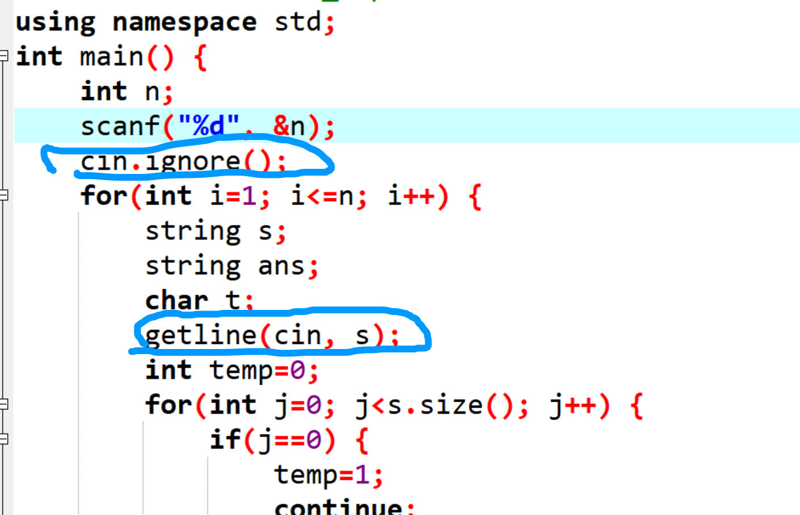

getline()本身就是以\n作为输入的结束标志，当然，它本身会丢弃末尾的那个\n

cin.ignore()实际上是把scanf中写的\n给吃进去，防止getline直接被scanf中的\n给作为结束标志直接结束了

## ⭐如何把int变到字符串里

- 当int这个整数是0到9的时候就这样

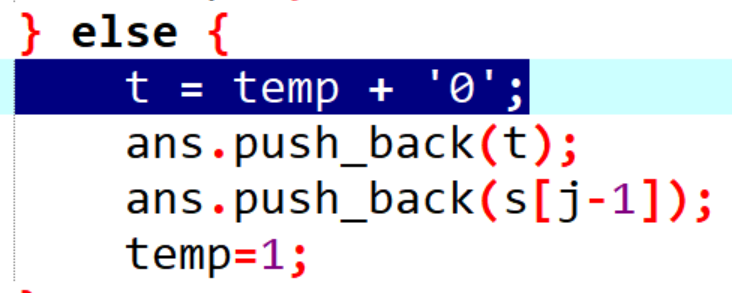

- 当这个整数超过了9，是多位数，那么就

  ```
  int main(){
  	int a;
  	cin>>a;
  	string s = to_string(a);
  	cout<<s.size()<<endl;
  	cout<<s<<endl;
  }
  ```

  注意，如果直接定义a=-0123，那么输出的结果是：

  ```
  3
  -83
  ```

  这是因为把a看成了八进制。如果cin>>那没事，因为cin>>会忽视前导零

## 把一个数组全部元素归0

```
memset(dp, 0, sizeof(dp));
```

## 强制类型转换

int a

double t = static_cast\<double>(a)

## double的话scanf和print

scanf要用%lf

printf要用%f

## 快速把一个char/string类型转换成int

```
int num = std::stoi(str)
```

## 定义一个二维vector的大小

```
vector<vector<int>> dp_max(n+1, vector<int>(x+1, 0));
```

## ll和int和ull的范围

- int，二进制有32位，表示范围在   -2^31 ~~~ 2^31-1，数值是−2,147,483,648∼2,147,483,647。共10位

- ll int，二进制有64位，表示范围在   -2^63 ~~~ 2^63-1，数值是−9,223,372,036,854,775,808∼9,223,372,036,854,775,807。共19位

- unsigned long long`（64位无符号整数）

  - **位数**：**64位**。
  - **范围**：
    - 最小值：`0`
    - 最大值：`18,446,744,073,709,551,615`（`2^64 - 1`）
  - **特点**：
    - **只能表示非负数**（正数和零）。
    - 范围比 `long long` 更大（因为不需要存储符号位）。
    - 如果存储负数会**自动转换**为很大的正数（如 `-1` 会被存储为 `2^64 - 1`）。

  - 需要**超大正整数**的场景（如哈希计算、位运算、无符号大数处理）。
  - 例如：计算组合数 `C(n, k)` 时，结果可能极大但不会为负。

## 对浮点数的一些《取整》操作

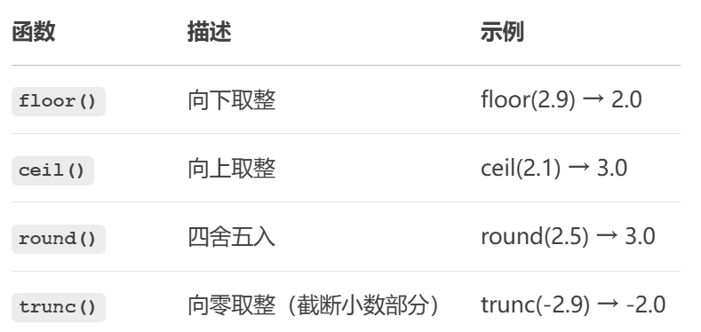

## multiset用法

- 需要的头文件 #include \<set>

- 初始化 multiset\<int> ms;

- ms.insert(x); 插入元素

- 打印所有的元素

  ```
  for(int num : ms) {
  		cout << num << " ";
  	}
  ```

- 降序排列

  ```
  #include <functional>
  
  multiset<int, greater<int>> ms;
  ```

- 一些可能用到的操作

  ```
  ms.empty();  // 判断是否为空
  ms.size();   // 返回元素数量
  ms.erase(10); // 删除所有值为 10 的元素
  ms.count(10); // 返回值为 10 的元素的个数
  ms.find(10);  // 返回第一个值为10的迭代器
  ms.erase(ms.begin(), ms.find(3)); // 删除范围（注意，不管他是升序还是降序，3都是不被删掉的）
  ms.clear(); // 清空所有元素
  ```

- 获取最值

  ```
  multiset<int> ms = {2, 2, 5, 1, 4};
  
  int min_val = *ms.begin();      // 1
  int max_val = *ms.rbegin();    // 5
  ```

- 删除元素的时候请注意！

  ```
  s.erase(value) // 删除所有匹配值的元素
  s.erase(iterator) // 删除迭代器指向的单个元素
  ```

  | `s.erase(nums[l])`         | 所有等于 `nums[l]` 的元素 |
  | -------------------------- | ------------------------- |
  | `s.erase(s.find(nums[l]))` | 仅第一个 `nums[l]`        |

## unordered_map遍历

```
#include <iostream>
#include <unordered_map>
#include <string>

int main() {
    std::unordered_map<std::string, int> umap = {
        {"Apple", 1},
        {"Banana", 2},
        {"Cherry", 3}
    };

    // 使用基于范围的 for 循环遍历
    for (const auto& pair : umap) {
        std::cout << "Key: " << pair.first << ", Value: " << pair.second << std::endl;
    }

    return 0;
}
```

## 异或运算的优先级比加减乘除低

在累加异或运算结果的时候，记得给异或运算加上括号

## map的用法

**`#include <map>`**

提供对数时间的有序键值对结构。底层原理是红黑树。

映射：
$$
\begin{matrix}
1&\to&2\\
2&\to&2\\
3&\to&1\\
4&\to&5\\
&\vdots
\end{matrix}
$$

| 性质   | 解释                         | map           | multimap      | unordered_map |
| ------ | ---------------------------- | ------------- | ------------- | ------------- |
| 互异性 | 一个键仅可以在映射中出现一次 | ✔             | ❌（任意次）   | ✔             |
| 无序性 | 键是没有顺序的               | ❌（从小到大） | ❌（从小到大） | ✔             |

**`map<键类型, 值类型, 比较器> mp`**

- 键类型：要储存键的数据类型
- 值类型：要储存值的数据类型
- 比较器：键比较大小使用的比较器，默认为 `less<类型>`，可自定义

```cpp
map<int, int> mp1;               // int->int 的映射（键从小到大）
map<int, int, greater<int>> st2; // int->int 的映射（键从大到小）
```

基于范围的循环（C++ 11）：

```cpp
for (auto &pr : mp)
    cout << pr.first << ' ' << pr.second << endl;
```

| 作用                   | 用法           | 示例                    |
| ---------------------- | -------------- | ----------------------- |
| 增 / 改 / 查元素       | 中括号         | `mp[1] = 2;`            |
| 查元素（返回迭代器）   | `.find(元素)`  | `auto it = mp.find(1);` |
| 删除元素               | `.erase(元素)` | `mp.erase(2);`          |
| 判断元素是否存在       | `.count(元素)` | `mp.count(3);`          |
| 查看大小 / 清空 / 判空 | 略             | 略                      |

增删改查时间复杂度均为 $O(\log n)$

不可用迭代器计算下标

map 的迭代器不能像 vector 一样相减得到下标。**下面是错误用法：**

```cpp
auto it = mp.find('a');      // 正确，返回2所在位置的迭代器。
int idx = it - mp.begin();   // 错误！不可相减得到下标。
```

## 请一定要写&！！！！！

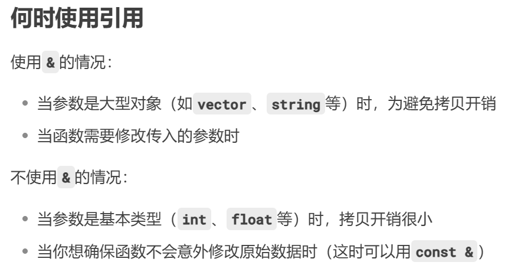

写函数的时候，当传入的参数是 string(可以不加)和vector的时候，请一定加上 &!!!!

但是引用也有一定的问题！：


## if((mask&(1<<k))==true)千万不要这么写！

## 初始化数组

```
memset(h, -1, sizeof h)
```

## next_permutation的用法

```
int main() {
    vector<int> nums = {1, 2, 3};
    
    // 必须先排序！
    sort(nums.begin(), nums.end());
    
    do {
        for (int num : nums) cout << num << " ";
        cout << endl;
    } while (next_permutation(nums.begin(), nums.end()));
    
    return 0;
}
```

```
do{
}while();
```

## 1e9和INT_MAX不能用memset初始化，老老实实循环吧

## 优先队列

- priority_queue<int, int>默认按first的值排序
- 默认都是大根堆
- 小根堆要这么写：priority_queue<int, vector\<int>, greater\<int>> min_heap（此处int可替换成任何优先队列里存储的元素类型）

## ||是逻辑或，|是按位或

## x/10是删去个位，x%10是获取个位

## reverse函数

```
reverse(迭代器l， 迭代器r)
反转的区间是[l, r)
直接reverse(s.begin(), s.end())
```

## begin和end迭代器

他们是对称的！

```
begin()：指向容器第一个元素的迭代器（如果容器非空）
end()：指向容器末尾的“哨兵”位置（最后一个元素的下一个位置），并不指向有效元素。
```

```
rbegin()：指向容器最后一个元素	反向遍历的起点
rend()：指向容器第一个元素的前一个位置（哨兵）	反向遍历的终点
```

用迭代器遍历

```
for (auto it = nums.begin(); it != nums.end(); ++it) {
    std::cout << *it << " "; 
}
```

从后往前遍历

```
for (auto it = nums.rbegin(); it != nums.rend(); ++it) {
    std::cout << *it << " "; 
}
```

## 初始化一个数组

```
bool use[200][200] = {false};
```

## 谨慎 runtime error是爆int

## `(a+b)/2` 和 `a+b>>1` 在处理**负数**时不同

(a+b)/2向0截取

a+b>>1向下取整

二分法中选第二种！

## while (nums.size() - x >= 0) 不要这么写！！！！改成n-x>=0

## sort函数是左闭右开的！

## 访问空vector会报错

# 用法

## map的用法

- 字符串到整型的映射，**必须使用\**string\**而不能用char数组！**

- map的键和值也可以是**STL容器**，例如以下代码将一个***\*set\****容器映射到一个字符串

  ```
  map<set<int>, string> mp;
  ```

- map中的键唯一

  ```
  map<char, int> mp; 
  mp['c'] = 20;
  mp['c'] = 30;	//30覆盖了20 
  mp['c'] = 666; 	//666覆盖了30 
  cout << mp['c'];	//答案输出666 
  ```

- **map**会以键从   **小到大**   的顺序自动排序

- **find(key)**返回键为**key**映射的迭代器，时间复杂度为O(logN)，N为map中映射的个数：

- **erase()**有两种用法：1、**删除单个元素**。2、**删除一个区间内所有的元素**。

  - mp.erase(it)，**it**为需要删除的元素的**迭代器**。时间复杂度为O(1)
  - mp.erase(key)，**key**为要删除的映射的键。时间复杂度O(logN)，N为map内元素的个数

- map.size()用来获得map中映射的**对数**，复杂度为O(1)

- ***\*clear()\****用来清空**map**中的所有元素，复杂度为O(N)，N为map中元素个数：

## multimap的用法

```
#include <map>
#include <string>

std::multimap<std::string, int> scoreMap;
scoreMap.insert({"Alice", 90});
scoreMap.insert({"Bob", 85});
scoreMap.insert({"Alice", 95});  // 允许 Alice 有多个分数

// 查找 Alice 的所有分数
auto range = scoreMap.equal_range("Alice");
for (auto it = range.first; it != range.second; ++it) {
    std::cout << it->first << ": " << it->second << std::endl;
}
```

- multimap无法用操作[]来调用键值，只能用insert（{， }）

- 遍历的话是用 

  ```
  auto range = scoreMap.equal_range("Alice");
  for(auto it = range.first; it != range.second; ++it){
  }
  ```

- 一对多关系（一个键可对应多个值）

- 不会覆盖已有键值对，而是新增

- **multimap**会以键从   **小到大**   的顺序自动排序

- ```
  // 声明一个按 string 降序排列的 multimap
      multimap<string, int, greater<string>> scoreMap;
     原来是：multimap<string, int> scoreMap;
  ```

- ```
  // 删除所有匹配键的元素
  multimap.erase("key");       
  unordered_multimap.erase("key");
  
  // 大小/判空
  multimap.size();  
  unordered_multimap.empty();
  ```

## 几种map的对比总结

| 特性           | std::map   | std::multimap      | std::unordered_map | std::unordered_multimap |
| :------------- | :--------- | :----------------- | :----------------- | :---------------------- |
| **实现方式**   | 红黑树     | 红黑树             | 哈希表             | 哈希表                  |
| **排序**       | 按键排序   | 按键排序           | 无序               | 无序                    |
| **键唯一性**   | 唯一       | 可重复             | 唯一               | 可重复                  |
| **时间复杂度** | O(log n)   | O(log n)           | O(1) 平均          | O(1) 平均               |
| **内存使用**   | 较低       | 较低               | 较高               | 较高                    |
| **适用场景**   | 需要有序键 | 需要有序且键可重复 | 快速查找，无需排序 | 快速查找且键可重复      |

## 题目——**Dangerous Goods Packaging**

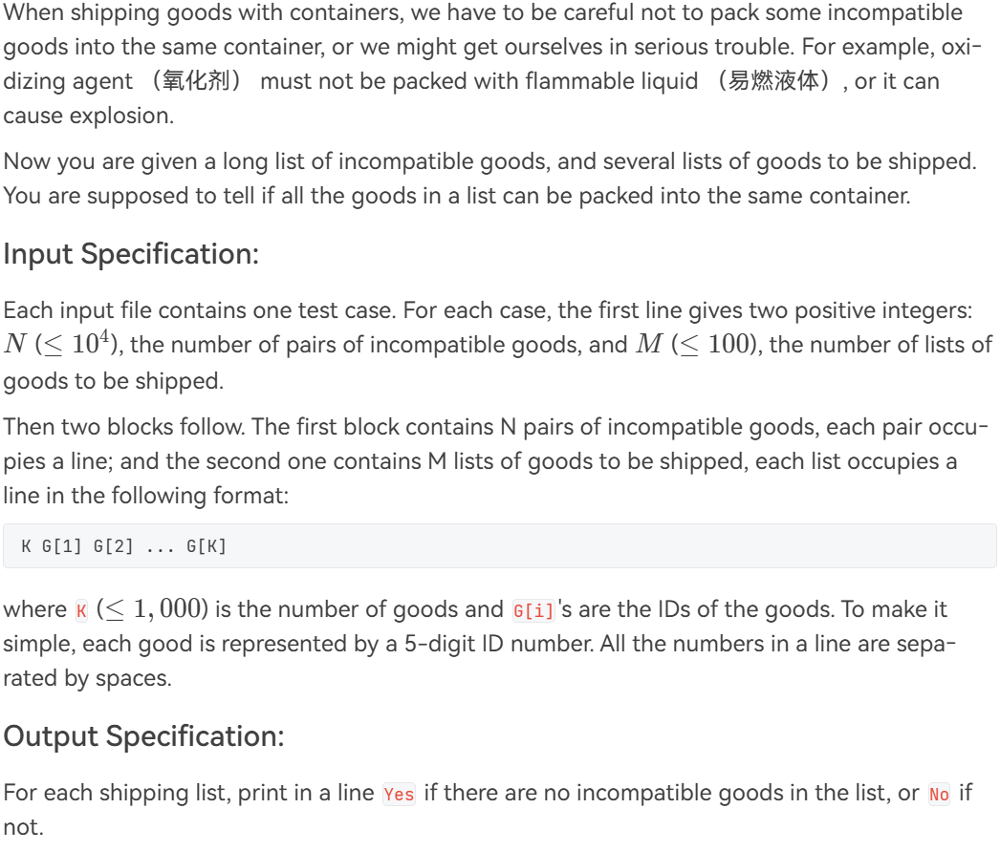

```
6 3
20001 20002
20003 20004
20005 20006
20003 20001
20005 20004
20004 20006
4 00001 20004 00002 20003
5 98823 20002 20003 20006 10010
3 12345 67890 23333


No
Yes
Yes
```

```
int main() {
	int n, m;
	cin>>n>>m;
	multimap<string, string> q;
	for(int i=1; i<=n; i++) {
		string a, b;
		cin>>a>>b;
		q.insert({a, b});
		q.insert({b, a});
	}
	for(int i=1; i<=m; i++) {
		int num;
		cin>>num;
		unordered_map<string, bool> k;
		bool success=true;
		for(int j=1; j<=num; j++) {
			string z;
			cin>>z;
			k[z]=true;
		}
		for(const auto& ele:k) {
			string idx = ele.first;
			if(k[idx]==true) {
				auto range = q.equal_range(idx);
				for(auto it = range.first; it != range.second; ++it) {
					if(k[it->second]==true) {
						success=false;
						break;
					}
				}
			}
		}
		if(success==true) {
			cout<<"Yes"<<endl;
		} else {
			cout<<"No"<<endl;
		}
	}
}

```

为什么要写if(k[idx]==true) { 这么一个判断？

就是因为“if(k[it->second]==true)”这个地方判断的时候，可能里面原本没有it->second这个元素，但是需要判断，就往里加了一个这个元素it->second，并把它值置成了false，导致遍历k的ele时，会遍历到他，导致错误！

## **Safari Park**

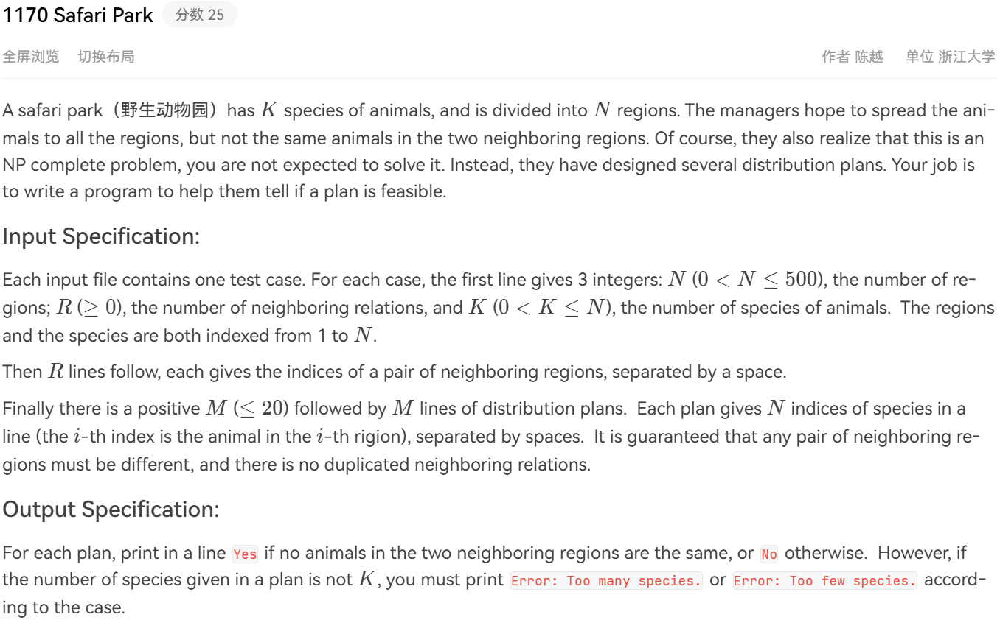

```
int g[1000][1000];
int main() {
	int N,R,K;
	cin>>N>>R>>K;
	for(int i=1; i<=R; i++) {
		int a, b;
		cin>>a>>b;
		g[a][b]=1;
		g[b][a]=1;
	}
	int M;
	cin>>M;
	for(int i=1; i<=M; i++) {
		unordered_map<int, int> use;
		int js=0;
		vector<int> plan;
		plan.push_back(0);
		for(int j=1; j<=N; j++) {
			int temp;
			cin>>temp;
			plan.push_back(temp);
			if(use[temp]==0) {
				use[temp]++;
				js++;
			}
		}
		if(js>K) {
			cout<<"Error: Too many species."<<endl;
		} else if(js<K) {
			cout<<"Error: Too few species."<<endl;
		} else {
			bool success=true;
			multimap<int, int> region;
			for(int t=1; t<plan.size(); t++) {
				if(region.find(plan[t])==region.end()) {
					region.insert({plan[t], t});
				} else {
					auto range = region.equal_range(plan[t]);
					for(auto it=range.first; it!=range.second; ++it) {
						int ne = it->second;
						if(g[t][ne]==1) {
							success=false;
							break;
						}
					}
					region.insert({plan[t], t});
				}
				if(success==false) {
					break;
				}
			}
			if(success==false) {
				cout<<"No"<<endl;
			} else {
				cout<<"Yes"<<endl;
			}
		}
	}
	return 0;
}
```

## set的用法

```
不允许重复元素，插入相同值时会被忽略。
若需要存储重复值，需使用 multiset。
set只能插入删除，不能修改元素
for (auto it = s.begin(); it != s.end(); ++it) { // 迭代器遍历
    cout << *it << " ";
}
```

```
set中元素按照升序排列
set<int, greater<int>> s;  // 降序排列
```

```
#include <set>
using namespace std;
```

```
set<int> s;                     // 空set
set<int> s = {1, 2, 3};         // 初始化列表
set<int> s2(s.begin(), s.end()); // 用迭代器范围构造
```

```
s.insert(4);                    // 插入单个元素
s.insert({5, 6, 7});            // 插入多个元素（C++11）
```

```
s.erase(3);                     // 删除值为3的元素
auto it = s.find(2);
if (it != s.end()) s.erase(it); // 通过迭代器删除
s.erase(s.begin());             // 删除第一个元素
s.clear();                      // 清空set
```

# 数学

## 质数的判定

质数是指：所有大于1的数字，他只能被自己和1整除

小于等于1的数字既不是质数也不是合数

```
bool f(int x){
	if(x<=1){
		return false;
	}
	for(int i=2;i<=x/i;i++){
		if(x%i==0){
			return false;
		}
	}
	return true;
}
```

约数总是成对出现：

若d|n，则一定有(n/d)|n

所以不需要从2搜到n，只需要搜到n/d，也就是小的那边就行

其实，i的上限改成sqrt(x)也是ok的

## 质因数的全部分解

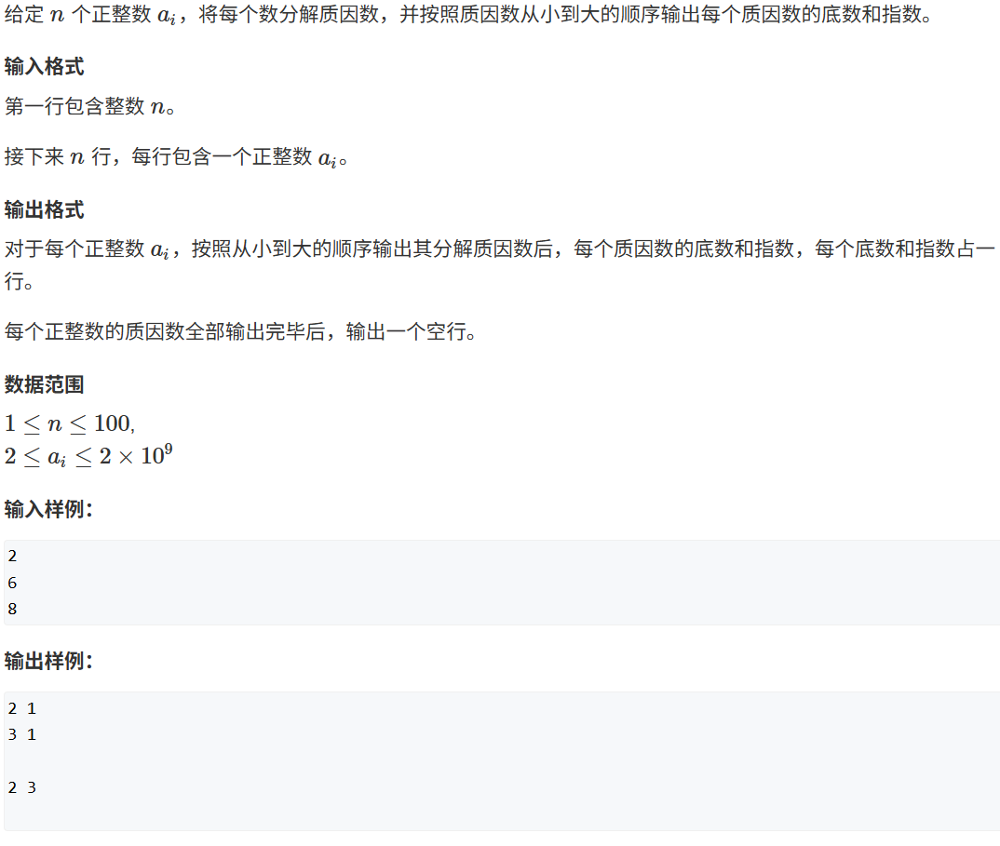

```
void f(int x) {
	for(int i=2; i<=sqrt(x); i++) {
		if(x%i==0) {
			int zhs=0;
			while(x%i==0) {
				zhs++;
				x = x/i;
			}
			cout<<i<<' '<<zhs<<endl;
		}
	}
	if(x>1){
		cout<<x<<' '<<'1'<<endl;
	}
	cout<<endl;
}

int main() {
	int n;
	scanf("%d", &n);
	while(n--) {
		int a;
		scanf("%d", &a);
		f(a);
	}
	return 0;
}
```

**一个数字，一定最多只包含一个大于sqrt(n)的质因子**

所以我们的搜索只需要搜到sqrt(n)就行，当然了，如果这个数字有一个大于sqrt(n)的质因子，那么要特判一下，把他单独输出出来

我们每一次找到的因子都把他除掉，这样在后续找的时候，选出来的i肯定都是质数，例如：

60，如果i能搜到6，那么在他之前一定被3和2都除干净了，也就是说如果i能到6，那么x已经变成了5

```
i<=sqrt(x)
```

**一定要取到等号！！！！！！**

## 埃氏筛

给定一个数字n，寻找从1到n中所有质数的个数

```
int shai[1000010];
int f(int n) {
	int ans = 0;
	for(int i=2; i<=n; i++) {
		if(shai[i]==0) {
			ans++;
			for(int j=i+i; j<=n; j=j+i) {
				shai[j]=1;
			}
		}
	}
	return ans; 
}
int main() {
	int n;
	cin>>n;
	int ans = f(n);
	cout<<ans;
}
```

从2到n开始遍历：

- 如果这个数字没有被筛掉(也就是shai[i]==0)，那么它就是个质数，否则是个合数（也就是被晒掉了），合数的话无需管他。质数的话，就把它的所有倍数都筛掉
- 为什么合数的倍数不需要筛，因为合数一定会有质因子x，那么它的倍数也一定会有质因子x。在前面循环到它的质因子x的时候，事实上已经把这些数字全筛掉了

## 求最大公因数

```
#include <numeric>  
int ans = gcd(a, b)
```

或者辗转相除法：

```
数学原理：最大公约数(a, b)=(b, a%b)
```

```
int gcd(int a, int b)
{
    if (a % b == 0) return b;
    else return gcd(b, a % b);
}
```

## 求最小公倍数

```
#include <numeric>  
int ans = lcm(a, b)
```

最小公倍数 = 两数字乘积 / 最大公约数

## 约数定理

如果一个数字x的质因数分解如下：

- $x = p_{1}^{\alpha_{1}}×p_{2}^{\alpha_{2}}×.....×p_{k}^{\alpha_{k}}$

那么就有：

- 该数所有约数的个数为：$(\alpha_{1}+1)×(\alpha_{2}+1)×.....×(\alpha_{k}+1)$
- 该数所有约数的和为：$(p_{1}^{0}+p_{1}^{1}+...+p_{1}^{\alpha_{1}})×(p_{2}^{0}+p_{2}^{1}+...+p_{2}^{\alpha_{2}})×.....×(p_{k}^{0}+p_{k}^{1}+...+p_{k}^{\alpha_{k}})$

## 求一个数字的所有约数的个数

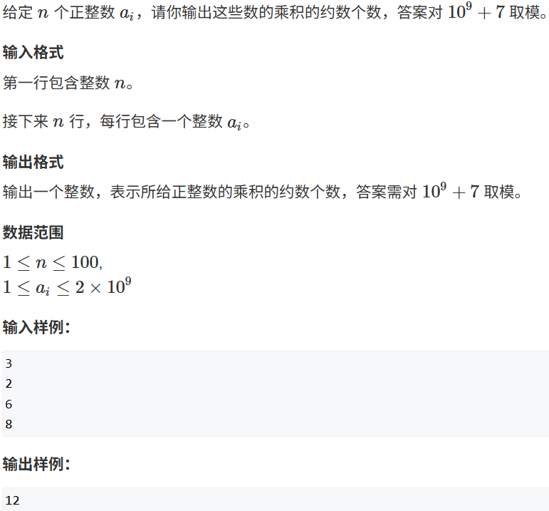

```
int mod = 1e9+7; 
int main() {
	int n;
	unordered_map<int, int> dic;
	cin>>n;
	while(n--) {
		int a;
		cin>>a;
		for(int i=2; i<=sqrt(a); i++) {
			if(a%i==0) {
				while(a%i==0) {
					dic[i]++;
					a = a/i;
				}
			}
		}
		if(a>1) {
			dic[a]++;
		}
	}
	long long int ans = 1;
	for(const auto& ele:dic){
		ans = (ans * (ele.second+1))%mod;
	}
	cout<<ans;
}
```

取模是 **乘完再模**

## 求一个数字的所有约数之和

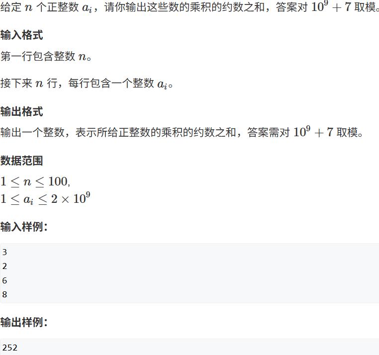

```
int mod = 1e9+7;
unordered_map<int, int> dic;
void f(int a) {
	for(int i=2; i<=sqrt(a); i++) {
		if(a%i==0) {
			while(a%i==0) {
				dic[i]++;
				a = a / i;
			}
		}
	}
	if(a>1) {
		dic[a]+=1;
	}
}
int main() {
	int n;
	cin>>n;
	while(n--) {
		int a;
		cin>>a;
		f(a);
	}
	long long int ans = 1;
	for(const auto& ele:dic) {
		int x = ele.first;
		int y = ele.second;
		long long int temp=1;
		for(long long int i=1; i<=y; i++) {
			temp = (temp*x + 1) % mod;
		}
		ans = ans * temp;
		ans = ans % mod; 
	}
	cout<<ans;
	return 0;
}
```

## 快速幂（反复平方法）

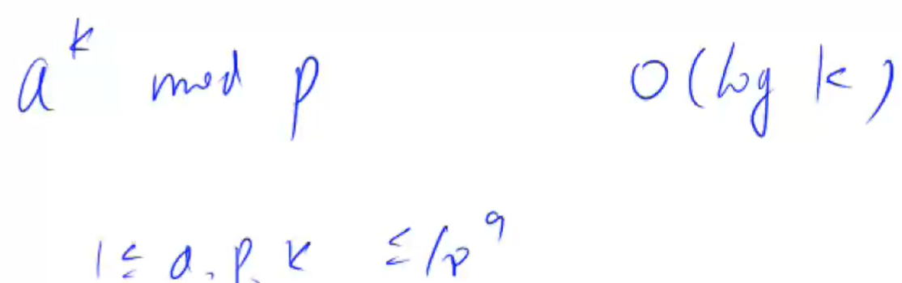

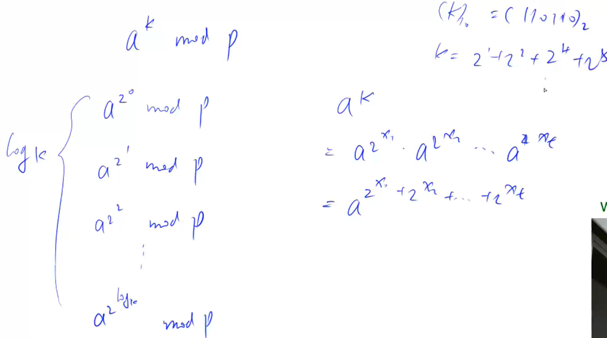

```
先预处理logk个数：a的2的n次幂mod p = a的2的n-1次幂 的平方 mod p
把k拆成2的x1次幂+2的x2次幂+。。。。（最多拆成logk个）
(a*b) % p = (a%p * b %p) % p
```

```
int ksm(int a, int k, int p) {
	int ans = 1;
	while(k) {
		if(k&1) {
			ans = (long long)ans * a % p;
		}
		k=(k>>1);
		a = (long long)a*a%p;
	}
	return ans;
}
int main() {
	int T;
	cin>>T;
	while(T--) {
		int a, k, p;
		cin>>a>>k>>p;
		int ans = ksm(a, k, p);
		cout<<ans<<endl;
	}
}
```

```
ksm中的while其实遍历的是k在十进制下的位数个数（并非k的二进制值）
每次我都会更新 a = (long long)a*a%p
如果当前k这一位是1的话，那就把
```

## 超级次方

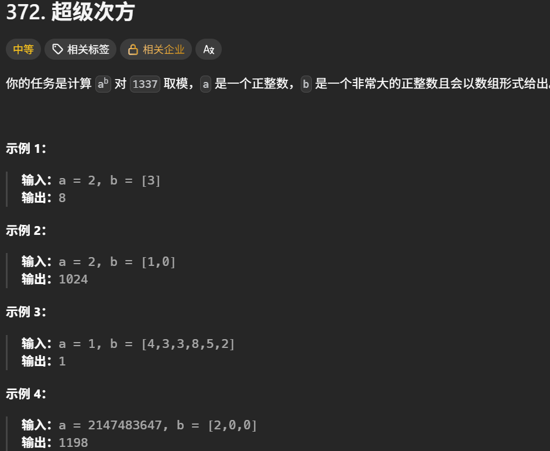

```
class Solution {
	public:
		int mod=1337;
		int ksm(int a, int k, int p) {
			int ans=1;
			while(k) {
				if(k&1) {
					ans = (long long)ans * a % p;
				}
				k=(k>>1);
				a=(long long)a*a%p;
			}
			return ans;
		}
		int superPow(int a, vector<int>& b) {
			int ans = a;
			for(int i=0; i<b.size(); i++) {
				if(i==0) {
					ans = ksm(a, b[0], mod);
					continue;
				}
				ans = ksm(ans, 10, mod);
				ans = (ans * ksm(a, b[i], mod))%mod;
			}
			return ans;
		}
};
```

```
2的32次方 = ((2^3)^10)*(2^2)
2的321次方 = ((((2^3)^10)*(2^2))^10)*(2^2)
```

## 快速幂求逆元

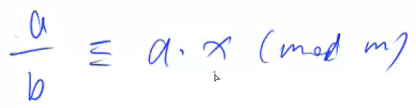

```
a/b再mod很麻烦，转换成a乘上一个数字再mod——找x

求一个数
```


## 求组合数Ⅰ

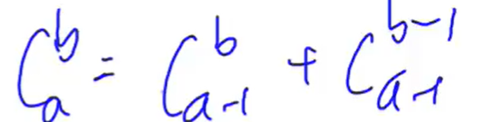

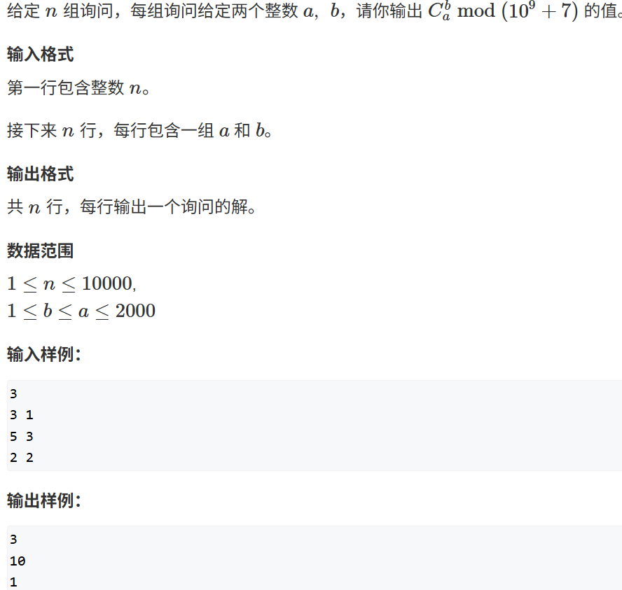

```
long long int c[3000][3000];
int mod = 1e9+7;
int main() {
	int n;
	cin>>n;
	for(int i=0; i<2100; i++) {
		for(int j=0; j<2100; j++) {
			if(i==0 && j==0) {
				c[i][j]=1;
			} else if(i==0 && j!=0) {
				c[i][j]=0;
			} else {
				c[i][j]=(c[i-1][j]+c[i-1][j-1])%mod;
			}
		}
	}
	for(int i=1; i<=n; i++) {
		int a, b;
		cin>>a>>b;
		cout<<c[a][b]<<endl;
	}
	return 0;
}
```

注意：

- $C_0^1$是0：从0个物品中挑大于0的个数，肯定没有办法
- $C_0^0$是1：从0个物品中挑0个物品，就一种方法

## 求组合数Ⅱ

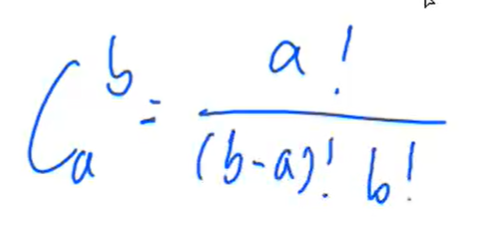


## 扩展欧几里得算法

```
原理
```

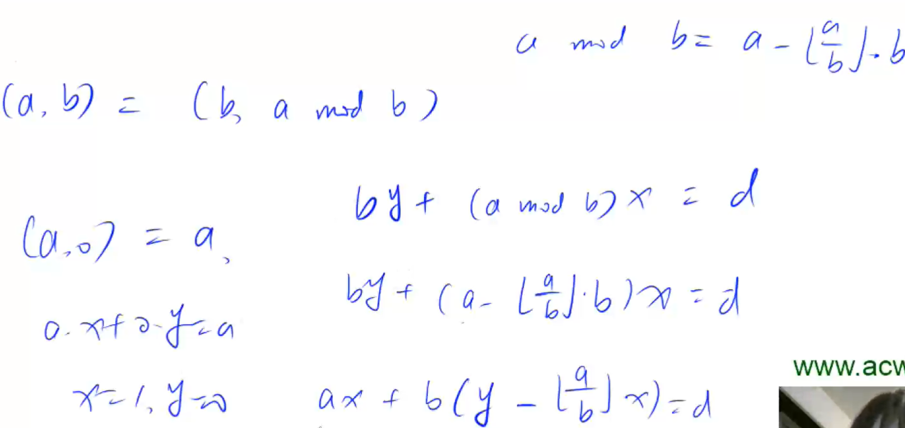


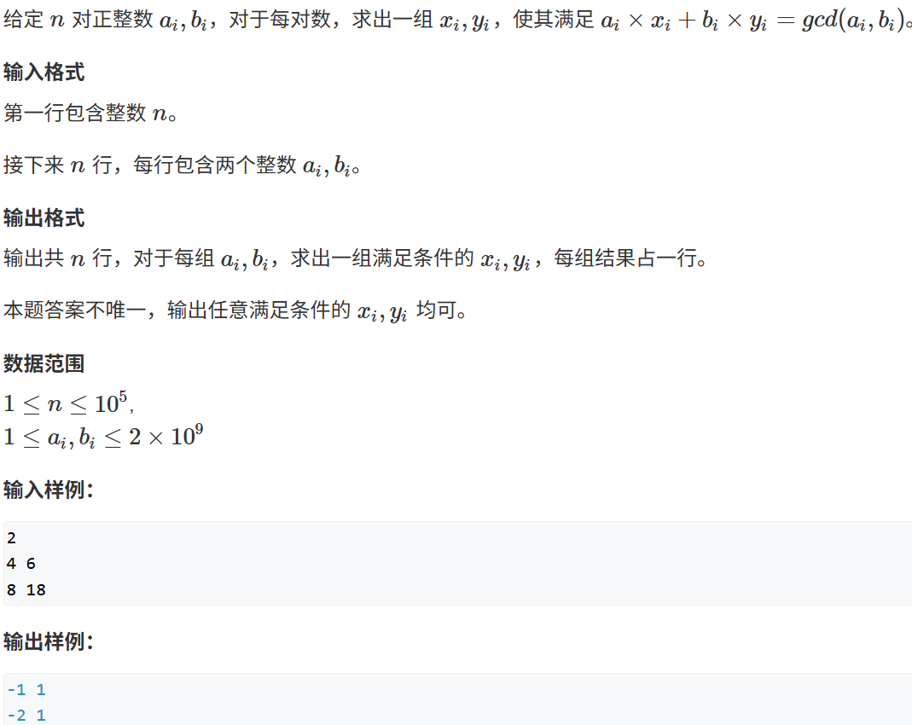

```
void extragcd(int a, int b, int &x, int& y){
	if(b==0){
		x=1;
		y=0;
		return;
	}
	extragcd(b, a%b, y, x);
	y = y-a/b*x;
	return;
}
int main() {
	int T;
	cin>>T;
	while(T--) {
		int a, b, x, y;
		cin>>a>>b;
		extragcd(a, b, x, y);
		cout<<x<<' '<<y<<endl;
	}
}
```

```
注意：
extragcd(b, a%b, y, x);
y = y-a/b*x;
```

## 容斥原理


# 高精度

## 高精加

```
vector<int> add(vector<int>& a, vector<int>& b) {
	int jw = 0;
	vector<int> ans;
	for(int i=0; i<a.size() || i<b.size(); i++) {
		if(i<a.size()) {
			jw+=a[i];
		}
		if(i<b.size()) {
			jw+=b[i];
		}
		// 获取个位，删除个位
		ans.push_back(jw%10);
		jw=jw/10;
	}
	// 最后进位没清空的话pushback一下
	if(jw){
		ans.push_back(jw);
	} 
	return ans;
}
int main() {
	string a, b;
	cin>>a>>b;
	vector<int> num1;
	vector<int> num2;
	for(int i=a.size()-1; i>=0; i--) {
		num1.push_back(a[i]-'0');
	}
	for(int i=b.size()-1; i>=0; i--) {
		num2.push_back(b[i]-'0');
	}
	vector<int> c = add(num1, num2);
	for(int i=c.size()-1; i>=0; i--) {
		cout<<c[i];
	}
}
```

- 数字我们以string读取，用vector\<int>存储。注意，个位在前，倒着存储
- 手动模拟加法
- 加完的vector\<int>也是个位在前的

## 高精减

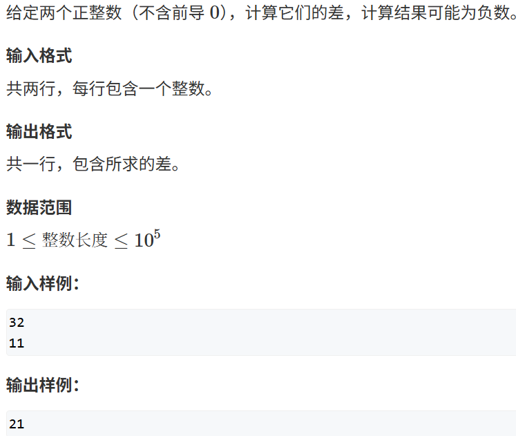

```
#include <iostream>
#include <vector>
#include <cmath>
#include <queue>
#include <map>
#include <algorithm>
#include <set>
#include <string>
#include <climits>
#include <cstring>
#include <numeric>
#include <unordered_map>
using namespace std;
bool cmp(vector<int>& a, vector<int>& b) {
	if(a.size()>b.size()) {
		return true;
	} else if(a.size()<b.size()) {
		return false;
	}
	for(int i=a.size()-1; i>=0; i--) {
		if(a[i]>b[i]) {
			return true;
		} else if(a[i]<b[i]) {
			return false;
		}
	}
	return true;
}
vector<int> jian(vector<int>& a, vector<int>& b) {
	int t=0;
	vector<int> ans;
	for(int i=0; i<a.size(); i++) {
		a[i]=a[i]-t;
		if(i<b.size()) {
			if(a[i]>=b[i]) {
				ans.push_back(a[i]-b[i]);
				t = 0;
			}
			if(a[i]<b[i]) {
				ans.push_back(10+a[i]-b[i]);
				t = 1;
			}
		} else {
			if(a[i]>=0) {
				ans.push_back(a[i]);
				t=0;
			} else {
				ans.push_back(10+a[i]);
				t=1;
			}
		}
	}

	while(ans.size()!=1 && ans[ans.size()-1]==0) {
		ans.erase(ans.end()-1);
	}

	return ans;
}
int main() {
	string a, b;
	cin>>a>>b;
	vector<int> num1;
	vector<int> num2;
	for(int i=a.size()-1; i>=0; i--) {
		num1.push_back(a[i]-'0');
	}
	for(int i=b.size()-1; i>=0; i--) {
		num2.push_back(b[i]-'0');
	}
	bool success = cmp(num1, num2);
	if(success) {
		auto c = jian(num1, num2);
		for(int i=c.size()-1; i>=0; i--) {
			cout<<c[i];
		}
	} else {
		auto c = jian(num2, num1);
		cout<<'-';
		for(int i=c.size()-1; i>=0; i--) {
			cout<<c[i];
		}
	}
}
```

- 先比较两个数字的大小！
- jian函数里面，在循环里先处理借位，借位完再比较大小（注意一下，如果有一个数字到头了，其实就是和0比较大小）其余都一样
- 计算完有可能有前导0，写个循环去除一下（注意只剩1个零可别删了）！！！

# 枚举 / 模拟

## 狼人杀（逻辑推导）

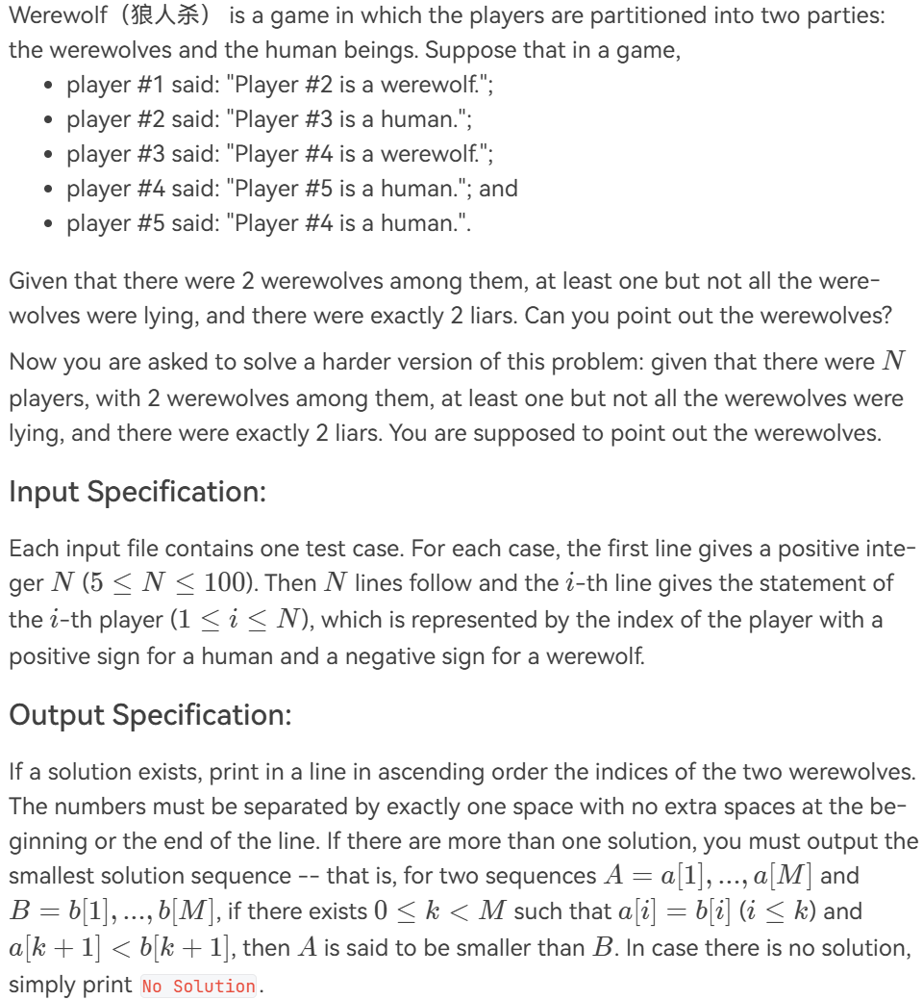

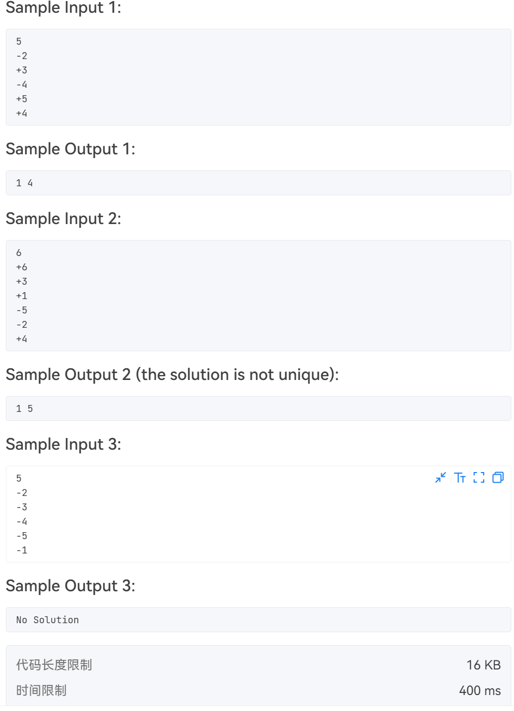

```
int main() {
	int n;
	cin>>n;
	vector<int> xx;
	xx.push_back(0);
	for(int i=1; i<=n; i++) {
		char s;
		int a;
		cin>>s>>a;
		if(s=='-') {
			xx.push_back(-1*a);
		} else {
			xx.push_back(a);
		}
	}
	for(int i=1; i<=n-1; i++) {
		for(int j=i+1; j<=n; j++) {
			vector<int> sf(n+1, 1);
			sf[i]=sf[j]=-1;
			vector<int> liar;
			for(int k=1;k<xx.size();k++){
				if(xx[k] * sf[abs(xx[k])] < 0){
					liar.push_back(k);
				}
			}
			if(liar.size()==2 && sf[liar[0]]*sf[liar[1]]<0){
				cout<<i<<' '<<j;
				return 0;
			}
		}
	}
	cout<<"No Solution";
	return 0;
}
```

- 枚举坏人，判断每个人的信息是否说谎了（这里很细节的是把好人设成1，坏人-1，判断是否说谎只需要看乘积是否是大于/小于0）
- 判断完了，看看说谎的是不是俩人，并且一狼一人
- 最好别枚举两个说谎的，这样赋值身份的时候会很麻烦！！！

## 螺旋矩阵

```
class Solution {
	public:
		vector<vector<int>> generateMatrix(int n) {
			vector<vector<int>> ans(n, vector<int>(n, 0));
			int l=-1, r=n, s=-1, x=n;
			int num=1;
			while(num<=n*n) {
				for(int i=l+1; i<r; i++) {
					ans[s+1][i]=num;
					num++;
				}
				s++;
				for(int i=s+1; i<x; i++) {
					ans[i][r-1]=num;
					num++;
				}
				r--;
				for(int i=r-1; i>l; i--) {
					ans[x-1][i]=num;
					num++;
				}
				x--; 
				for(int i=x-1; i>s; i--) {
					ans[i][l+1]=num;
					num++;
				}
				l++;
			}
			return ans;
		}
};
int main() {
	Solution a;
	int n=3;
	vector<vector<int>> ans = a.generateMatrix(n);
	for(int i=0; i<ans.size(); i++) {
		for(int j=0; j<ans[i].size(); j++) {
			cout<<ans[i][j]<<' ';
		}
		cout<<endl;
	}
}
```

```
走完一条边就把边界更新一下！
```

# 哈希表

## 经典两数之和

从头开始遍历，先找target - nums[i]，找不到就把nums[i]和其下表加进字典，找到了就是答案

- 哈系表存的是 **数组元素 **和他的 **下标**

```
class Solution {
	public:
		vector<int> twoSum(vector<int>& nums, int target) {
			unordered_map<int,int> map;
			vector<int> ans;
			for(int i=0; i<nums.size(); i++) {
				if(i==0) {
					map[nums[i]] = i;
					continue;
				}
				int temp = target - nums[i];
				if(map.find(temp)==map.end()) {
					map[nums[i]] = i;
				} else {
					ans.push_back(map[temp]);
					ans.push_back(i);
					break;
				}
			}
			return ans;
		}
};
```

## 和为k的连续子数组的个数(前缀和+哈希)

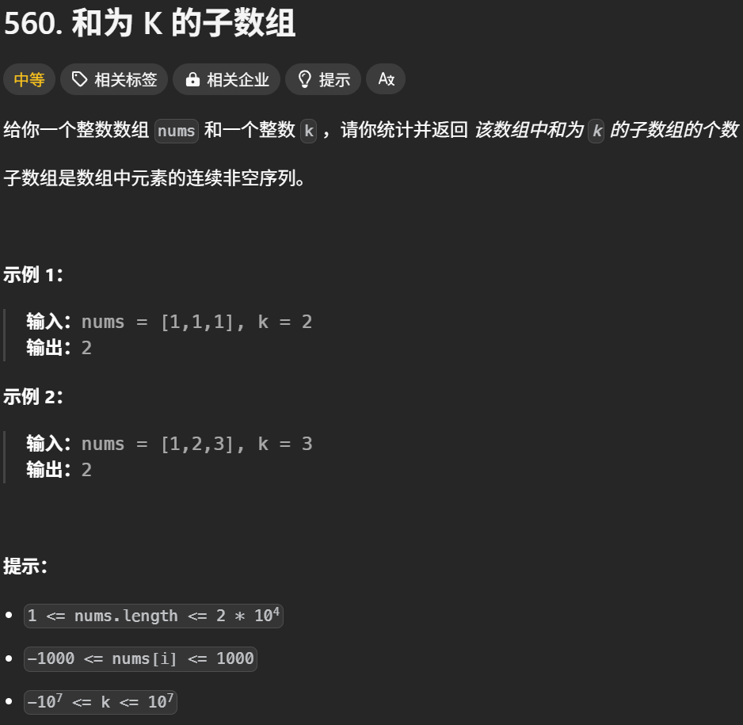

```
class Solution {
	public:
		int qz[100010]; 
		int subarraySum(vector<int>& nums, int k) {
			for(int i=0;i<nums.size();i++){
				qz[i+1] = qz[i]+nums[i];
			}
			// [i, j] q[j] - q[i-1] = k
			int ans = 0;
			unordered_map<int, int> dic;
			dic[qz[0]]=1;
			for(int i=1;i<=nums.size();i++){
				int x = qz[i] - k;
				if(dic.find(x)!=dic.end()){
					ans = ans + dic[x];
				}
				dic[qz[i]]++;
			}
			return ans;
		}
};
//43
```

- 哈希表存的是 **前缀和数组里的元素** 及其 **出现的次数**

## 连续数组

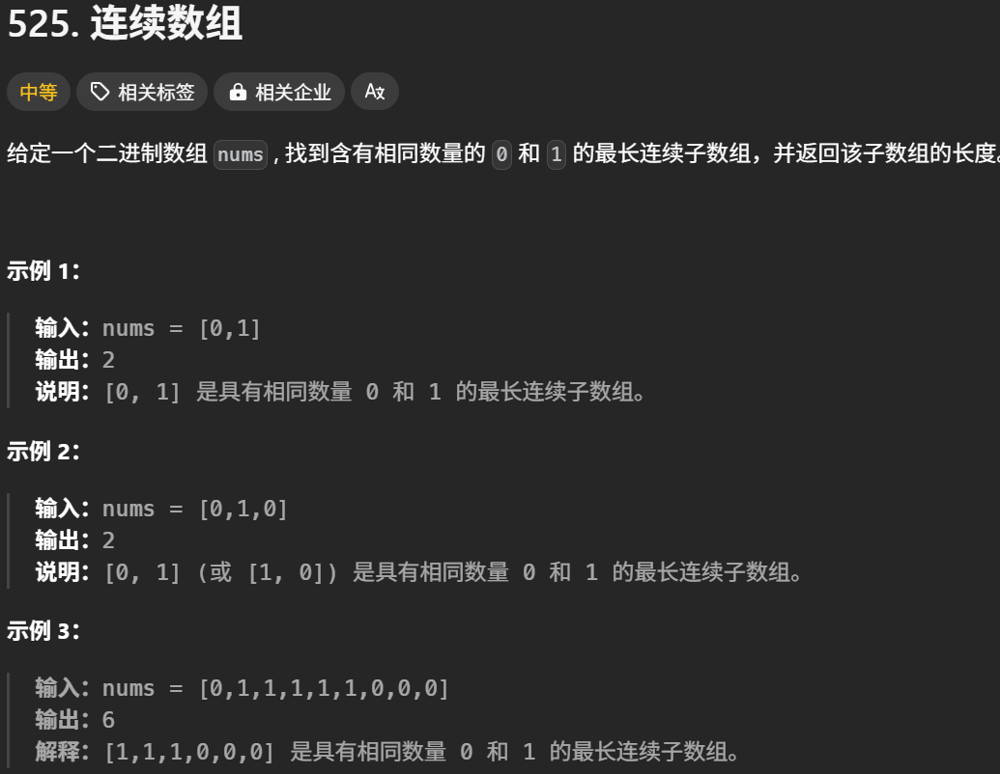

```
class Solution {
	public:
		int qz[100010];
		int findMaxLength(vector<int>& nums) {
			for(int i=0; i<nums.size(); i++) {
				if(nums[i]==0) {
					nums[i]=-1;
				}
			}
			for(int i=0; i<nums.size(); i++) {
				qz[i+1] = qz[i] + nums[i];
			}
			unordered_map<int, int> dic;
			dic[0] = 0;
			int ans = INT_MIN;
			for(int i=1; i<nums.size()+1; i++) {
				int x = qz[i];
				if(dic.find(x)!=dic.end()) {
					int y = dic[x];
					ans = max(ans, i-y);
				}
				if(dic.find(qz[i])==dic.end()) {
					dic[qz[i]] = i;
				}
			}
            if(ans==INT_MIN){
            	return 0;
			}
			return ans;
		}
};
```

前缀和+哈希表。先让所有0变成-1（注意，前缀和数组的第一个0也要变成-1），这样我们就把问题转换成：前缀和数组里哪些数字之差为0？

## 找到字符串中所有的字母异位词

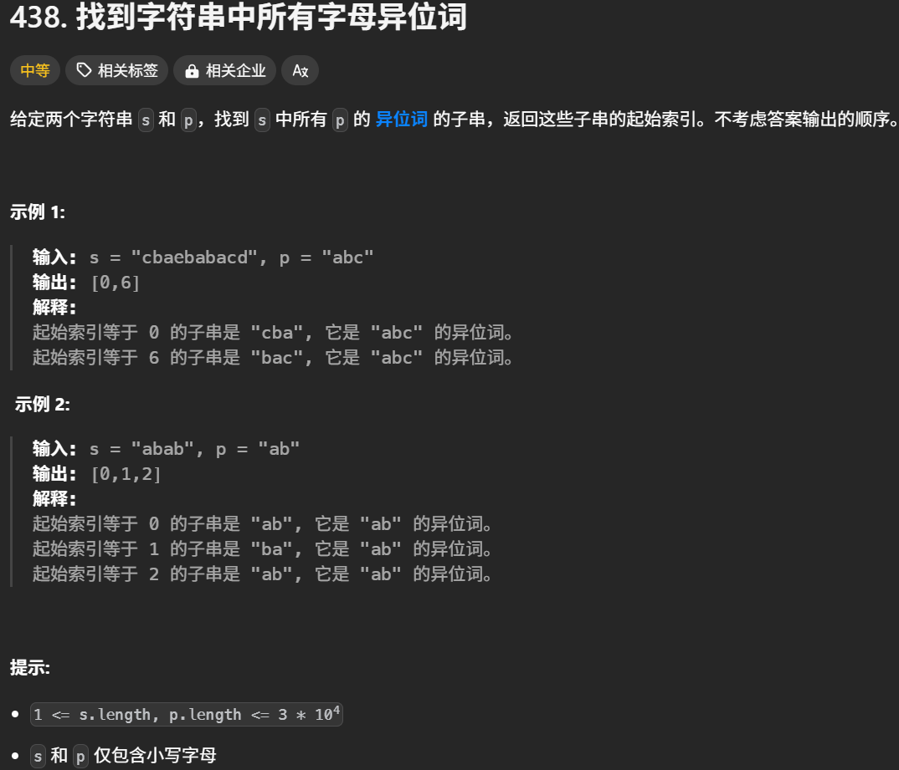

### 方法一

把它看成一个滑动的窗口，窗口大小就是p字符串的大小，在每个窗口里面，记录每个字母出现的次数，然后和所需要的字母（都在dic里面）进行比对即可，但会超时。

```
class Solution {
	public:
		vector<int> findAnagrams(string s, string p) {
			unordered_map<char,int> dic;
			vector<int> ans;
			if(p.size()>s.size()){
				return ans;
			}
			vector<char> word;
			for(int i=0; i<p.size(); i++) {
				dic[p[i]]++;
				word.push_back(p[i]);
			}
			int k = p.size();
			for(int i=0; i<=s.size()-k; i++) {
				int success=1;
				int r = i+k-1;
				unordered_map<char,int> temp;
				for(int j=i; j<=r; j++) {
					temp[s[j]]++;
				}
				for(int j=0; j<word.size(); j++) {
					if(temp.find(word[j])==temp.end()) {
						success = 0;
						break;
					}
					if(dic[word[j]]!=temp[word[j]]) {
						success = 0;
						break;
					}
				}
				if(success==1) {
					ans.push_back(i);
				}
			}
			return ans;
		}
};
```

### 方法二

窗口滑动，划过去一个格子，就先把array temp里--

array<int,26> dic{}：初始化一个26格大小的，元素类型为int的一个array，后加{}表明全都初始化为0。

两个array可以直接判断是否完全相等，当然复杂度是O(N)

```
class Solution {
	public:
		vector<int> findAnagrams(string s, string p) {
			array<int,26> dic{};
			vector<int> ans;
			if(p.size()>s.size()) {
				return ans;
			}
			for(int i=0; i<p.size(); i++) {
				dic[p[i]-'a']++;
			}
			int k = p.size();
			array<int,26> temp{};
			for(int i=0; i<s.size(); i++) {
				temp[s[i]-'a']++;
				// 每次获取左边界，如果左边界都比 0 小，说明窗口还没划够 k 的大小 
				int l = i-k+1;
				if(l<0) {
					continue;
				} else {
					if(temp==dic) {
						ans.push_back(l);
					}
					temp[s[l]-'a']--;
				}
			}
			return ans;
		}
};
```

## 一手顺子

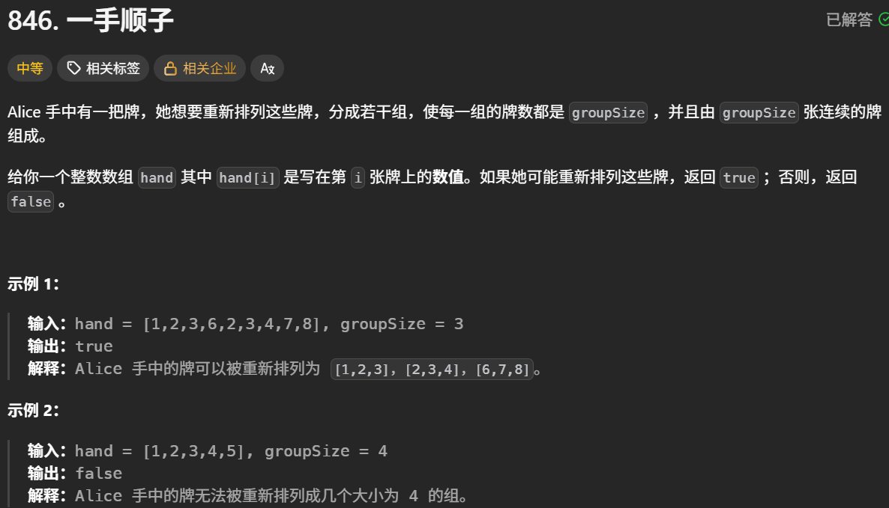

````
class Solution {
	public:
		bool isNStraightHand(vector<int>& hand, int groupSize) {
			if(groupSize==1) {
				return true;
			}
			map<int, int> dic;
			for(int i=0; i<hand.size(); i++) {
				dic[hand[i]]++;
			}
			bool success=true;
			for(auto& ele:dic) {
				if(ele.second==0) {
					continue;
				}
				int number = ele.first;
				while(dic[number]--) {
					for(int i=2; i<=groupSize; i++) {
						if(dic.find(number+i-1)==dic.end() || dic[number+i-1]==0) {
							success=false;
							break;
						} else {
							dic[number+i-1]--;
						}
					}
				}
			}
			return success;
		}
};
````

# ST表

```
int main() {
	cin<<n;
	int x = floor(log2(n));
	vector<vector<int>> dp(n+1, vector<int>(x+1, 0));
	int len=1;
	for(int mi=0; len<=n; mi++) {
		len = 1<<mi; // 计算 2 的 mi 次幂
		for(int i=1; i+len-1<=n; i++) {
			int j=i+len-1;
			dp[i][mi] = max(dp[i][mi-1], dp[j-(1<<(mi-1))+1][mi-1]);
		}
	}
	int y = floor(log2(r-l+1))
	cout<<max(dp[l][y], dp[r-(1<<y)+1][y]);
}
```

注意，上述代码里num数组里存的数字，下标是从1开始的

# KMP

```
next数组就是一个前缀表（prefix table）。
暴力写法：先固定开头，从开头开始一个一个检查是否和模式串匹配？如果发现不匹配了，就把开头往后移动一个位置，在重新匹配模式串！

next数组（前缀表）记录从0到下标i的字符串中，相同前缀后缀的最大长度是多少？（注意，这个前缀或者后缀都不能是0到i这个子串本身！！你都跳过了还有什么意义吗？）

前缀表是用来回退的，它记录了模式串与主串(文本串)不匹配的时候，模式串不需要从头开始了，那应该从哪里开始重新匹配？

线性：主串上那个指针一直是往前走的，不会后退
```

## 经典字符串匹配

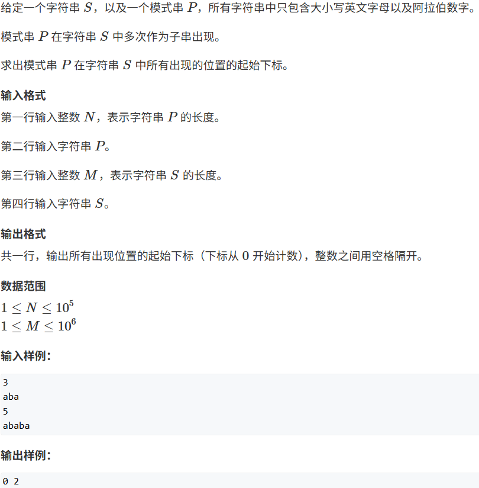

```
char a[1000010];
char b[1000010];
int ne[1000010];
int main() {
	int n,m;
	cin>>n>>a+1>>m>>b+1;

	// 求 ne
	for(int i=2, j=0; i<=n; i++) {
		// 当前元素互相不匹配 并且 可以退，就往前退
		while(j && a[i]!=a[j+1]) j=ne[j];
		if(a[i]==a[j+1]) j++;
		ne[i] = j;
	}

	// kmp 匹配过程
	for(int i=1,j=0; i<=m; i++) {
		while(j && b[i]!=a[j+1]) j = ne[j];
		if(b[i]==a[j+1]) j++;
		if(j==n) {
			cout<<i-n<<' ';
			j = ne[j];
		}
	}
	return 0;
}
```

- ne: 使字串 p[0…i] 中前缀 p[0…k] 等于后缀 p[i-k…i] 的最大的 k

## 一个字符串是不是循环构成的？

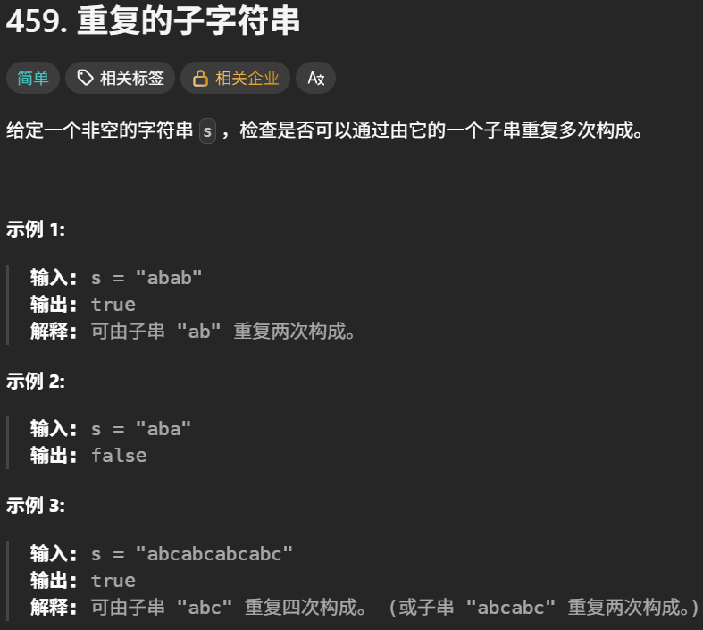

```
class Solution {
	public:
		bool repeatedSubstringPattern(string s) {
			int i=0;
			int success;
			for(int j=0; j<s.size()-1; j++) {
				int dx = j-i+1;
				if(s.size()%dx!=0) {
					continue;
				}
				success=1;
				for(int k=j+1; k+dx-1<s.size(); k=k+dx) {
					string temp1 = s.substr(k, dx);
					string temp2 = s.substr(0, dx);
					if(temp1!=temp2) {
						success = 0;
						break;
					}
				}
				if(success==1) {
					break;
				}
			}
			return success;
		}
};
```

别忘了最原始的方法！！！

- **字符串可以直接比较**

```
class Solution {
	public:
		int ne[101010];
		bool repeatedSubstringPattern(string s) {
			if(s.size()==1){
				return false;
			}
			int ans=0;
			s.insert(s.begin(), '0');
			for(int i=2,j=0; i<s.size(); i++) {
				while(j && s[i]!=s[j+1]) {
					j=ne[j];
				}
				if(s[i]==s[j+1]) {
					j++;
				}
				ne[i]=j;
				ans = max(ans, ne[i]);
			}
			int len = s.size()-1-ans;
			if(len==s.size()-1){
				return false;
			}
			string temp1 = s.substr(1, len);
			string temp2;
			for(int i=1; i<=(s.size()-1)/len; i++) {
				temp2+=temp1;
			}
			s.erase(s.begin());
			if(temp2==s){
				return true;
			}
			return false;
		}
};
```

**如果这个字符串s是由重复子串组成，那么最长相等前后缀不包含的子串是字符串s的最小重复子串**。

## 重复叠加字符串匹配

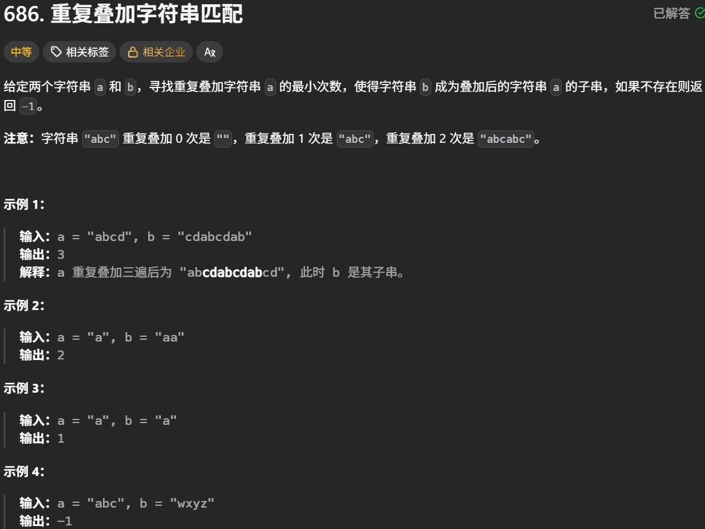

```
class Solution {
	public:
		int ne[10010];
		int repeatedStringMatch(string a, string b) {
			int n=a.size(), m=b.size();
			a.insert(a.begin(), ' ');
			b.insert(b.begin(), ' ');
			int ans = -1;
			for(int i=2, j=0; i<b.size(); i++) {
				while(j!=0 && b[i]!=b[j+1]) {
					j = ne[j];
				}
				if(b[i]==b[j+1]) {
					j++;
				}
				ne[i] = j;
			}
			for(int i=1, j=0; i-j<=n; i++) {
				while(j!=0 && a[(i-1)%n+1]!=b[j+1]) {
					j = ne[j];
				}
				if(a[(i-1)%n+1]==b[j+1]) {
					j++;
				}
				if(j==m) {
					ans = ceil((1.0 * i)/n);
					break;
				}
			}
			return ans;
		}
};
```

对于重复叠加，我们事实上可以：

- 取(i-1)%n+1，这里这么取是因为我们计数是从1开始的，如果从0开始，那么不用这么麻烦，直接i%n就行

对于终止条件：

- i-j<=n（i-j事实上就是a串里匹配好后开始的索引。单反能匹配上，b串一定在第一个a串里就有匹配好的部分，因此**a串里匹配好后开始的索引必须在第一个a串里面，也就是<=n**），但是要提前break，对于一些样例可能会有取等的情况，这样答案就不对了

# Trie

## 前述

高效存储和查找字符串集合的数据结构（要么都是小写字母、大写字母、数字、01，反正字符串不会太多）

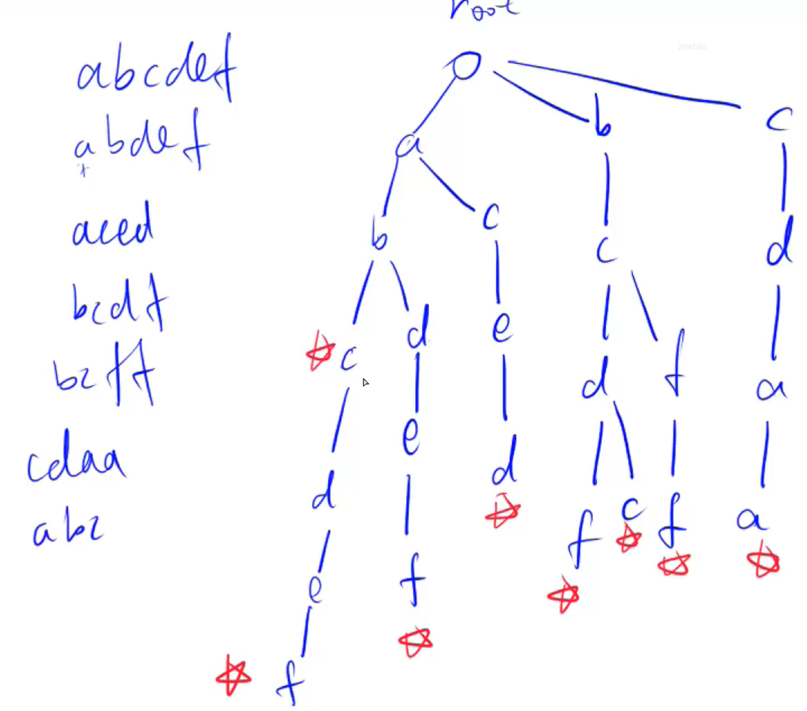

## 字符串出现的次数

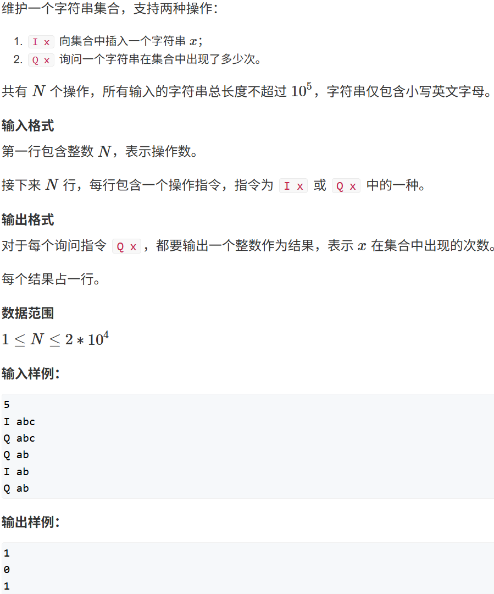

```
int e[100100][26];
int idx=1;
int num[100100];
void add(string s) {
	int p=0;
	for(int i=0; i<s.size(); i++) {
		int a = s[i]-'a';
		if(e[p][a]==0) {
			e[p][a] = idx;
			idx++;
		}
		p=e[p][a];
	}
	num[p]++;
}
int query(string s) {
	int p=0;
	for(int i=0; i<s.size(); i++) {
		int a = s[i]-'a';
		if(e[p][a]==0) {
			return 0;
		}
		p=e[p][a];
	}
	return num[p];
}
int main() {
	int n;
	cin>>n;
	for(int i=1; i<=n; i++) {
		char a;
		string b;
		cin>>a>>b;
		if(a=='I') {
			add(b);
		} else {
			int ans = query(b);
			cout<<ans<<endl;
		}
	}
}
```

```
//每次都从第一个结点开始遍历
int p=0;
for(int i=0;str[i];i++){
    //用数字0～25代表a～z
    int u=srt[i]-'a';
    //判断这个结点是否存在这个字母，如果不存在的话，新创一个结点存储该字母
    //p表示的是第几个结点，u表示的是哪个字母，如果s[p][u]不为空就证明有以这个字母为值的子结点
    //它代表的值就是指向了该子结点，即说明了第几个结点是它的子结点
    //如s[2][1]=3，表示结点2有一个值为b（第二个数字代表的是a～z）的子结点，是结点3
    if(!son[p][u]) son[p][u]=++idx;
    //令p指向子结点
    p=son[p][u];
}
//以这个结点为末尾的字符串次数加1
cnt[p]++;
```

## 最大异或值

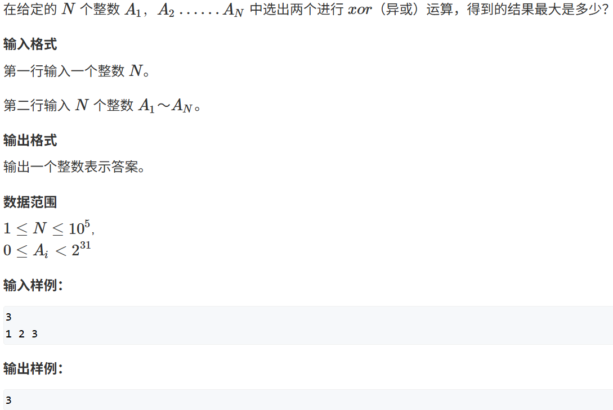

```

int f[4000010][2];
int idx = 1;
int cnt[4000010];
void insert(int x) {
	int p = 0;
	for(int i=31; i>=0; i--) {
		int t = x&(1<<i);
		if(t!=0) {
			t=1;
		}
		if(f[p][t]==0) {
			f[p][t] = idx;
			idx++;
		}
		p = f[p][t];
	}
	cnt[p] = x;
}
int query(int x) {
	int p = 0;
	for(int i=31; i>=0; i--) {
		int t = x&(1<<i);
		if(t!=0){
			t = 1;
		}
		if(f[p][1-t]==0) {
			p = f[p][t];
		} else {
			p = f[p][1-t];
		}
	}
	return cnt[p];
}
int main() {
	int n;
	scanf("%d", &n);
	vector<int> num;
	num.push_back(-1);
	for(int i=1; i<=n; i++) {
		int x;
		scanf("%d", &x);
		num.push_back(x);
		insert(x);
	}
	int ans = 0;
	for(int i=1; i<=n; i++) {
		int y;
		y = query(num[i]);
		ans = max(ans, num[i]^y);
	}
	cout<<ans;
	return 0;
}
```

## 词典中最长的单词

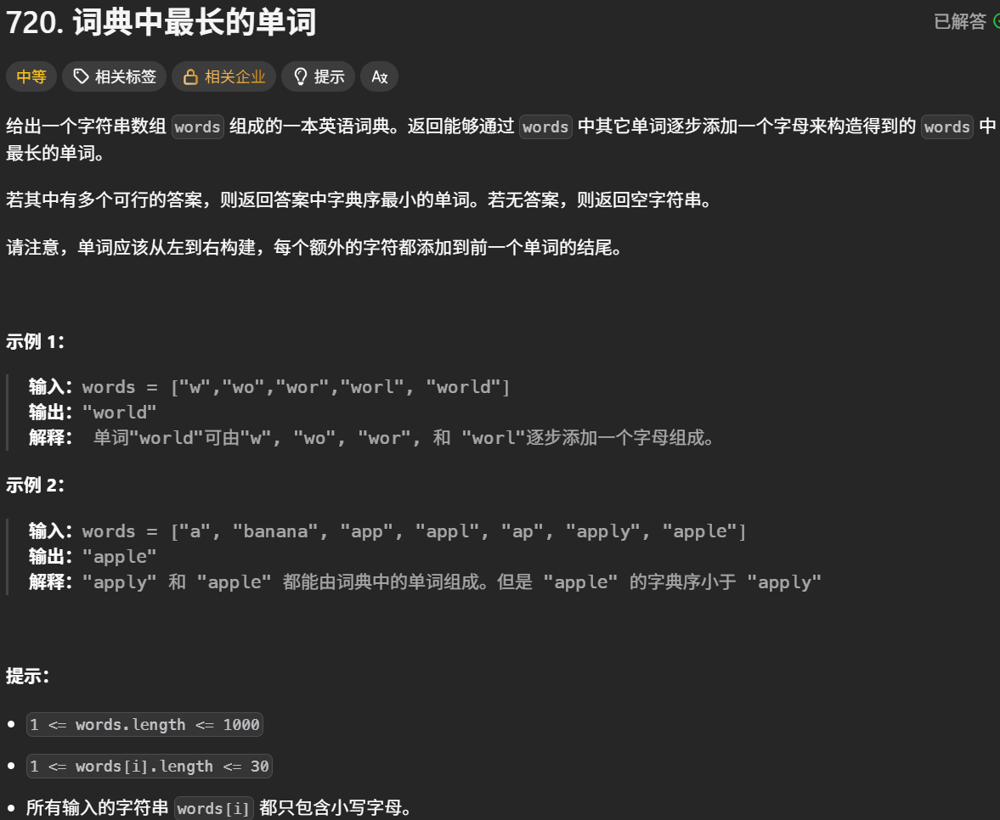

```
class Solution {
	public:
		typedef pair<int, string> PII;
		int e[30010][26];
		int idx=1;
		bool cx[30010];
		void add(string s) {
			int p=0;
			for(int i=0; i<s.size(); i++) {
				int a = s[i]-'a';
				if(e[p][a]==0) {
					e[p][a]=idx;
					idx++;
				}
				p=e[p][a];
			}
			cx[p]=true;
		}
		bool check(string s) {
			int p=0;
			for(int i=0; i<s.size(); i++) {
				int a = s[i]-'a';
				p=e[p][a];
				if(cx[p]==false) {
					return false;
				}
			}
			return true;
		}
		string longestWord(vector<string>& words) {
			string ans;
			priority_queue<PII> dui;
			for(int i=0; i<words.size(); i++) {
				dui.push({words[i].size(), words[i]});
			}
			for(int i=0; i<words.size(); i++) {
				add(words[i]);
			}
			while(dui.size()) {
				auto x = dui.top();
				dui.pop();
				string temp = x.second;
				if(check(temp)) {
					if(temp.size()>=ans.size())
					ans = temp;
				}
			}
			return ans;
		}
};
```

# 并查集

快速地（近乎O(1)，但不算O(1)）

- 将两个集合合并
- 询问两个元素是否在同一个集合中

## 例题1

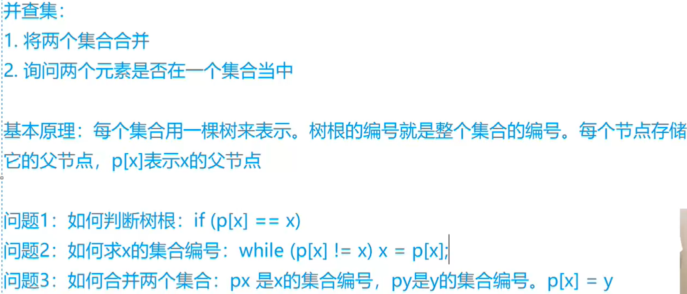

```
int p[100010];
int find(int x) {
	if(p[x]!=x) {
		// 如果说当前这个节点不是根节点，那么就把它的父节点改成根节点 
		p[x] = find(p[x]);
	}
	return p[x];
}
int main() {
	int n,m;
	scanf("%d %d",&n,&m);
	for(int i=1; i<=n; i++) {
		p[i] = i;
	}
	while(m--) {
		char s;
		int a,b;
		cin>>s>>a>>b;
		if(s=='M') {
			// 合并的时候就是把 a 的根节点的 p[] 值改成 b 的根节点，相当于认了个爹 
			p[find(a)] = find(b);
		} else {
			if(find(a)==find(b)) {
				cout<<"Yes"<<endl;
			} else {
				cout<<"No"<<endl;
			}
		}
	}
	return 0;
}
```

```
p[find(a)] = find(b);
p[x] = find(p[x]);!!!
```


## 例题2

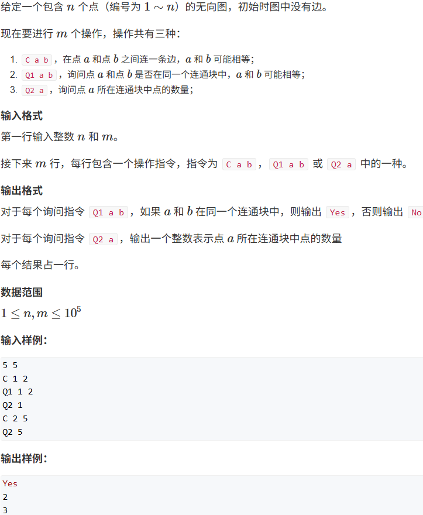

```
int p[100100];
int nums[100100];
int find(int x) {
	if(x!=p[x]) {
		p[x]=find(p[x]);
	}
	return p[x];
}
int main() {
	int n, m;
	cin>>n>>m;
	for(int i=1; i<=n; i++) {
		p[i]=i;
		nums[i]=1;
	}
	while(m--) {
		string s;
		int a, b;
		cin>>s;
		if(s=="C") {
			cin>>a>>b;
			if(find(a)!=find(b)) {
				nums[find(b)]+=nums[find(a)];
				p[find(a)]=find(b);
			}
		} else if(s=="Q1") {
			cin>>a>>b;
			if(find(a)==find(b)) {
				cout<<"Yes"<<endl;
			} else {
				cout<<"No"<<endl;
			}
		} else {
			cin>>a;
			cout<<nums[find(a)]<<endl;
		}
	}
}
```

每一个集合代表一个连通集，所谓连通集就是 从A能走到B也能从B走到A就叫连通集

多了一个数组来维护个数，但是要特判：**当两个点在同一个集合里面的时候siz不要相加！**

注意，用祖父节点的编号代替计数器的编号（也就是查询一个连通集的点个数时，查询索引为祖父节点编号就行，连边的时候操作也只是索引为祖父节点编号）

## 快速查看图里两个点是否连通

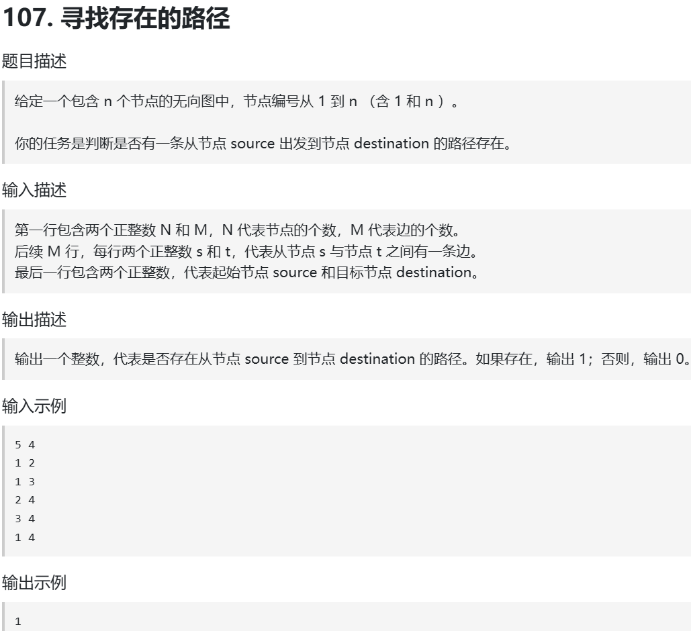

```
int p[1000];
int find(int x) {
	if(x!=p[x]) {
		p[x]=find(p[x]);
	}
	return p[x];
}
int main() {
	int n, m;
	cin>>n>>m;
	for(int i=1;i<=n;i++){
		p[i]=i;
	} 
	for(int i=1; i<=m; i++) {
		int a, b;
		cin>>a>>b;
		p[find(a)] = find(b);
	}
	int start, end;
	cin>>start>>end;
	if(find(start)==find(end)) {
		cout<<1;
	} else {
		cout<<0;
	}
}
```

只需要看俩点的祖父节点是不是一样的就行！

## 删除冗余的边

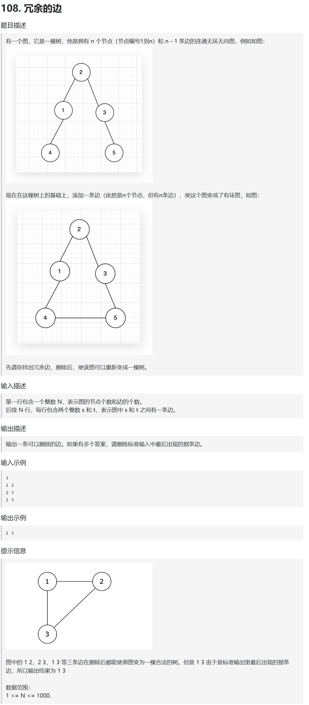

```
从后往前遍历输入的边，不加当前这条，看看构造完的图是不是连通
```

```
int p[10000];
int find(int x) {
	if(x!=p[x]) {
		p[x] = find(p[x]);
	}
	return p[x];
}
int main() {
	int n;
	cin>>n;
	vector<vector<int>> bian;
	for(int i=1; i<=n; i++) {
		int a, b;
		cin>>a>>b;
		bian.push_back({a, b});
	}
	for(int k=bian.size()-1; k>=0; k--) {
		memset(p, 0, sizeof p);
		for(int i=1; i<=n; i++) {
			p[i]=i;
		}
		for(int i=0; i<bian.size(); i++) {
			if(i==k) {
				continue;
			}
			int a = bian[i][0];
			int b = bian[i][1];
			p[find(a)]=find(b);
		}
		bool success=true;
		for(int i=2; i<=n; i++) {
			if(find(i)!=find(1)) {
				success=false;
				break;
			}
		}
		if(success) {
			cout<<bian[k][0]<<' '<<bian[k][1];
			break;
		}
	}
}
```

```
下一个做法：加边的时候，看看他俩节点是不是已经连到的同一个祖父节点上（已经连通，再连边就会有环了）
```

```
int p[10000];
int find(int x) {
	if(x!=p[x]) {
		p[x] = find(p[x]);
	}
	return p[x];
}
int main() {
	int n;
	cin>>n;
	vector<vector<int>> bian;
	for(int i=1; i<=n; i++) {
		int a, b;
		cin>>a>>b;
		bian.push_back({a, b});
		p[i]=i;
	}
	for(int k=0; k<bian.size(); k++) {
		int a = bian[k][0];
		int b = bian[k][1];
		if(find(a)==find(b)) {
			cout<<a<<' '<<b;
			break;
		} else {
			p[find(a)]=find(b);
		}
	}
}
```

## 最小体力消耗

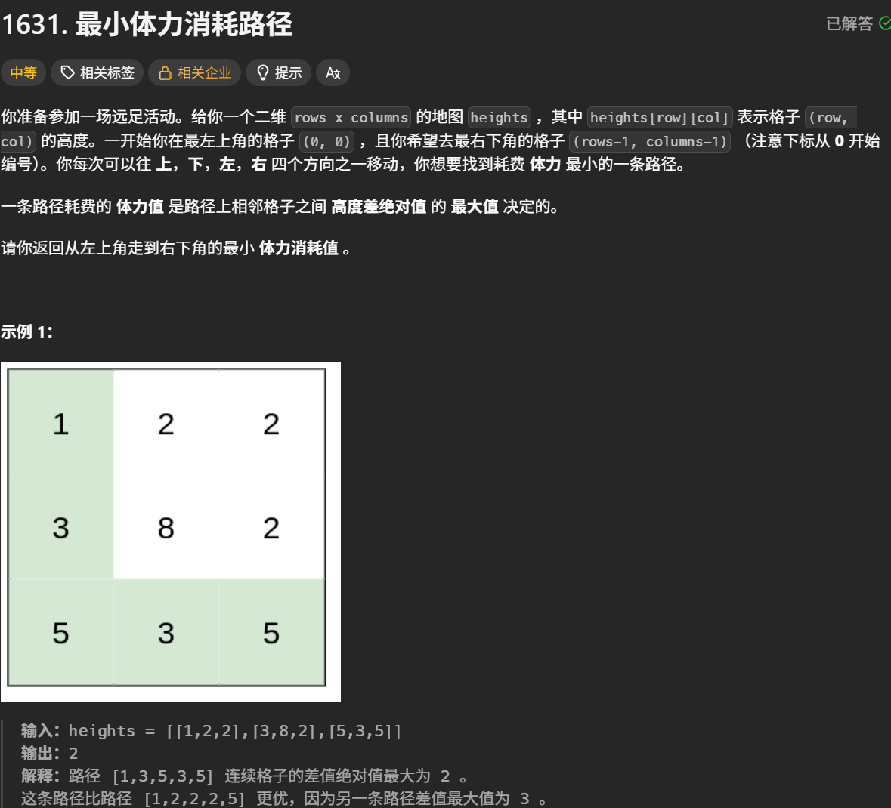

```
本题可以 二分搜（最小最大值）：二分体力，得到固定体力后，把边容器里所有权重大于该体力的边删掉，然后转换成检查——检查从起点开始dfs， 利用当前删完的这些边能否到达终点！

也可以并查集

也可以迪杰斯特拉
```

```
bool cmp(vector<int>& a, vector<int>& b) {
	return a[2]<b[2];
}
class Solution {
	public:
		int dx[4]= {0, 0, -1, 1};
		int dy[4]= {1, -1, 0, 0};
		int index[110][110];
		int p[10000];
		int find(int x) {
			if(x!=p[x]) {
				p[x]=find(p[x]);
			}
			return p[x];
		}
		int minimumEffortPath(vector<vector<int>>& heights) {
			vector<vector<int>> bian;
			int h = heights.size()-1;
			int l = heights[0].size()-1;
			int t=0;
			for(int i=0; i<=h; i++) {
				for(int j=0; j<=l; j++) {
					index[i][j]=t;
					t++;
				}
			}
			int start=0, end=t-1;
			for(int i=0; i<=h; i++) {
				for(int j=0; j<=l; j++) {
					for(int k=0; k<4; k++) {
						int i_new = i+dx[k];
						int j_new = j+dy[k];
						if(i_new>=0 && i_new<=h && j_new>=0 && j_new<=l) {
							int index1 = index[i][j];
							int index2 = index[i_new][j_new];
							bian.push_back({index1, index2, abs(heights[i][j]-heights[i_new][j_new])});
						}
					}
				}
			}
			sort(bian.begin(), bian.end(), cmp);
			for(int i=start; i<=end; i++) {
				p[i]=i;
			}
			if(find(start)==find(end)) {
				return 0;
			}
			int ans =0;
			for(int i=0; i<bian.size(); i++) {
				int index1 = bian[i][0];
				int index2 = bian[i][1];
				int w = bian[i][2];
				p[find(index1)]=find(index2);
				if(find(start)==find(end)) {
					ans=w;
					break;
				}
			}
			return ans;
		}
};
int main() {
	Solution a;
	vector<vector<int>> heights = {{1,2,2},{3,8,2},{5,3,5}};
	int ans = a.minimumEffortPath(heights);
	cout<<ans;
}
```

```
并查集做法：
先把每个点赋上编号——index数组
把所有边记录下来，边的权重就是两个点之间差的绝对值——bian容器

把bian容器按权重从小到大排序

权重从小到大连通两个顶点，每次连通完都判断一下起点和终点是否连通，连通的话路径长度就是最后一次连通的边的权重（最后一次边权一定是最大的）
```

## 最小化连通分量的最大成本

```
二分答案
```

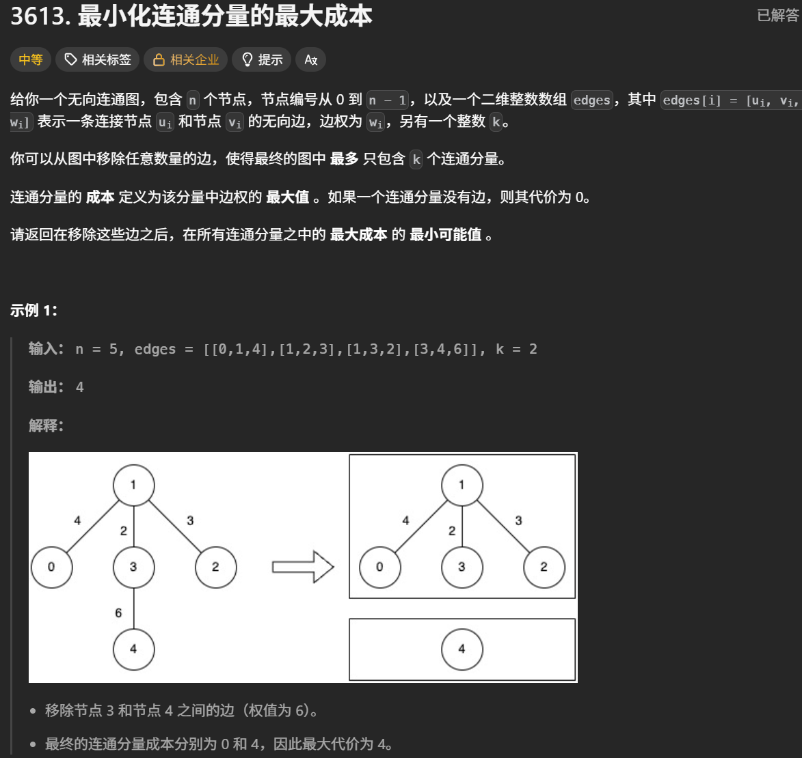

```
bool cmp(vector<int>& a, vector<int>& b) {
	return a[2]<b[2];
}
class Solution {
	public:
		int p[50010];
		int find(int x) {
			if(x!=p[x]) {
				p[x]=find(p[x]);
			}
			return p[x];
		}
		bool check(int x, int n, vector<vector<int>>& edges, int k) {
			for(int i=0; i<n; i++) {
				p[i]=i;
			}
			for(int i=0; i<edges.size(); i++) {
				if(edges[i][2]<=x) {
					p[find(edges[i][0])]=find(edges[i][1]);
				}
			}
			unordered_map<int, bool> dic;
			for(int i=0; i<n; i++) {
				dic[find(i)]=true;
			}
			if(dic.size()>k) {
				return false;
			} else {
				return true;
			}
		}
		int minCost(int n, vector<vector<int>>& edges, int k) {
			int l=0, r=1e9;
			sort(edges.begin(), edges.end(), cmp);
			while(l<r) {
				int mid=l+r>>1;
				if(check(mid, n, edges, k)) {
					r=mid;
				} else {
					l=mid+1;
				}
			}
			return r;
		}
};
```

```
把删边转换成加边
记录所有祖宗，看多少个
```

## 统计完全连通分量的数量

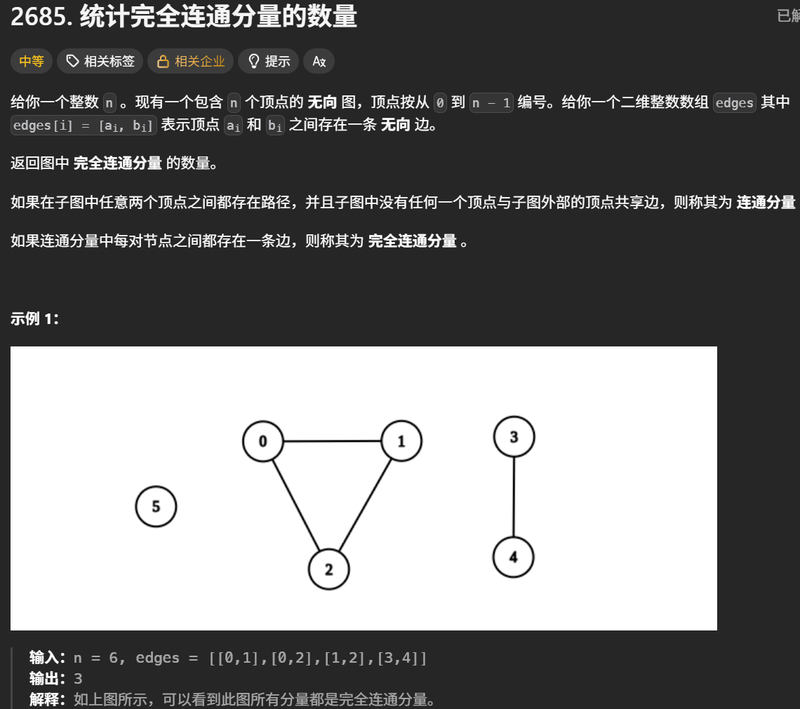

```
class Solution {
	public:
		int p[10010];
		int find(int x) {
			if(x!=p[x]) {
				p[x]=find(p[x]);
			}
			return p[x];
		}
		bool bian[1010][1010];
		int countCompleteComponents(int n, vector<vector<int>>& edges) {
			for(int i=0; i<n; i++) {
				p[i]=i;
			}
			for(int i=0; i<edges.size(); i++) {
				p[find(edges[i][0])]=find(edges[i][1]);
				bian[edges[i][0]][edges[i][1]]=true;
				bian[edges[i][1]][edges[i][0]]=true;
			}
			unordered_map<int, vector<int>> dic;
			for(int i=0; i<n; i++) {
				dic[find(i)].push_back(i);
			}
			int ans = 0;
			for(const auto &ele:dic) {
				vector<int> temp = ele.second;
				bool success=true;
				for(int i=0; i<temp.size(); i++) {
					for(int j=i+1; j<temp.size(); j++) {
						if(bian[temp[i]][temp[j]]==false) {
							success=false;
							break;
						}
					}
					if(success==false) {
						break;
					}
				}
				if(success==true) {
					ans++;
				}
			}
			return ans;
		}
};
```

# 单调栈

## 找当前这个数字左边最小的且最近的那个数字

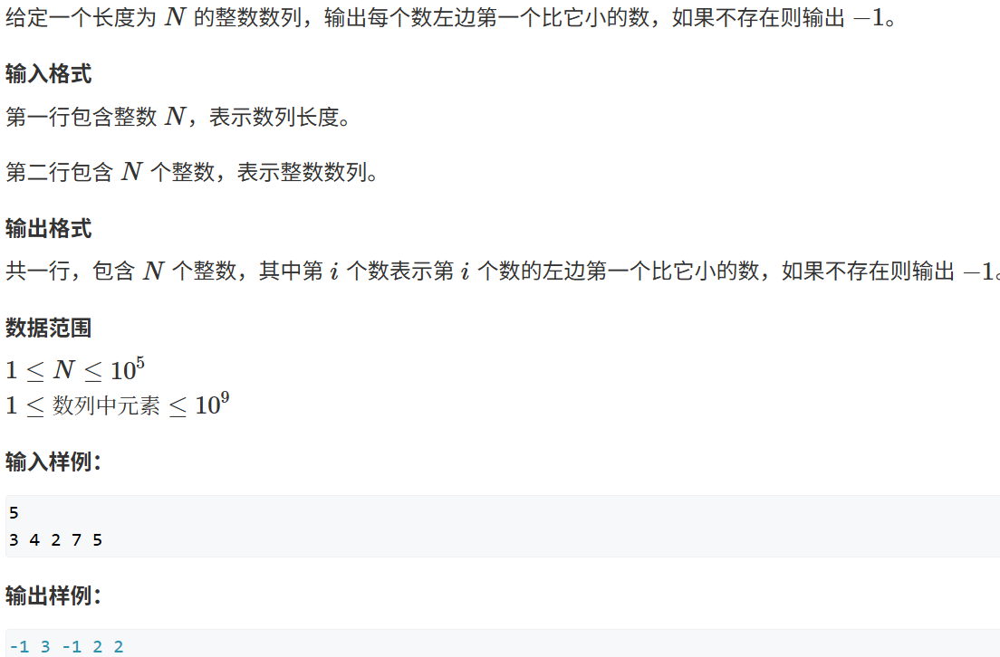

- 时刻保持栈里面是一个单调递增的，因为如果x<=y，且num[x]>=num[y]的话，实际上num[x]永远不会被作为答案输出！

```
int main() {
	int n;
	scanf("%d", &n);
	vector<int> zhan;
	zhan.push_back(-1);
	for(int i=1; i<=n; i++) {
		int x;
		scanf("%d", &x);
		int t = zhan[zhan.size()-1];
		while(t>=x) {
			zhan.pop_back();
			t = zhan[zhan.size()-1];
		}
		cout<<t<<' ';
		zhan.push_back(x);
	}
}
```

## 柱状图中的最大矩形

直接上链接

```
https://leetcode.cn/problems/largest-rectangle-in-histogram/?envType=study-plan-v2&envId=top-100-liked
```

上代码！

```
class Solution {
	public:
		int largestRectangleArea(vector<int>& heights) {
			vector<int> zhan;
			vector<int> ans(heights.size(), 0);
			for(int i=0; i<heights.size(); i++) {
				if(zhan.size()==0 || heights[i]>=heights[zhan[zhan.size()-1]]) {
					zhan.push_back(i);
					continue;
				}
				if(heights[i]<heights[zhan[zhan.size()-1]]) {
					while(zhan.size()!=0 && heights[i]<heights[zhan[zhan.size()-1]]) {
						int x;
						x = heights[zhan[zhan.size()-1]] * (i-zhan[zhan.size()-1]);
						ans[zhan[zhan.size()-1]] += x;
						zhan.pop_back();
					}
					zhan.push_back(i);
				}
			}
			for(int i=0; i<zhan.size(); i++) {
				int x;
				x = heights[zhan[i]] * (1 + zhan[zhan.size()-1] - zhan[i]);
				ans[zhan[i]] += x;
			}
//			for(int i=0; i<ans.size(); i++) {
//				cout<<ans[i]<<' ';
//			}
//			cout<<endl;
			zhan.clear();
			for(int i=heights.size()-1; i>=0; i--) {
				if(zhan.size()==0 || heights[i]>=heights[zhan[zhan.size()-1]]) {
					zhan.push_back(i);
					continue;
				}
				if(heights[i]<heights[zhan[zhan.size()-1]]) {
					while(zhan.size()!=0 && heights[i]<heights[zhan[zhan.size()-1]]) {
						int x;
						x = heights[zhan[zhan.size()-1]] * (zhan[zhan.size()-1]-i-1);
						ans[zhan[zhan.size()-1]] += x;
						zhan.pop_back();
					}
					zhan.push_back(i);
				}
			}
			for(int i=0; i<zhan.size(); i++) {
				int x;
				x = heights[zhan[i]] * (zhan[i] - zhan[zhan.size()-1]);
				ans[zhan[i]] += x;
			}
			int goal=0;
			for(int i=0;i<ans.size();i++){
				goal = max(goal, ans[i]);
			}
			return goal;
		}
};
```

代码很长，但重复性很高

- 第一部分是：找到每一个数字向右看能 勾勒出来的 最大矩形
- 注意，到最后的时候要处理栈里剩余的元素，也就是它到栈顶元素的距离乘它自身的高度
- 第二部分是：找到每一个数字向左看能 勾勒出来的 最大矩形
- 注意，在往左看的时候，要注意自身已经在第一部分被加了一次，因此在这个时候要少加一次
- 单调栈的问题 一定要注意 zhan是否为空的情况，要注意特判，否则TLE

后续做法：找当前这个元素左边和右边第一个比它小的元素所处的位置（经典单调栈），保持单调栈是一个单调递增的！如果来一个更小的元素，说明栈里比它大的那些元素永远都不会再用到！

```
class Solution {
	public:
		int largestRectangleArea(vector<int>& heights) {
			vector<int> zhan;
			vector<int> lmin;
			for(int i=0; i<heights.size(); i++) {
				if(i==0) {
					zhan.push_back(i);
					lmin.push_back(-1);
					continue;
				}
				if(heights[i]>heights[zhan[zhan.size()-1]]) {
					lmin.push_back(zhan[zhan.size()-1]);
					zhan.push_back(i);
				} else {
					while(zhan.size()!=0 && heights[i]<=heights[zhan[zhan.size()-1]]) {
						zhan.pop_back();
					}
					if(zhan.size()==0) {
						lmin.push_back(-1);
					} else {
						lmin.push_back(zhan[zhan.size()-1]);
					}
					zhan.push_back(i);
				}
			}

			vector<int> rmin;
			zhan.clear();
			for(int i=heights.size()-1; i>=0; i--) {
				if(i==heights.size()-1) {
					zhan.push_back(i);
					rmin.push_back(heights.size());
					continue;
				}
				if(heights[i]>heights[zhan[zhan.size()-1]]) {
					rmin.push_back(zhan[zhan.size()-1]);
					zhan.push_back(i);
				} else {
					while(zhan.size()!=0 && heights[i]<=heights[zhan[zhan.size()-1]]) {
						zhan.pop_back();
					}
					if(zhan.size()==0) {
						rmin.push_back(heights.size());
					} else {
						rmin.push_back(zhan[zhan.size()-1]);
					}
					zhan.push_back(i);
				}
			}
			reverse(rmin.begin(), rmin.end());
			int ans=0;
			for(int i=0;i<rmin.size();i++){
				int temp = heights[i]*(i-lmin[i]+rmin[i]-i-1);
				ans = max(temp, ans);
			} 
			return ans;
		}
};
int main() {
	Solution a;
	vector<int>heights = {2,1,5,6,2,3};
	int ans = a.largestRectangleArea(heights);
	cout<<ans; 
}
```


## 不同字符的最小子序列

```
#include <iostream>
#include <algorithm>
#include <vector>
#include <set>
#include <map>
#include <queue>
#include <unordered_map>
#include <set>
#include <string>
#include <cstring>
#include <cmath>
#include <climits>
#include <numeric>
using namespace std;
// 34
class Solution {
	public:
		string smallestSubsequence(string s) {
			string zhan;
			unordered_map<char, int> pos;
			for(int i=0; i<s.size(); i++) {
				pos[s[i]]=i;
			}
			unordered_map<char, bool> cx;
			for(int i=0; i<s.size(); i++) {
				if(i==0) {
					zhan.push_back(s[i]);
					cx[s[i]]=true;
					continue;
				}
				if(cx[s[i]]==false) {
					if(s[i]>zhan[zhan.size()-1]) {
						zhan.push_back(s[i]);
						cx[s[i]]=true;
					} else {
						while(zhan.size()!=0 && s[i]<=zhan[zhan.size()-1] && pos[zhan[zhan.size()-1]]>=i) {
							cx[zhan[zhan.size()-1]]=false;
							zhan.pop_back();
						}
						zhan.push_back(s[i]);
						cx[s[i]]=true;
					}
				}
			}
			return zhan;
		}
};

```

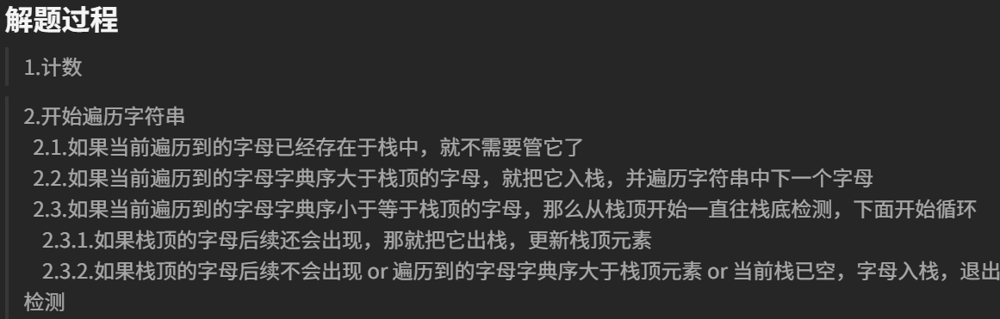

```
遍历到当前元素
如果它已经出现在zhan中，则不需要管，否则：
- 如果它比栈顶要大，那就入栈
- 如果他比栈顶要小，开始循环：栈顶元素后续还会出现、当前元素比栈顶要小，就一直pop
```

## 删除字符串中相邻重复元素

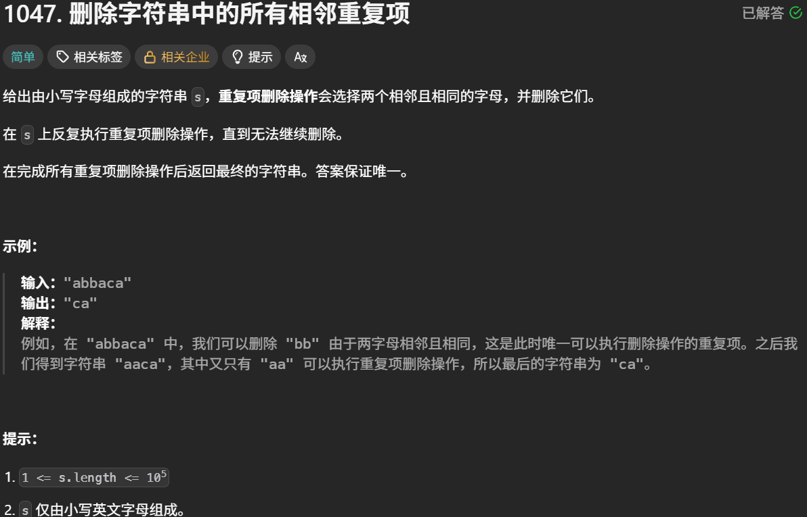

```
class Solution {
	public:
		string removeDuplicates(string s) {
			string zhan;
			for(int i=0;i<s.size();i++){
				if(i==0){
					zhan.push_back(s[i]);
					continue;
				}
				if(zhan.size()!=0 && s[i]==zhan[zhan.size()-1]){
					zhan.pop_back();
				}else{
					zhan.push_back(s[i]);
				}
			}
			return zhan;
		}
};
```

## 中缀表达式求值

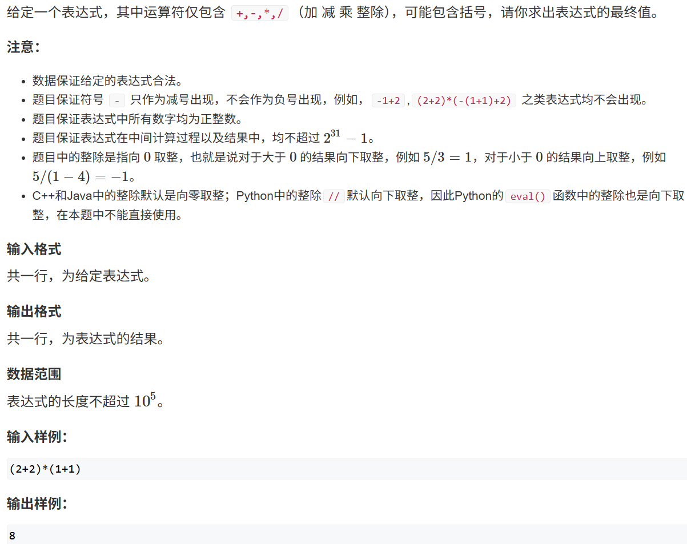

```
vector<int> number;
string op;
void compute() {
	int num2 = number[number.size()-1];
	number.pop_back();
	int num1 = number[number.size()-1];
	number.pop_back();
	char ys = op[op.size()-1];
	op.pop_back();
	if(ys=='+') {
		number.push_back(num1+num2);
	}
	if(ys=='-') {
		number.push_back(num1-num2);
	}
	if(ys=='*') {
		number.push_back(num1*num2);
	}
	if(ys=='/') {
		number.push_back(num1/num2);
	}
}
int main() {
	string s;
	cin>>s;
	unordered_map<char, int> dic= {{'+', 1}, {'-', 1}, {'*', 2}, {'/', 2}};
	for(int i=0; i<s.size(); i++) {
		if(s[i]>='0' && s[i]<='9') {
			int j = i;
			int temp=0;
			while(j<s.size() && s[j]>='0' && s[j]<='9') {
				temp=temp*10+s[j]-'0';
				j++;
			}
			number.push_back(temp);
			i=j-1;
		} else if(s[i]=='(') {
			op.push_back(s[i]);
		} else if(s[i]==')') {
			while(op.size()!=0 && op[op.size()-1]!='(') {
				compute();
			}
			op.pop_back();
		} else {
			while(op.size()!=0 && dic[s[i]]<=dic[op[op.size()-1]]) {
				compute();
			}
			op.push_back(s[i]);
		}
		cout<<op<<endl; 
	}
	while(op.size()) {
		compute();
	}
	cout<<number[number.size()-1];
}

```

```
dic[s[i]]<=dic[op[op.size()-1]] 是<=
```

## 波兰（后缀）表达式求值

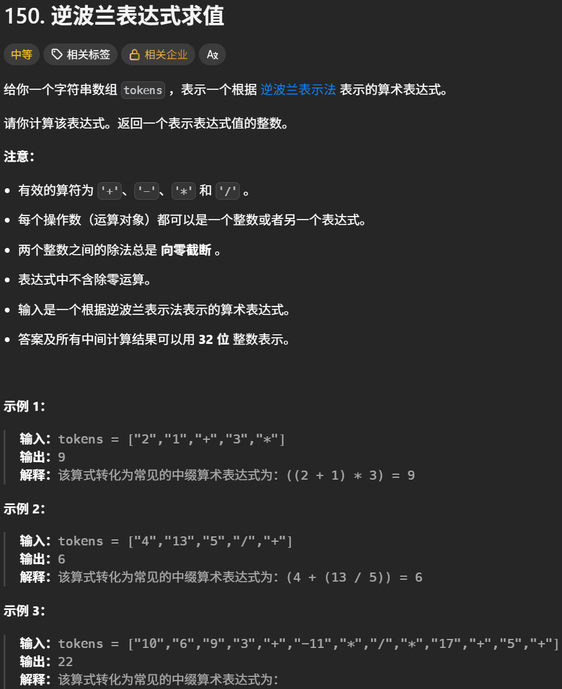

```
class Solution {
	public:
		int evalRPN(vector<string>& tokens) {
			vector<int> num;
			for(int i=0; i<tokens.size(); i++) {
				if((tokens[i][0]>='0' && tokens[i][0]<='9') || tokens[i].size()>1) {
					int temp=0;
					if(tokens[i][0]=='-') {
						for(int j=1; j<tokens[i].size(); j++) {
							temp=temp*10+tokens[i][j]-'0';
						}
						temp = -temp;
					} else {
						for(int j=0; j<tokens[i].size(); j++) {
							temp=temp*10+tokens[i][j]-'0';
						}
					}
					num.push_back(temp);
				} else {
					int s2 = num[num.size()-1];
					num.pop_back();
					int s1 = num[num.size()-1];
					num.pop_back();
					if(tokens[i][0]=='+') {
						num.push_back(s1+s2);
					}
					if(tokens[i][0]=='-') {
						num.push_back(s1-s2);
					}
					if(tokens[i][0]=='*') {
						num.push_back(s1*s2);
					}
					if(tokens[i][0]=='/') {
						num.push_back(s1/s2);
					}
				}
			}
			int ans = num[num.size()-1];
			return ans;
		}
};
```

注意负数的处理！！！！！

## 有效的括号字符串（双栈）

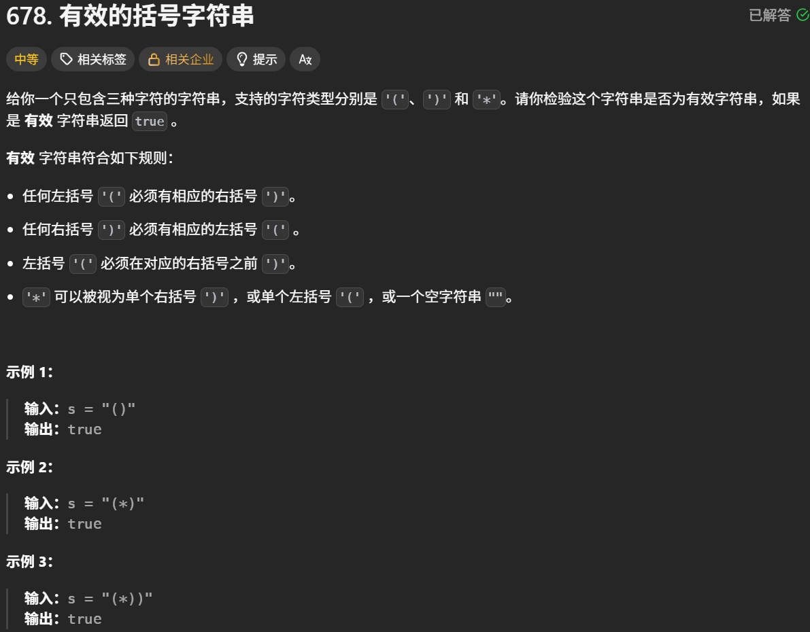

```
class Solution {
	public:
		typedef pair<char, int> PII;
		bool checkValidString(string s) {
			vector<PII> kuohao;
			vector<PII> xing;
			for(int i=0; i<s.size(); i++) {
				if(s[i]=='(') {
					kuohao.push_back({s[i], i});
				} else if(s[i]=='*') {
					xing.push_back({s[i], i});
				} else {
					if(kuohao.size()!=0 && kuohao[kuohao.size()-1].first=='(') {
						kuohao.pop_back();
					} else {
						if(xing.size()!=0) {
							xing.pop_back();
						} else {
							return false;
						}
					}
				}
			}
			while(xing.size()!=0 && kuohao.size()!=0 && kuohao[kuohao.size()-1].second < xing[xing.size()-1].second) {
				kuohao.pop_back();
				xing.pop_back();
			}
			if(kuohao.size()==0){
				return true;
			} 
			return false;
		}
};
```

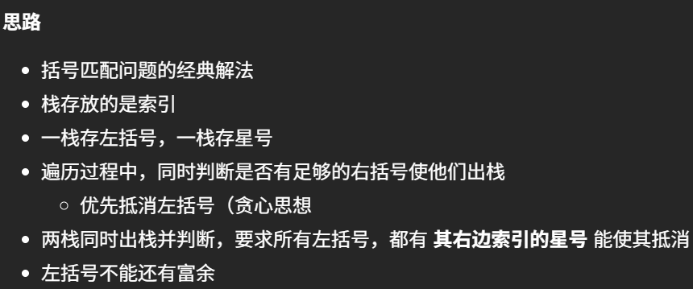

## 车队

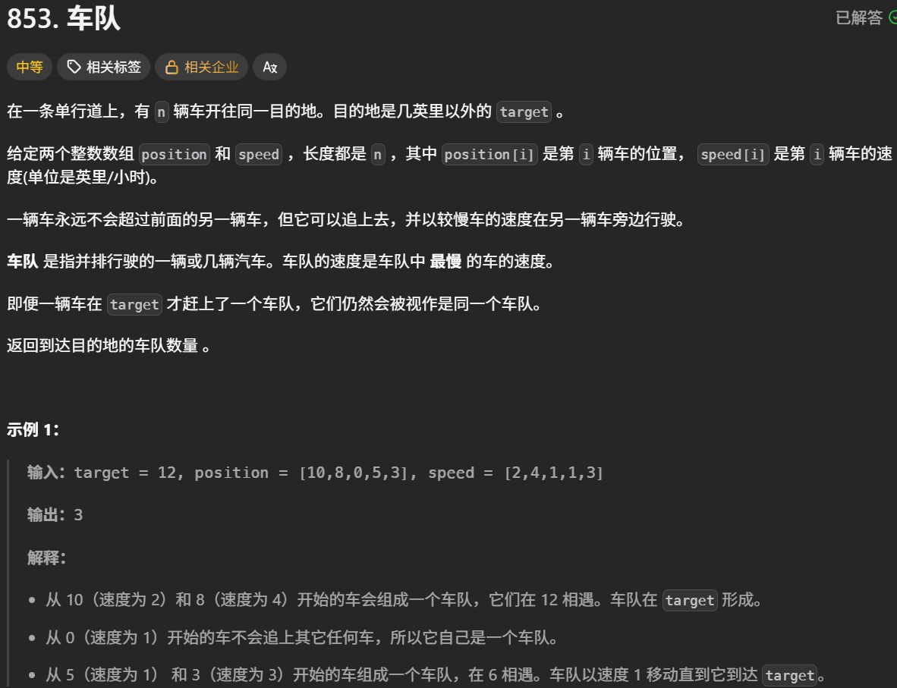

```
bool cmp(vector<int>& a, vector<int>& b) {
	return a[0]<b[0];
}
class Solution {
	public:
		int carFleet(int target, vector<int>& position, vector<int>& speed) {
			vector<vector<int>> nums;
			int ans = position.size();
			vector<double> time(ans, 0);
			for(int i=0; i<position.size(); i++) {
				nums.push_back({position[i], speed[i]});
			}
			sort(nums.begin(), nums.end(), cmp);
			
			for(int i=0; i<nums.size(); i++) {
				time[i]=(target-nums[i][0])*1.0/nums[i][1];
			}
			vector<double> zhan;
			
			for(int i=nums.size()-1;i>=0;i--){
				while(zhan.size()!=0 && zhan[zhan.size()-1]<time[i]){
					zhan.pop_back();
				}
				if(zhan.size()!=0){
					ans--;
				}
				zhan.push_back(time[i]);
			}
			return ans;
		}
};
```

```
按position排序
计算到达终点的时间
如果当前元素的time它右边还有更大的time，那说明当前这个元素不会单独成队，因此ans--
```

# 单调队列

## 滑动窗口最大值

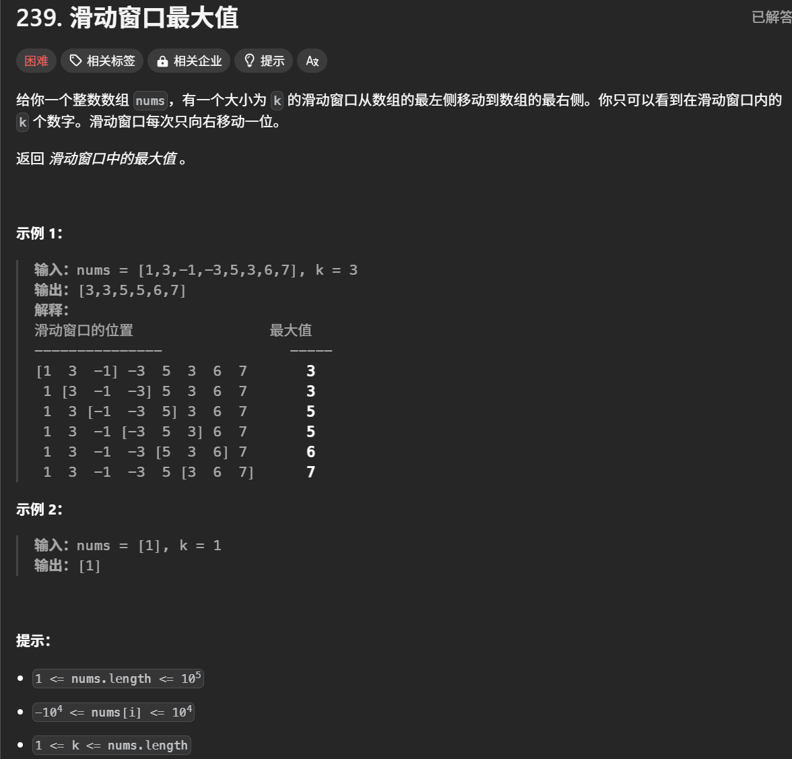

```
class Solution {
	public:
		vector<int> maxSlidingWindow(vector<int>& nums, int k) {
			vector<int> zhan;
			vector<int> ans;
			for(int i=0; i<nums.size(); i++) {
				if(i==0) {
					zhan.push_back(0);
				} else {
					if(nums[i]<nums[zhan[zhan.size()-1]]) {
						zhan.push_back(i);
					} else {
						while(1) {
							if(zhan.size()==0 || nums[i]<nums[zhan[zhan.size()-1]]) {
								break;
							}
							zhan.pop_back();
						}
						zhan.push_back(i);
					}
				}
				if(i>=(k-1)) {
					int x = zhan[0];
					if(x<i-k+1) {
						zhan.erase(zhan.begin());
					}
					ans.push_back(nums[zhan[0]]);
				}
			}
			return ans;
		}
};
```

这里求的是最大值，那么实际上就是要保证一个单调递减的队列！

- 如果当前数字比队尾元素要小，直接入队
- 如果当前数字比队尾元素要大，队尾开始出队，直到它比某个元素要小或者队列为空，就入队
- i 从 k-1 开始就保存答案，直接保存队首元素即可！当然这里要判断一下，队首元素是否还在当前的滑动窗口里

```
class Solution {
	public:
		vector<int> maxSlidingWindow(vector<int>& nums, int k) {
			vector<vector<int>> dui(nums.size(), vector<int>(2, 0));
			vector<int> ans;
			int tou=0, wei=-1;
			for(int i=0; i<nums.size(); i++) {
				while(tou<=wei && nums[i]>=dui[wei][0]) {
					wei--;
				}
				wei++;
				dui[wei][0]=nums[i];
				dui[wei][1]=i;
				if(i>=k-1) {
					while(dui[tou][1]<i-k+1) {
						tou++;
					}
					ans.push_back(dui[tou][0]);
				}
			}
			return ans;
		}
};
```

纯数组模拟队列的做法

## 跳跃游戏VI

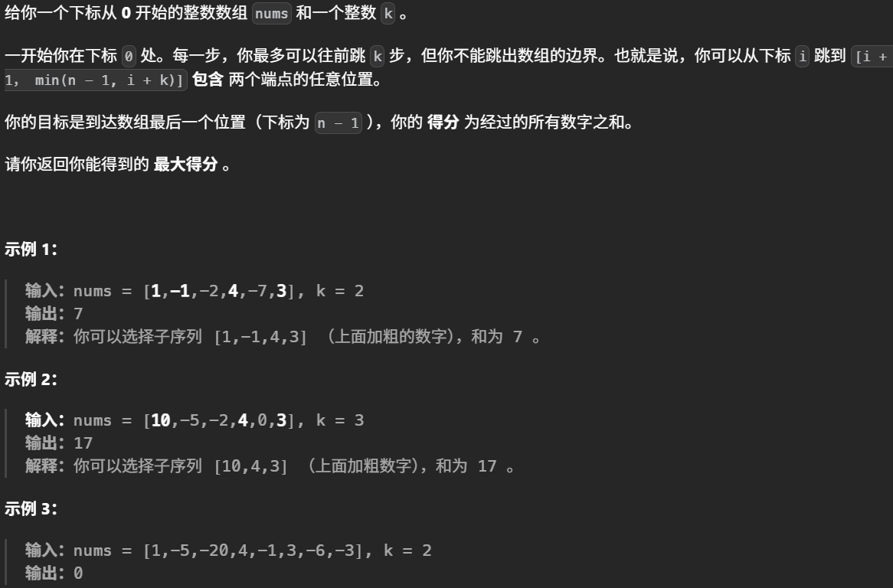

```
class Solution {
	public:
		int dp[100010];
		int maxResult(vector<int>& nums, int k) {
			vector<vector<int>> dui(nums.size(), vector<int>(2, 0));
			int tou=0, wei=-1;
			dp[0]=nums[0];
			int n = nums.size()-1;
			dui[0][0]=dp[0];
			dui[0][1]=0;
			wei++;
			for(int i=1; i<nums.size(); i++) {
				dp[i] = nums[i];
				while(dui[tou][1]+1>i || min(n, dui[tou][1]+k)<i) {
					tou++;
				}
				dp[i]+=dui[tou][0];
				while(tou<=wei && dp[i]>=dui[wei][0]) {
					wei--;
				}
				wei++;
				dui[wei][0]=dp[i];
				dui[wei][1]=i;
			}
			return dp[n];
		}
};
```

会超时的做法：

```
class Solution {
	public:
		int dp[100010];
		int maxResult(vector<int>& nums, int k) {
			multiset<int> dic;
			for(int i=0; i<nums.size(); i++) {
				if(i==0) {
					dp[0] = nums[0];
					dic.insert(0);
					continue;
				}
				int t = *dic.rbegin();
				while(t<i-k) {
					dic.erase(*dic.rbegin());
					t = *dic.rbegin();
				}
				dp[i] = dp[t] + nums[i];
			}
			return dp[nums.size()-1];
		}
};
```

事实上，我们需要以最低的复杂度：求滑动窗口是k这么个大小里，dp的最大值

所以dp的存储可以优化**（单调队列）**

## 不间断子数组

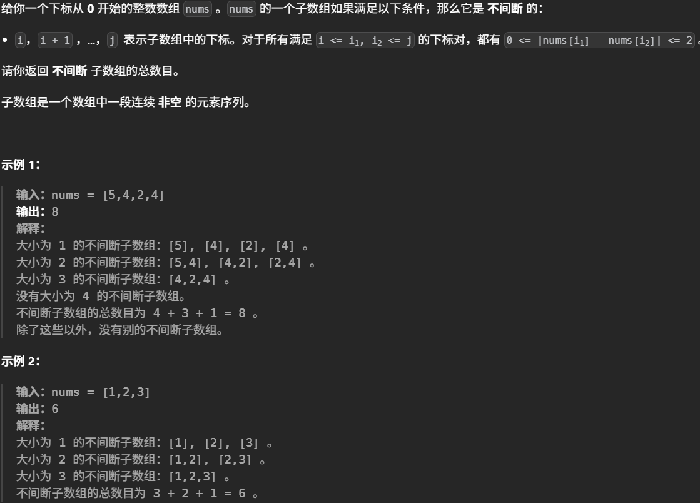

```
class Solution {
	public:
		long long continuousSubarrays(vector<int>& nums) {
			multiset<int> dic;
			int pos=0;
			long long int ans=0;
			for(int i=0; i<nums.size(); i++) {
				dic.insert(nums[i]);
				while(*dic.rbegin()-*dic.begin()>2) {
					dic.erase(dic.find(nums[pos]));
					pos++;
				}
				ans=ans+i-pos+1;
			}
			return ans;
		}
};
```


# 左右分别遍历一遍

## 经典接雨水

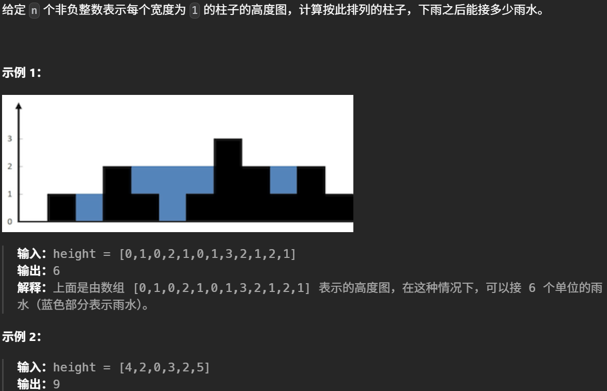

```
int l_max[20020];
int r_max[20020];
class Solution {
	public:
		int trap(vector<int>& height) {
			int ans=0;
			if(height.size()==1||height.size()==0||height.size()==2) {
				return 0;
			}
			for(int i=0; i<height.size(); i++) {
				if(i==0) {
					l_max[i] = height[i];
				} else {
					l_max[i] = max(l_max[i-1], height[i]);
				}
			}
			for(int i=height.size()-1; i>=0; i--) {
				if(i==height.size()-1) {
					r_max[i] = height[i];
				} else {
					r_max[i] = max(r_max[i+1], height[i]);
				}
			}
			for(int i=1; i<height.size()-1; i++) {
				int temp;
				temp = min(r_max[i], l_max[i]);
				if(height[i]<temp) {
					ans = ans + temp - height[i];
				}
			}
			return ans;
		}
};
```

重点在于：寻找第i的地方左边和右边的最大值，计算雨水值的时候只需要在乎它自己即可。

# 贪心

## 划分字母区间

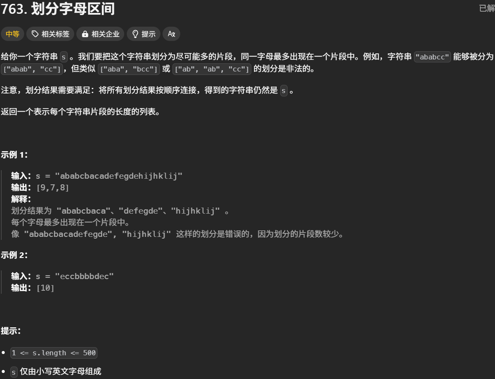

- 第一种做法：创建一个哈希表hash，记录每个字母出现的次数，然后再开一个哈希表cx，开始遍历字符串，当前字符在cx表里记录出现次数，然后从头遍历到这个字母，查看之前的字母是不是出现次数也都等于hash里面的出现次数，是的话就截断

```text
class Solution {
	public:
		vector<int> partitionLabels(string s) {
			unordered_map<char, int> hash;
			unordered_map<char, int> cx;
			vector<int> ans;
			for(int i=0; i<s.size(); i++) {
				if(hash.find(s[i])==hash.end()) {
					hash[s[i]] = 1;
				} else {
					hash[s[i]]++;
				}
			}
//			for (const auto& pair : hash) {
//				cout << pair.first << ": " << pair.second <<endl;
//			}
//			cout<<endl;
			for(int i=0; i<s.size(); i++) {
				if(cx.find(s[i])==cx.end()) {
					cx[s[i]] = 1;
				} else {
					cx[s[i]]++;
				}
				int temp = 1;
				for(int j=0; j<=i; j++) {
					if(cx[s[j]]!=hash[s[j]]) {
						temp = 0;
						break;
					}
				}
				if(temp==1) {
					ans.push_back(i+1);
				}
			}
			for(int i=ans.size()-1;i>=1;i--){
				ans[i] = ans[i]-ans[i-1];
			}
			return ans;
		}
};
```

- 第二种做法：记录每个字母最后一次出现的下表在一个hash里面，然后循环，具体如下（每一个字母都有一个最远的“视距”，当i到达前i个字母里视距最大值的时候，就记录一下答案）

```
class Solution {
	public:
		vector<int> partitionLabels(string s) {
			unordered_map<char, int> hash;
			vector<int> ans;
			for(int i=0; i<s.size(); i++) {
				hash[s[i]] = i;
			}
			int temp_max = 0;
			for(int i=0; i<s.size(); i++) {
				temp_max = max(temp_max, hash[s[i]]);
				if(i==temp_max) {
					ans.push_back(i+1);
				}
			}
			for(int i=ans.size()-1;i>=1;i--){
				ans[i] = ans[i]-ans[i-1];
			}
			return ans;
		}
};
```

## 买卖股票

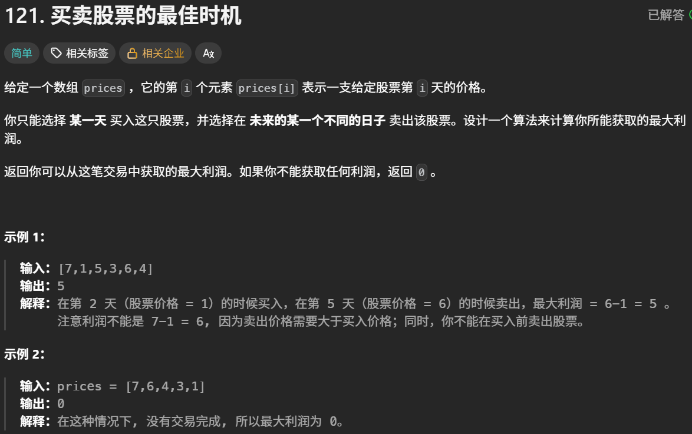

```
class Solution {
public:
    int maxProfit(vector<int>& prices) {
        int low = INT_MAX;
        int result = 0;
        for (int i = 0; i < prices.size(); i++) {
            low = min(low, prices[i]);  // 取最左最小价格
            result = max(result, prices[i] - low); // 直接取最大区间利润
        }
        return result;
    }
};
```

别想复杂了。。。单调队列都用上了。。。。

## 加油站

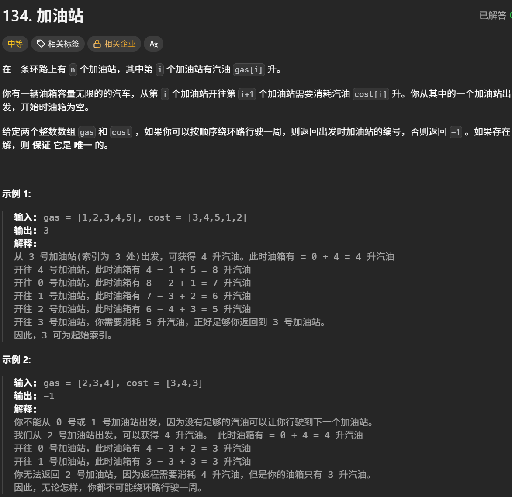

```
class Solution {
	public:
		int canCompleteCircuit(vector<int>& gas, vector<int>& cost) {
			int start=0; // 记录这条路线从哪开始
			int now=0; // 记录当前在哪
			bool round=false; // 记录是否绕圈
			int gas_num=0; // 记录当前油量
			while(start<gas.size()) {
				if(now==start && round==true) {
					return start;
				}
				gas_num += gas[now];
				if(gas_num<cost[now]) {
					if(round==false) {
						gas_num=0;
						now++;
						start=now;
					}else{
						return -1;
					}
				} else {
					gas_num=gas_num-cost[now];
					now++;
					if(now==gas.size()) {
						now=0;
						round=true;
					}
				}
			}
			return -1;
		}
};
```

```
如果当前油量不足以支撑，更新起点：一句话概括：如果x到达不了y+1，那么x-y之间的点也不可能到达y+1，因为中间任何一点的油都是拥有前面的余量的，所以下次遍历直接从y+1开始
当然了，如果已经绕圈了，那就return -1即可

否则更新油量，检查是否要绕圈了
```

## 分发糖果

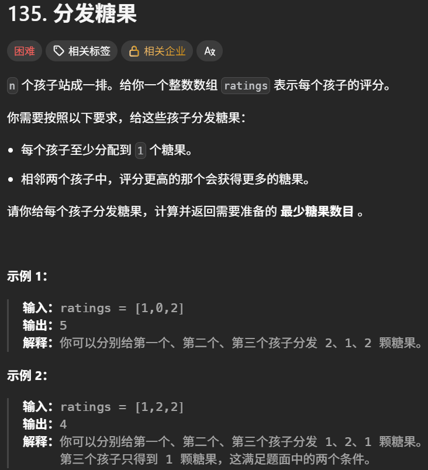

```
class Solution {
	public:
		int candy(vector<int>& ratings) {
			vector<int> candy;
			for(int i=0; i<ratings.size(); i++) {
				if(i==0) {
					candy.push_back(1);
					continue;
				}
				if(ratings[i]==ratings[i-1]) {
					candy.push_back(1);
				} else if(ratings[i]>ratings[i-1]) {
					candy.push_back(candy[candy.size()-1]+1);
				} else {
					candy.push_back(1);
					for(int i=candy.size()-2; i>=0; i--) {
						if(ratings[i]>ratings[i+1] && candy[i]<=candy[i+1]) {
							candy[i]=candy[i+1]+1;
						}
					}
				}
			}
			int sum=0;
			for(int i=0;i<candy.size();i++){
				sum+=candy[i];
			}
			return sum;
		}
};

```

```
如果ratings[i]==ratings[i-1]，补1
如果ratings[i]>ratings[i-1]，补前一个糖果+1
如果ratings[i]<ratings[i-1]，当前这个位置补1，往前检查：比前一个分高的，糖果要比前面一个多！
```

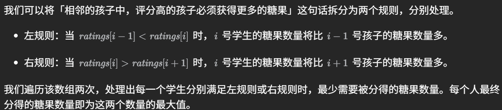

```
class Solution {
	public:
		int candy(vector<int>& ratings) {
			int n = ratings.size();
			vector<int> candy(n, 1);
			for(int i=1; i<ratings.size(); i++) {
				if(ratings[i]>ratings[i-1]) {
					candy[i]=candy[i-1]+1;
				}
			}
			for(int i=ratings.size()-2; i>=0; i--) {
				if(ratings[i]>ratings[i+1]){
					candy[i] = max(candy[i], candy[i+1]+1);
				}
			}
			int sum=0;
			for(int i=0;i<candy.size();i++){
				sum+=candy[i];
			}
			return sum;
		}
};

```

## 根据身高排队列

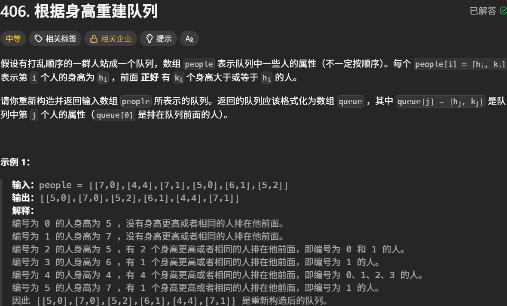

```
bool cmp(vector<int>& a, vector<int>& b) {
	if(a[1]==b[1]) {
		return a[0]<b[0];
	}
	return a[1]<b[1];
}
class Solution {
	public:
		vector<vector<int>> reconstructQueue(vector<vector<int>>& people) {
			sort(people.begin(), people.end(), cmp);
			vector<vector<int>> ans;
			for(int i=0; i<people.size(); i++) {
				cout<<people[i][0]<<' '<<people[i][1]<<endl; 
				if(i==0) {
					ans.push_back(people[i]);
					continue;
				}
				int js=0;
				int pos = ans.size();
				for(int j=0;j<ans.size();j++){
					if(ans[j][0]>=people[i][0]){
						js++;
					}
					if(js>people[i][1]){
						pos = j;
						break;
					}
				}
				ans.insert(ans.begin()+pos, people[i]);
			}
			return ans;
		}
};
```

```
按照前面的人数从小到大排序
前面的人数 一样，那就身高从小到大！
插入的当前这个人的时候，寻找第一个 身高比他大的人数累计超过了它前面应有的人数的那个人，插进去
```

## Cell Phone Network G

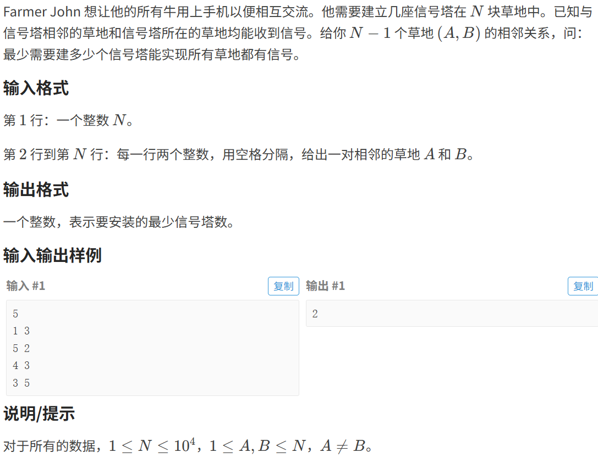

```
int n;
int h[10010];
int ne[20010];
int idx=0;
int e[20010];
int state[100010];
int pre[100010];
vector<vector<int>> depth;
bool use[100010];
void add(int x, int y) {
	e[idx]=y;
	ne[idx]=h[x];
	h[x]=idx;
	idx++;
}
void dfs(int node, int dep) {
	depth.push_back({node, dep});
	use[node]=true;
	for(int i=h[node]; i!=-1; i=ne[i]) {
		int j = e[i];
		if(use[j]==false) {
			pre[j]=node;
			dfs(j, dep+1);
		}
	}
	return;
}
bool cmp(vector<int>& a, vector<int>& b) {
	return a[1]>b[1];
}
int main() {
	cin>>n;
	memset(h, -1, sizeof h);
	for(int i=1; i<=n-1; i++) {
		int a, b;
		cin>>a>>b;
		add(a, b);
		add(b, a);
	}
	pre[1]=-1;
	dfs(1, 1);
	sort(depth.begin(), depth.end(), cmp);
	for(int i=0; i<depth.size(); i++) {
		int index = depth[i][0];
		if(state[index]!=0) {
			continue;
		}
		if(state[pre[index]]==1) {
			state[index]=2;
		} else {
			if(pre[index]!=-1) {
				state[pre[index]]=1;
				state[index]=2;
				if(pre[pre[index]]!=-1) {
					state[pre[pre[index]]]=2;
				}
			} else {
				state[index]=1;
			}
		}
	}
	int ans=0;
	for(int i=1; i<=n; i++) {
		if(state[i]==1) {
			ans++;
		}
	}
	cout<<ans;
}
```

```
1号点当作起点，他的深度是1，前驱pre[1]=-1
深搜一次，把每个点的深度和前驱找到
按照深度从大到小排序
开始处理！
state中：0表示当前这个点没接信号，1表示这个点放了基站，2表示它没放基站但是受其他点影响接入了信号
只处理state为0的点：
    - 看父亲节点的情况：
    - 没有父亲节点，那这个点放基站
    - 如果父亲节点是0，直接在父亲节点上放基站。此时 当前这个点 和 父亲节点的父亲节点（没有就不处理） 状态更新成2。
    - 如果父亲节点是2，由于这个点必须接入信号，因此父亲节点还是要放基站。后续和上面情况一样
    - 如果父亲节点是1，只把这个点状态更新成2就行！
```

## Dota2参议院

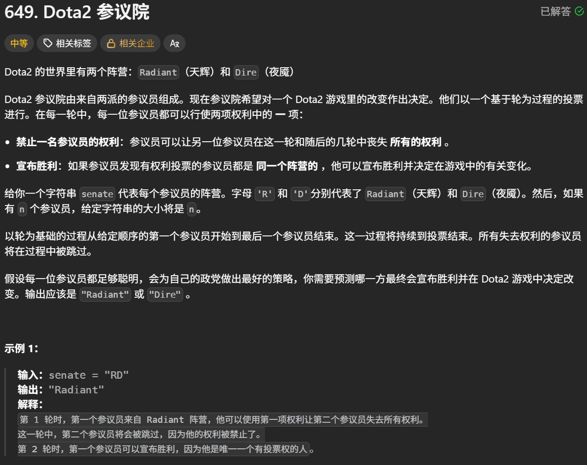

```
class Solution {
	public:
		string predictPartyVictory(string senate) {
			vector<int> dui_R;
			int tou_R=0, wei_R=-1;
			vector<int> dui_D;
			int tou_D=0, wei_D=-1;
			for(int i=0; i<senate.size(); i++) {
				if(senate[i]=='R') {
					dui_R.push_back(i);
					wei_R++;
				} else {
					dui_D.push_back(i);
					wei_D++;
				}
			}
			int n=senate.size()-1;
			while(tou_R<=wei_R && tou_D<=wei_D) {
				int R = dui_R[tou_R];
				tou_R++;
				int D = dui_D[tou_D];
				tou_D++;
				if(R<D) {
					n++;
					dui_R.push_back(n);
					wei_R++;
				} else {
					n++;
					dui_D.push_back(n);
					wei_D++;
				}
			}
			if(tou_R<=wei_R) {
				return "Radiant";
			} else {
				return "Dire";
			}
		}
};
```

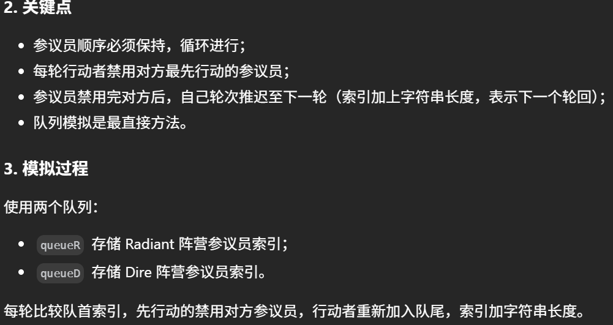

```
每轮结束后，存活的参议院编号要修改，注意！
```

# 双指针/滑动窗口

## 使数组平衡的最少移动数目

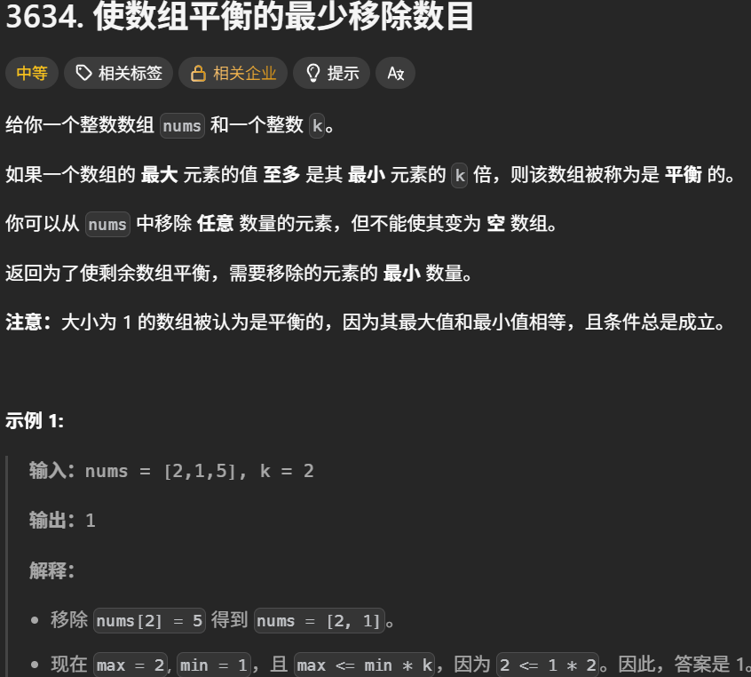

```
class Solution {
	public:
		int minRemoval(vector<int>& nums, int k) {
			int pos =0;
			int ans = 1e9;
			int n = nums.size();
			sort(nums.begin(), nums.end());
			for(int i=0;i<nums.size();i++){
				while((long long int)nums[i]>(long long int)k*(long long int)nums[pos]){
					pos++;
				}
				ans = min(ans, n-(i-pos+1));
			}
			return ans;
		}
};
```


## 长度最小的子数组

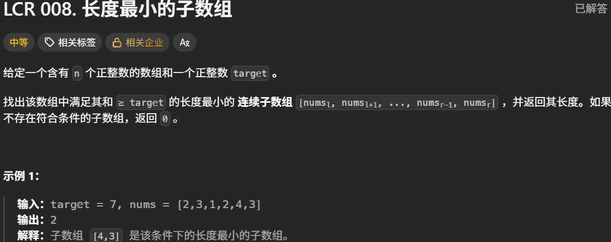

```
class Solution {
	public:
		int minSubArrayLen(int target, vector<int>& nums) {
			int pos=0;
			int sum=0;
			int ans =1e9;
			for(int i=0; i<nums.size(); i++) {
				sum+=nums[i];
				while(sum-nums[pos]>=target) {
					sum=sum-nums[pos];
					pos++;
				}
				if(sum>=target){
					ans = min(ans, i-pos+1);
				}
			}
			if(ans==1e9) {
				ans=0;
			}
			return ans;
		}
};
```

## 乘积小于K的子数组

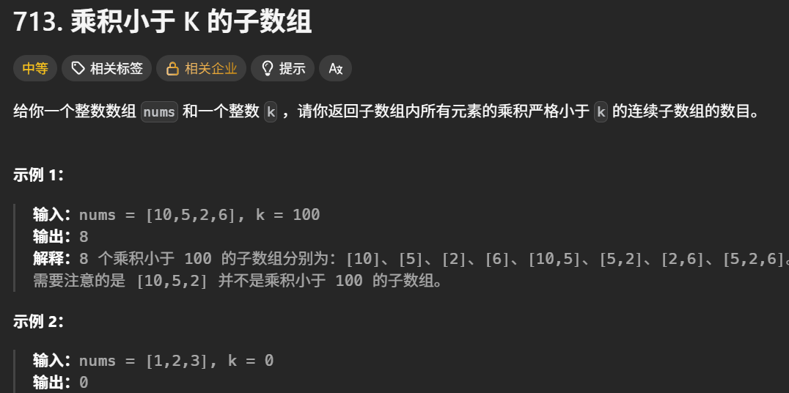

```
class Solution {
	public:
		int numSubarrayProductLessThanK(vector<int>& nums, int k) {
			int pos=0;
			int all=1;
			int ans =0;
			if(k<=1) {
				return 0;
			}
			for(int i=0;i<nums.size();i++){
				all = all*nums[i];
				while(all>=k){
					all=all/nums[pos];
					pos++;
				}
				ans+=i-pos+1;
			}
			return ans;
		}
};
```

```
枚举每个右端点所能构造出的最大区间，然后ans=ans+i-pos+1即可
```

## 无重复的最长子串

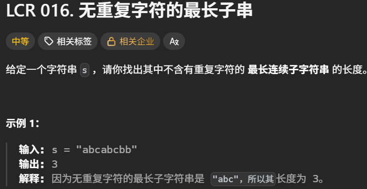

```
class Solution {
	public:
		int lengthOfLongestSubstring(string s) {
			unordered_map<char, int> dic;
			int pos =0;
			int ans = 0;
			for(int i=0;i<s.size();i++){
				dic[s[i]]++;
				while(dic[s[i]]>1){
					dic[s[pos]]--;
					pos++;
				}
				ans = max(ans, i-pos+1);
			} 
			return ans;
		}
};
```

````
枚举右端点
````

## 最短的覆盖子串

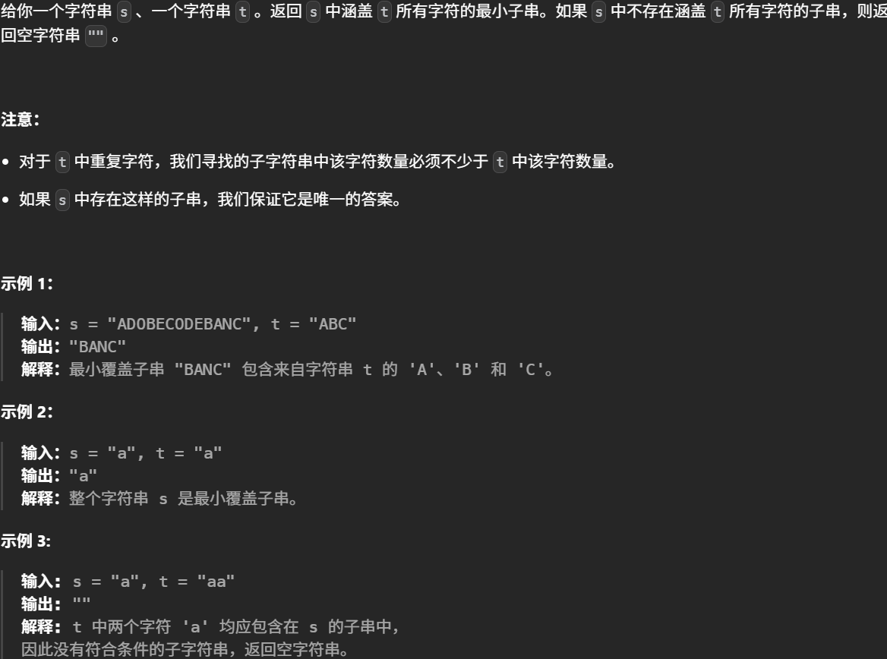

```
class Solution {
	public:
		string minWindow(string s, string t) {
			unordered_map<char, int> cxt;
			for(int i=0; i<t.size(); i++) {
				cxt[t[i]]++;
			}
			unordered_map<char, int> cxx;
			int number=0;
			int pos=0;
			int min_len=1e9;
			string ans;
			for(int i=0; i<s.size(); i++) {
				cxx[s[i]]++;
				if(cxx[s[i]]<=cxt[s[i]]) {
					number++;
				}
				while(cxx[s[pos]]-1>=cxt[s[pos]]){
					cxx[s[pos]]--;
					pos++;	
				}
				if(number==t.size()){
					if(i-pos+1<min_len){
						min_len = i-pos+1;
						ans = s.substr(pos, i-pos+1);
					}
				}
			}
			return ans;
		}
};
```

## 最短的覆盖字串（带顺序版）

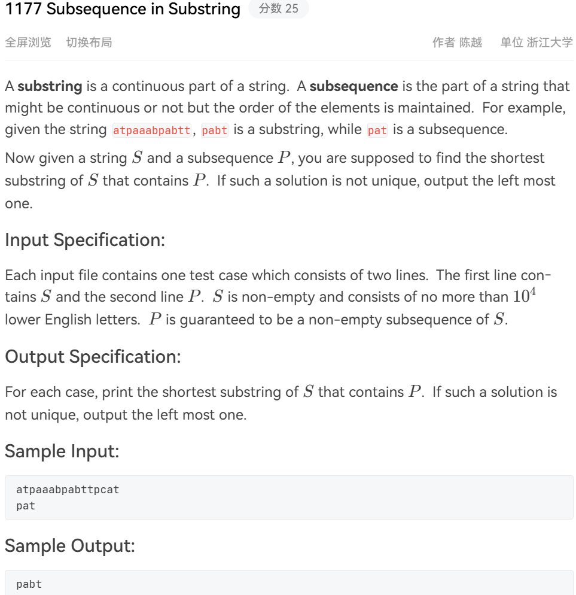

```
int main() {
	string s;
	string t;
	cin>>s;
	cin>>t;
	int temp;
	string ans;
	int minl=0;
	for(int i=0; i<s.size(); i++) {
		if(s[i]==t[0]) {
			temp=0;
			for(int j=i; j<s.size(); j++) {
				if(s[j]==t[temp]) {
					temp++;
				}
				if(temp==t.size()) {
					if(minl==0 || j-i+1<minl) {
						ans=s.substr(i, j-i+1);
						minl = j-i+1;
					}
					break;
				}
			}
		}
	}
	cout<<ans;
}
```

先找到第一个字母匹配的位置，然后再开一个循环找剩下的是否匹配。
注意，下一个循环的 j 一定不能直接从 i+1 开始！！！！如果t只有一个字符那就错了。。

## 判断子序列（带顺序的）

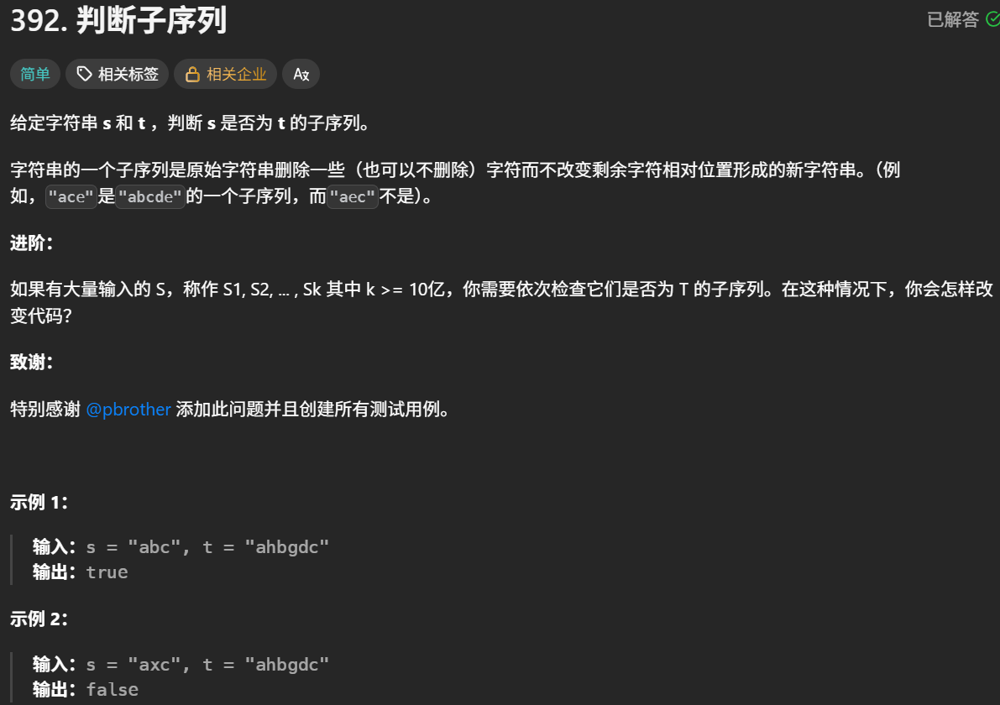

```
class Solution {
public:
    bool isSubsequence(string s, string t) {
    	if(s.size()==0){
    		return true;
		} 
    	bool success=false;
        for(int i=0;i<t.size();i++){
        	if(t[i]==s[0]){
        		int num=0;
        		for(int j=i;j<t.size();j++){
        			if(t[j]==s[num]){
        				num++;
					}
					if(num==s.size()){
						success=true;
						break;
					}
				}
			}
		}
		return success;
    }
};
```

dp做法只能求覆不覆盖，没法求覆盖的最小子序列是谁？

```
int dp[110][10010];
class Solution {
	public:
		bool isSubsequence(string s, string t) {
			for(int i=1; i<=s.size(); i++) {
				for(int j=1; j<=t.size(); j++) {
					if(s[i-1]==t[j-1]) {
						dp[i][j] = dp[i-1][j-1]+1;
					} else {
						dp[i][j] = dp[i][j-1];
					}
				}
			}
			int n=s.size(), m=t.size();
			if(dp[n][m]==n) {
				return true;
			} else {
				return false;
			}
		}
};
int main() {
	Solution a;
	string s="a";
	string t="";
	bool ans = a.isSubsequence(s, t);
	cout<<ans<<endl;
}
```

- dp其实是在推进j，含义是s数组1到i，t数组1到j中，覆盖了s中多少个元素？
- 当前这个j，也就是t[j-1]不等于s[i-1]的话，那其实t[j-1]没法覆盖，那就是dp[i]\[j] = dp[i]\[j-1]
- 当前这个j，也就是t[j-1]等于s[i-1]的话，那其实t[j-1]覆盖了，那就是dp[i]\[j] = dp[i-1]\[j-1]+1

## 相同的二元子数组

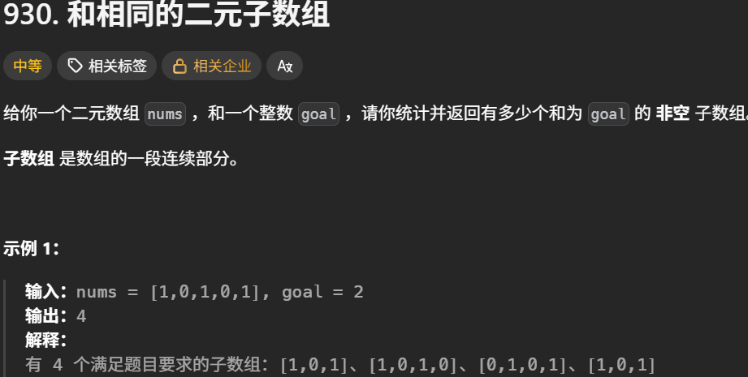

```
前缀和+哈希表做法：
class Solution {
	public:
		int qz[100100];
		int numSubarraysWithSum(vector<int>& nums, int goal) {
			int ans =0;
			for(int i=0;i<nums.size();i++){
				qz[i+1]=qz[i]+nums[i];
			}
			unordered_map<int, int> dic;
			dic[0]++;
			for(int i=1;i<=nums.size();i++){
				int y = qz[i]-goal;
				ans = ans + dic[y];
				dic[qz[i]]++;
			}
			return ans;
		}
};
```

```
滑动窗口做法：
注意pos小于i！！，最极端的情况是pos移动到了i身上！
class Solution {
	public:
		int solve(vector<int>& nums, int k) {
			int pos =0;
			int ans =0;
			int sum =0;
			for(int i=0; i<nums.size(); i++) {
				sum+=nums[i];
				while(pos<i && sum-nums[pos]>=k) {
					sum=sum-nums[pos];
					pos++;
				}
				if(sum>=k) {
					ans = ans + pos+1;
				}
			}
			return ans;
		}
		int numSubarraysWithSum(vector<int>& nums, int goal) {
			int ans = solve(nums, goal)-solve(nums, goal+1);
			return ans;
		}
};
```

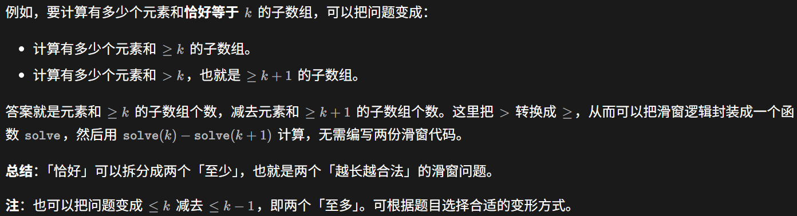

## K个不同整数的子数组


```
class Solution {
	public:
		int solve(vector<int>& nums, int k) {
			unordered_map<int, int> dic;
			int all=0;
			int pos=0;
            int ans=0;
			for(int i=0; i<nums.size(); i++) {
				dic[nums[i]]++;
				if(dic[nums[i]]==1) {
					all++;
				}
				while(all>=k) {
					dic[nums[pos]]--;
					if(dic[nums[pos]]==0) {
						all--;
					}
					pos++;
				}
				ans += pos;
			}
			return ans;
		}
		int subarraysWithKDistinct(vector<int>& nums, int k) {
			int ans = solve(nums, k)-solve(nums, k+1);
			return ans;
		}
};
```


## 适龄的朋友

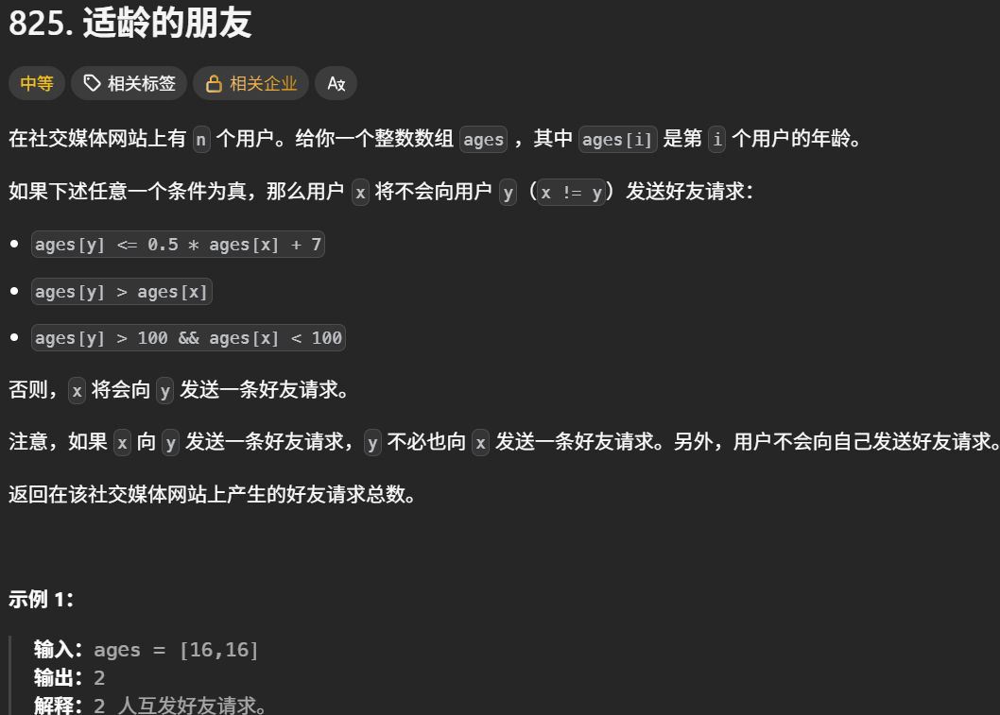

```
class Solution {
	public:
		int numFriendRequests(vector<int>& ages) {
			sort(ages.begin(), ages.end());
			if(ages.size()==1) {
				return 0;
			}
			int pos=0;
			int same=0;
			int ans =0;
			for(int i=1; i<ages.size(); i++) {
				while(pos<i && (ages[i]+14>=2*ages[pos] || (ages[i]<100 && ages[pos]>100))) {
					pos++;
				}
				while(ages[same]<ages[i]) {
					same++;
				}
				if(same>=pos) {
					ans=ans+i-pos+i-same;
				}else{
					ans=ans+i-pos;
				}
			}
			return ans;
		}
};
```

```
用same记录离他最远的，和他年龄一样的人
注意，同龄不一定能发请求，same要大于等于pos才加
```

## 有效三角形的个数

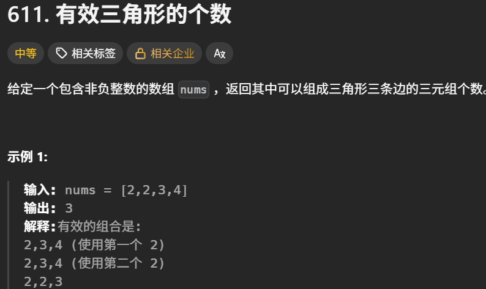

```
class Solution {
	public:
		int triangleNumber(vector<int>& nums) {
			sort(nums.begin(), nums.end());
			if(nums.size()<3){
				return 0;
			}
			int pos=2;
			int ans =0;
			for(int i=0; i<nums.size()-1; i++) {
				for(int j=i+1; j<nums.size(); j++) {
					pos=j+1;
					int sum = nums[i]+nums[j];
					while(pos<nums.size() && sum>nums[pos]){
						pos++;
					}
					ans = ans+pos-j-1;
				}
			}
			return ans;
		}
};
```


## multiset+双指针——绝对差不超过限制的最长子序列

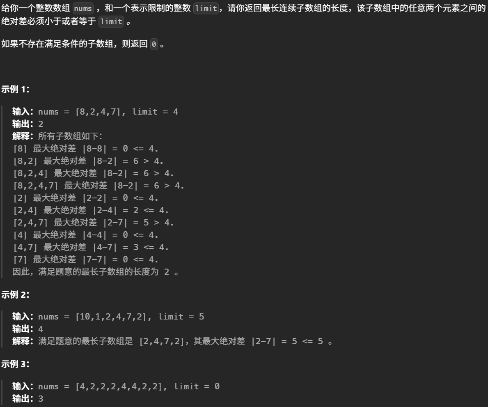

```
class Solution {
	public:
		int longestSubarray(vector<int>& nums, int limit) {
			multiset<int> s;
			int l=0,r=0;
			int ans = 0;
			while(r<nums.size()) {
				s.insert(nums[r]);
				while(s.size()!=0 && *s.rbegin()-*s.begin()>limit) {
					s.erase(s.find(nums[l]));
					l++;
				}
				ans = max(ans, r-l+1);
				r++;
			}
			return ans;
		}
};
```

注意，移动左指针的时候，一定是**移一个删一个**

```
s.erase(s.find(nums[l])) 改成 s.erase(nums[l])
同时ans = max(ans, r-l+1); 不改成 ans = max(ans, s.size()); 就错了
```

注意，**先更新 ans 的值，再让 r 变大**

## 恰好出现2次的最长子串（前缀和）

见TJU机试试题

## 至少出现k次的最长子串（前缀和）

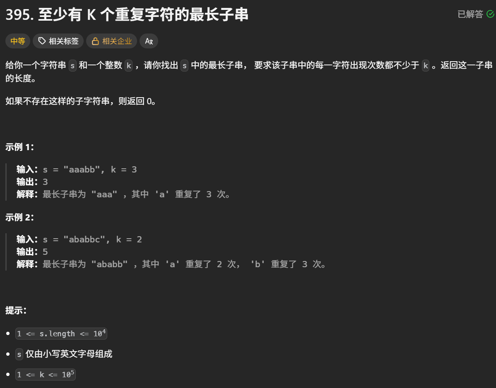

```
int qz[30][10010];
class Solution {
	public:
		int longestSubstring(string s, int k) {
			for(int i=1; i<=s.size(); i++) {
				for(int j=0; j<26; j++) {
					if(s[i-1]-'a'==j) {
						qz[j][i] = qz[j][i-1] + 1;
					} else {
						qz[j][i] = qz[j][i-1];
					}
				}
			}
			int ans = 0;
			int len = s.size();
			for(int i=1; i<=len; i++) {
				for(int j=0; j+i-1<len; j++) {
					int success = 1;
					for(int t=0; t<26; t++) {
						if(qz[t][j+i]-qz[t][j]>0 && qz[t][j+i]-qz[t][j]<k) {
							success = 0;
						}
					}
					if(success == 1) {
						ans = max(ans, i);
					}
				}
			}
			return ans;
		}
};
```

## 字符至少出现k次的子字符串个数

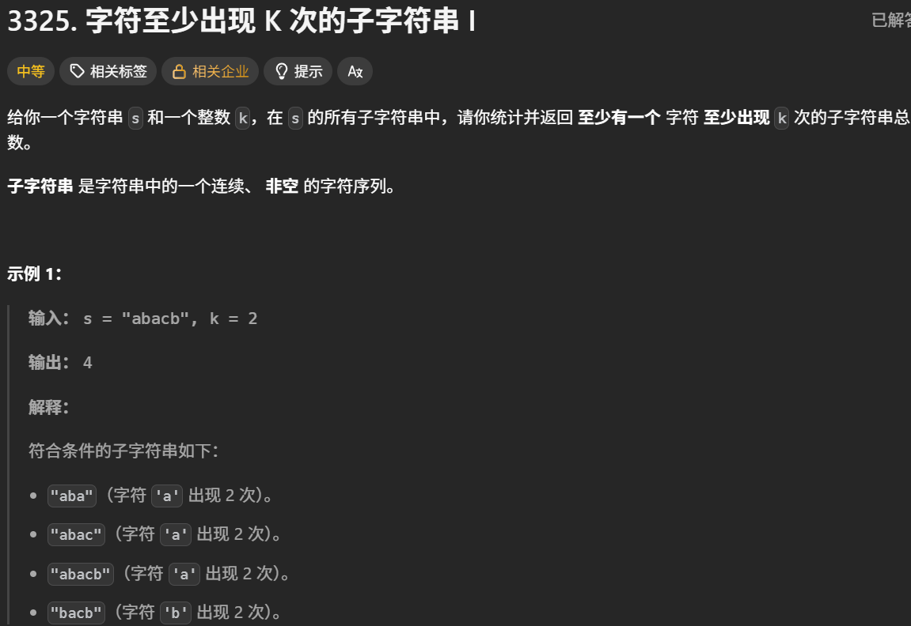

```
class Solution {
	public:
		bool check(unordered_map<char, int>& dic, int k) {
			bool success=false;
			for(const auto& ele:dic) {
				if(ele.second>=k){
					success=true;
					break;
				}
			}
			return success;
		}
		int numberOfSubstrings(string s, int k) {
			unordered_map<char, int> dic;
			int pos =0;
			int ans =0;
			for(int i=0; i<s.size(); i++) {
				dic[s[i]]++;
				while(pos<=i && check(dic, k)==true) {
					dic[s[pos]]--;
					pos++;
				}
				ans += pos;
			}
			return ans;
		}
};
```

## 回文串的个数

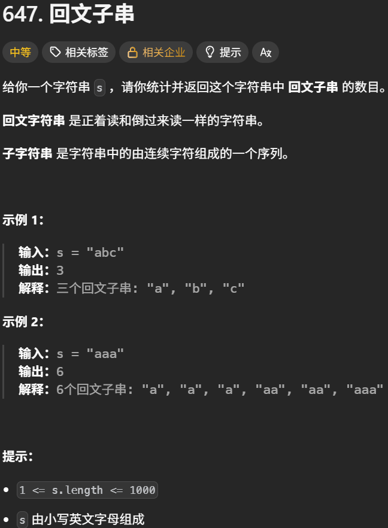

```
class Solution {
	public:
		int hw(string s, int x, int y){
			int ans = 0;
			if(y>s.size()-1 || s[x]!=s[y]){
				return 0;
			}
			while(x>=0 && y<s.size() && s[x]==s[y]){
				ans++;
				x--;
				y++;
			}
			return ans;
		}
		int countSubstrings(string s) {
			int ans =0;
			for(int i=0;i<s.size();i++){
				ans=ans+hw(s, i, i)+hw(s, i, i+1);
			}
			return ans;
		}
};
```

- 遍历每一个点，每一个点都会当作回文串的中心点，当然了，也会出现中心点是两个的，所以要

  ```
  ans = ans + hw(s, i, i) + hw(s, i, i+1)
  ```

动态规划做法：

```
bool dp[1010][1010];
class Solution {
	public:
		int countSubstrings(string s) {
			int ans=0;
			for(int i=0; i<s.size(); i++) {
				dp[i][i]=true;
				ans++;
			}
			for(int i=s.size()-1; i>=0; i--) {
				for(int j=i+1;j<s.size();j++) {
					if(s[i]!=s[j]) {
						dp[i][j]=false;
					} else {
						if(j-i+1>2) {
							if(dp[i+1][j-1]==true) {
								dp[i][j]=true;
								ans++;
							} else {
								dp[i][j]=false;
							}
						} else {
							dp[i][j]=true;
							ans++;
						}
					}
				}
			}
			return ans;
		}
};
int main() {
	Solution a;
	string s = "aaaaa";
	int ans = a.countSubstrings(s);
	cout<<ans<<endl;
}
```

```
dp[i][j]表示下表从i到j是不是回文串
初始化！
如果s[i]！=s[j]，那么肯定不是回文串
如果s[i]==s[j]，要分情况：1.如果是长度等于2的，那确实就是true。2.如果长度大于2了，要看看dp[i+1][j-1]是true还是false！

注意遍历顺序，我们算一个dp[i][j]要依赖于左下角那个元素，因此我们需要《从下往上，从左往右》遍历！
```

## 最长的回文串

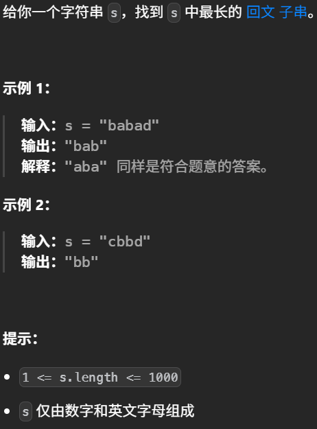

```
class Solution {
	public:
		string ans;
		string hw(string s, int x, int y) {
			string temp;
			if(y==s.size()) {
				return temp;
			}
			if(s[x]!=s[y]){
				temp.push_back(s[x]);
				return temp;
			}
			while(x>=0 && y<s.size() && s[x]==s[y]){
				x--;
				y++;
			}
			x++;
			y--;
			temp = s.substr(x, y-x+1);
			return temp;
		}
		string longestPalindrome(string s) {
			for(int i=0; i<s.size(); i++) {
				string temp = hw(s, i, i);
				if(temp.size()>ans.size()) {
					ans = temp;
				}
				string t = hw(s, i, i+1);
				if(t.size()>ans.size()) {
					ans = t;
				}
			}
			return ans;
		}
};
```

```
class Solution {
	public:
		bool dp[1010][1010];
		string longestPalindrome(string s) {
			for(int i=0; i<s.size(); i++) {
				dp[i][i]=true;
			}
			int len=1;
			string ans=s.substr(0, 1);
			for(int i=s.size()-2; i>=0; i--) {
				for(int j=i+1; j<s.size(); j++) {
					if(s[i]==s[j]) {
						if(i+1==j) {
							dp[i][j]=true;
							if(2>len) {
								len=2;
								ans = s.substr(i, 2);
							}
						} else {
							dp[i][j]=dp[i+1][j-1];
							if(dp[i][j]==true && j-i+1>len){
								len = j-i+1;
								ans = s.substr(i, j-i+1);
							}
						}
					} else {
						dp[i][j]=false;
					}
				}
			}
			return ans;
		}
};
```

## 最长的回文子序列长度

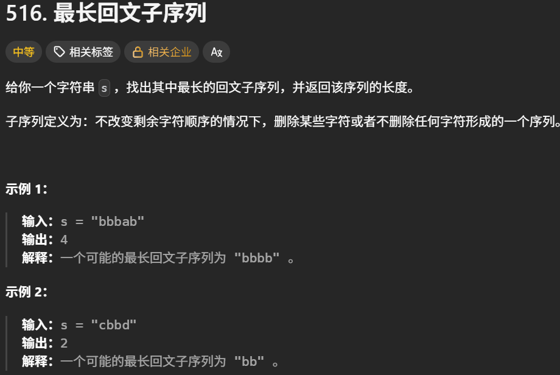

```
class Solution {
	public:
		int dp[1010][1010];
		int longestPalindromeSubseq(string s) {
			for(int i=0; i<s.size(); i++) {
				dp[i][i]=1;
			}
			for(int i=s.size()-2; i>=0; i--) {
				for(int j=i+1; j<s.size(); j++) {
					if(j-i+1==2){
						if(s[i]!=s[j]){
							dp[i][j]=1;
						}else{
							dp[i][j]=2;
						}
						continue;
					}
					if(s[i]!=s[j]){
						dp[i][j] = max(dp[i+1][j-1], dp[i+1][j]);
						dp[i][j] = max(dp[i][j], dp[i][j-1]);
					}else{
						dp[i][j] = dp[i+1][j-1]+2;
					}
				}
			}
			int n = s.size()-1;
			return dp[0][n];
		}
};
```

```
dp[i][j]表示下表从i到j回文子序列的最大长度
初始化！同时长度为2的时候单独处理
如果s[i]！=s[j]，那么dp[i][j]取dp[i+1][j-1]，dp[i+1][j]，dp[i][j-1]最大值就行
如果s[i]==s[j]，直接dp[i+1][j-1]+2就行
注意遍历顺序，我们算一个dp[i][j]要依赖于左下角那个元素，因此我们需要《从下往上，从左往右》遍历！
```

## 找两个set中的重复率（⭐ ）

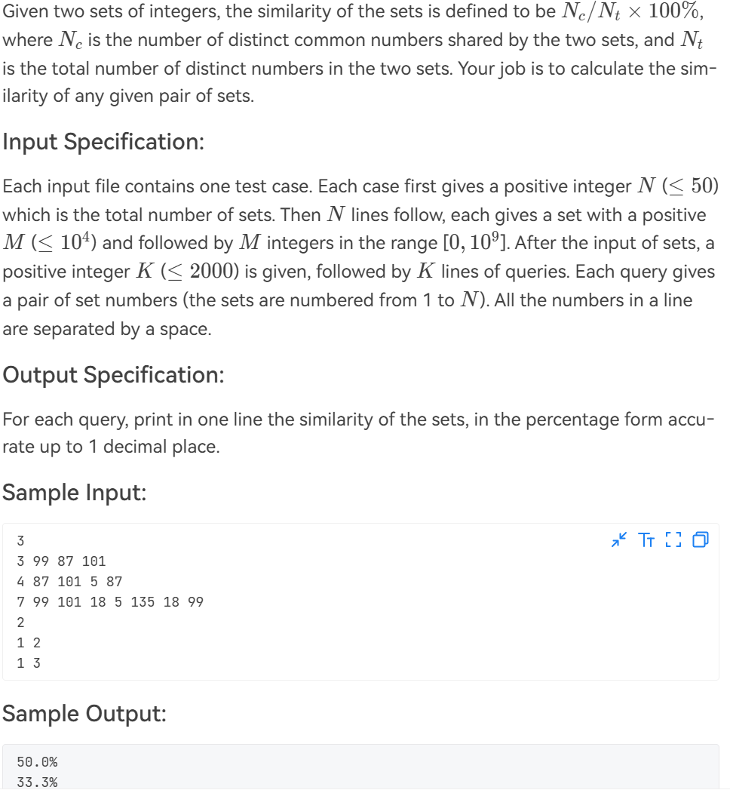

```
vector<vector<int>> num;
int main() {
	int n;
	cin>>n;
	for(int i=1; i<=n; i++) {
		int e;
		scanf("%d", &e);
		vector<int> temp;
		for(int j=1; j<=e; j++) {
			int s;
			scanf("%d", &s);
			temp.push_back(s);
		}
		num.push_back(temp);
	}
	int k;
	cin>>k;
	for(int t=1; t<=k; t++) {
		int a, b;
		cin>>a>>b;
		a = a-1;
		b = b-1;
		vector<int> temp;
		sort(num[a].begin(), num[a].end());
		num[a].erase(unique(num[a].begin(), num[a].end()), num[a].end());
		sort(num[b].begin(), num[b].end());
		num[b].erase(unique(num[b].begin(), num[b].end()), num[b].end());
		int l=0, r=0;
		int total = 0;
		int repeat = 0;
		while(l<num[a].size() && r<num[b].size()) {
			if(num[a][l]>num[b][r]) {
				temp.push_back(num[b][r]);
				r++;
			} else if(num[a][l]<num[b][r]) {
				temp.push_back(num[a][l]);
				l++;
			} else {
				temp.push_back(num[a][l]);
				r++;
				l++;
				repeat++;
			}
		}
		while(l<num[a].size()) {
			temp.push_back(num[a][l]);
			l++;
		}
		while(r<num[b].size()) {
			temp.push_back(num[b][r]);
			r++;
		}
		sort(temp.begin(), temp.end());
		temp.erase(unique(temp.begin(), temp.end()), temp.end());
		total = temp.size();
		if(total==0) {
			cout<<"0.0%"<<endl;
		} else {
			double ans = 100.0 * repeat / total;
			printf("%.1lf", ans);
			cout<<'%'<<endl;
		}
	}
}
```

- 先在两个set中作去重！！！！！一定要去重，防止下面双指针搜索的时候同一数值被算作多次！！！！！！！！！
- 双指针搜索两个set中的重复元素

上面的做法颇有些核弹炸苍蝇，下面的做法哈希表即可搞定

```
vector<vector<int>> num;
int main() {
	int n;
	cin>>n;
	for(int i=1; i<=n; i++) {
		int e;
		scanf("%d", &e);
		vector<int> temp;
		for(int j=1; j<=e; j++) {
			int s;
			scanf("%d", &s);
			temp.push_back(s);
		}
		num.push_back(temp);
	}
	int k;
	cin>>k;
	for(int t=1; t<=k; t++) {
		int a, b;
		cin>>a>>b;
		a = a-1;
		b = b-1;
		int total=0, repeat=0;
		sort(num[a].begin(), num[a].end());
		num[a].erase(unique(num[a].begin(), num[a].end()), num[a].end());
		sort(num[b].begin(), num[b].end());
		num[b].erase(unique(num[b].begin(), num[b].end()), num[b].end());
		unordered_map<int, int> h;
		for(int i=0; i<num[a].size(); i++) {
			if(h[num[a][i]]==0) {
				total++;
				h[num[a][i]]++;
			} else if(h[num[a][i]]==1) {
				repeat++;
				h[num[a][i]]++;
			}
		}
		for(int i=0; i<num[b].size(); i++) {
			if(h[num[b][i]]==0) {
				total++;
				h[num[b][i]]++;
			} else if(h[num[b][i]]==1) {
				repeat++;
				h[num[b][i]]++;
			}
		}
		double ans = 100.0 * repeat / total;
		printf("%.1lf", ans);
		cout<<'%'<<endl;
	}
}
```

## 求出最多标记的下表数

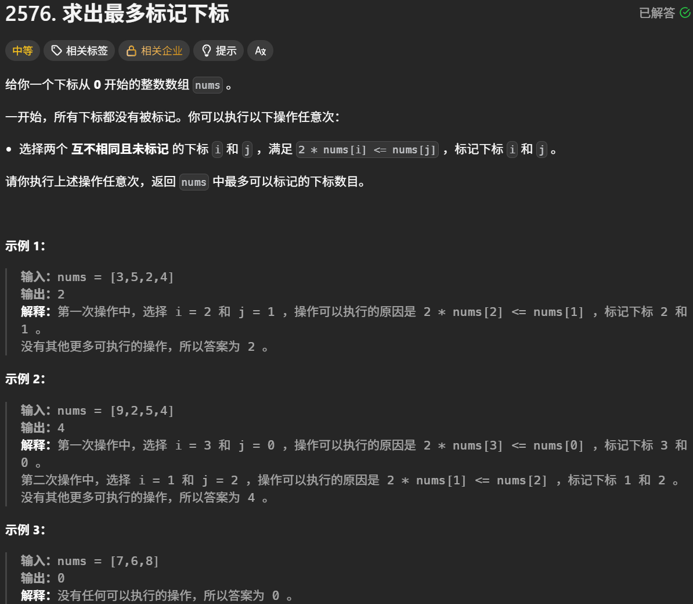

```
class Solution {
	public:
		bool biaoji[100010];
		int maxNumOfMarkedIndices(vector<int>& nums) {
			int l=0, r=1;
			if(nums.size()==1) {
				return 0;
			}
			int ans=0;
			sort(nums.begin(), nums.end());
			int j = (nums.size()-1)/2+1;
			for(int i=0; i<=(nums.size()-1)/2; i++) {
				while(j<nums.size() && 2*nums[i]>nums[j]) {
					j++;
				}
				if(j==nums.size()) {
					break;
				}
				ans=ans+2;
				j++;
				if(j==nums.size()) {
					break;
				}
			}
			return ans;
		}
};
```

```
二分法：
从小到大排序后，如果存在 k 对匹配，那么一定可以让最小的 k 个数与最大的 k 个数匹配。

贪心：
把一个数组排好序，然后对半分，左边是小区，右边是大区。用小区的较小元素去匹配大区中较小元素

这个判断是防止j搜到了结尾
if(j==nums.size()) {
	break;
}
```

# 前缀和

## 前缀和的好处

它可以以O(1)的复杂度对一段连续区间（二维则是一个面）进行一系列操作（访问）

## 注意

最后要被求前缀和的数组最好存储元素下标从1开始

## 一维前缀和


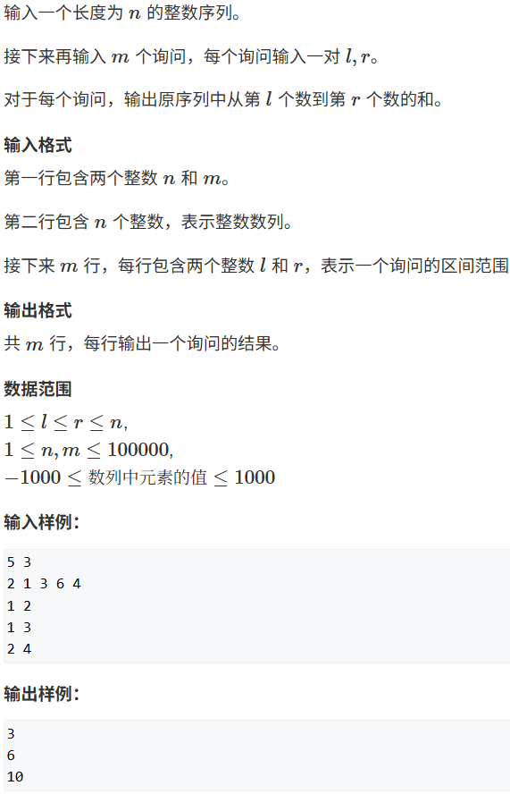

```text
void quick_sort(vector<int> &q, int l, int r) {
	if(l>=r)
		return;
	int x = q[(l+r+1)/2];
	int i = l-1;
	int j = r+1;
	while(i<j) {
		do i++;
		while(q[i]<x);
		do j--;
		while(q[j]>x);
		if(i<j) swap(q[i], q[j]);
	}
	quick_sort(q, l, i-1);
	quick_sort(q, i, r);
}
int main() {
	int n,m;
	vector<int> nums;
	vector<int> S;
	vector<vector<int>> test;
	int x,l,r;
	scanf("%d %d", &n, &m);
//	从下标为1开始计数 
	nums.push_back(0);
	for(int i=1;i<=n;i++){
		scanf("%d", &x);
		nums.push_back(x);
	}
	for(int i=1;i<=m;i++){
		scanf("%d %d",&l, &r);
		test.push_back({l, r});
	}
//	S(i) = S(i-1)+nums(i)
	for(int i=0;i<=nums.size();i++){
		if(i==0){
			S.push_back(0);
			continue;
		}
		S.push_back(S[i-1]+nums[i]);
	}
	for(int i=0;i<=test.size()-1;i++){
		l = test[i][1];
		r = test[i][0]-1;
		cout<<S[l]-S[r]<<endl;
	}
	return 0;
}
```

## 二维前缀和

给定矩阵的“左上角”和“右下角”坐标，计算其中所有的数字之和：
$$
Sum = S(x2, y2) - S(x1-1, y2) - S(x2, y1-1) + S(x1-1, y1-1)
$$
对于每一个S(x, y)，计算方式如下：
$$
S(i, j) = S(i-1, j) + S(i, j-1) - S(i-1, j-1) + a(i, j)
$$
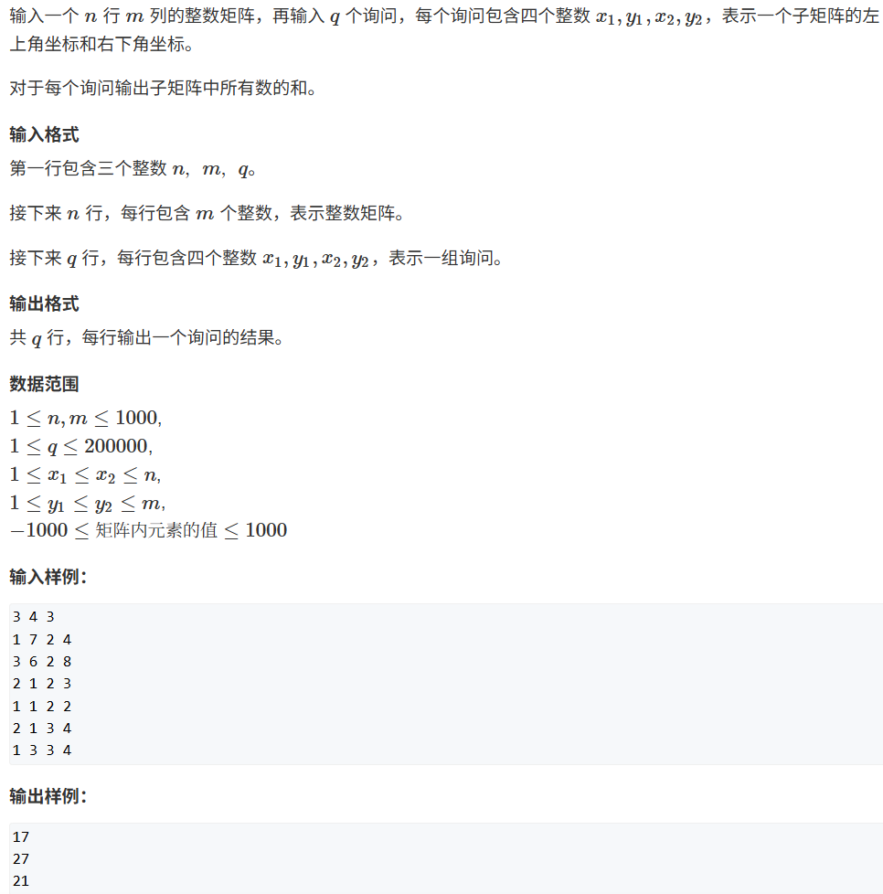

```
int main() {
    int n, m, q;
    scanf("%d %d", &n, &m);
    
    // 输入矩阵（下标从1开始）
    int a[n + 1][m + 1];       // 原始矩阵
    int S[n + 1][m + 1] = {0}; // 二维前缀和矩阵（自动初始化为0）
    
    // 输入矩阵数据
    for (int i = 1; i <= n; i++) {
        for (int j = 1; j <= m; j++) {
            scanf("%d", &a[i][j]);
        }
    }
    
    // 计算前缀和矩阵
    for (int i = 1; i <= n; i++) {
        for (int j = 1; j <= m; j++) {
            S[i][j] = S[i - 1][j] + S[i][j - 1] - S[i - 1][j - 1] + a[i][j];
        }
    }
    
    // 处理查询
    scanf("%d", &q);
    while (q--) {
        int x1, y1, x2, y2;
        scanf("%d %d %d %d", &x1, &y1, &x2, &y2);
        
        // 计算子矩阵和（容斥原理）
        int sum = S[x2][y2] - S[x1 - 1][y2] - S[x2][y1 - 1] + S[x1 - 1][y1 - 1];
        printf("%d\n", sum);
    }
    
    return 0;
}
```

## 长度最小的子数组(前缀和+双指针)

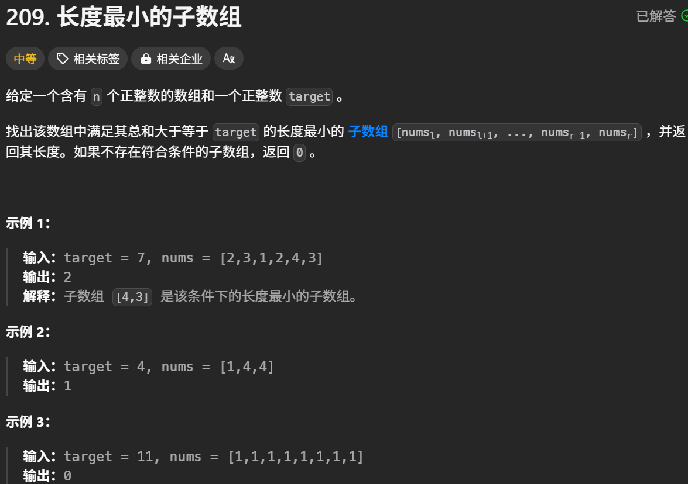

```
class Solution {
	public:
		int minSubArrayLen(int target, vector<int>& nums) {
			vector<int> qz;
            int ans = 100010;
			int success=0;
			qz.push_back(0);
			for(int i=0; i<nums.size(); i++) {
				qz.push_back(qz[qz.size()-1]+nums[i]);
			}
			int l=0,r=1;
			while(1) {
				if(qz[r]-qz[l]<target) {
					r++;
					if(r>qz.size()-1){
						break;
					}
				} else {
					ans = min(ans, r-l);
					success++;
					l++;
				}
				if(l==qz.size()-1) {
					break;
				}

			}
			if(success==0) {
				return 0;
			} else {
				return ans;
			}
		}
};
```

前缀和以O(1)访问某个子数组的数字和。

贪心：一个指针从0，另外一个从1

- 当二者之差小于target的话，就把右指针右移
- 否则，左指针左移
- 当右指针移出前缀和数组边界后，就break
- 当左指针移到右指针身上的时候，就break

## 乘积前/后缀和

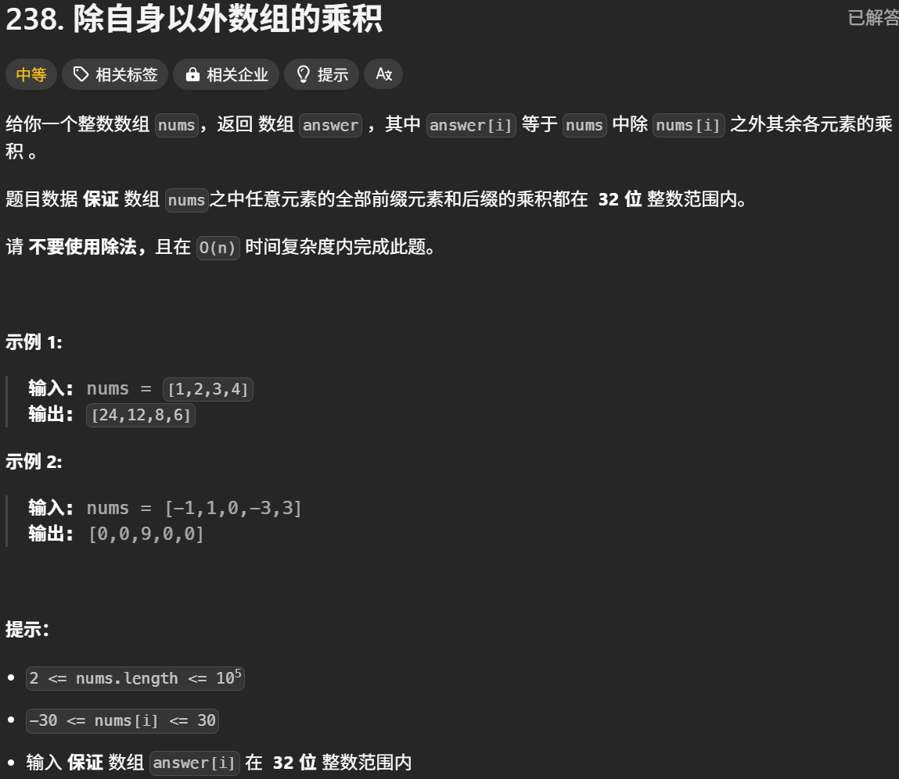

维护两个数组，分别记录当前这个数字的**前面所有数字乘积**和**后面所有数字乘积**

```
class Solution {
	public:
		int zuo[100010];
		int you[100010];
		vector<int> productExceptSelf(vector<int>& nums) {
			zuo[0] = 1;
			you[0] = 1;
			you[nums.size()+1]=1;
			for(int i=1; i<=nums.size(); i++) {
				zuo[i] = nums[i-1] * zuo[i-1];
				you[nums.size()-i+1] = nums[nums.size()-i] * you[nums.size()-i+2];
			}
			vector<int> ans;
			for(int i=1; i<=nums.size(); i++) {
				int x = zuo[i-1] * you[i+1];
				ans.push_back(x);
			}
			return ans;
		}
};
```

## 每个字段的异或的和

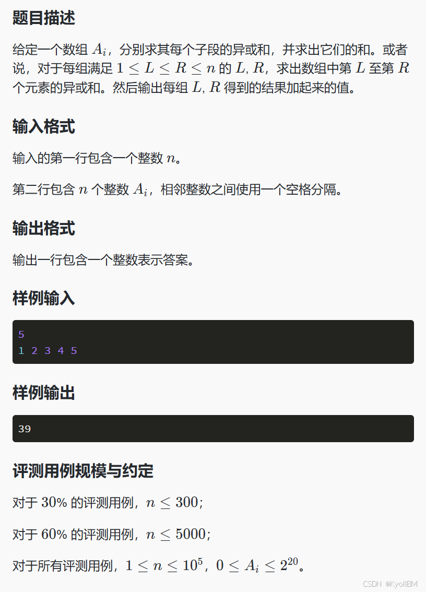

暴力的做法：

- 用一个前缀和存储1到第i个数字的异或和，然后遍历每一个长度的子段，求区间j到i的异或和
- 注意异或的性质：
  - **一样的数字异或之后为 0** 
  - **任何数字和0做异或都是她本身**

代码：

```

int qz[100010];
int main() {
	int n;
	cin>>n;
	qz[0]=0;
	for(int i=1; i<=n; i++) {
		qz[i] = i^qz[i-1];
	}
	int ans=0;
	for(int len=1; len<=n; len++) {
		for(int i=1; i+len-1<=n; i++) {
			int j = i+len-1;
			ans = ans + (qz[j] ^ qz[i-1]);
		}
	}
	cout<<ans;
}
```

可以发现：我们实际上是对前缀和数组——任取两个数字做异或，最后求和，这与TJU的机试题一样！因此可以做一下优化：

```
int qz[100010];
long long int nums[50];
int main() {
	int n;
	cin>>n;
	for(int i=1; i<=n; i++) {
		int a;
		cin>>a;
		qz[i]=qz[i-1]^a;
	}
	for(int i=0; i<=n; i++) {
		for(int j=0; j<31; j++) {
			if(qz[i]&(1<<j)) {
				nums[j]++;
			}
		}
	}
	long long int ans = 0;
	for(int i=0; i<31; i++) {
		ans = ans + (1<<i)*(n+1-nums[i])*(nums[i]);
	}
	cout<<ans;
}
```

注意，前缀和数组实际上有 **n+1** 个数字！！！！！！！！所以：

```
ans = ans + (1<<i)*num[i]*(n+1-num[i]);
```

注意乘法爆int！！！

## 每个元音字母含偶数次的最长子串

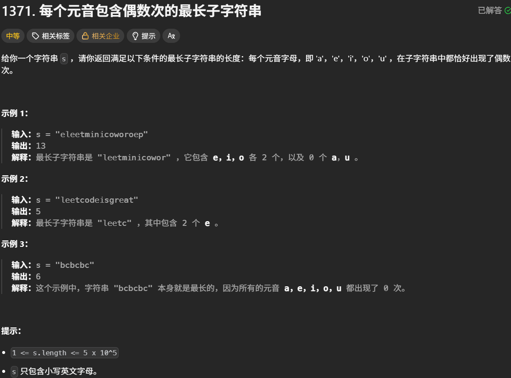

```
int zm[5] = {0, 4, 8, 14, 20};
int qz[500010][26];
class Solution {
	public:
		int findTheLongestSubstring(string s) {
			for(int i=1; i<s.size()+1; i++) {
				for(int j=0; j<26; j++) {
					qz[i][j] = qz[i-1][j];
					if(s[i-1]-'a'==j) {
						qz[i][j]++;
					}
				}
			}
			int ans = 0;
			for(int len=1; len<=s.size(); len++) {
				for(int i=0; i+len-1<s.size(); i++) {
					int tou = i+1;
					int wei = i+len;
					int success=1;
					for(int k=0; k<5; k++) {
						if((qz[wei][zm[k]]-qz[tou-1][zm[k]])%2!=0) {
							success = 0;
							break;
						}
					}
					if(success==1) {
						ans = len;
						break;
					}
				}
			}
			return ans;
		}
};
```

同类型题见TJU的机试题**恰好出现两次的最长字串**

## 前后缀分解——选择建筑的方案

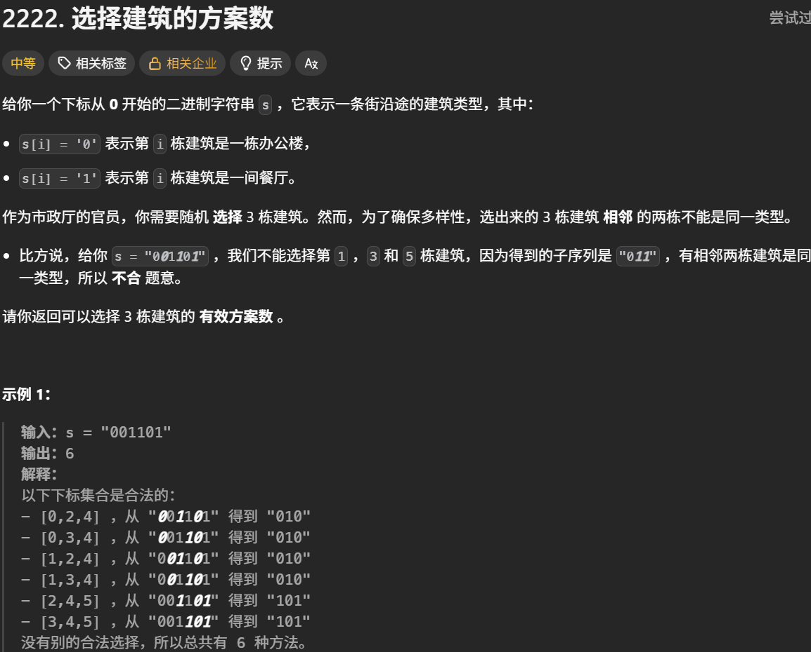

```
class Solution {
	public:
		long long int dp[100100][4];
		int find(vector<int>& nums, int x) {
			int l=0, r=nums.size()-1;
			while(l<r) {
				int mid = (l+r+1)/2;
				if(nums[mid]<x) {
					l=mid;
				} else {
					r=mid-1;
				}
			}
			return r;
		}
		long long numberOfWays(string s) {
			for(int i=0; i<s.size(); i++) {
				dp[i][1]=1;
			}
			int num0=0, num1=0;
			vector<vector<int>> nums;
			vector<int> pos0;
			vector<int> pos1;
			for(int i=0; i<s.size(); i++) {
				if(s[i]=='0') {
					num0++;
					pos0.push_back(i);
				} else {
					num1++;
					pos1.push_back(i);
				}
				nums.push_back({num0, num1});
			}
			for(int i=1; i<s.size(); i++) {
				if(s[i]=='0') {
					dp[i][2]=nums[i][1];
				} else {
					dp[i][2]=nums[i][0];
				}
			}
			long long int cnt0=0, cnt1=0;
			for(int i=0; i<s.size(); i++) {
				if(s[i]=='0') {
					dp[i][2]+=cnt0;
					cnt0=dp[i][2];
				} else {
					dp[i][2]+=cnt1;
					cnt1=dp[i][2];
				}
			}
			long long int ans =0;
			for(int i=1; i<s.size(); i++) {
				char goal = 1-(s[i]-'0')+'0';
				int pos;
				if(goal=='0') {
					pos = find(pos0, i);
					if(pos<pos0.size() && pos0[pos]<i) {
						dp[i][3]=dp[pos0[pos]][2];
						ans+=dp[i][3];
					}
				} else {
					pos = find(pos1, i);
					if(pos<pos1.size() && pos1[pos]<i) {
						dp[i][3]=dp[pos1[pos]][2];
						ans+=dp[i][3];
					}
				}
				
			}
			return ans;
		}
};
```

```
先初始化dp[i][1]
然后存当前这个点之前的1和0的个数，然后初始化dp[i][2]，顺带记录s[i]='0'和'1'的所有位置
最后给dp[i][2]累加，注意我们累加的时候是按照s[i]相同才累加，看看代码是咋加的（cnt1和cnt0得是long long）

最后针对每个dp[i][3]，我们只需要找离他最近的那个相反元素的dp[j][2]的值，这一步用到二分法查询

注意，pos0和pos1可能为空，此时再pos0[pos]会报错
```

```
class Solution {
	public:
		long long numberOfWays(string s) {
			int nums0=0, nums1=0;
			vector<vector<long long int>> l,r;
			for(int i=0; i<s.size(); i++) {
				l.push_back({nums0, nums1});
				if(s[i]=='0') {
					nums0++;
				} else {
					nums1++;
				}
			}
			nums0=0;
			nums1=0;
			for(int i=s.size()-1; i>=0; i--) {
				r.push_back({nums0, nums1});
				if(s[i]=='0') {
					nums0++;
				} else {
					nums1++;
				}
			}
			reverse(r.begin(), r.end());
			long long int ans=0;
			for(int i=0; i<s.size(); i++) {
				if(s[i]=='1') {
					ans = ans + l[i][0] * r[i][0];
				} else {
					ans = ans + l[i][1] * r[i][1];
				}
			}
			return ans;
		}
};
```

```
统计每个点左边和右边1、0的个数
然后直接乘就行
记得r要reverse
```

# 差分(差分数组一定记得给最后多出一个位置)

## 差分好处

可以以O(1)复杂度对区间内连续子区间上每个数加一个固定值

## 差分本质

确实是原数列相邻项的差组成的数列，但是无需刻意去构造，只需要明白（不管1维2维），对当前 b[i] 元素加上 c ，就是对 a[i] 及其后面所有的元素加上 c，二维则是对以a[i, j]为左上角顶点的矩阵加上 c。减法同理

## 一维差分

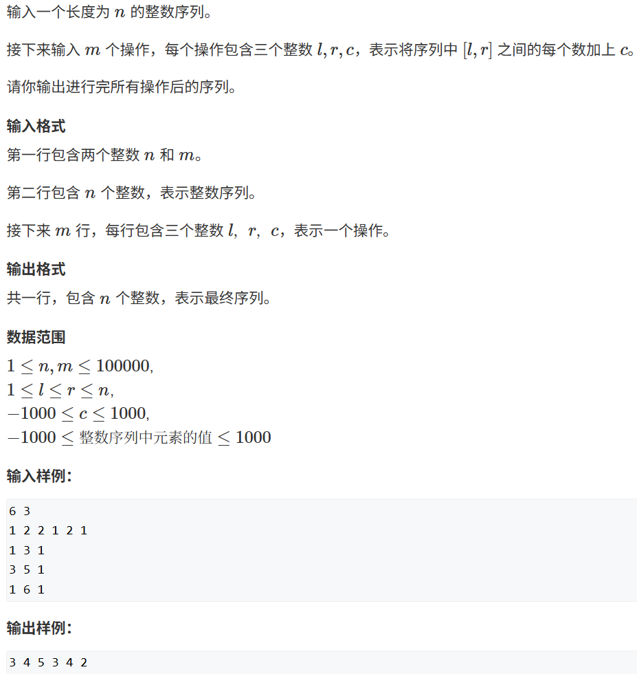

```
const int N = 1e5 + 10;
int n, m;
int a[N], b[N]; // 开一个全局变量

// 差分数组操作：在区间[l, r]上加上c
void insert(int l, int r, int c) {
    b[l] += c;
    b[r + 1] -= c;
}

int main() {
    // 输入数组长度n和操作次数m
    scanf("%d %d", &n, &m);
    
    // 读取原始数组
    for (int i = 1; i <= n; i++) scanf("%d", &a[i]);
    
    // 初始化差分数组（相当于在i到i这个区间上做插入操作）
    for (int i = 1; i <= n; i++) insert(i, i, a[i]);
    
    // 执行m次区间加法操作
    while (m--) {
        int l, r, c;
        scanf("%d %d %d", &l, &r, &c);
        insert(l, r, c);
    }
    
    // 计算前缀和并输出结果
    for (int i = 1; i <= n; i++) {
        b[i] += b[i - 1];
        printf("%d ", b[i]);
    }
    
    return 0;
}
```

$$
b[i] = a[i]-a[i-1],b[1]=a[1]
$$

$$
a[i] = b[1]+b[2]+...+b[i]
$$

如果想对 l 到 r 的区间上每个元素都加上一个特定值后再求区间内的数字和，实际上就是让
$$
b[l] = b[l]+c, b[r+1] = b[r+1]-c
$$
这样就有：
$$
任意的i>=l，a[i]通过前缀和求出来都被加了c，然后i>r时的a[i]加上的c被减了回去
$$

**注意，差分数组也是从下标为1开始，原数组0索引做变换，就是在差分数组索引为1的地方做变换**

## 二维差分

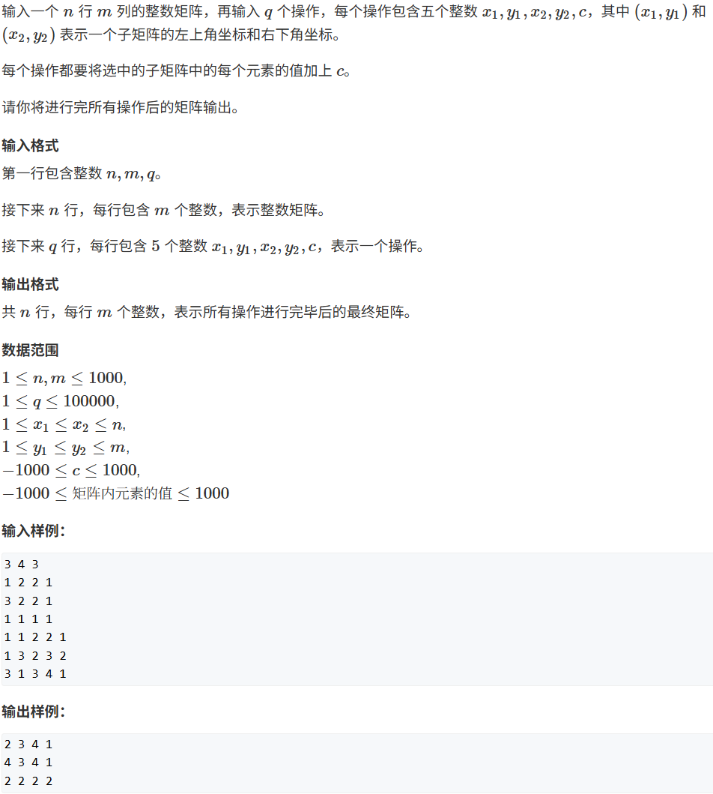

```
const int MAX_SIZE = 1010;
int a[MAX_SIZE][MAX_SIZE];    // 原始矩阵
int b[MAX_SIZE][MAX_SIZE];    // 差分矩阵

// 二维差分数组操作：在子矩阵(x1,y1)到(x2,y2)上加上c
void insert(int x1, int y1, int x2, int y2, int c) {
    b[x1][y1] += c;
    b[x2 + 1][y1] -= c;
    b[x1][y2 + 1] -= c;
    b[x2 + 1][y2 + 1] += c;
}

int main() {
    int n, m, q;
    scanf("%d %d %d", &n, &m, &q);
    
    // 读取原始矩阵
    for (int i = 1; i <= n; i++) {
        for (int j = 1; j <= m; j++) {
            scanf("%d", &a[i][j]);
        }
    }
    
    // 初始化差分矩阵
    for (int i = 1; i <= n; i++) {
        for (int j = 1; j <= m; j++) {
            insert(i, j, i, j, a[i][j]);
        }
    }
    
    // 执行q次子矩阵加法操作
    for (int i = 1; i <= q; i++) {
        int x1, y1, x2, y2, c;
        scanf("%d %d %d %d %d", &x1, &y1, &x2, &y2, &c);
        insert(x1, y1, x2, y2, c);
    }
    
    // 计算二维前缀和得到最终矩阵
    for (int i = 1; i <= n; i++) {
        for (int j = 1; j <= m; j++) {
            b[i][j] += b[i - 1][j] + b[i][j - 1] - b[i - 1][j - 1];
        }
    }
    
    // 输出结果矩阵
    for (int i = 1; i <= n; i++) {
        for (int j = 1; j <= m - 1; j++) {
            cout << b[i][j] << ' ';
        }
        cout << b[i][m] << endl;  // 每行最后一个元素单独处理，避免多余空格
    }
    
    return 0;
}
```

具体是怎么差的，看代码就行。

## 描述绘画的结果

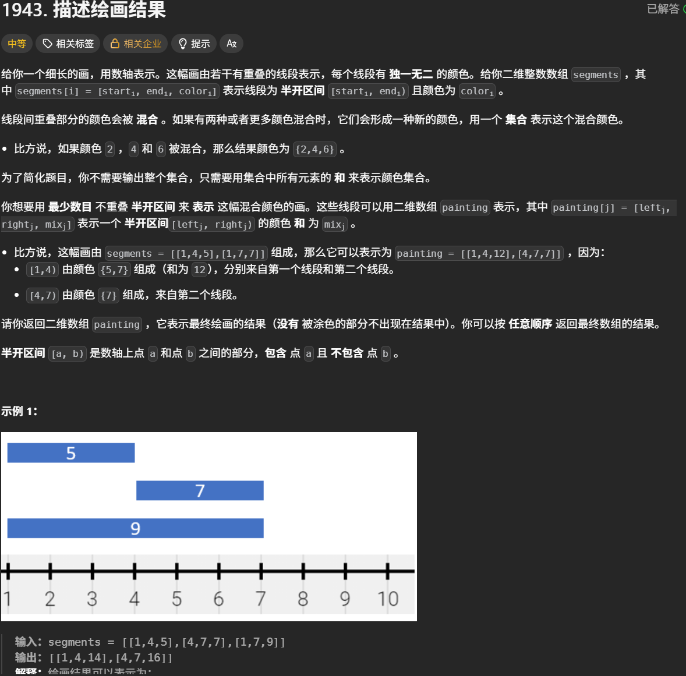

```
class Solution {
	public:
		vector<vector<long long>> splitPainting(vector<vector<int>>& segments) {
			map<int, long long> dic;
			for(int i=0; i<segments.size(); i++) {
				dic[segments[i][0]] += segments[i][2];
				dic[segments[i][1]] -= segments[i][2];
			}
			vector<vector<long long>> ans;
			long long int col = 0;
			int tou=0;
			for(const auto& ele:dic){
				if(col!=0){
					ans.push_back({tou, ele.first, col});
				}
				col+=ele.second;
				tou = ele.first;
			}
			return ans;
		}
};
```

用map存有个好处就是：只要这个元素（下标）被修改，那就一定会被const auto扫描到，这样就可以避免

```
注意，只返回一个单独的线段 [1,7) 是不正确的，因为混合颜色的集合不相同。
```

这个情况

## 所有排列中的最大和

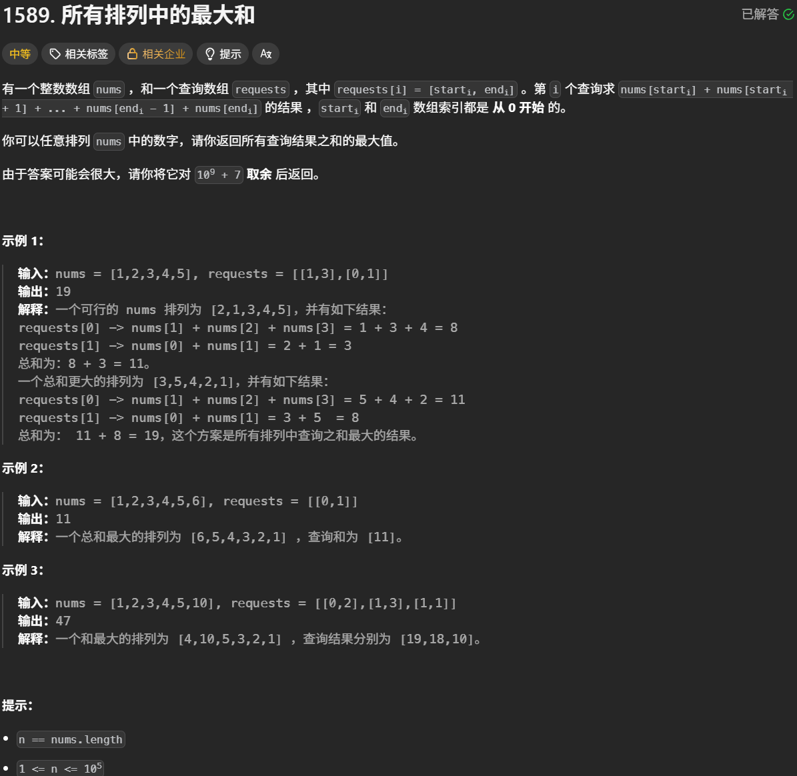

```
bool cmp(vector<int>& a, vector<int>& b) {
	return a[0]>b[0];
}
bool cmp2(int a, int b) {
	return a>b;
}
class Solution {
	public:
		int s[100010];
		int d[100010];
		int mod = 1e9+7;
		int maxSumRangeQuery(vector<int>& nums, vector<vector<int>>& requests) {
			vector<vector<int>> num;
			vector<int> final(nums.size(), 0);
			for(int i=0; i<requests.size(); i++) {
				int l = requests[i][0]+1;
				int r = requests[i][1]+1;
				s[l]+=1;
				s[r+1]-=1;
			}
			for(int i=1; i<100010; i++) {
				s[i]=s[i-1]+s[i];
				if(s[i]!=0) {
					num.push_back({s[i], i});
				}
			}
			sort(num.begin(), num.end(), cmp);
			sort(nums.begin(), nums.end(), cmp2);
			for(int i=0, j=0; i<num.size(); i++) {
			//构造final数组的时候，注意把下标减1还原回去
				int pos = num[i][1]-1;
				final[pos] = nums[j];
				j++;
			}
			for(int i=1; i<=final.size(); i++) {
				d[i] = d[i-1] + final[i-1];
				d[i] = d[i]%mod;
			}
			int ans=0;
			for(int i=0; i<requests.size(); i++) {
				ans +=d[requests[i][1]+1]-d[requests[i][0]];
				ans = ans%mod;
			}
			return ans;
		}
};
```

- 第一步：先用差分，计算**下标从1开始**的，每个索引位置被求和了多少次
- 第二步：每一位数字被计算的次数算出来（也就是差分数组求前缀和），把被计算次数超过0的，把它的计算次数和对应索引存到vector<vector\<int>> num里面
- 按照被计算次数，从大到小排列vector<vector\<int>> num，同时也从大到小排列原数组nums
- **计算次数多的索引，给他nums里更大的数字！**
- 求前缀和，计算结果

## 得分最多的最小轮调

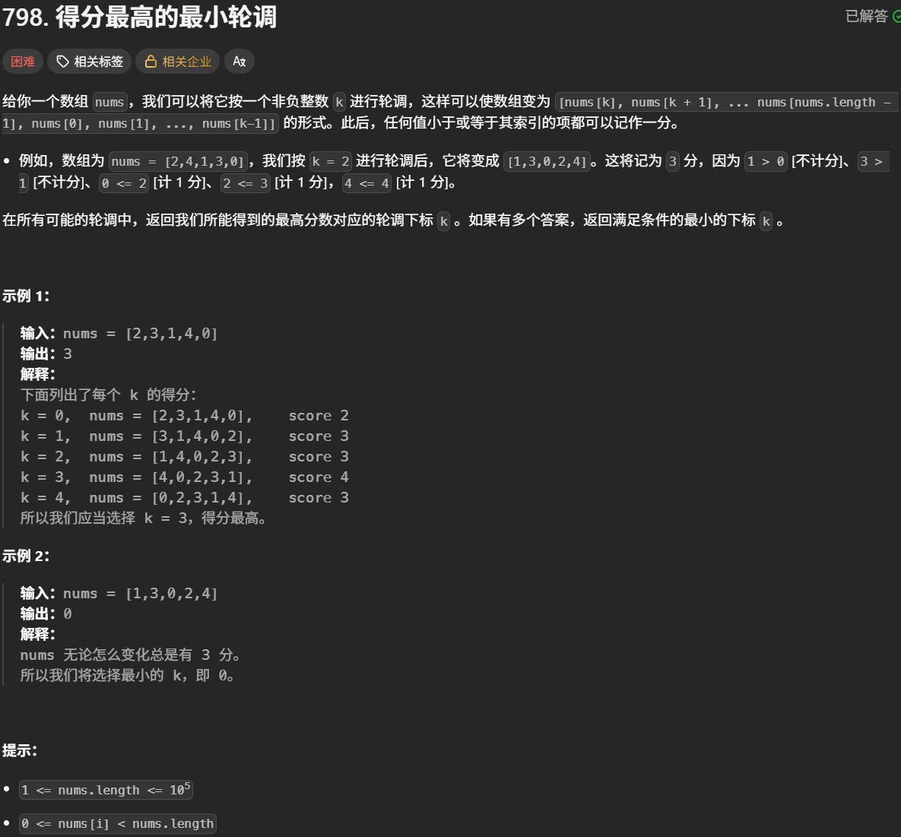

```
class Solution {
	public:
		int goal[100010];
		void insert(int x, int y) {
			goal[x]+=1;
			goal[y+1]-=1;
		}
		int bestRotation(vector<int>& nums) {
			int n = nums.size();
			for(int i=0; i<nums.size(); i++) {
				if(i-nums[i]>=0) {
					insert(0, i-nums[i]);
					insert(i+1, n-1);
				} else {
					insert(i+1, n+i-nums[i]);
				}
			}
			int max_goal = goal[0];
			int ans_k = 0;
			for(int k=1; k<nums.size(); k++) {
				goal[k] = goal[k-1]+goal[k];
				if(goal[k]>max_goal) {
					max_goal=goal[k];
					ans_k = k;
				}
			}
			return ans_k;
		}
};
```

每个$i$做轮调之后，变成的下标是$(i-k+n)\%n$

对于$nums[i]$，我们要得分，就要有：

- $nums[i]$<=$(i-k+n)\%n$

那么，拆开来看就是：

- 当$i-k>=0$时，$nums[i]<=i-k$
- 当$i-k<0$时，$nums[i]<=i-k+n$

这样，我们就得到了两个区间：

- $[0, i-nums[i]]$和$[i+1, i+n-nums[i]]$

但是，这两个区间不见得一定合法（右边不一定大于左边），我们可以稍微分析一下。但事实上，**只需要在insert函数里判断一下右端点是否大于等于左端点，同时上界有没有超过n-1（或者你直接把goal函数开的是1e5的二倍就行）**

```
class Solution {
	public:
		int goal[100010];
		int n;
		void insert(int x, int y) {
			if(y>=x) {
				goal[x]+=1;
				if(y>n-1) {
					goal[n]-=1;
				} else {
					goal[y+1]-=1;
				}
			}
		}
		int bestRotation(vector<int>& nums) {
			n = nums.size();
			for(int i=0; i<nums.size(); i++) {
				insert(0, i-nums[i]);
				insert(i+1, n+i-nums[i]);
			}
			int max_goal = goal[0];
			int ans_k = 0;
			for(int k=1; k<nums.size(); k++) {
				goal[k] = goal[k-1]+goal[k];
				if(goal[k]>max_goal) {
					max_goal=goal[k];
					ans_k = k;
				}
			}
			return ans_k;
		}
};
```

# 位运算

n的二进制表示中，第k位是几？

## 移动操作

n >> k & 1：先右移 k 位，使目标位变成最低位，再 & 1，取出最后一位

x & y 表示“按位与”操作：只有两个对应位 都是1 时，结果的该位才是 1，否则是 0

x & (1<<j) 

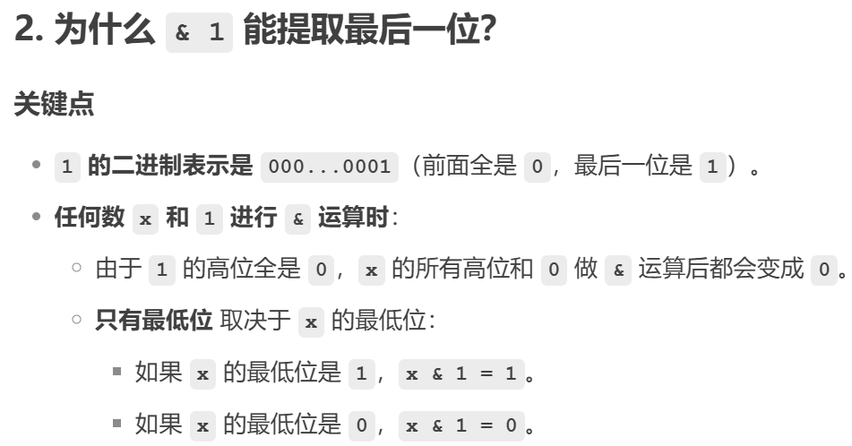

## 找1操作

lowbit(x)：返回一个二进制数字，二进制数字的第一位就是 x 二进制下的第一位 1
例如：

x = 10110, lowbit(x) = 10

x = 10010000, lowbit(x) = 10000

lowbit()操作本质上是：x&(~x+1)

例如：

x = 101100

~x = 010011

~x+1 = 010100

x&(~x+1) = 101100 & 010100 = 000100

## 反码、补码、原码

若存储为8位，令x = 1010

原码：x = 00001010

反码：~x = 11110101

补码：~x+1 = 11110110（补码也常常定义 -x）

## 例题

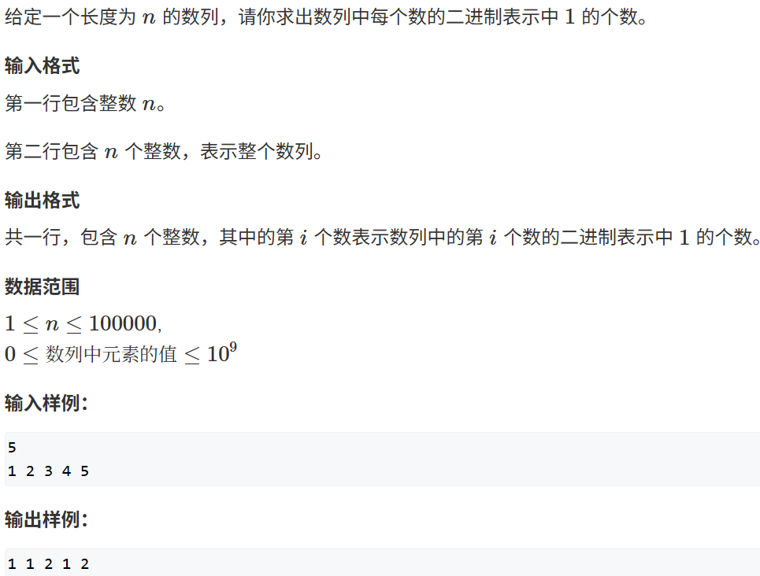

    int lowbit(int x){
        return x & (-x)
    }
    int main() {
    	int n,x;
    	scanf("%d", &n);
    	int a[n+1]= {0};
    	int ans=0;
    	for(int i=1; i<=n; i++) {
    		scanf("%d", &a[i]);
    	}
    	for(int i=1; i<=n; i++) {
    		ans = 0;
    		x = a[i];
    		while(1) {
    			if(x==0) {
    				break;
    			}
    			// 二进制下的减号也是直接把这部分删掉了（可转换成十进制验证）
    			x = x-lowbit(x);
    			ans++;
    		}
    		cout<<ans<<' ';
    	}
    	return 0;
    }
## 只出现一次的数字

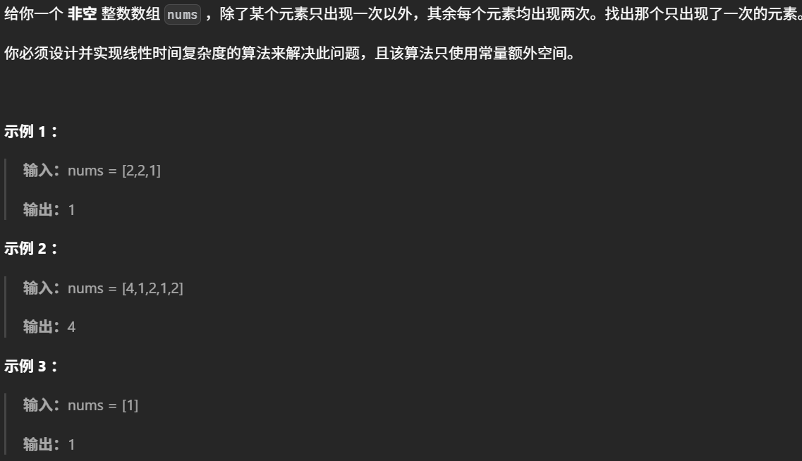

对所有的数字作《异或运算》，相同的数字运算后变成0

```
class Solution {
	public:
		int singleNumber(vector<int>& nums) {
			int ans;
			for(int i=0; i<nums.size(); i++) {
				if(i==0){
					ans = nums[0];
					continue;
				}
				ans = ans ^ nums[i];
			}
			return ans;
		}
};
```

# 快排

    void quick_sort(vector<int> &q, int l, int r) {
    	if(l>=r)
    		return;
    	int x = q[(l+r+1)/2];
    	int i = l-1;
    	int j = r+1;
    	while(i<j) {
    		do i++;
    		while(q[i]<x);
    		do j--;
    		while(q[j]>x);
    		if(i<j) swap(q[i], q[j]);
    	}
    	quick_sort(q, l, i-1);
    	quick_sort(q, i, r);
    }

# 二分查找

## 第一次出现的位置

注意，下面的找法，即便没找到，也是找到了**恰好比目标数字 大或者小的那个数字！！**

查找元素 **第一次出现的位置**：

- 没找到就返回-1

- mid的构造是 **l+r>>1**

- 当mid指向的元素**大于等于target**，则 r = mid

  否则就是 l = mid+1

```
int find_first(int x, vector<int>& nums) {
	int l = 0;
	int r = nums.size()-1;
	while(l<r) {
		int mid = l+r>>1;
		if(nums[mid]>=x) {
			r = mid;
		} else {
			l = mid + 1;
		}
	}
	if(nums[r]!=x) {
		return -1;
	}
	return r;
}
```

## 最后一次出现的位置

查找元素 **最后一次出现的位置**：

- 没找到就返回-1

- mid的构造是 **l+r+1>>1**

- 当mid指向的元素**大于target**，则 r = mid -1

  否则就是 l = mid

```
int find_last(int x, vector<int>& nums) {
	int l = 0;
	int r = nums.size()-1;
	while(l<r) {
		int mid = l+r+1>>1;
		if(nums[mid]>x) {
			r = mid-1;
		} else {
			l = mid;
		}
	}
	if(nums[r]!=x) {
		return -1;
	}
	return r;
}
```

最后返回的都是 **右指针！！！！**

## 插入位置

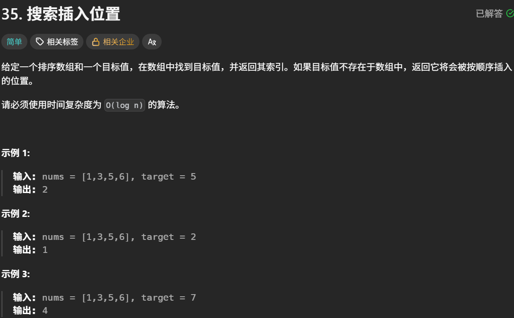

```
class Solution {
	public:
		int find(vector<int>& nums, int x) {
			int l = 0;
			int r = nums.size()-1;
			while(l<r) {
				int mid = l+r>>1;
				if(nums[mid]>=x) {
					r = mid;
				} else {
					l = mid+1;
				}
			}
			return r;
		}
		int searchInsert(vector<int>& nums, int target) {
			int pos = find(nums, target);
			if(nums[pos]==target) {
				return pos;
			} else if(nums[pos]>target) {
				return pos;
			} else {
				return pos+1;
			}
		}
};
```

## 长度最小的子数组

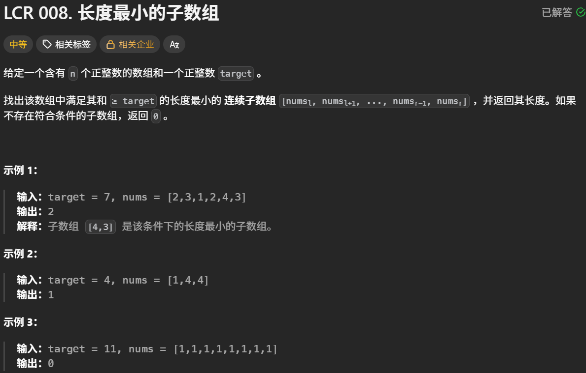

```
class Solution {
	public:
		int qz[100010];
		int n;
		int find(int x) {
			int l=0, r=n;
			while(l<r) {
				int mid = (l+r)/2;
				if(qz[mid]>=x) {
					r = mid;
				} else {
					l = mid+1;
				}
			}
			return r;
		}
		int minSubArrayLen(int target, vector<int>& nums) {
			unordered_map<int, int> dic;
			n = nums.size();
			for(int i=0; i<nums.size(); i++) {
				qz[i+1] = qz[i]+nums[i];

			}
			for(int i=nums.size(); i>=0; i--) {
				dic[qz[i]]=i;
			}
			int ans = 1e9;

			for(int i=0; i<=n; i++) {
				int temp = target+qz[i];
				int pos = find(temp);
				if(qz[pos]>=temp) {
					ans = min(ans, pos-i);
				} else {
					pos++;
					if(pos<=n) {
						ans = min(ans, pos-i);
					}
				}
				cout<<temp<<' '<<pos<<' '<<ans<<endl;
			}
			if(ans==1e9) {
				return 0;
			}
			return ans;
		}
};
```

二分查找的结果只有两种

- 找到了，分为找到**第一次出现的那个**或者**最后一次出现的那个**，这需要两种不同的二分

- 没找到，只会是离目标元素最近的**较大**或者**较小**元素（不管是找第一次出现的那个二分还是最后一次出现的那个二分），至于是大还是小，写个判断吧！

  ```
  int pos = find(temp);
  				if(qz[pos]>=temp) {
  					ans = min(ans, pos-i);
  				} else {
  					pos++;
  					if(pos<=n) {
  						ans = min(ans, pos-i);
  					}
  				}
  ```

  注意别越界

## 二分整数

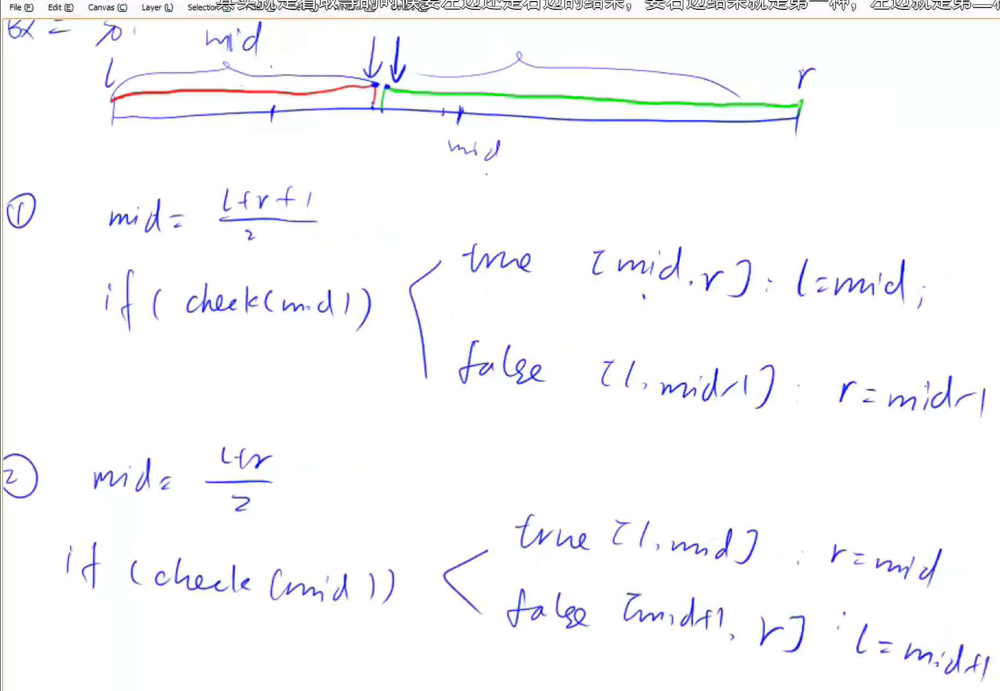

## 二分浮点数

```
int main(){
	double x;
	cin>>x;
	double l=-10000;
	double r=10000;
	while(r-l>1e-9){
		double mid =(l+r)/2;
		if(mid*mid*mid>=x){
			r=mid; 
		} else{
			l=mid;
		}
	}
	printf("%.6lf", r);
}
```

- 注意while中判断条件是r-l>1e-9（题中要求6位小数，按经验一般往后多2位，也就是1e-8）
- l=mid就行，这是浮点数，不需要l=mid+1！！！！！

## 乘法表中第k小的数字


## 供暖器

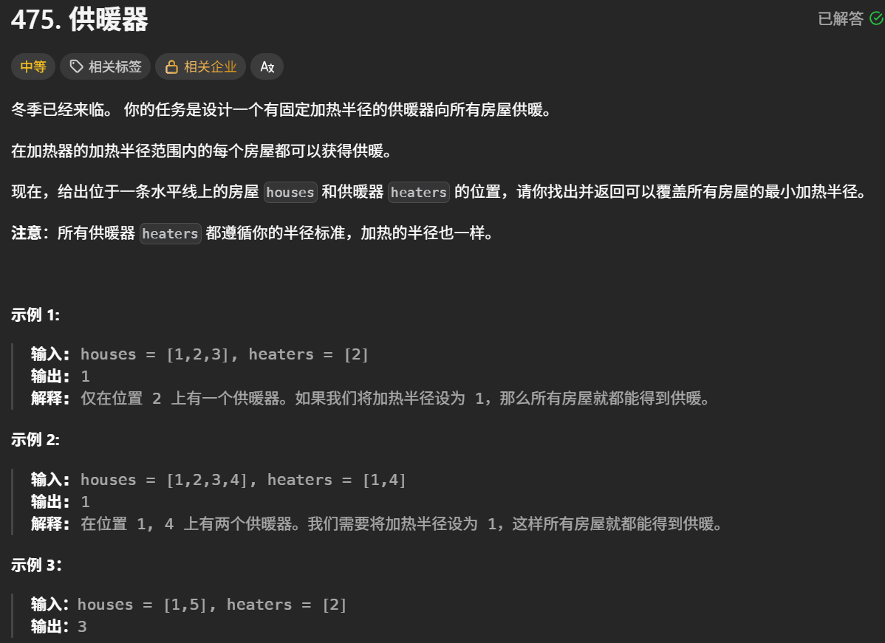

```
class Solution {
	public:
		bool check(int x, vector<int>& houses, vector<int>& heaters) {
			int l=0, r=0;
			while(l<houses.size() && r<heaters.size()){
				if(heaters[r]-x<=houses[l] && heaters[r]+x>=houses[l]){
					l++;
				}else{
					r++;
				}
			}
			if(l<houses.size()){
				return false;
			}
			return true;
		}
		int findRadius(vector<int>& houses, vector<int>& heaters) {
			int l=0, r=1e9;
			sort(heaters.begin(), heaters.end());
			sort(houses.begin(), houses.end());
			while(l<r) {
				int mid = l+r>>1;
				if(check(mid, houses, heaters)) {
					r=mid;
				} else {
					l=mid+1;
				}
			}
			return r;
		}
};
```

很明显，答案具有单调性，我们直接从0到1e9二分

对于每个答案，我们进行双指针check：

- 把暖器位置和楼房位置都从小到大排序
- 具体双指针贪心可以看代码
- 注意while结束后，**处理一下没走完的楼房！！！！！！！！！！！！！！**

## 分割数组的最大值（最小化最大值）

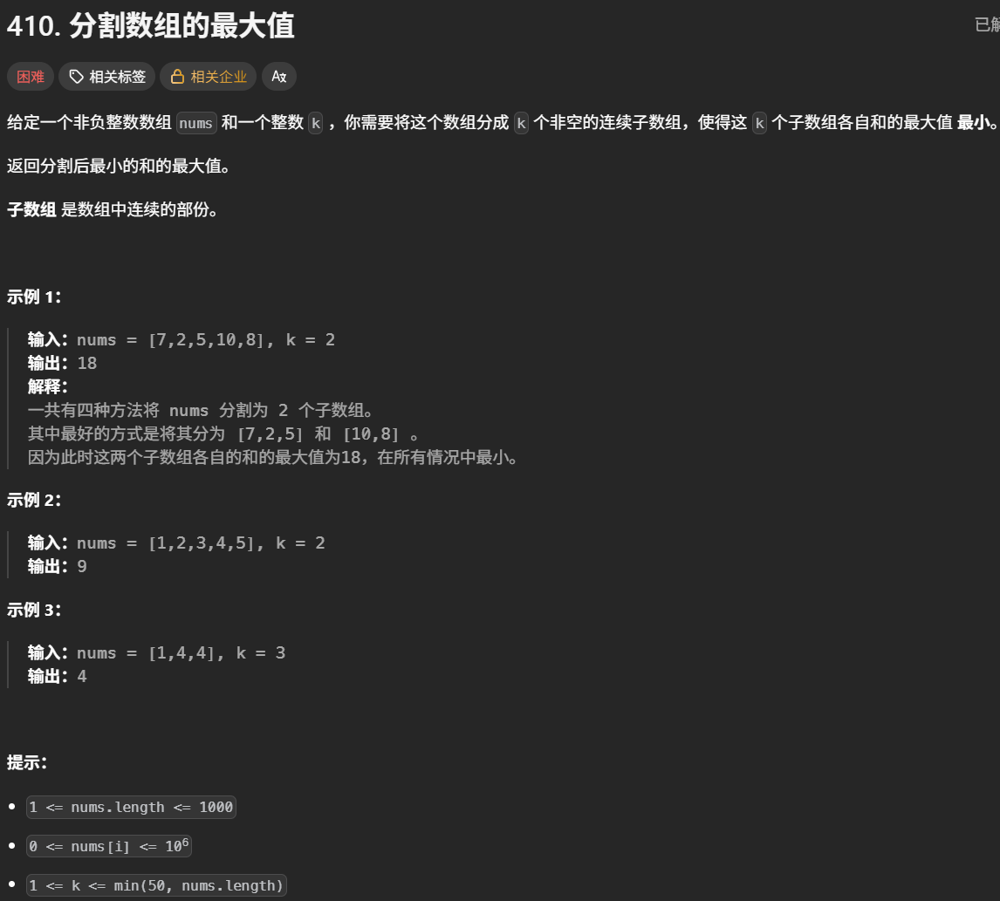

```
class Solution {
	public:
		bool check(int x, vector<int>& nums, int k){
			int sum=0;
			int cishu=0;
			for(int i=0;i<nums.size();i++){
				sum=sum+nums[i];
				if(sum>x){
					sum=nums[i];
					cishu++;
				}
			}
			cout<<x<<' '<<cishu<<endl;
			if(cishu>=k){
				return false;
			}
			return true;
		}
		int splitArray(vector<int>& nums, int k) {
			int max_ele=INT_MIN;
			for(int i=0;i<nums.size();i++){
				if(nums[i]>max_ele){
					max_ele = nums[i];
				}
			}
			int l=max_ele, r=1e9;
			while(l<r){
				int mid = (l+r)/2;
				if(check(mid, nums, k)){
					r=mid;
				}else{
					l=mid+1;
				}
			}
			return r;
		}	
};
```

- 我们的答案选择范围是：max_ele和num_ele，最粗暴的办法就是遍历这每一种组合，检查我们至少需要划分多少次才能得到这个答案？

- ```
  int cur_k=1;
  int cur_sum=0;
  for(int i=0; i<nums.size(); i++) {
  	cur_sum+=nums[i];
  		if(cur_sum>mid) {
  			cur_k++;
  			cur_sum=nums[i];
  		}
  }
  ```

  这段代码就是用**贪心**办法搜索答案是mid的时候，我们至少要把区间划分多少次才能得到（注意，是至少，因为我们完全可以在更小的，长度非1的区间上再划分）

- 后来发现，我们不用全部遍历，它是具有单调性的！

  - **如果设置「数组各自和的最大值」很大，会使得分割数很小**；
  - **如果设置「数组各自和的最大值」很小，会使得分割数很大**。

- 二分的格式同正常二分一模一样。

- 最后return 的是r和l都是可以过的

## 正方形中的最多点数

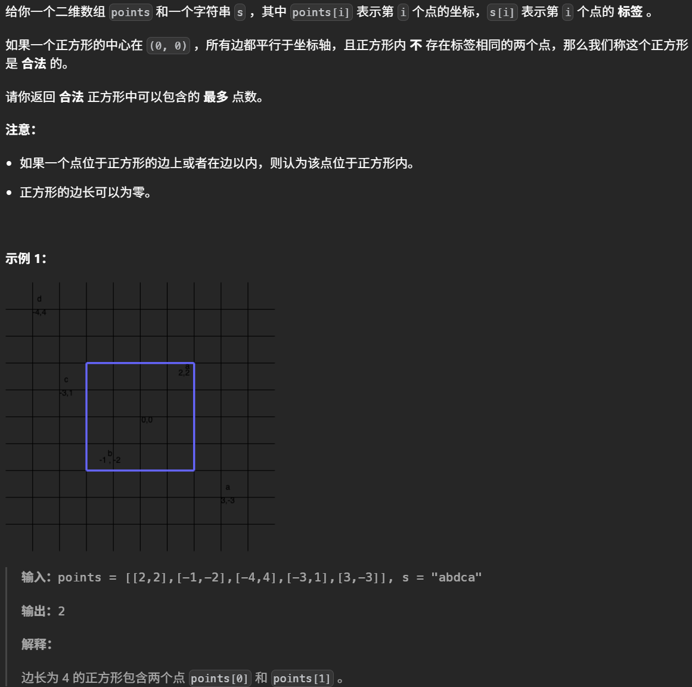

```
class Solution {
	public:
		int ans = 0;
		bool check(int b, vector<vector<int>>& points, string s) {
            cout<<b<<endl;
			unordered_map<char, bool> dic;
			int num=0;
			for(int i=0; i<points.size(); i++) {
				int x = points[i][0];
				int y = points[i][1];
				if(x<=b && x>=-b && y<=b && y>=-b) {
					char a = s[i];
					if(dic.find(a)!=dic.end()) {
						return false;
					}else{
						dic[a]=true;
						num++;
					}
				}
			}

			ans = max(ans, num);
			return true;
		}
		int maxPointsInsideSquare(vector<vector<int>>& points, string s) {
			int l=-1, r=1e9;
			while(l<r) {
				int mid = l+r+1>>1;
				if(check(mid, points, s)) {
					l=mid;
				} else {
					r=mid-1;
				}
			}
			return ans;
		}
};
```

# 分治

## 归并排序

```cpp
int q[100001];
int tmp[100001];

void merge_sort(int q[], int l, int r) {
    if(l >= r) {
        return;
    }
    int mid = (l + r) / 2;
    merge_sort(q, l, mid);
    merge_sort(q, mid + 1, r);
    
    int k = 0, i = l, j = mid + 1;
    while(i <= mid && j <= r) {
        if(q[i] <= q[j]) {
            tmp[k++] = q[i++];
        } else {
            tmp[k++] = q[j++];
        }
    }
    
    while(i <= mid) {
        tmp[k++] = q[i++];
    }
    
    while(j <= r) {
        tmp[k++] = q[j++];
    }
    
    for(i = l, j = 0; i <= r; i++, j++) {
        q[i] = tmp[j];
    }
}

int main() {
    int n;
    scanf("%d", &n);
    for(int i = 0; i <= n - 1; i++) {
        scanf("%d", &q[i]);
    }
    
    merge_sort(q, 0, n - 1);
    
    for(int i = 0; i <= n - 1; i++) {
        cout << q[i] << ' ';
    }
    
    return 0;
}
```

- 确定分界点

- 递归排序：**[l, mid]和[mid+1, r]**

  - ```
    merge_sort(q, l, mid); 
    merge_sort(q, mid + 1, r);
    ```

- 归并（合二为一）

归并排序是稳定的：原序列中两个数值一样，排序后他们的位置不发生变化那么就是稳定的

快排不稳定

## 逆序对的个数

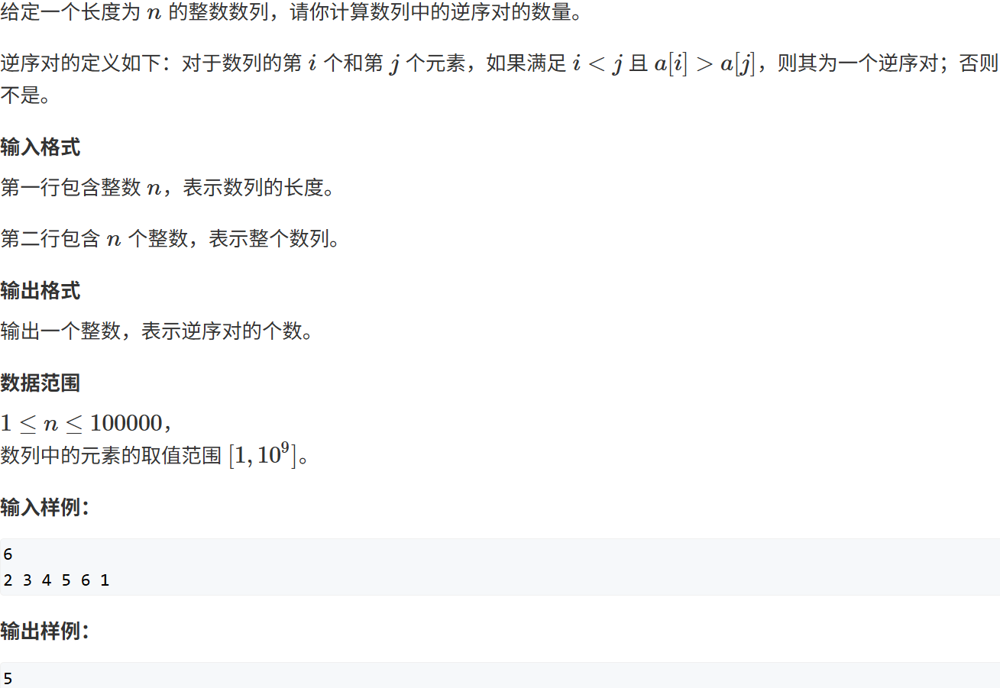

```cpp
class Solution {
	public:
		int ans =0;
		void find(vector<int>& record, int l, int r) {
			if(l>=r) {
				return;
			}
			int mid = l+r>>1;
			find(record, l, mid);
			find(record, mid+1, r);
			int i = mid;
			int j = r;
			while(i>=l && j>=mid+1) {
				if(record[i]>record[j]) {
					ans = ans + j-(mid+1)+1;
					i--;
				} else {
					j--;
				}
			}
			sort(record.begin()+l, record.begin()+r+1);
		}
		int reversePairs(vector<int>& record) {
			int n = record.size();
			find(record, 0, n-1);
			return ans;
		}
};
```

其实就是和归并排序一样的写法，只不过不是单独对左和右进行merge_sort，而是把左右的ans都要汇总（加）起来。

在左边和右边数组的归并过程中，顺便统计右边数组每个数能和左边数组构成逆序对的总数：

当左指针指向的数字**大于**右指针时，右指针指向的数字构成逆序对的个数其实就是**左指针到左数组结尾的所有数字个数**

## 满足条件的区间和的个数

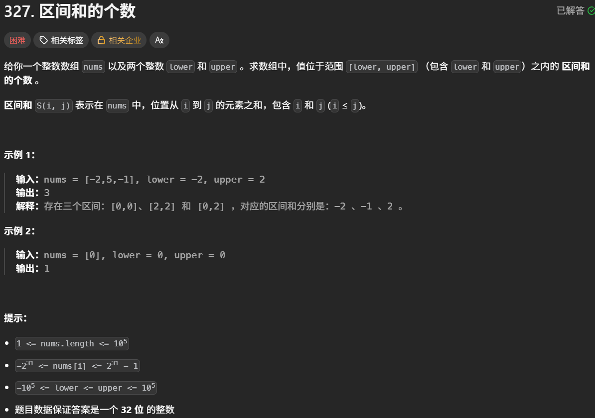

```
class Solution {
	public:
		vector<long long int> qz;
		int ans =0;
		void merge_sort(int l, int r, long long int lower, long long int upper) {
			if(l>=r) {
				return;
			}
			int mid=l+r>>1;
			merge_sort(l, mid, lower, upper);
			merge_sort(mid+1, r, lower, upper);
			int left=mid+1;
			int right=mid+1;
			for(int i=l; i<=mid; i++) {
				int x = qz[i];
				while(left<=r && qz[left]<x+lower) {
					left++;
				}
				while(right<=r && qz[right]<=x+upper) {
					right++;
				}
				ans = ans + right - left;
			}
			sort(qz.begin()+l, qz.begin()+r+1);
			return;
		}
		int countRangeSum(vector<int>& nums, int lower, int upper) {
			qz.push_back(0);
			for(int i=0; i<nums.size(); i++) {
				qz.push_back(qz[qz.size()-1]+nums[i]);
			}
			merge_sort(0, qz.size()-1, (long long)lower, (long long)upper);
			return ans;
		}
};
```

我们先用一个num数组存前缀和，**注意这个数组要开 long long int**

我们归并的目的是在于，可以处理两个都是单调递增的数组，这样可以**双指针**找满足条件的区间！

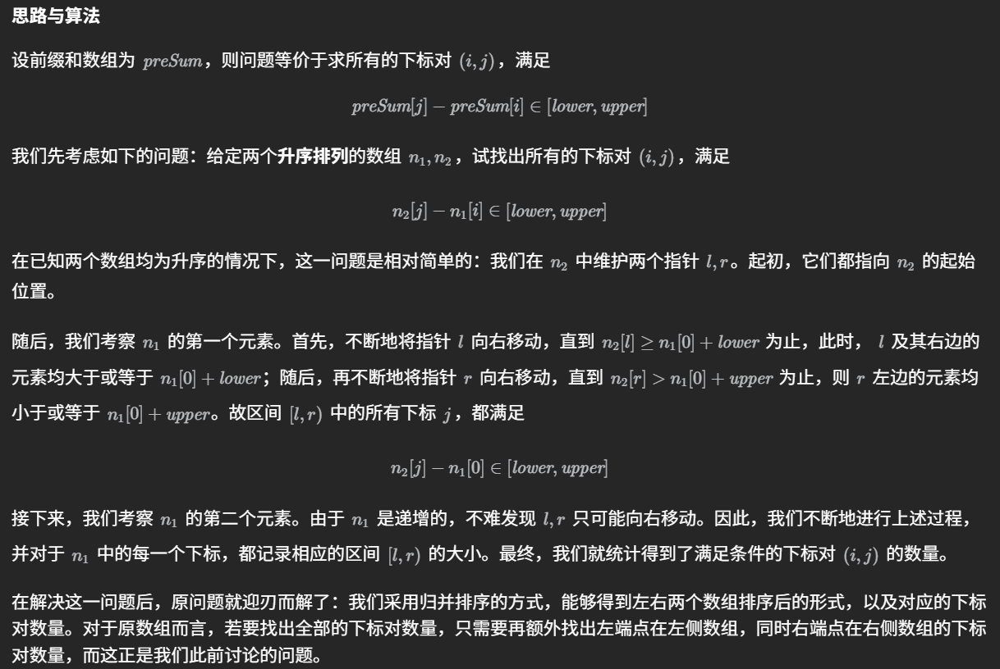

注意：

```
// 计数
			int i=l;
			int tou = mid+1;
			int wei = tou;
			while(i<=mid) {
				while(wei<=r && nums[wei]-nums[i]<lower) {
					wei++;
				}
				while(tou<=r && nums[tou]-nums[i]<=upper) {
					tou++;
				}
				ans+=tou-wei;
				i++;
			}
```

不要写成

```
tou--
ans+=tou-wei+1;
```

因为在本轮$i$里面，tou可能一开始就不满足while的条件，那么他已经就是不会移动，所以再--会出现越界的情况！

# 离散化

对于值域很大，跨度很大，但是个数很少，涉及到的数字很少：把他们一一映射成**“连续自然数”**

例如：

a[] = 1, 3, 100, 2000, 500000
映射为 0, 1, 2, 3, 4

考虑问题：

1.**a[]会有重复元素，要去重**。

```
alls.erase(unique(alls.begin(), alls.end()), alls.end()); // 去掉重复元素
```

2.**如何计算a[i]离散化后的值是什么？**

## 例题

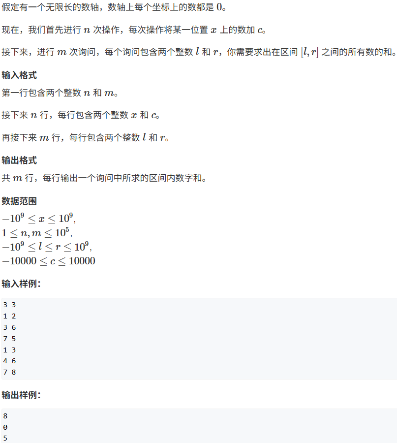

```cpp
vector<int> pos;                  // 存储所有需要离散化的坐标
vector<vector<int>> pos_addc;     // 存储原始数据 (x, c) 对
vector<vector<int>> query_pos;    // 存储查询区间 [l, r]
// 二分查找离散化后的位置 (从1开始计数)
int find(int x) {
    int l = 0, r = pos.size() - 1;
    while(l < r) {
        int mid = l + r >> 1;
        if(pos[mid] >= x) {
            r = mid;
        } else {
            l = mid + 1;
        }
    }
    return r + 1;  // 前缀和数组 pos_map 从下标1开始
}
int main() {
    int n, x, c, m, l, r;
    // 输入处理
    scanf("%d %d", &n, &m);
    // 读取原始数据
    for(int i = 1; i <= n; i++) {
        scanf("%d %d", &x, &c);
        pos_addc.push_back({x, c});
        pos.push_back(x);
    }
    
    // 读取查询区间
    for(int i = 1; i <= m; i++) {
        scanf("%d %d", &l, &r);
        query_pos.push_back({l, r});
        pos.push_back(l);
        pos.push_back(r);
    }
    // 至此为止，把所有涉及到的区间都存到了 pos 里面
    // 排序+去重
    sort(pos.begin(), pos.end());
    pos.erase(unique(pos.begin(), pos.end()), pos.end());
    // 完成指定位置加数的操作（实际上就是对离散化后数组操作）
    vector<int> pos_map(pos.size() + 1, 0);
    for(int i = 0; i < pos_addc.size(); i++) {
        int y = find(pos_addc[i][0]); // 先找要加的位置在离散化后的位置
        pos_map[y] += pos_addc[i][1];
    }
    // 计算前缀和
    for(int i = 1; i < pos_map.size(); i++) {
        pos_map[i] += pos_map[i - 1];
    }
    // 处理查询
    for(int i = 0; i < query_pos.size(); i++) {
        int left = find(query_pos[i][0]); // 先找要查询的位置离散化后的位置
        int right = find(query_pos[i][1]); // 先找要查询的位置离散化后的位置
        cout << pos_map[right] - pos_map[left - 1] << endl;
    }
    return 0;
}
```

````
vector<int> pos;
vector<vector<int>> add;
vector<vector<int>> query;
int find(int x) {
	int l=0, r=pos.size()-1;
	while(l<r) {
		int mid=l+r>>1;
		if(pos[mid]>=x) {
			r=mid;
		} else {
			l=mid+1;
		}
	}
	return r;
}
int main() {
	int n, m;
	cin>>n>>m;
	for(int i=1; i<=n; i++) {
		int a, b;
		cin>>a>>b;
		add.push_back({a, b});
		pos.push_back(a);
	}
	for(int i=1; i<=m; i++) {
		int a, b;
		cin>>a>>b;
		query.push_back({a, b});
		pos.push_back(a);
		pos.push_back(b);
	}
	sort(pos.begin(), pos.end());
	pos.erase(unique(pos.begin(), pos.end()), pos.end());
	vector<int> nums(pos.size(), 0);
	for(int i=0; i<add.size(); i++) {
		int index = find(add[i][0]);
		nums[index]+=add[i][1];
	}
	nums.insert(nums.begin(), 0);
	for(int i=1; i<nums.size(); i++) {
		nums[i]=nums[i]+nums[i-1];
	}
	for(int i=0; i<query.size(); i++) {
		int l = find(query[i][0]);
		int r = find(query[i][1]);
		cout<<nums[r+1]-nums[l]<<endl;
	}
	return 0;
}
````

# 链表

## 单链表

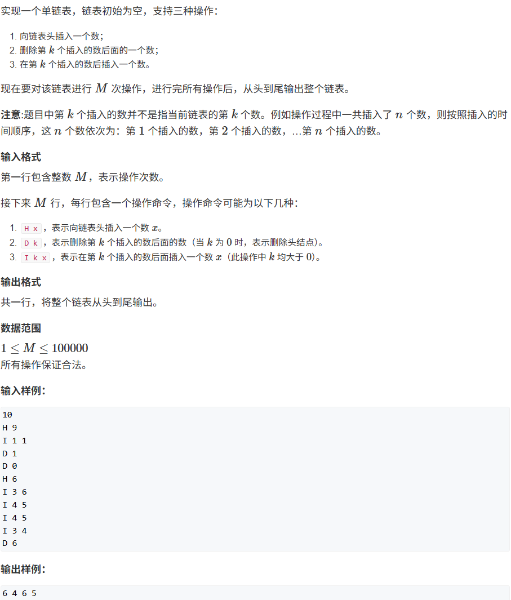

```cpp
// 头节点指向的那个节点的编号 
int head; 

// 节点的值，节点编号即为下标 
int e[100001]; 

// 编号为下表的节点其后面一个点的编号是多少 
int ne[100001]; 

// 存储当前已经用到哪个点了 
int idx; 

// 初始化链表 
void init() {
    head = -1;
    idx = 0;
}

// 将值为x的节点插到头节点后面 
void add_to_head(int x) {
    e[idx] = x;
    ne[idx] = head;
    head = idx;
    idx++;
}

// 将值为x的节点插到编号为k的节点的后面
void insert(int x, int k) {
    e[idx] = x;
    ne[idx] = ne[k];
    ne[k] = idx;
    idx++;
}

// 将编号为k的点的后面一个节点删掉 
void remove(int k) {
    ne[k] = ne[ne[k]];
}

int main() {
    int n, x, k;
    scanf("%d", &n);
    char a;
    init();
    for (int i = 1; i <= n; i++) {
        cin >> a;
        if (a == 'H') {
            cin >> x;
            add_to_head(x);
        }
        if (a == 'D') {
            cin >> k;
            // 注意如果要删除头节点后面那个数字，就要单独判断
            if (k == 0) {
                head = ne[head];
            }
            remove(k - 1);
        }
        if (a == 'I') {
            cin >> k;
            cin >> x;
            insert(x, k - 1);
        }
    }
    for (int i = head; i != -1; i = ne[i]) {
        cout << e[i] << ' ';
    }
}
```

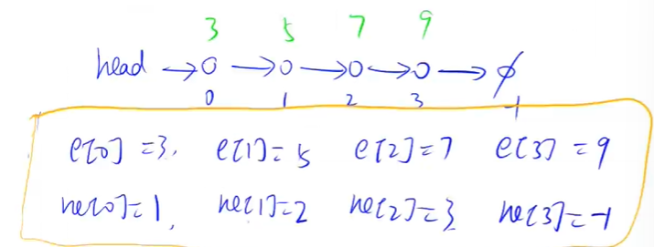

## 链表找环的入口

```
/**
 * Definition for singly-linked list.
 * struct ListNode {
 *     int val;
 *     ListNode *next;
 *     ListNode(int x) : val(x), next(NULL) {}
 * };
 */
class Solution {
	public:
		ListNode *detectCycle(ListNode *head) {
			ListNode *fast=head;
			ListNode *slow=head;
			unordered_map<ListNode*, bool> dic;
			ListNode *temp=head;
			while(1){
				if(temp==NULL){
					return NULL;
				}
				if(dic[temp]==true){
					break;
				}
				dic[temp]=true;
				temp = temp->next;
			}
			while(1){
				fast=fast->next->next;
				slow=slow->next;
				if(fast==slow){
					break;
				}
			}
			fast=head;
			while(fast!=slow){
				slow=slow->next;
				fast=fast->next;
			}
			return fast;
		}
};
```

# 动态规划

## 打家劫舍

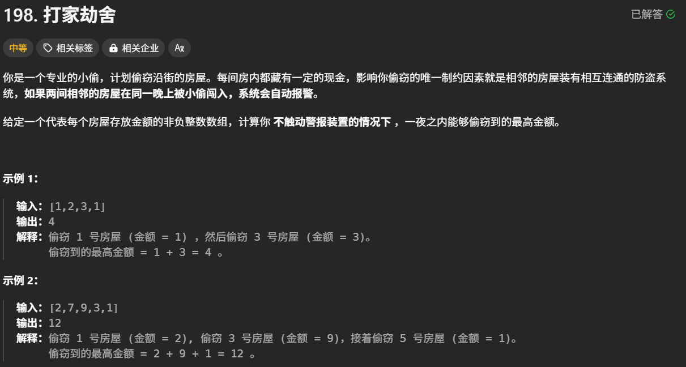

- 集合：到第i号房子选择偷/不偷所获得的钱财
- 属性：最大值
- 状态计算：分成dp\[i][0]和dp\[i][1]
- dp\[i][0]：当前这个房子不偷，是因为：
  - 前一个房子没偷，则是dp\[i-1][0]
  - 前一个房子偷了，则是dp\[i-1][1]
- dp\[i][1]：当前这个房子偷，是因为：
  - 前一个房子没偷，则是dp\[i-1][0]+v[i]

    int dp[1001][1001];
    class Solution {
    	public:
    		int rob(vector<int>& nums) {
    			for(int i=0; i<nums.size(); i++) {
    				if(i==0) {
    					dp[i][0]=0;
    					dp[i][1]=nums[0];
    				} else {
    					dp[i][0] = max(dp[i-1][1], dp[i-1][0]);
    					dp[i][1] = dp[i-1][0]+nums[i];
    				}
    			}
    			return max(dp[nums.size()-1][1], dp[nums.size()-1][0]);
    		}
    };

如果只考虑一维的dp，那就是下面的代码

```
class Solution {
	public:
		int dp[1000];
		int rob(vector<int>& nums) {
			dp[1]= nums[0];
			for(int i=2; i<=nums.size(); i++) {
				dp[i] = max(dp[i-1], dp[i-2]+nums[i-1]);
			}
			int n = nums.size();
			int ans = dp[n];
			return ans;
		}
};
```

决定dp[i]的因素就是第i房间偷还是不偷。

如果偷第i房间，那么dp[i] = dp[i - 2] + nums[i] ，即：第i-1房一定是不考虑的，找出 下标i-2（包括i-2）以内的房屋，最多可以偷窃的金额为dp[i-2] 加上第i房间偷到的钱。

如果不偷第i房间，那么dp[i] = dp[i - 1]，即考 虑i-1房，（**注意这里是考虑，并不是一定要偷i-1房，这是很多同学容易混淆的点**）

然后dp[i]取最大值，即dp[i] = max(dp[i - 2] + nums[i], dp[i - 1]);

1. dp数组如何初始化

从递推公式dp[i] = max(dp[i - 2] + nums[i], dp[i - 1]);可以看出，递推公式的基础就是dp[0] 和 dp[1]

从dp[i]的定义上来讲，dp[0] 一定是 nums[0]，dp[1]就是nums[0]和nums[1]的最大值即：dp[1] = max(nums[0], nums[1]);

## 打家劫舍Ⅱ

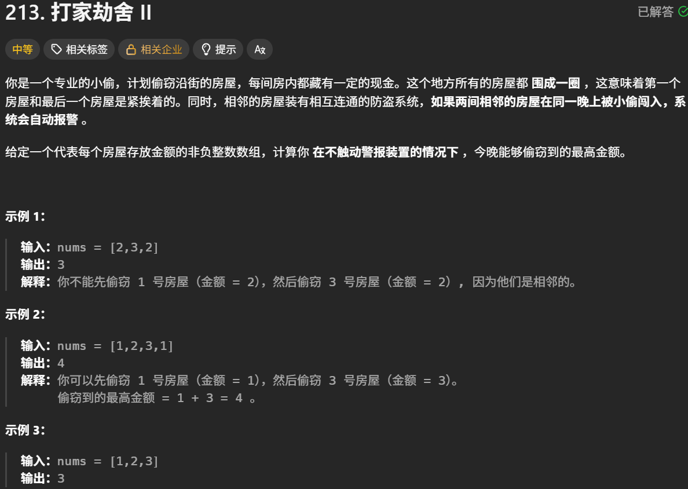

```
#include <iostream>
#include <vector>
#include <cmath>
#include <queue>
#include <map>
#include <algorithm>
#include <set>
#include <string>
#include <climits>
#include <cstring>
#include <numeric>
#include <unordered_map>
using namespace std;
// 22
class Solution {
	public:
		int dp[5010];
		int rob(vector<int>& nums) {
		    // 先处理特殊情况
			if(nums.size()==1) {
				return nums[0];
			}
			if(nums.size()==2) {
				return max(nums[0], nums[1]);
			}
			// 处理第一天买，最后一天不买的情况
			memset(dp, 0, sizeof dp);
			int ans = -1;
			int n = nums.size();

			dp[1] = nums[0];
			for(int i=2; i<nums.size(); i++) {
				dp[i] = max(dp[i-1], dp[i-2]+nums[i-1]);
			}
			ans = max(ans, dp[n-1]);
			// 处理第一天不买，最后一天买or不买的情况
			memset(dp, 0, sizeof dp);
			dp[2] = nums[1];
			for(int i=3; i<=nums.size(); i++) {
				dp[i] = max(dp[i-1], dp[i-2]+nums[i-1]);
			}
			ans = max(ans, dp[n]);
			return ans;
		}
};
```

环，无非就是三种情况

- 第一天买，最后一天不买
- 第一天不买，最后一天买
- 第一天不买，最后一天不买

第一种情况，只需要遍历dp到n-1就行了

第二种情况和第三情况，实际上就是跳过第一个房间开始遍历，到最后得到的dp[n]包含了这两种情况！

**特殊情况(n=1和n=2)放开头处理了，不然太麻烦。**

## 买入股票的最佳时机

题干见贪心部分

- 集合：到第i天持有/不持有股票所获得的利润
- 属性：最大值
- 状态计算：分成dp\[i][0]和dp\[i][1]
- dp\[i][0]：这天不持有，是因为：
  - 前一天不持有，则是dp\[i-1][0]
  - 前一天持有但是今天给卖了，则是dp\[i-1][1]+v[i]
- dp\[i][1]：这天交易完持有，是因为：
  - 前一天就持有，则是dp\[i-1][1]
  - 前一天不持有，但是今天买了，则是dp\[i-1][0]-v[i]，但是由于只能买一次，所以此时dp\[i-1][0]=0

```
class Solution {
	public:
		int dp[300100][2];
		int maxProfit(vector<int>& prices) {
			dp[0][0]=0;
			dp[0][1] =-prices[0];
			for(int i=1; i<prices.size(); i++) {
				dp[i][1] = max(dp[i-1][1], -prices[i]);
				dp[i][0] = max(dp[i-1][0], dp[i-1][1]+prices[i]);
			}
			int n = prices.size()-1;
			return dp[n][0];
		}
};
```

## 买入股票的最佳时机Ⅱ

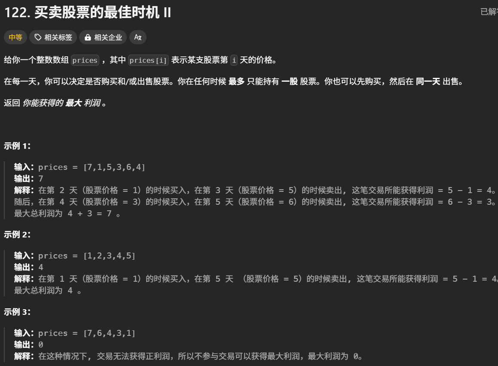

- 集合：到第i天持有/不持有股票所获得的利润
- 属性：最大值
- 状态计算：分成dp\[i][0]和dp\[i][1]
- dp\[i][0]：这天交易完不持有，是因为：
  - 前一天交易完就不持有，则是dp\[i-1][0]
  - 前一天交易完持有但是今天给卖了，则是dp\[i-1][1]+v[i]
- dp\[i][1]：这天交易完持有，是因为：
  - 前一天交易完就持有，则是dp\[i-1][1]
  - 前一天交易完不持有，但是今天买了，则是dp\[i-1][0]-v[i]

```
class Solution {
	public:
		int dp[10010][2]; 
		int maxProfit(vector<int>& prices) {
			dp[0][1] = -prices[0];
			dp[0][0] = 0;
			for(int i=1;i<prices.size();i++){
				dp[i][0] = max(dp[i-1][0], dp[i-1][1]+prices[i]);
				dp[i][1] = max(dp[i-1][1], dp[i-1][0]-prices[i]);
				cout<<i<<' '<<dp[i][0]<<' '<<dp[i][1]<<endl;
			}
			int n = prices.size()-1;
			return dp[n][0];
		}
};
```

## 买入股票的最佳时机Ⅲ

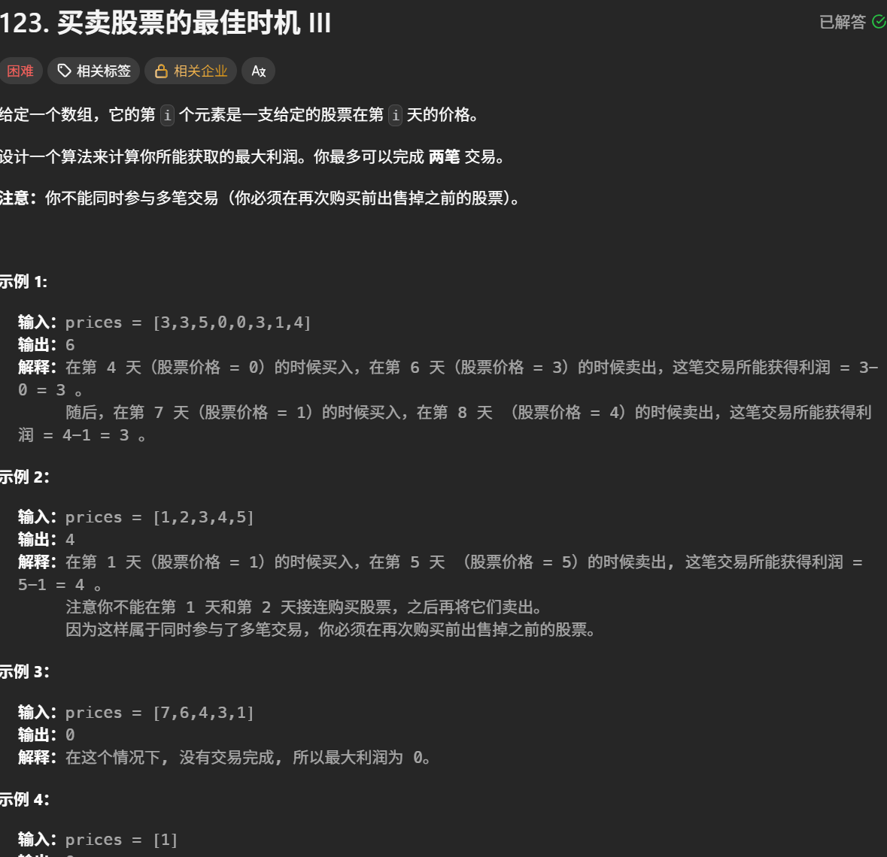

```
class Solution {
	public:
		int dp[100010][5]; 
		int maxProfit(vector<int>& prices) {
			dp[0][0] = 0;
			dp[0][1] = -prices[0];
			dp[0][2] = 0;
			dp[0][3] = -prices[0];
            dp[0][4] = 0;
			for(int i=1;i<prices.size();i++){
				dp[i][0] = dp[i-1][0];
				dp[i][1] = max(dp[i-1][1], dp[i-1][0]-prices[i]);
				dp[i][2] = max(dp[i-1][2], dp[i-1][1]+prices[i]);
				dp[i][3] = max(dp[i-1][3], dp[i-1][2]-prices[i]);
				dp[i][4] = max(dp[i-1][4], dp[i-1][3]+prices[i]);
			}
			int n = prices.size()-1;
			int ans = max(dp[n][2], dp[n][4]);
			return ans;
		}
};
```

注意初始化的时候dp\[0][3]和dp\[0][4]是**反复买卖当前天股票**得到的

## 买入股票的最佳时机Ⅳ

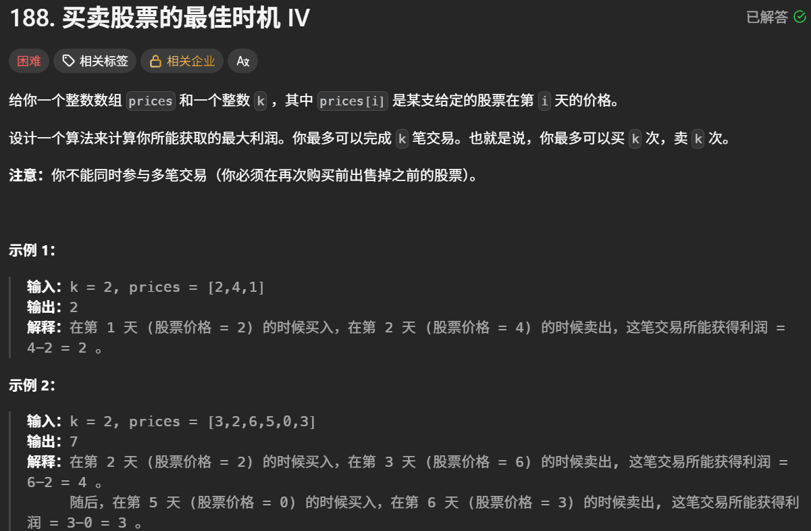

```
int dp[1010][1010];
class Solution {
	public:
		
		int maxProfit(int k, vector<int>& prices) {
			for(int i=1; i<=2*k; i++) {
				if(i%2==0) {
					dp[0][i] = 0;
				} else {
					dp[0][i] = -prices[0];
				}
			}
			for(int i=1; i<prices.size(); i++) {
				dp[i][0] = dp[i-1][0];
				for(int j=1; j<=2*k; j++) {
					if(j%2!=0) {
						dp[i][j] = max(dp[i-1][j], dp[i-1][j-1]-prices[i]);
					} else {
						dp[i][j] = max(dp[i-1][j], dp[i-1][j-1]+prices[i]);
					}
				}
			}
			int n = prices.size()-1;
			int ans = 0;
			for(int i=2;i<=2*k;i=i+2){
				ans = max(ans, dp[n][i]);
			}
			return ans;
		}
};
```

## 买入股票最佳时机+冷冻期

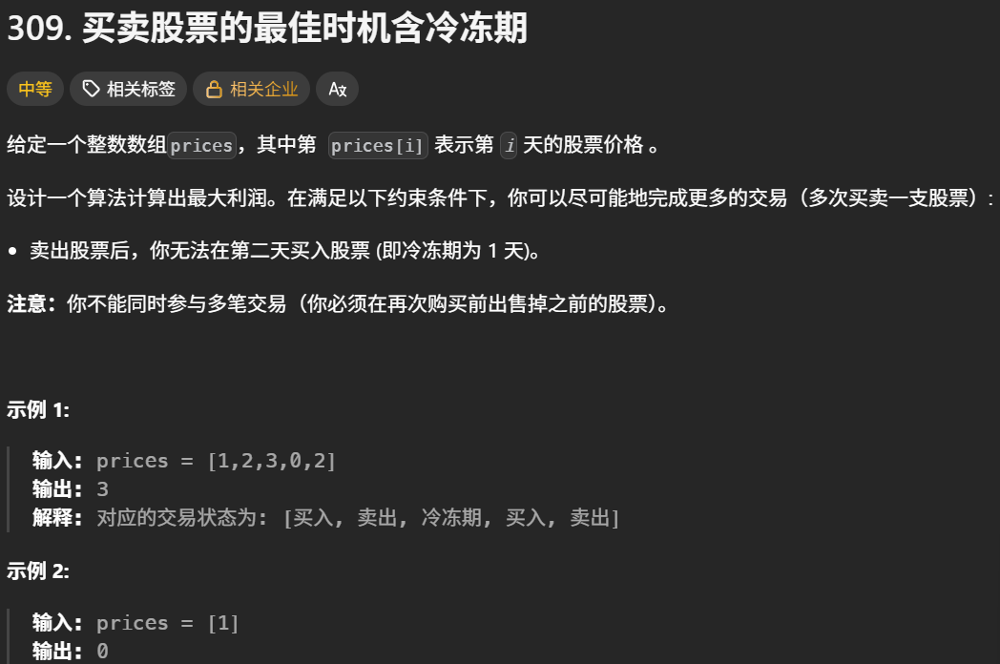

dp\[i][j]表示

- j=1表示持有股票
- j=2表示不持有股票，今天没卖，昨天没卖
- j=3表示不持有股票，今天卖的
- j=4表示不持有股票，昨天卖的

```
dp[i][1] = max(dp[i-1][1], dp[i-1][2]+p[i], dp[i-1][4]+p[i])
dp[i][2] = max(dp[i-1][2], dp[i-1][4])
dp[i][3] = dp[i-1][1]+p[i]
dp[i][4] = dp[i-1][3]
```

## 整数划分

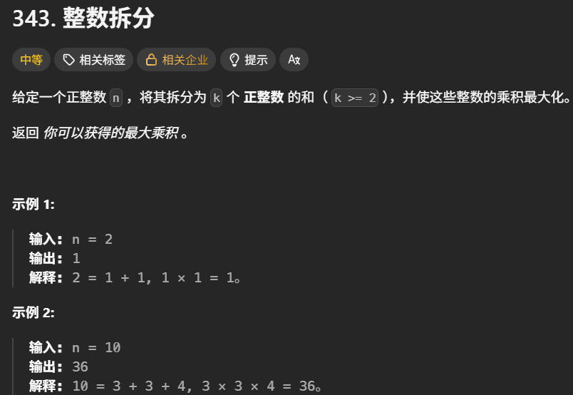

```
int dp[100];
class Solution {
	public:
		int integerBreak(int n) {
			dp[2]=1;
			for(int i=3; i<=n; i++) {
				for(int j=1; j<=i-1; j++) {
					dp[i] = max(dp[i], j*(i-j));
					dp[i] = max(dp[i], j*dp[i-j]);
				}
			}
			return dp[n];
		}
};
```

动规五部曲，分析如下：

1. 确定dp数组（dp table）以及下标的含义

dp[i]：分拆数字i，可以得到的最大乘积为dp[i]。

dp[i]的定义将贯彻整个解题过程，下面哪一步想不懂了，就想想dp[i]究竟表示的是啥！

1. 确定递推公式

可以想 dp[i]最大乘积是怎么得到的呢？

其实可以从1遍历j，然后有两种渠道得到dp[i].

一个是j * (i - j) 直接相乘。

一个是j * dp[i - j]，相当于是拆分(i - j)，对这个拆分不理解的话，可以回想dp数组的定义。

**那有同学问了，j怎么就不拆分呢？**

j是从1开始遍历，拆分j的情况，在遍历j的过程中其实都计算过了。那么从1遍历j，比较(i - j) * j和dp[i - j] * j 取最大的。

用完全背包不好搞，因为很难处理**k最少是2，也就是最少分两个数字**

- 为什么不是dp[j]\*dp[i-j]，这样实际上就是对i这个数字分了至少四次。2次的情况j\*(i-j)包含了。三次的情况就要用j * dp[i - j]。而实际上，它包含了分三次及以上的情况

## 单词拆分

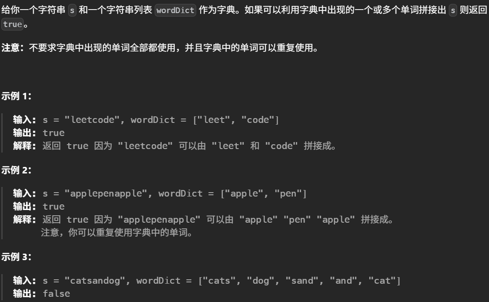

可以类比成背包问题：

- 集合表示：dp\[i]表示0到 i 的元素中，是否能分割
- 状态计算（按元素索引分割集合）：
  - 0~i-1
  - 0 和 1~i-1（长度是i-1）
  - 0~1 和 2~i-1（长度是i-2）
  - ...
  - 0~i-3 和 i-2~i-1（长度是2）
  - 0~i-2 和 i-1（长度是1）

```
class Solution {
	public:
		bool dp[500];
		bool wordBreak(string s, vector<string>& wordDict) {
			unordered_map<string, bool> dic;
			for(int i=0; i<wordDict.size(); i++) {
				dic[wordDict[i]]=true;
			}
			for(int i=0; i<s.size(); i++) {
				string a = s.substr(0, i+1);
				if(dic[a]==true) {
					dp[i]=true;
				}
			}
			for(int i=1; i<s.size(); i++) {
				for(int j=i-1; j>=0; j--) {
					bool temp;
					if(dp[j]==true) {
						string b = s.substr(j+1, i-j);
						temp = dic[b];
						dp[i] = dp[i] || temp;
					}
				}
				cout<<dp[i]<<endl;
			}
			int n = s.size()-1;
			return dp[n];
		}
};
```

## 分割等和子集（背包问题）

用0到i种物品，装到j这么多大小，能否实现？

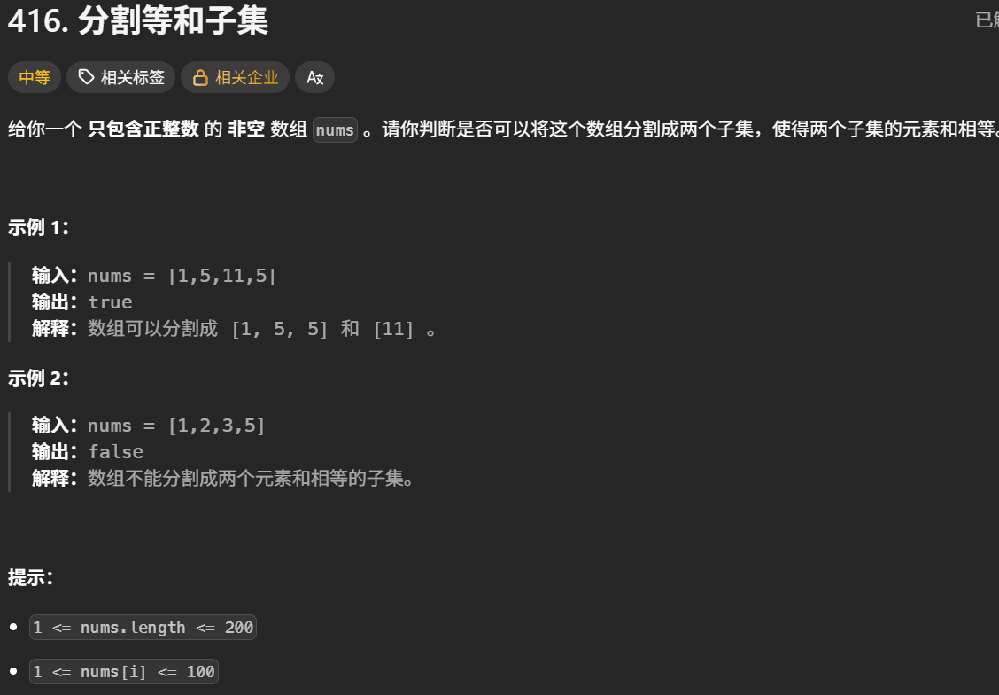

可以类比成背包问题：

- 集合表示：dp\[i][j]表示1到 i 的元素中，是否恰好能凑成 j （bool数组）
- 状态计算（一般是看最后一步）：
  - 第 i 个数不选，那么就是 dp\[i-1][j]
  - 第 i 个数选：
    - 如果nums[i] <= j，那么就是dp\[i-1][j-nums[i]]

```
int dp[1000][50000]; 
class Solution {
	public:
		bool canPartition(vector<int>& nums) {
			int sum=0;
			for(int i=0;i<nums.size();i++){
				sum+=nums[i];
			}
			if(sum%2!=0){
				return false;
			}
			for(int i=0;i<=nums.size();i++){
				dp[i][0]=true;
			}
			for(int i=1;i<=nums.size();i++){
				for(int j=1;j<=sum/2;j++){
					dp[i][j] = dp[i-1][j];
					if(j>=nums[i-1]){
						dp[i][j] = dp[i][j]||dp[i-1][j-nums[i-1]];
					}
				}
			}
			int n = nums.size();
			return dp[n][sum/2];
		}
};
```

- ```
  dp[i][0]=true;用任何数字凑0都是能凑出来的（啥也不选就行）
  ```

- ```
  dp[0][i]=false：不用数字能凑出来谁？
  ```

- ```
  一定在if前面先dp[i][j] = dp[i-1][j];。否则会出错的！！
  ```

## 视频拼接


```
int dp[200];
class Solution {
	public:
		int videoStitching(vector<vector<int>>& clips, int time) {
			for(int i=0; i<=time; i++) {
				dp[i]=1e9;
				for(int j=0; j<clips.size(); j++) {
					int l=clips[j][0];
					int r=clips[j][1];
					if(i>=l && i<=r) {
						if(l==0) {
							dp[i]=1;
						} else {
							dp[i] = min(dp[i], dp[l]+1);
						}
					}
				}
			}
			if(dp[time]==1e9){
				return -1;
			}
			return dp[time];
		}
};
```

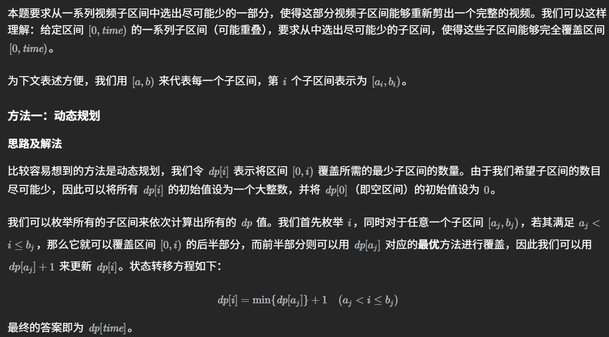

## 灌溉花园的最少水龙头数

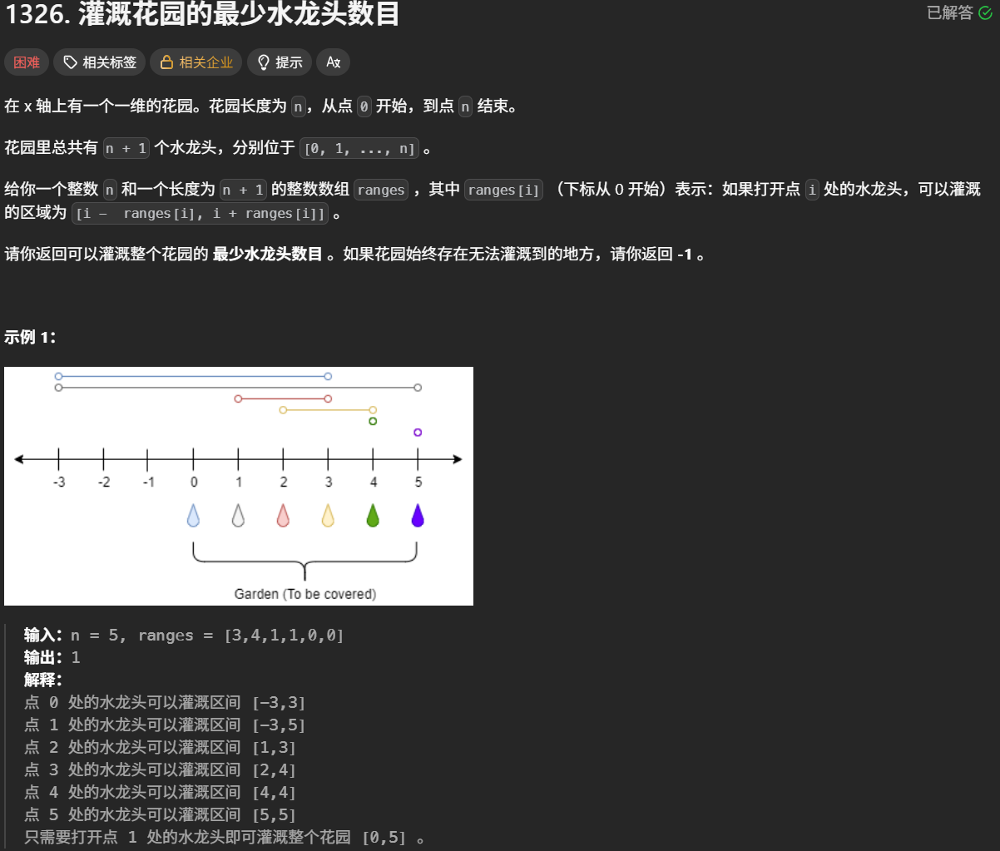

```
int dp[10010];
class Solution {
	public:
		int minTaps(int n, vector<int>& ranges) {
			vector<vector<int>> qz;
			for(int i=0; i<ranges.size(); i++) {
				vector<int> temp = {i-ranges[i], i+ranges[i]};
				qz.push_back(temp);
			}
			for(int i=0; i<=n; i++) {
				dp[i] = 1e9;
				for(int j=0; j<qz.size(); j++) {
					int l = qz[j][0];
					int r = qz[j][1];
					if(i>=l && i<=r) {
						if(l<=0) {
							dp[i] = 1;
						} else {
							dp[i] = min(dp[i], 1+dp[l]);
						}
					}
				}
			}
			if(dp[n]==1e9) {
				return -1;
			} else {
				return dp[n];
			}
		}
};
```

## 最大平均值和的分组

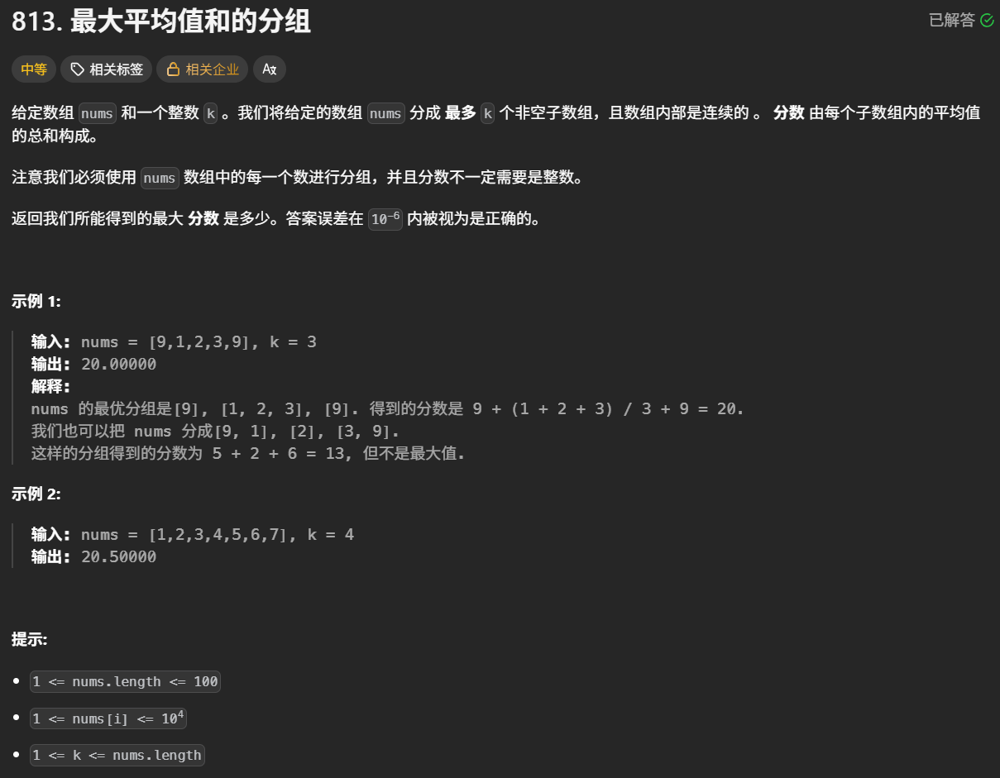

```
double qz[10010];
double dp[10010][110];
class Solution {
	public:

		double largestSumOfAverages(vector<int>& nums, int k) {
			int n = nums.size();
			for(int i=0; i<nums.size(); i++) {
				qz[i+1] = qz[i]+nums[i];
			}
			nums.insert(nums.begin(), 0);
			for(int i=1;i<=n;i++){
				dp[i][1] = qz[i]/i;
			} 
			for(int i=2; i<=n; i++) {
				for(int j=2; j<=k; j++) {
					for(int t=i-1; t>=1; t--) {
						double temp = qz[i] - qz[t];
						dp[i][j] = max(dp[i][j], dp[i][j-1]);
						dp[i][j] = max(dp[i][j], dp[t][j-1]+temp/(i-t));
					}
				}
			}
			return dp[n][k];
		}
};
int main() {
	Solution a;
	vector<int> nums = {1, 2, 3, 4, 5, 6, 7};
	int k = 4;
	int ans = a.largestSumOfAverages(nums, k);
}
```

- dp\[i][j]表示从1到i，分j组，能获得的最大分数

- dp\[i][j]怎么求？在把区间1到i分割一下，分割成1到k和k+1到i。则有：

  ```
  dp[i][j] = dp[k][j-1] + (nums[k+1]+nums[k+2]+...+nums[i])/(i-k)
  ```

  我们遍历所有的k，最后取算出来的值最大的那个

- 初始化如图，初始化只有1组的情况。

## 划分数组得到的最小XOR

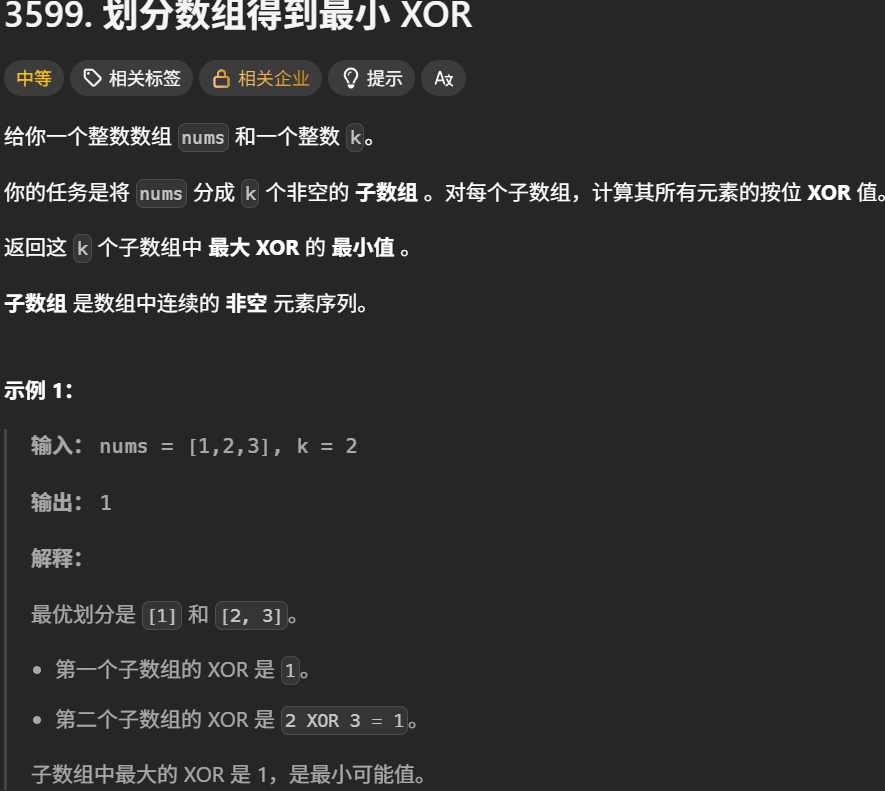

```
class Solution {
	public:
		int dp[500][500];
		int minXor(vector<int>& nums, int k) {
			int n = nums.size();
			nums.insert(nums.begin(), 0);
			for(int i=1; i<nums.size(); i++) {
				dp[i][1]=dp[i-1][1]^nums[i];
			}

			for(int i=2; i<nums.size(); i++) {
				for(int j=2; j<=k; j++) {
					dp[i][j]=2e9;
					for(int t=i; t>=j; t--) {
						int temp = max(dp[t-1][j-1], dp[i][1]^dp[t-1][1]);
						dp[i][j]=min(dp[i][j], temp);
					}
				}
			}
			return dp[n][k];
		}
};

```

```
dp[i][j]表示前0到i，分割成j个区间，得到的最小XOR
注意边界
注意：异或运算的逆运算是异或运算
```

## 合并石子(区间线性dp)

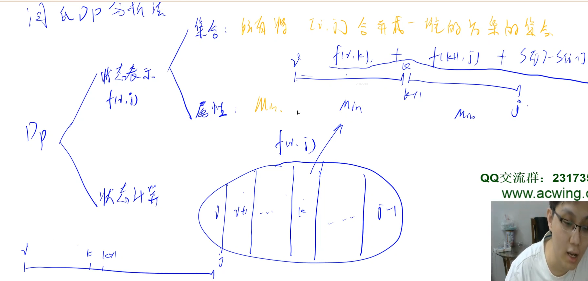

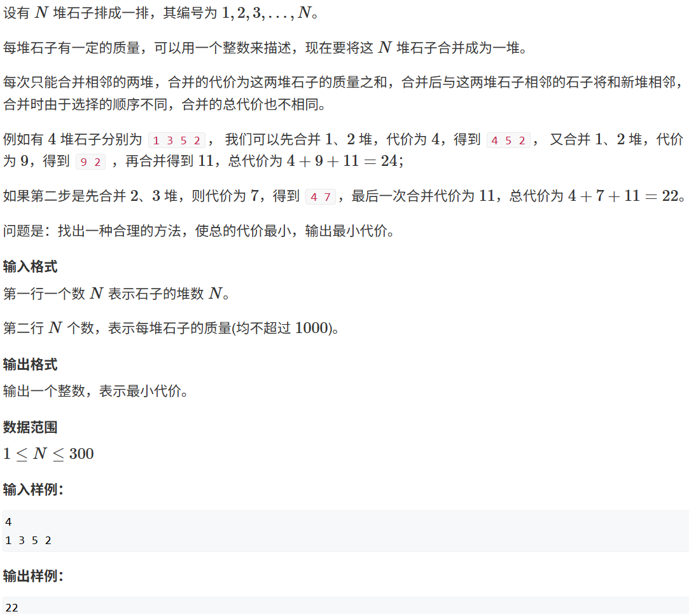

- 集合：合并区间[i, j]的所有方法所用的体力
- 属性：体力的最小值
- 状态计算：怎么计算f(i, j)？考虑合并区间i到j的方式实际上跟中间选取的分界点有关系。
  - 对于中间点k，实际上就是f(i, k) + f(k+1, j) + $\sum_{i}^{j}$
  - 遍历所有的k，k的取值从i到j-1，**i的时候也就是i和[i+1,j]**

```
int dp[400][400];
int qz[400];
int main() {
	int n;
	cin>>n;
	vector<int> nums;
	nums.insert(nums.begin(), 0);
	for(int i=1; i<=n; i++) {
		int a;
		cin>>a;
		nums.push_back(a);
		qz[i]=qz[i-1]+a;
	}
	for(int len=2; len<=n; len++) {
		for(int i=1; i+len-1<=n; i++) {
			int j = i+len-1;
			dp[i][j]=1e9;
			for(int k=i; k<j; k++) {
				dp[i][j]=min(dp[i][j], qz[j]-qz[i-1]+dp[i][k]+dp[k+1][j]);
			}
		}
	}
	cout<<dp[1][n];
}
```

以上代码所有存储有效元素的部分都是从下标为1开始

注意，一般的区间dp都是先遍历区间长度，再遍历左端点。

```
for(int len=2; len<=n; len++) {
		// 再遍历区间左端点
		for(int i=1; i+len-1<=n; i++) {
```

注意dp\[i][i]是没法合并的，因此需要的体力也就是0

## 最后一块石头（不是区间dp！！！）

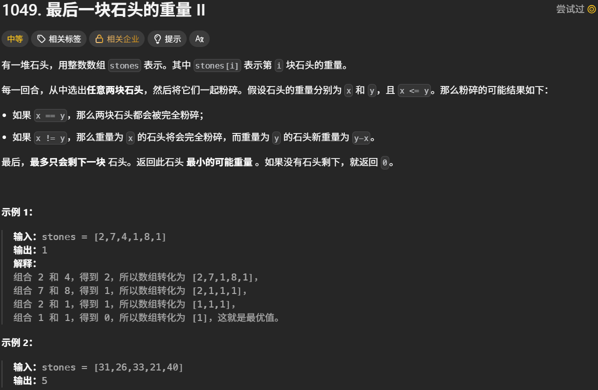

```
bool dp[50][5000];
class Solution {
	public:
		int lastStoneWeightII(vector<int>& stones) {
			int sum = 0;
			for(int i=0; i<stones.size(); i++) {
				sum+=stones[i];
				dp[i][0]=true;
			}
			int max_ele=0;
			for(int i=1; i<=stones.size(); i++) {
				for(int j=1; j<=sum/2; j++) {
					dp[i][j] = dp[i-1][j];
					if(j-stones[i-1]>=0){
						dp[i][j] = dp[i][j] || dp[i-1][j-stones[i-1]];
					}
					if(dp[i][j]==true){
						max_ele = j;
					}
				}
			}
			return sum-max_ele-max_ele;
		}
};

```

- dp\[i][j]表示前1到i能否凑出j
- 尽可能凑sum/2
- 答案其实就是stones中元素乘上1或者-1再求和得到的

优化后的dp

```
class Solution {
	public:
		bool dp[5000];
		int lastStoneWeightII(vector<int>& stones) {
			int sum = 0;
			for(int i=0; i<stones.size(); i++) {
				sum+=stones[i];
				dp[0]=true;
			}
			int max_ele=0;
			for(int i=1; i<=stones.size(); i++) {
				for(int j=sum/2; j>=0; j--) {
					if(j-stones[i-1]>=0) {
						dp[j] = dp[j] || dp[j-stones[i-1]];
					}
				}
			}
			for(int j=sum/2; j>=0; j--) {
				if(dp[j]==true) {
					max_ele = j;
					break;
				}
			}
			return sum-max_ele-max_ele;
		}
};

```

注意，我们枚举max_ele = j;的时候，是在第i的情况下的dp[j]，所以要等循环都算完，再开个循环计算

## 目标和

用0到i种物品，装到j这么多大小，有几种方法？

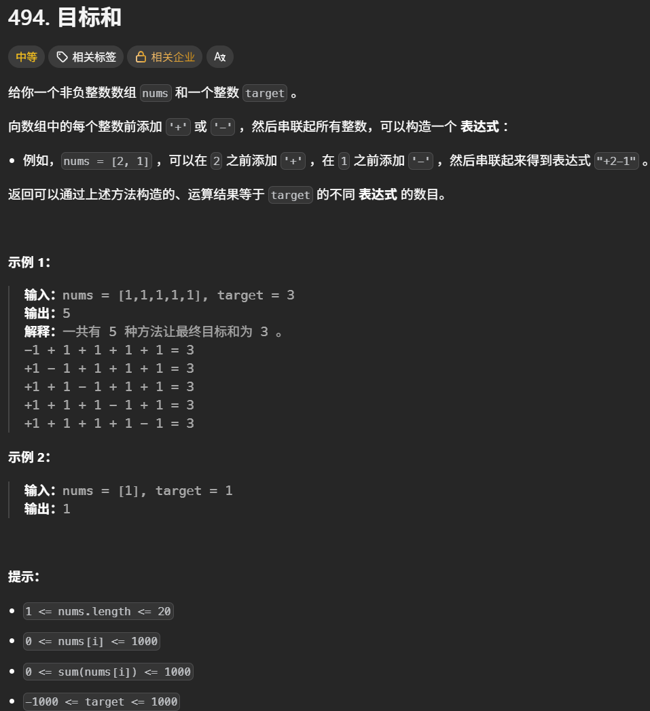

看到这个数据量，就能想到回溯算法

```
int dp[100][10010];
class Solution {
	public:
		
		int findTargetSumWays(vector<int>& nums, int target) {
			int sum=0;
			for(int i=0; i<nums.size(); i++) {
				sum+=nums[i];
			}
			int x = target+sum;
			if(x%2!=0 || target>sum || target<-sum) {
				return 0;
			}
			int num0=0;
			dp[0][0]=1;
			for(int i=1; i<=nums.size(); i++) {
				if(nums[i-1]==0) {
					num0++;
				}
				dp[i][0] = (int)pow(2, num0);
			}
			x=x/2;
			for(int i=1; i<=nums.size(); i++) {
				for(int j=1; j<=x; j++) {
					dp[i][j] = dp[i-1][j];
					if(j>=nums[i-1]) {
						dp[i][j]+=dp[i-1][-nums[i-1]];
					}
				}
			}
			int n=nums.size();
			return dp[n][x];
		}
};
int main(){
	Solution a;
	vector<int> nums = {1,1,1,1,1};
	int target = 3;
	int ans = a.findTargetSumWays(nums, target);
	cout<<ans<<endl;
}
```

下面展示dp方法

首先，我们要凑target。我们需要把一些数字变为相反数，一些是保留。我们假设不变号的部分最后求和是x，那么变号的部分他们变完再求和就是x-sum。也就是我们有

- target = x+x-sum，进而推出我们的x=(target+sum)/2（必须能整除。。）

所以，实际上问题就是我们要看nums里的数字能凑成x的有多少种方法？这就是经典的背包问题了，即求dp[nums.size()]\[x];

```
int dp[100][50010];
class Solution {
	public:
		int findTargetSumWays(vector<int>& nums, int target) {
			int sum = 0;
			int numzero=0;
			for(int i=0; i<nums.size(); i++) {
				if(nums[i]==0) {
					numzero++;
				}
				dp[i+1][0] = (int)pow(2, numzero);
				sum+=nums[i];
			}
			dp[0][0]=1;
			int x = (sum+target)/2;
			if((sum+target)%2!=0 || target>sum || x<0) {
				return 0;
			}
			for(int i=1; i<=nums.size(); i++) {
				for(int j=1; j<=x; j++) {
					dp[i][j] = dp[i-1][j];
					if(j>=nums[i-1]) {
						dp[i][j]+=dp[i-1][j-nums[i-1]];
					}
				}
			}
			int n = nums.size();
			return dp[n][x];
		}
};
```

本题最重要的是初始化

- 可以发现，如果把dp表写出来，其实dp\[i][j]依赖的是上和左上的元素，因此我们需要初始化第一行和第一列
- 用0个物品装0到x的容量，有0种办法
- 用0到n-1种物品装0的容量，如果0到i这些物品中没有0，那么就有一种办法：啥也不装。如果有0，那么就是2的零的个数次方种办法

```
dp[i+1][0] = (int)pow(2, numzero);
```

这块有学问的

```
int dp[50010];
class Solution {
	public:
		int findTargetSumWays(vector<int>& nums, int target) {
			memset(dp, 0, sizeof(dp)); // 修改2：初始化dp数组
			int sum = 0;
			int numzero = 0;
			for(int i=0; i<nums.size(); i++) {
				if(nums[i]==0) {
					numzero++;
				}
				sum += nums[i];
			}
			dp[0] = 1;
			int x = (sum+target)/2;
			if((sum+target)%2!=0 || target>sum || x<0) { // 修改3：添加x>1000检查
				return 0;
			}
			for(int i=1; i<=nums.size(); i++) {
				for(int j=x; j>=0; j--) {
					if(j>=nums[i-1]) {
						dp[j]+=dp[j-nums[i-1]];
					}
				}
			}
			return dp[x];
		}
};
```

优化的dp如上，dp[0]其实就是dp[0]\[0]，因此我们dp[i]\[0]都还没算呢，所以遍历j的时候一定要

```
for(int j=x; j>=0; j--)
```

这非常重要！

## 1和0

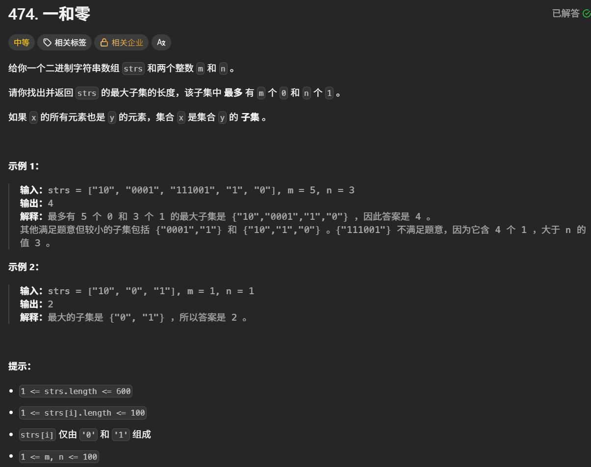

```
int dp[1000][110][110];
class Solution {
	public:
		int findMaxForm(vector<string>& strs, int m, int n) {
			vector<vector<int>> nums;
			for(int i=0; i<strs.size(); i++) {
				string temp = strs[i];
				int num_1=0;
				int num_0=0;
				for(int j=0; j<temp.size(); j++) {
					if(temp[j]=='1') {
						num_1++;
					} else {
						num_0++;
					}
				}
				vector<int> a = {num_0, num_1};
				nums.push_back(a);
			}
			for(int i=1; i<=nums.size(); i++) {
				for(int j=0; j<=m; j++) {
					for(int k=0; k<=n; k++) {
						dp[i][j][k] = dp[i-1][j][k];
						if(j>=nums[i-1][0] && k>=nums[i-1][1]) {
							dp[i][j][k] = max(dp[i][j][k], 1+dp[i-1][j-nums[i-1][0]][k-nums[i-1][1]]);
						}
					}
				}
			}
			int t = nums.size();
			return dp[t][m][n];
		}
};
int main() {
	Solution a;
	vector<string> strs = {"10", "0", "1"};
	int m = 1;
	int n = 1;
	int ans = a.findMaxForm(strs, m, n);
	cout<<ans<<endl;
}
```

```
dp[i][j][k]表示前i组里面，0的个数不超过j，1的个数不超过k的最大组合数
dp[i][j][k] = max(dp[i][j][k], 1+dp[i-1][j-nums[i-1][0]][k-nums[i-1][1]]);
```

注意j和k的遍历起点。

对任意的i，dp[i]\[0][0]表示用前组合构成0和1的个数都不超过0，那组合的最大长度就是0了，一个也别选了

## 01背包

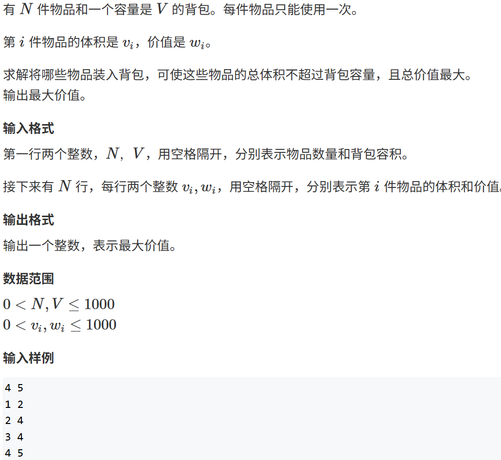

记录 f(i, j)为：可以从0到 i 个物品中选择，容量最大为 j 的情况下，价值的最大值。

将集合划分，可以看到f(i, j)可以分为

1、 第 i 个物品不选
$$
f(i, j) = f(i-1, j)
$$
2、 第 i 个物品选且能选
$$
f(i, j) = \max(f(i-1, j), f(i-1, j-v_i) + w_i)
$$

```cpp
int v[2000];
int w[2000];
int dp[2000][2000];
int main() {
	int sl, tj;
	cin>>sl>>tj;
	for(int i=1; i<=sl; i++) {
		scanf("%d %d", &v[i], &w[i]);
	}
	for(int i=1; i<=sl; i++) {
		for(int j=1; j<=tj; j++) {
			dp[i][j] = dp[i-1][j];
			if(j>=v[i]){
				dp[i][j] = max(dp[i][j], dp[i-1][j-v[i]]+w[i]);
			}
		}
	}
	cout<<dp[sl][tj];
}
```

先遍历每一个物品，然后在物品固定后，遍历体积（想想那个表格，先遍历一行的每一列，再遍历每一行）

```
优化复杂度
```

```
int v[2000];
int w[2000];
int dp[2000];
int main() {
	int sl, tj;
	cin>>sl>>tj;
	for(int i=1; i<=sl; i++) {
		scanf("%d %d", &v[i], &w[i]);
	}
	for(int i=0; i<=sl; i++) {
		for(int j=tj; j>=1; j--) {
			if(j>=v[i]) {
				dp[j] = max(dp[j], dp[j-v[i]]+w[i]);
			}
		}
	}
	cout<<dp[tj];
}
```

背包问题的优化只是再原代码上做出改动，大概逻辑不变。为什么要倒过来遍历j，因为如果正序遍历，由于j - v[i] < j，当我们更新f[j]时我们已经把f[j - v[i]]更新了。也就是说我们使用的是第[i]个循环里面的f[j - v[i]]，而我们实际要用的是第[i-1]的个循环里面的f[j - v[i]]

这么写的话，i要从0开始了

## 完全背包问题（物品有无数个）

记录 f(i, j)为：可以从0到 i 个物品中选择，容量最大为 j 的情况下，价值的最大值。

将集合划分，可以看到f(i, j)可以分为

1、第 i 个物品不选
$$
f(i, j) = f(i-1, j)
$$
2、第 i 个物品选1个

3、第 i 个物品选2个

。。。。

k+1、第 i 个物选k个
$$
f(i, j) = max(f(i-1, j), f(i-1, j-k*v_i)+k*w_i)
$$
**实际上，综合看来f(i, j)等于下面的式子**
$$
f(i, j) = max\{f(i-1, j), \\f(i-1, j-v_i)+w_i, f(i-1, j-2*v_i)+2*w_i,\\...,\\f(i-1, j-k*v_i)+k*w_i),\\...\}
$$
**做一个变换，令 j = t - v_i 有**
$$
f(i, t-v_i) = max\{f(i-1, t-v_i), \\f(i-1, t-2*v_i)+w_i, f(i-1, t-3*v_i)+2*w_i,\\...,\\f(i-1, t-(k+1)*v_i)+k*w_i),\\...\}
$$
**所以就有：**
$$
f(i, j) = max\{f(i-1, j), f(i, j-v_i)+w_i\}
$$

```c
int f[1001][1001];
int v[1001], w[1001];
int main() {
    int N, V;
    scanf("%d %d", &N, &V);
    
    for (int i = 1; i <= N; i++) {
        scanf("%d %d", &v[i], &w[i]);
    }
    
    for (int i = 1; i <= N; i++) {
        for (int j = 0; j <= V; j++) {
            f[i][j] = f[i - 1][j];
            if (j >= v[i]) {
                f[i][j] = max(f[i][j], f[i][j - v[i]] + w[i]);
            }
        }
    }
    
    printf("%d", f[N][V]);
    return 0;
}
```

```
int v[1010], w[1010];
int dp[1010];
int main() {
	int N,V;
	cin>>N>>V;
	for(int i=1; i<=N; i++) {
		scanf("%d %d", &v[i], &w[i]);
	}
	for(int i=1; i<=N; i++) {
		for(int j=1; j<=V; j++) {
			if(j-v[i]>=0) {
				dp[j] = max(dp[j], dp[j-v[i]]+w[i]);
			}
		}
	}
	cout<<dp[V];
}
```

## 完全平方数

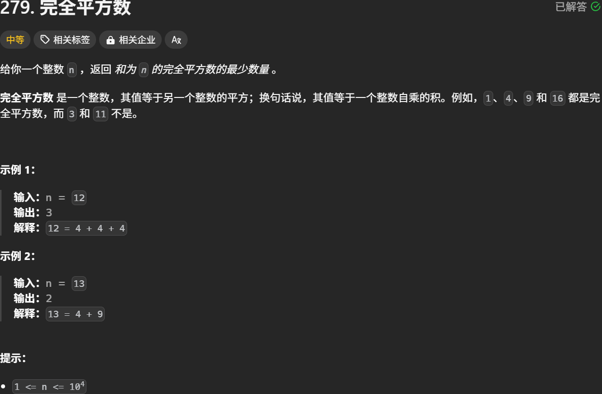

```
int dp[10010];
class Solution {
	public:
		int numSquares(int n) {
			for(int i=0; i<=n; i++) {
				if(i==0) {
					dp[0] = 0;
					continue;
				}
				if(i==1) {
					dp[1] =1;
					continue;
				}
				dp[i] = 99999;
				for(int j=0; j*j<=i; j++) {
					dp[i] = min(dp[i], 1 + dp[i-j*j]);
				}
			}
			return dp[n];
		}
};
```

dp 表示 i 这个数字最少需要多少完全平方数凑出来

对于每个数字 i ，dp[i]的求法是：

- 我们知道，每个i，能凑出它的完全平方数一定是在1到\sqrt(i) 这个范围内的，因此：集合的划分是从**1到 \sqrt(i)向下取整** 这个范围内
- 对于每个划分，我们都需要考虑当前dp[i]和 1+dp[i-j*j]的大小，取小者

其实这个题是一个完全背包问题，解法如下：

```
int dp[10010];
class Solution {
	public:
		int numSquares(int n) {
			vector<int> nums;
			for(int i=1; i*i<=n; i++) {
				nums.push_back(i*i);
			}
			memset(dp, 10010, sizeof dp);
			dp[0] = 0;
			for(int i=1; i<=nums.size(); i++) {
				for(int j=0; j<=n; j++) {
					if(j>=nums[i-1]) {
						dp[j] = min(dp[j], dp[j-nums[i-1]]+1);
					}
				}
			}
			return dp[n];
		}
};
```

## 零钱兑换Ⅱ（无顺序——组合）

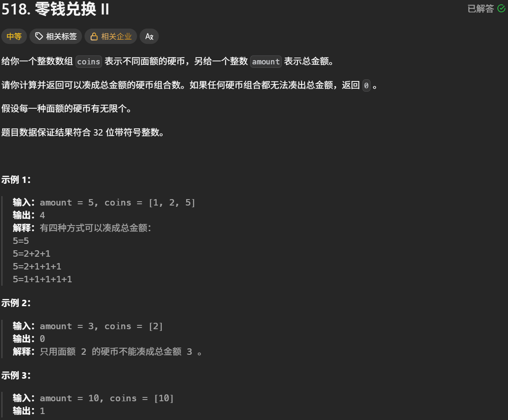

```
class Solution {
	public:
        unsigned long long dp[5010];
		int change(int amount, vector<int>& coins) {
			int n = coins.size();
			dp[0]=1;
			for(int i=1; i<=n; i++) {
				for(int j=0; j<=amount; j++) {
					if(j-coins[i-1]>=0) {
						dp[j]=dp[j]+dp[j-coins[i-1]];
					}
				}
			}
			return dp[amount];
		}
};
```

## 组合总和4（有顺序——排列）

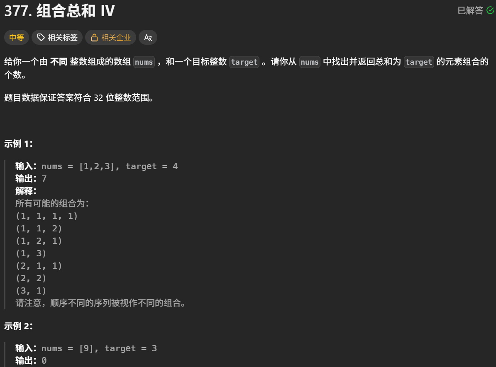

```
class Solution {
	public:
		unsigned long long dp[5010];
		int combinationSum4(vector<int>& nums, int target) {
			memset(dp, 0, sizeof dp);
			dp[0] = 1;
			int n = nums.size();
			for(int j=0; j<=target; j++) {
				for(int i=1; i<=n; i++) {
					if(j>=nums[i-1]) {
						dp[j] = dp[j]+dp[j-nums[i-1]];
					}
					cout<<dp[j]<<' ';
				}
				cout<<endl;
			}
			return dp[target];
		}
};
```

调换顺序就行

```
这种写法，由于我们计算dp[j]的时候需要dp[j-x]，而这个dp[j-x]只包含了一部分i，i尾部还没遍历到————求的是 组合
for:i
   for:j
  
这种写法，由于我们计算dp[j]的时候需要dp[j-x]，而这个dp[j-x]包含所有的i，i已被全部遍历完————求的是 排列
for:j
   for:i
```

## 多重背包问题Ⅰ（每个物品都有数量限制）

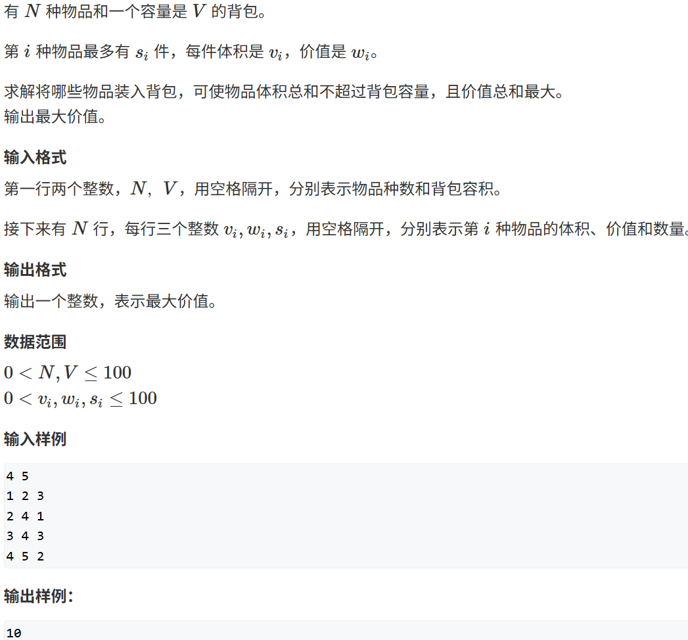

```cpp
int f[1001][1001];
int v[1001], w[1001], s[1001];

int main() {
    int N, V;
    scanf("%d %d", &N, &V);
    
    for (int i = 1; i <= N; i++) {
        scanf("%d %d %d", &v[i], &w[i], &s[i]);
    }
    
    for (int i = 1; i <= N; i++) {
        for (int j = 0; j <= V; j++) {
            f[i][j] = f[i - 1][j];
            for (int k = 1; k <= s[i]; k++) {
                if (j - k * v[i] < 0) {
                    break;
                }
                f[i][j] = max(f[i][j], f[i - 1][j - k * v[i]] + k * w[i]);
            }
        }
    }
    
    printf("%d", f[N][V]);
    return 0;
}
```

## 分组背包问题

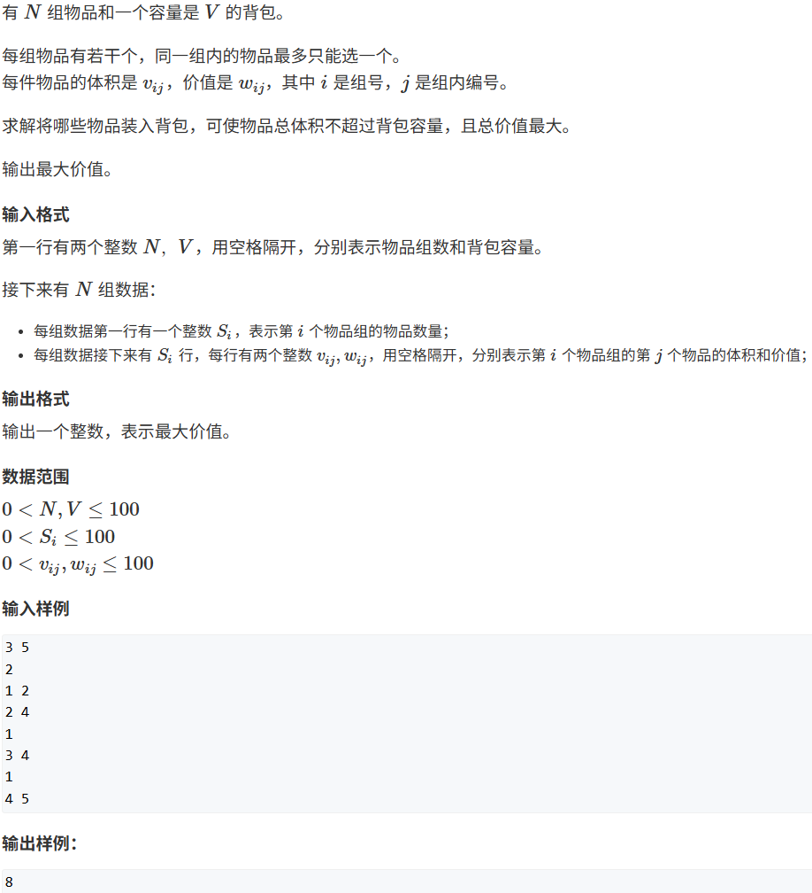

```cpp
int v[110][110];  // 体积数组
int w[110][110];  // 价值数组
int dp[110][110]; // DP数组
int s[110];       // 每组物品数量

int main() {
    int N, V;
    scanf("%d %d", &N, &V);
    
    // 输入数据
    for (int i = 1; i <= N; i++) {
        scanf("%d", &s[i]);
        for (int j = 1; j <= s[i]; j++) {
            scanf("%d %d", &v[i][j], &w[i][j]);
        }
    }
    
    // 分组背包DP
    for (int i = 1; i <= N; i++) {
        for (int j = 1; j <= V; j++) {
            dp[i][j] = dp[i - 1][j]; // 不选当前组的物品
            for (int k = 1; k <= s[i]; k++) {
                if (j >= v[i][k]) {
                    // 选当前组的第k个物品
                    dp[i][j] = max(dp[i][j], dp[i - 1][j - v[i][k]] + w[i][k]);
                }
            }
        }
    }
    
    cout << dp[N][V];
    return 0;
}
```

## 数字三角形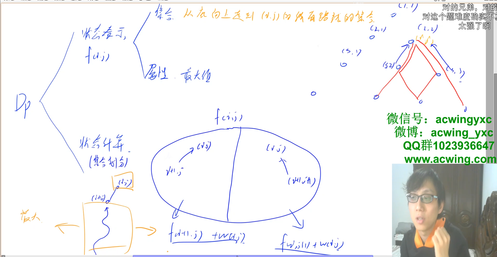

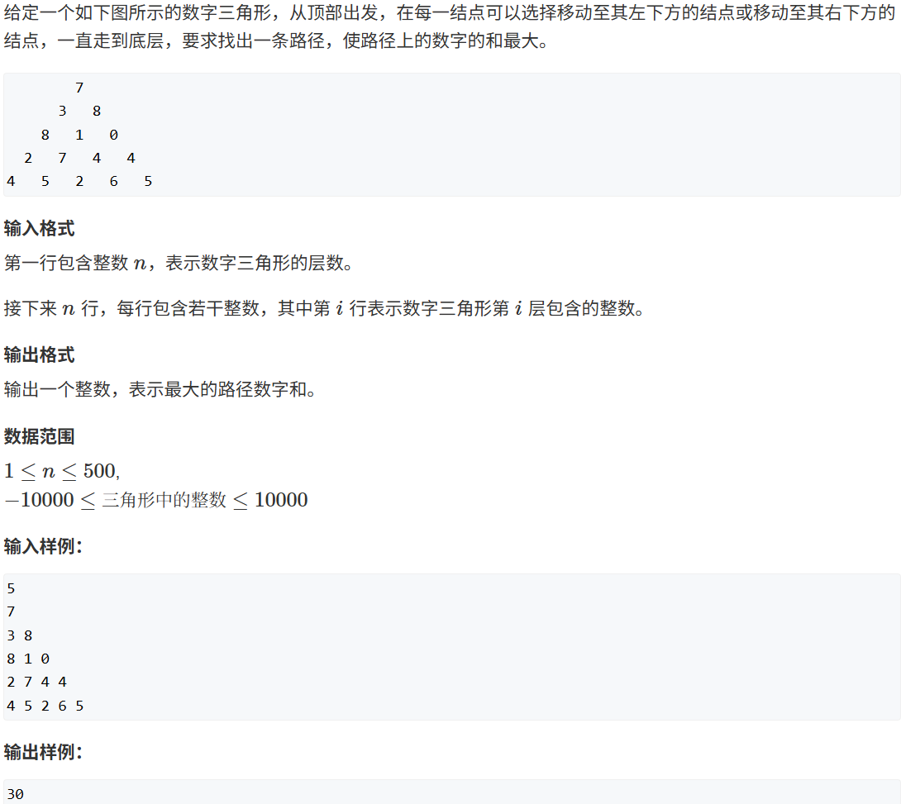

这里

- 集合表示：从最底端走到(i, j)这个点的所有路径的集合
- f(i, j)表示集合里“最大值”这一个属性（属性大致上有：min、max、个数）
- 状态计算（一般是看最后一步）：(i, j)这个点会被怎么到达？即：要么从(i+1, j)上去，要么从(i+1, j+1)上去

```cpp
int num[510][510];
int dp[510][510];
int main() {
	int n;
	cin>>n;
	for(int i=1; i<=n; i++) {
		for(int j=1; j<=i; j++) {
			scanf("%d", &num[i][j]);
		}
	}
	for(int i=1; i<=n; i++) {
		dp[n][i]=num[n][i];
	}
	for(int i=n-1; i>=1; i--) {
		for(int j=1; j<=i; j++) {
			dp[i][j]=max(dp[i+1][j], dp[i+1][j+1])+num[i][j];
		}
	}
	cout<<dp[1][1];
}
```

## 最小路径和

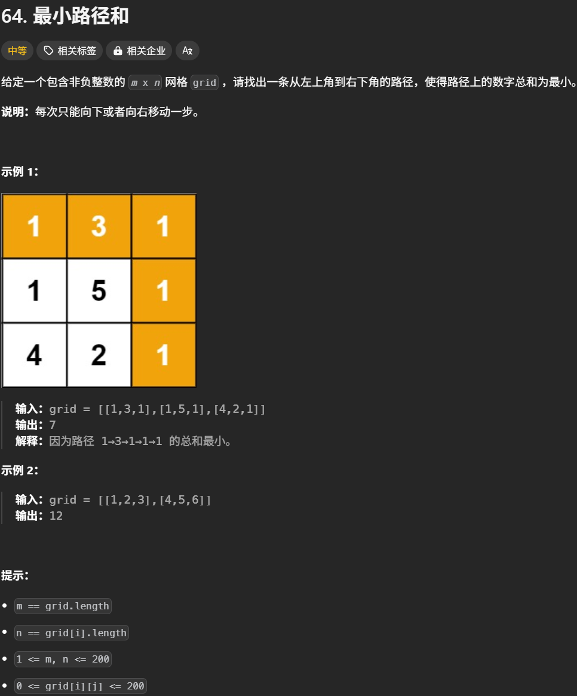

- 集合：从最右下角走到(i, j)的路径
- 属性：min
- 注意都是从最右下角走到(i, j)的路径，所以初始化的时候，要注意！

```
class Solution {
	public:
		int dp[400][400];
		int minPathSum(vector<vector<int>>& grid) {
			int n = grid.size()-1;
			int m = grid[0].size()-1;
			dp[0][0] = grid[0][0];
			for(int i=1; i<=m; i++) {
				dp[0][i] = dp[0][i-1]+grid[0][i];
			}
			for(int i=1; i<=n; i++) {
				dp[i][0] = dp[i-1][0]+grid[i][0];
			}
			for(int i=1; i<=n; i++) {
				for(int j=1; j<=m; j++) {
					dp[i][j] = grid[i][j]+min(dp[i-1][j], dp[i][j-1]);
				}
			}
			return dp[n][m];
		}
};
```

## 最长的重复子序列(需要连续)

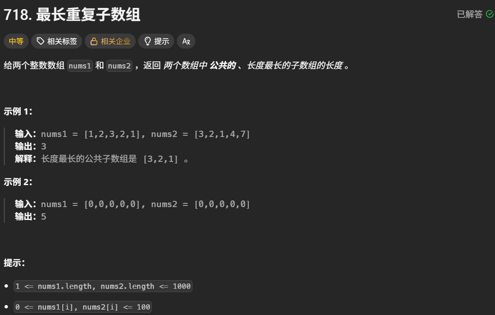

```
int dp[2000][2000];
class Solution {
	public:

		int findLength(vector<int>& nums1, vector<int>& nums2) {
			int ans =0;
			for(int i=1; i<=nums1.size(); i++) {
				for(int j=1; j<=nums2.size(); j++) {
					if(nums1[i-1]==nums2[j-1]) {
						dp[i][j] = dp[i-1][j-1]+1;
					} else {
						dp[i][j]=0;
					}
					ans = max(ans, dp[i][j]);
				}
			}
			return ans;
		}
};
```

dp\[i][j]表示以第一个串的i号元素何第二个串的j号元素结尾，能构成的最长重复子序列

## 最长的公共子序列（不必连续）

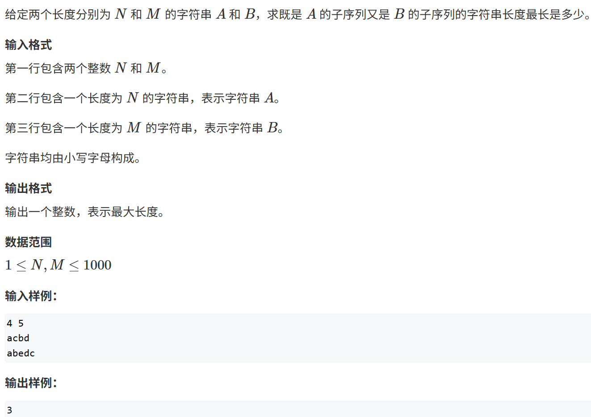

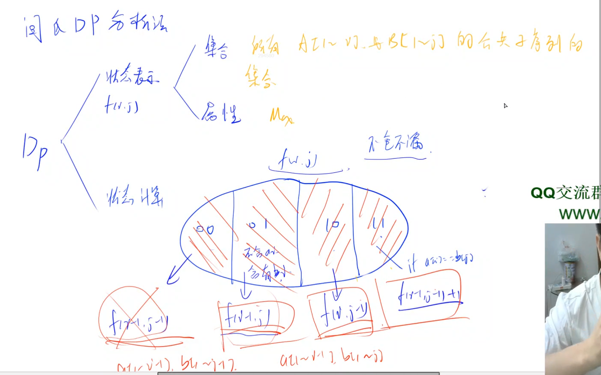

- 集合：A[1~i]和B[1~j]里的公共子序列
- 属性：子序列的最大值f\[i\][j]
- 状态计算：怎么从《A[1~i-1]和B[1~j-1]里的公共子序列的最大长度》转移到《A[1~i]和B[1~j]里的公共子序列的最大长度》，其实就四种：A[i]和B[j]选与不选！
- 00：其实就是f\[i-1\][j-1]
- 01：01说明A[1~i]和B[1~j]里的公共子序列的最大的那个里面包含了B[j]但是不包含A[i]，但是f\[i-1\][j]对应的那个最大子序列，可能包含B[j]也可能不包含B[j]，所以其实真正的01选出来的结果<=f\[i-1\][j]，但是我们只需要求最大值，做不到不重复，但是可以做到不漏掉，因此这里直接就是让01后的结果是大于f\[i-1\][j]即可
- 10：同上
- 11：什么时候才能都选？是不是只有相等的时候才可以选！

4 5
acbd
abedc

    int dp[1010][1010];
    int main() {
    	int n,m;
    	string a,b;
    	scanf("%d %d", &n,&m);
    	cin.ignore();
    	getline(cin, a);
    	// 这里不需要加cin.ignore();是因为getline本身就会丢弃末尾的结束符号\n
    	getline(cin, b);
    	for(int i=0; i<a.size(); i++) {
    		for(int j=0; j<b.size(); j++) {
    			dp[i+1][j+1] = dp[i][j];
    			if(a[i]==b[j]) {
    				dp[i+1][j+1] = dp[i][j]+1;
    			} else {
    				dp[i+1][j+1] = max(dp[i][j+1], dp[i+1][j]);
    			}
    		}
    	}
    	cout<<dp[n][m];
    	return 0;
    }
```
class Solution {
	public:
		int f[2000][2000];
		int longestCommonSubsequence(string text1, string text2) {
			for(int i=1; i<=text1.size(); i++) {
				for(int j=1; j<=text2.size(); j++) {
					f[i][j] = f[i-1][j-1];
					f[i][j] = max(f[i][j], f[i-1][j]);
					f[i][j] = max(f[i][j], f[i][j-1]);
					if(text1[i-1]==text2[j-1]) {
						f[i][j] = max(f[i][j], f[i-1][j-1]+1);
					}
				}
			}
			int n = text1.size();
			int m = text2.size();
			return f[n][m];
		}
};
```

## 不相交的线

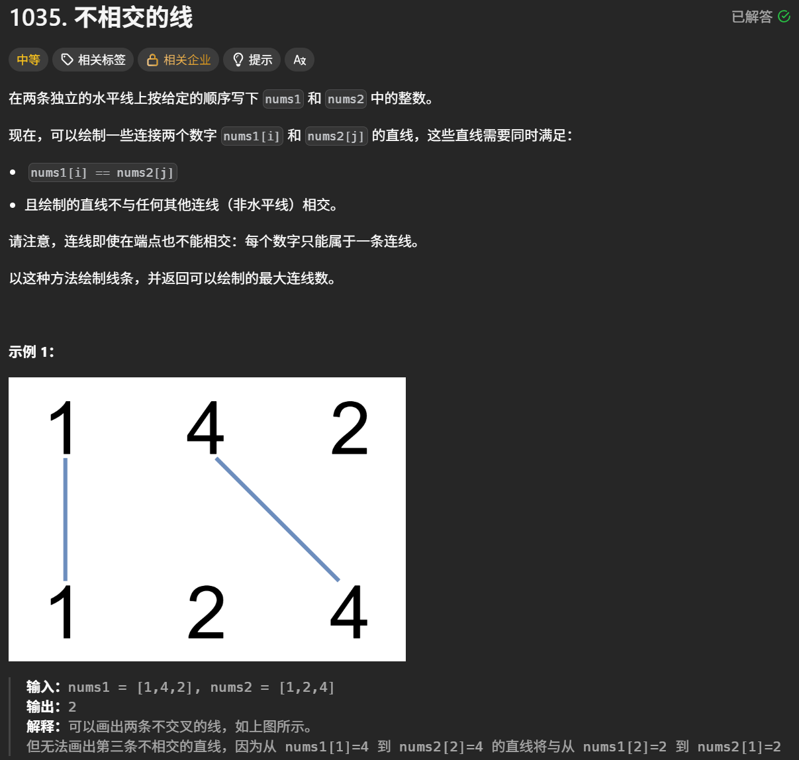

其实就是找最长的《不连续的重复子序列》

```
int f[1000][1000];
class Solution {
	public:
		int maxUncrossedLines(vector<int>& nums1, vector<int>& nums2) {
			for(int i=1; i<=nums1.size(); i++) {
				for(int j=1; j<=nums2.size(); j++) {
					f[i][j] = f[i-1][j-1];
					f[i][j] = max(f[i][j], f[i-1][j]);
					f[i][j] = max(f[i][j], f[i][j-1]);
					if(nums1[i-1]==nums2[j-1]) {
						f[i][j] = max(f[i][j], f[i-1][j-1]+1);
					}
				}
			}
			int n = nums1.size();
			int m = nums2.size();
			return f[n][m];
		}
};
```

## 判断子序列（需要连续）


```
int dp[110][10010];
class Solution {
	public:
		bool isSubsequence(string s, string t) {
			for(int i=1; i<=s.size(); i++) {
				for(int j=1; j<=t.size(); j++) {
					if(s[i-1]==t[j-1]) {
						dp[i][j] = dp[i-1][j-1]+1;
					} else {
						dp[i][j] = dp[i][j-1];
					}
				}
			}
			int n=s.size(), m=t.size();
			if(dp[n][m]==n) {
				return true;
			} else {
				return false;
			}
		}
};
int main() {
	Solution a;
	string s="a";
	string t="";
	bool ans = a.isSubsequence(s, t);
	cout<<ans<<endl;
}
```

- dp其实是在推进j，含义是s数组1到i，t数组1到j中，覆盖了s中多少个元素？
- 当前这个j，也就是t[j-1]不等于s[i-1]的话，那其实t[j-1]没法覆盖，那就是dp[i]\[j] = dp[i]\[j-1]
- 当前这个j，也就是t[j-1]等于s[i-1]的话，那其实t[j-1]覆盖了，那就是dp[i]\[j] = dp[i-1]\[j-1]+1

## 不同的子序列

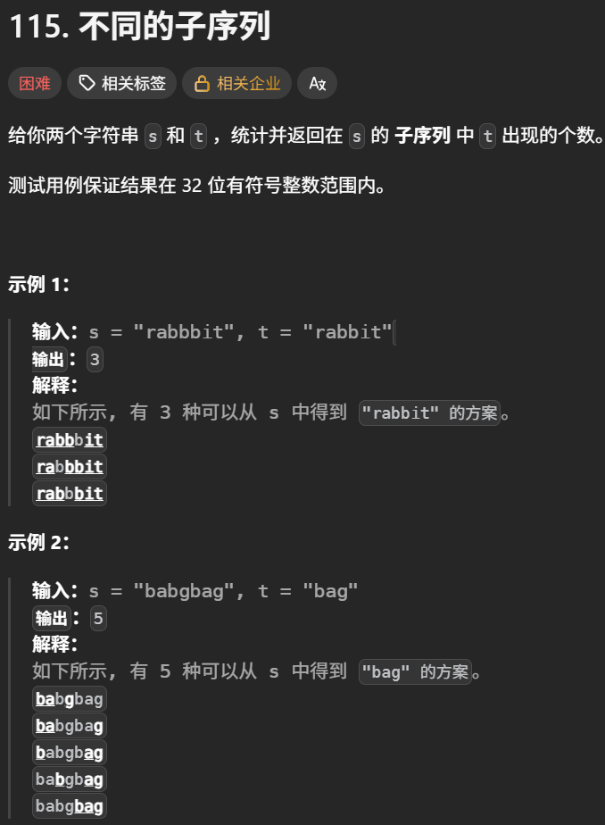

```
class Solution {
	public:
        unsigned long long dp[1010][1010];
		int numDistinct(string s, string t) {
			for(int i=0; i<=s.size(); i++) {
				dp[0][i]=1;
			}
			for(int i=1; i<=t.size(); i++) {
				for(int j=1; j<=s.size(); j++) {
					if(t[i-1]==s[j-1]) {
						dp[i][j] = dp[i][j-1]+dp[i-1][j-1];
					} else {
						dp[i][j]=dp[i][j-1];
					}
				}
			}
			int n = t.size(), m = s.size();
			return dp[n][m];
		}
};
```

```
dp[i][j]表示s串里面1到j的位置有多少种凑成t串前1到i的方式
==：dp[i][j] = dp[i-1][j-1]+dp[i][j-1]
！=：dp[i][j]=dp[i][j-1]
```

```
这里可能有录友不明白了，为什么还要考虑 不用s[i - 1]来匹配，都相同了指定要匹配啊。

例如： s：bagg 和 t：bag ，s[3] 和 t[2]是相同的，但是字符串s也可以不用s[3]来匹配，即用s[0]s[1]s[2]组成的bag。

当然也可以用s[3]来匹配，即：s[0]s[1]s[3]组成的bag。

所以当s[i - 1] 与 t[j - 1]相等时，dp[i][j] = dp[i - 1][j - 1] + dp[i - 1][j];
```

## 两个字符串的最小ASCII删除和

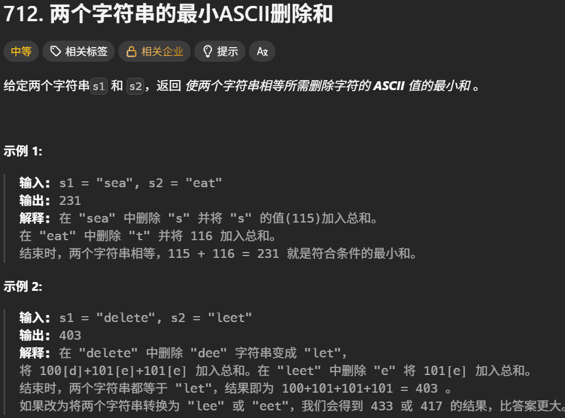

```
class Solution {
	public:
		int dp[1000][1000];
		int minimumDeleteSum(string s1, string s2) {
			for(int i=1; i<=s1.size(); i++) {
				dp[i][0]=dp[i-1][0]+s1[i-1];
			}
			for(int i=1; i<=s2.size(); i++) {
				dp[0][i]=dp[0][i-1]+s2[i-1];
			}
			for(int i=1; i<=s1.size(); i++) {
				for(int j=1; j<=s2.size(); j++) {
					if(s1[i-1]==s2[j-1]) {
						dp[i][j] = dp[i-1][j-1];
					} else {
						dp[i][j] = min(dp[i-1][j]+s1[i-1], dp[i][j-1]+s2[j-1]);
					}
				}
			}
			int n=s1.size(), m=s2.size();
			int ans = dp[n][m];
			return ans;
		}
};
```

## 最短编辑距离

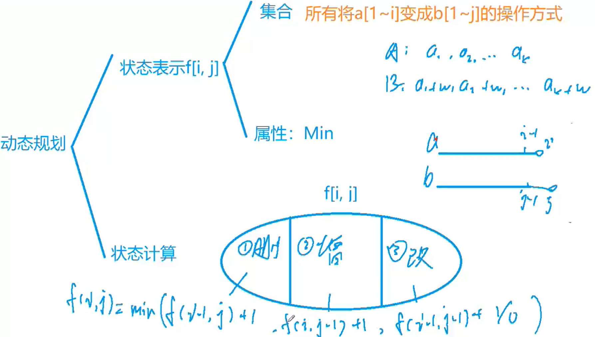

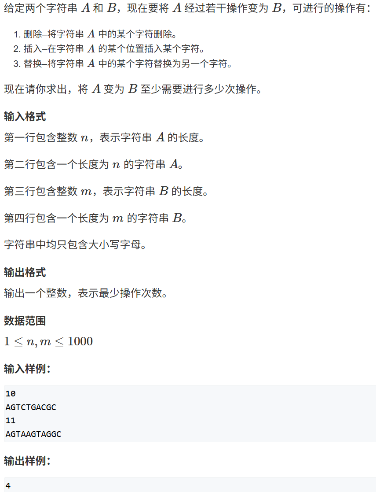

- 集合：A[1~i]去匹配B[1~j]所需要修改的次数
- 属性：修改次数的最小值
- 状态计算：考虑对A[i]这个位置上是删除/添加/修改/什么也不做？
- 删除：如果把A[i]这个位置删掉（删的肯定是A[i]，所以状态转移是从A[i-1]转移到A[i]）就能匹配B[j]，说明所需要的次数就是A\[i-1][j]+1，也就是在A\[i-1]已经都匹配上了B[j]的基础上。注意，你什么时候都能删除，就算A[i]和B[j]相等，你也可以删除，反正后面也能加回来，而且这肯定也不是最优情况！
- 添加：如果把A[i]这个位置添加（肯定添加的是B[j]，所以状态是从B[j-1]转移到B[j]）一个char就能匹配B[j]，说明所需要的次数就是A\[i][j-1]+1，也就是在A\[i]已经都匹配上了B[j-1]的基础上。注意，你什么时候都能添加，......
- 修改：如果把A[i]这个位置修改（修的肯定是将A[i]修改成B[j]，所以状态转移是两方面的）一个char就能匹配B[j]，说明所需要的次数就是A\[i-1][j-1]+1，前提是A[i]不等于B[j]。注意，你什么时候也都能修改，.....
- 什么也不做：必须是A[i]==B[j]，你才可以在A\[i-1][j-1]的基础上什么也不做。

```
int dp[1010][1010];
using namespace std;
int main() {
	int n,m;
	string a,b;
	scanf("%d", &n);
	cin.ignore();
	getline(cin, a);
//	cout<<a.size()<<endl;
	scanf("%d", &m);
	cin.ignore();
	getline(cin, b);
//	cout<<b.size()<<endl;
// 注意dp矩阵里0的位置要初始化！！！！！！！！
	for(int i=0; i<=n; i++) {
		dp[i][0] = i;
	}
	for(int i=0; i<=m; i++) {
		dp[0][i] = i;
	}
	for(int i=1; i<=n; i++) {
		for(int j=1; j<=m; j++) {
			// 增加
			dp[i][j] = dp[i][j-1]+1;
			//删除
			dp[i][j] = min(dp[i][j], dp[i-1][j]+1);
			//修改
			dp[i][j] = min(dp[i][j], dp[i-1][j-1]+1);
			//什么也不干
			if(a[i-1]==b[j-1]) {
				dp[i][j] = min(dp[i][j], dp[i-1][j-1]);
			}
		}
	}
	cout<<dp[n][m];
	return 0;
}
```

## 编辑距离

加了次数限制和查询

```
int dp[1010][1010];
int main() {
	int n,m;
	scanf("%d %d", &n, &m);
	vector<string> zf;
	for(int i=1; i<=n; i++) {
		string a;
		cin>>a;
		zf.push_back(a);
	}
	for(int t=1; t<=m; t++) {
		string b;
		string a;
		int x;
		cin>>b;
		scanf("%d", &x);
		int ans=0;
		for(int k=0; k<zf.size(); k++) {
			a = zf[k];
			for(int i=0; i<=a.size(); i++) {
				dp[i][0] = i;
//				cout<<a[i]<<' ';
			}
//			cout<<endl;
			for(int i=0; i<=b.size(); i++) {
				dp[0][i] = i;
//				cout<<b[i]<<' ';
			}
//			cout<<endl;
			for(int i=1; i<=a.size(); i++) {
				for(int j=1; j<=b.size(); j++) {
					// 增加
					dp[i][j] = dp[i][j-1] + 1;
					// 删除
					dp[i][j] = min(dp[i][j], dp[i-1][j] + 1);
					// 替换
					dp[i][j] = min(dp[i][j], dp[i-1][j-1] + 1);
					if(a[i-1]==b[j-1]) {
						dp[i][j] = min(dp[i][j], dp[i-1][j-1]);
					}
				}
			}
			if(dp[a.size()][b.size()]<=x) {
				ans++;
			}
		}
		cout<<ans<<endl;
	}
	return 0;
}
```


## 整数划分

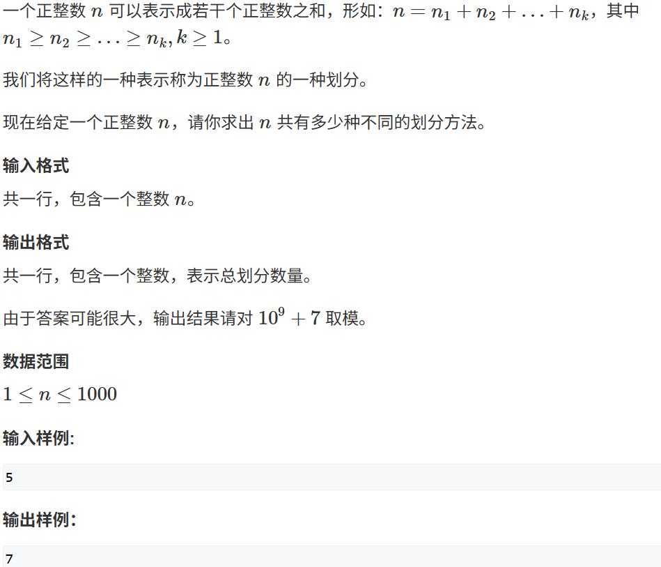

- 集合：从1到i中选，恰好体积凑成j的选法
- 属性：数量
- 状态计算：考虑最后一个i选不选，以及选多少个？
- 如果说，当前的j是大于等于i的，那么可以选i，也就有下面的情况：
  - 选0个，也就是f\[i-1][j]
  - 选k个，也就是f\[i-k][j-k*num[i]]（方法的拼接，所以这里不需要加上k）
  - 选s个，也就是f\[i-s][j-s*num[i]]，这里的s其实就是能让t * num[i]<=j的最大的t
- 如果说，当前的j是小于i的，那就不能选，也就是选0个的情况：
  - 选0个，也就是f\[i-1][j]
- 在j>=i的时候，f\[i][j] = f\[i-1][j] + f\[i-1][j-num[i]] + ... +f\[i-s][j-s\*num[i]] ，令j = j-num[i]则有：f\[i][j-num[i]] = f\[i-1][j-num[i]] + f\[i-1][j-2num[i]] + ... +f\[i-s][j-s*num[i]]

```
using namespace std;
int mod = 1e9 + 7;
int dp[1110][1110];
int main() {
	int n;
	scanf("%d", &n);
	for(int i=0; i<=n; i++) {
		dp[i][0]=1;
	}
	for(int i=1; i<=n; i++) {
		for(int j=1; j<=n; j++) {
			if(j>=i) {
				dp[i][j] = (dp[i-1][j] + dp[i][j-i]);
			}else{
				dp[i][j] = dp[i-1][j];
			}
		}
	}
	int ans = dp[n][n] % mod;
	cout<<ans<<endl;
}
```

注意，一边计算一边取mod，不要只在最后地方取mod

## 数位计数1

例如求a~b中，某个数出现的次数？

- 首先，可以先实现一个函数count(n, x)：求1~n中x出现的次数，这样a到b之间出现的次数也就是count(b, x) - count(a-1, x)
- 下面求1~n中x出现的次数，我们以x=1为例，也就是**求1~n中1出现的次数**
- 对于一个给定一个数字**n = abcdefg**，我们可以先**分别求出1在每一位上出现的次数**，其实对每一位都枚举求一下就好
- 我们可以再以**求abcdefg中1在第4位上出现的次数**，即有多少种1<=xxx1xxx<=abcdefg，分情况讨论！
  - 前三位从000~abc-1，后三位可以随便去，也就是000~999。这样总共就是**abc * 1000**种**（注意，如果求的x如果是0的话，那么这里就是要从001~abc-1）（再次注意，如果枚举到的是该数字的最高位，其实这种情况也就不存在了，特判即可）**
  - 前三位恰好是abc：
    - d<1的时候，第四位就不可能取1，取了1就会超过abcdefg，因此这种情况下没有方案
    - d=1的时候，后三位可以取的个数就是000~efg，也就是**efg+1**种
    - d>1的时候，后三位可以取的个数就是000~999，也就是**1000**种

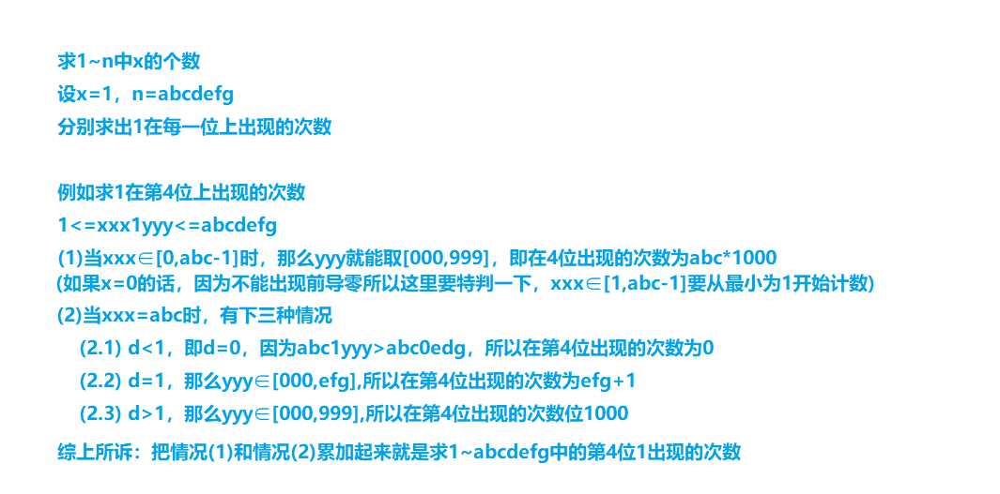

```
using namespace std;
int power10(int n) {
	int ans = 1;
	for(int i=1; i<=n; i++) {
		ans = ans*10;
	}
	return ans;
}
int get(int l, int r, vector<int>& num) {
	int ans = 0;
	int n = r-l;
	for(int i=0; i<=n; i++) {
		ans = ans + num[l] * power10(i);
		l++;
	}
	return ans;
}
int count(int n, int x) {
	int ans=0;
	if(n == 0) {
		return 0;
	}
	vector<int> num;
	while(n!=0) {
		num.push_back(n%10);
		n = n/10;
	}
	for(int i=0; i<num.size(); i++) {
		// 如果查询的数字是0，那么他不可能出现在首位，所以特判一下 
		if(i==num.size()-1 && x==0) {
			continue;
		}
		// 在末位到首位-1之间查询，则需要遵循如下： 
		
		if(i<num.size()-1) {
			// 特判 x 是否为0，处理000~abc-1或者001~abc-1的情况 
			if(x!=0) {
				ans = ans + get(i+1, num.size()-1, num) * power10(i);
			} else {
				ans = ans + (get(i+1, num.size()-1, num) - 1) * power10(i);
			}
		}
		//处理abc的情况
		if(num[i]>x) {
			ans = ans + power10(i);
		} else if(num[i]==x) {
			ans = ans + get(0, i-1, num) + 1;
		}
	}
	return ans;
}
int main() {
	while(1) {
		int a,b;
		scanf("%d %d",&a,&b);
		if(a==0&&b==0) {
			break;
		}
		int t;
		if(a>b) {
			int t;
			t = a;
			a = b;
			b = t;
		}
		for(int i=0; i<=9; i++) {
			int ans = count(b, i) - count(a-1, i);
			cout<<count(b, i) - count(a-1, i) <<' ';
		}
		cout<<endl;
	}
	return 0;
}
```

```
bool vis[20][2][2][20];
int memo[20][2][2][20];
int dp(vector<int>& nums, int pos, bool islimit, bool isnum, int total, int target) {
	if(pos==nums.size()) {
		return total;
	}
	if(vis[pos][islimit][isnum][total]==true) {
		return memo[pos][islimit][isnum][total];
	}
	int ans =0;
	if(isnum==false) {
		ans+=dp(nums, pos+1, false, false, 0, target);
	}
	int ub, lb;
	if(islimit==true) {
		ub=nums[pos];
	} else {
		ub=9;
	}
	if(isnum==false) {
		lb=1;
	} else {
		lb=0;
	}
	for(int k=lb; k<=ub; k++) {
		if(k==target) {
			ans+=dp(nums, pos+1, islimit&(k==ub), true, total+1, target);
		} else {
			ans+=dp(nums, pos+1, islimit&(k==ub), true, total, target);
		}
	}
	vis[pos][islimit][isnum][total]=true;
	memo[pos][islimit][isnum][total]=ans;
	return ans;
}
int main() {
	while(1) {
		int a, b;
		cin>>a>>b;
		if(a>b) {
			int temp = a;
			a=b;
			b=temp;
		}
		if(a==0 && b==0) {
			break;
		}

		vector<int> nums1, nums2;
		a--;
		while(a) {
			nums1.push_back(a%10);
			a=a/10;
		}
		reverse(nums1.begin(), nums1.end());
		while(b) {
			nums2.push_back(b%10);
			b=b/10;
		}
		reverse(nums2.begin(), nums2.end());

		for(int i=0; i<=9; i++) {
			int ans1 = dp(nums1, 0, true, false, 0, i);
			memset(vis, false, sizeof vis);
			memset(memo, 0, sizeof memo);
			int ans2 = dp(nums2, 0, true, false, 0, i);
			memset(vis, false, sizeof vis);
			memset(memo, 0, sizeof memo);
			if(i==9) {
				cout<<ans2-ans1<<endl;
			} else {
				cout<<ans2-ans1<<' ';
			}
		}
	}
}
```


## 数字1的个数

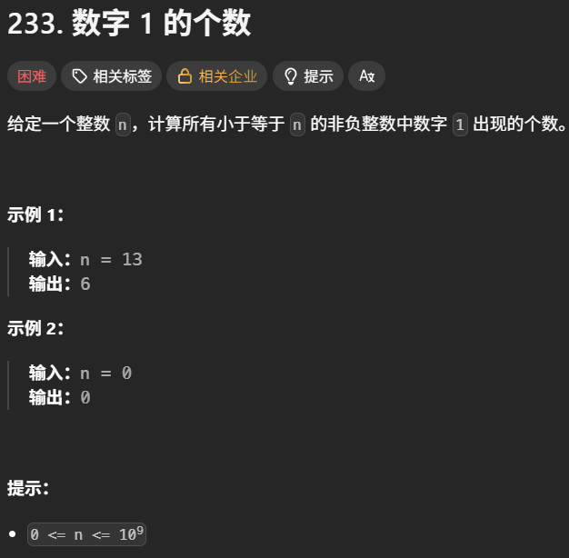

abecd，比如说e这一位是1的个数：

- 前导ab如果取值在$[0, ab-1]$，那么cd可能的情况就有00到99这么多。综合下来，就是ab×100这么多可能
- 前导ab如果取值就是ab，那么就要讨论e的情况
  - 如果e=1，那么cd的取值就只能在00到cd之间。综合下来就有cd+1这么多可能
  - 如果e>1，那么cd的取值就在00到99，综合下来就是100种可能
  - 如果e<1，那就是0种

```
class Solution {
	public:
		int wei=0;
		int hm(string n, int tou, int wei) {
			int ans=0;
			for(int i=tou; i<=wei; i++) {
				ans=ans*10+n[i]-'0';
			}
			return ans;
		}
		int ten(int x) {
			int ans=1;
			for(int i=1; i<=x; i++) {
				ans=ans*10;
			}
			return ans;
		}
		int count(string n, int i) {
			int ans=0;
			ans+=hm(n, 0, i-2)*ten(wei-i);
			if(n[i-1]-'0'>1) {
				ans+=ten(wei-i);
			} else if(n[i-1]-'0'==1) {
				ans=ans+1+hm(n, i, wei-1);
			}
			return ans;
		}
		int countDigitOne(int n) {
			int temp =n;
			string number;
			while(temp!=0) {
				wei++;
				number.insert(number.begin(), temp%10+'0');
				temp=temp/10;

			}
			int ans=0;
			for(int i=1; i<=wei; i++) {
				ans=ans+count(number, i);
			}
			return ans;
		}
};
```

```
class Solution {
	public:
		bool vis[20][2][2][100];
		int memo[20][2][2][100];
		int dp(vector<int>& nums, int pos, bool islimit, bool isnum, int onenum) {
			if(pos==nums.size()) {
				return onenum;
			}
			if(vis[pos][islimit][isnum][onenum]==true) {
				return memo[pos][islimit][isnum][onenum];
			}
			int ans = 0;
			if(isnum==false) {
				ans+=dp(nums, pos+1, false, false, 0);
			}
			int lb, ub;
			if(islimit==true) {
				ub = nums[pos];
			} else {
				ub = 9;
			}

			if(isnum==false) {
				lb=1;
			} else {
				lb=0;
			}
			for(int k=lb; k<=ub; k++) {
				if(k==1) {
					ans+=dp(nums, pos+1, islimit&(k==ub), true, onenum+1);
				} else {
					ans+=dp(nums, pos+1, islimit&(k==ub), true, onenum);
				}
			}
			vis[pos][islimit][isnum][onenum]=true;
			memo[pos][islimit][isnum][onenum]=ans;
			return ans;
		}
		int digitOneInNumber(int num) {
			vector<int> nums;
			while(num) {
				nums.push_back(num%10);
				num=num/10;
			}
			reverse(nums.begin(), nums.end());
			int ans = dp(nums, 0, true, false, 0);
			return ans;
		}
};

```

在void的写法里，我们的记忆化搜索记录的是这个状态对答案的贡献，当下一次再访问到这个状态的时候，直接把贡献值加上去即可！

## 至少有一位重复的数字

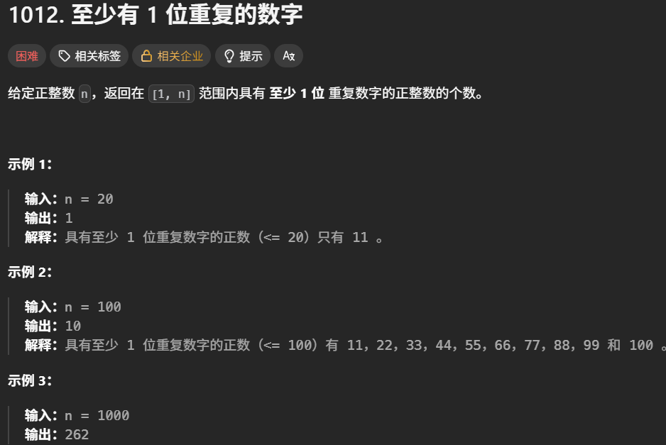

```
class Solution {
	public:
		int dp(int i, vector<int>& nums, int mask, bool islimit, bool isnum) {
			if(i==nums.size()) {
				return isnum;
			}
			int ans=0;
			if(isnum==false) {
				ans+=dp(i+1, nums, mask, false, false);
			}
			int lb,ub;
			if(islimit==true) {
				ub=nums[i];
			} else {
				ub=9;
			}

			if(isnum==true) {
				lb=0;
			} else {
				lb=1;
			}
			
			for(int k=lb;k<=ub;k++){
				if((mask&(1<<k))==false){
					ans+=dp(i+1, nums, mask|(1<<k), islimit&k==ub, true);
				}
			}
			return ans;
			
		}
		int numDupDigitsAtMostN(int n) {
			vector<int> nums;
			int temp =n;
			while(n) {
				nums.push_back(n%10);
				n=n/10;
			}
			reverse(nums.begin(), nums.end());
			int ans =  temp - dp(0, nums, 0, true, false);
			return ans;
		}
};
```

## 统计各位数字都不同的数字个数

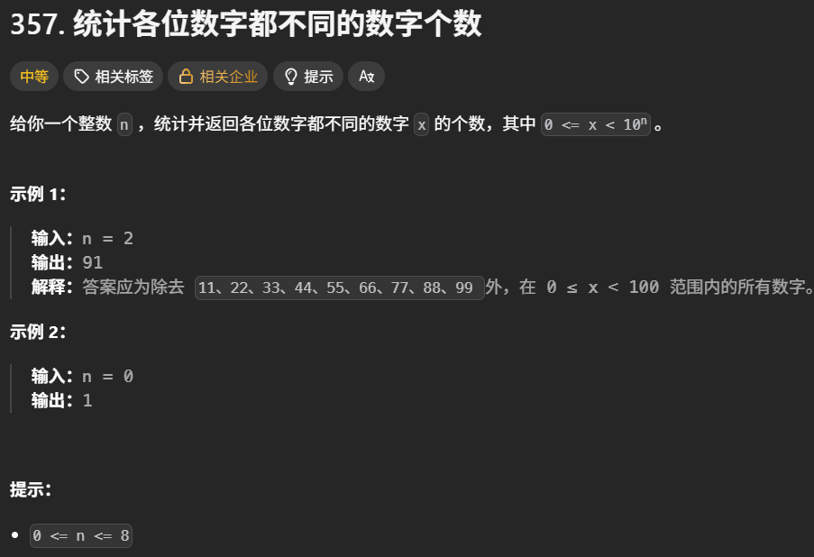

```
class Solution {
	public:
		int countNumbersWithUniqueDigits(int n) {
			if(n==0) {
				return 1;
			}
			int ans=1;
			for(int i=1; i<=n; i++) {
				if(i==1) {
					ans=10;
					continue;
				}
				int temp=1;
				for(int j=1; j<=i; j++) {
					if(j==1){
						temp=9;
						continue;
					}
					temp=temp*(10-j+1);
				}
				ans+=temp;
			}
			return ans;
		}
};
```

举个例子：n=3

- 当我们要的是实实在在的**一位数**，那就只有10种
- 当我们要的是实实在在的**两位数**，那就是9*9种，最高位去掉0，有9种选择，那么第二位就是去掉最高位选出来的那一个，那么也是9种
- 当我们要的是实实在在的**三位数**，那就是9×9×8种，最高位去掉0，有9种选择，那么第二位就是去掉最高位选出来的那一个，那么也是9种，第三位那自然就只剩下8种

```
class Solution {
	public:
		int f(int i, vector<int>& number, int mask, bool is_num) {
			if(i==number.size()) {
				return is_num;
			}
			int ans=0;
			if(is_num==false) {
				ans+=f(i+1, number, mask, false);
			}
			int ub=9,lb;
			if(is_num==true) {
				lb=0;
			} else {
				lb=1;
			}
			for(int k=lb; k<=ub; k++) {
				if((mask&(1<<k))==false) {
					ans+=f(i+1, number, mask|(1<<k), true);
				}
			}
			return ans;
		}
		int countNumbersWithUniqueDigits(int n) {
			vector<int> number;
			for(int i=1; i<=n; i++) {
				number.push_back(9);
			}
			int ans = f(0, number, 0, false);
			return ans+1;
		}
};
```

方法二

## 统计特殊整数

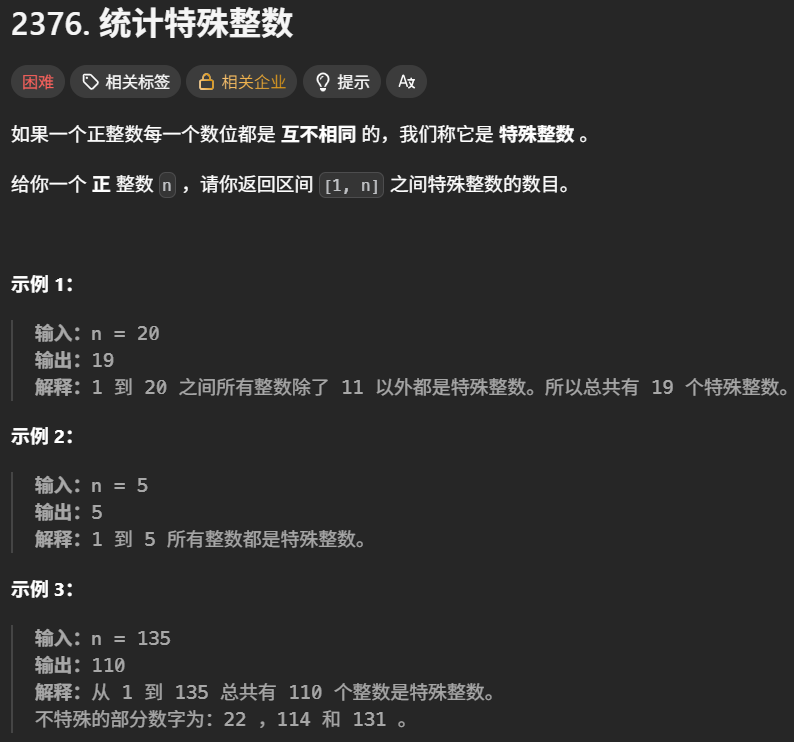

```
class Solution {
	public:
		// i表示到第几位了
		// mask表示现在从0到9已经用了哪些数字？00100表示2已经用了
		// is_limit表示前面的数字是否都是n对应位上的，true：当前位至多为number[i]；false：当前位至多为9
		// is_num表示前面是否填了数字？（是否都是前导零），true：当前位可以从0开始；false：当前位可以跳过或者从1开始填
		int f(vector<int>& number, int i, int mask, bool is_limit, bool is_num) {
		    // 如果长度到了，那么就返回1或者0，这取决于填没填数字，也就是看is_num
			if(i==number.size()) {
				return is_num;
			}
			int ans=0;
			
			// 没填数字的话，就可以继续不填
			if(is_num==false) {
				ans += f(number, i+1, mask, false, false);
			}
			
			// 开始填数字，不管之前填没填，要找上下界，根据is_limit和is_num
			int ub, lb;
			if(is_limit==true) {
				ub=number[i];
			} else {
				ub=9;
			}
			if(is_num==true) {
				lb=0;
			} else {
				lb=1;
			}

			for(int k=lb; k<=ub; k++) {
				if((mask&(1<<k))==false) {
				    // 注意，更新is_limit的时候是：前面都是is_limit并且此位置上填的是ub，那么就是true
					ans+=f(number, i+1, mask|(1<<k), is_limit&(k==ub), true);
				}
			}
			return ans;
		}
		int countSpecialNumbers(int n) {
			vector<int> number;
			while(n) {
				number.insert(number.begin(), n%10);
				n=n/10;
			}
			int ans = f(number, 0, 0, true, false);
			return ans;
		}
};
```

！！！！！

```
if((mask&(1<<k))==false)
```

==的优先级超过了&，所以这里一定要记得套括号！！！！！

按位或是一个竖杠|

## 不连续1的非负整数

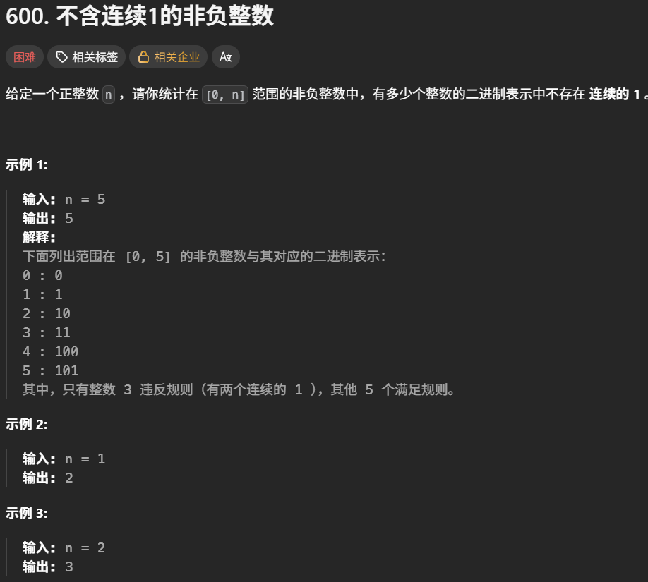

```
class Solution {
	public:
		int memo[35][2][2][2];
		bool vis[35][2][2][2];
		int dp(vector<int>& nums, int pos, int lastnum, bool islimit, bool isnum) {
			if(pos==nums.size()) {
				return isnum;
			}
			if(vis[pos][lastnum][islimit][isnum]==true){
				return memo[pos][lastnum][islimit][isnum];
			} 
			int ans =0;
			if(isnum==false) {
				ans+=dp(nums, pos+1, 0, false, false);
			}

			int lb,ub;
			if(islimit==true) {
				ub=nums[pos];
			} else {
				ub=1;
			}
			if(isnum==false) {
				lb=1;
			} else {
				lb=0;
			}
			for(int k=lb; k<=ub; k++) {
				if(k==0 || (k==1 && lastnum==0)) {
					ans+=dp(nums, pos+1, k, islimit&(k==ub), true);
				}
			}
			memo[pos][lastnum][islimit][isnum] = ans;
			vis[pos][lastnum][islimit][isnum]=true;
			return ans;
		}
		int findIntegers(int n) {
			if(n==0) {
				return 0;
			}
			vector<int> nums;
			for(int i=0; i<32; i++) {
				if(n&(1<<i)) {
					nums.push_back(1);
				} else {
					nums.push_back(0);
				}
			}
			while(nums[nums.size()-1]==0) {
				nums.erase(nums.end()-1);
			}
			reverse(nums.begin(), nums.end());
			int ans = dp(nums, 0, 0, true, false);
			return ans+1;
		}
};
```

- 我们把一个数字的二进制全部拿下来（最多有32位），然后一定记得把前导0全部删掉！！！！！

- 我们在选取 ub 和 lb 后，函数里is_limit的判断保险起见请这样写：

  ```
  is_limit&(k==number[i])
  ```

  其实就是因为ub可能被条件限制后，其实无法到达number[i]，所以判断的时候让k==ub其实是不对的！

- 记忆化搜索！其实对于固定的 i, is_limit, is_one, is_num，他们的答案都是唯一的，所以可以开一个unordered_map来存！注意string的构造方法

## 记忆化搜索

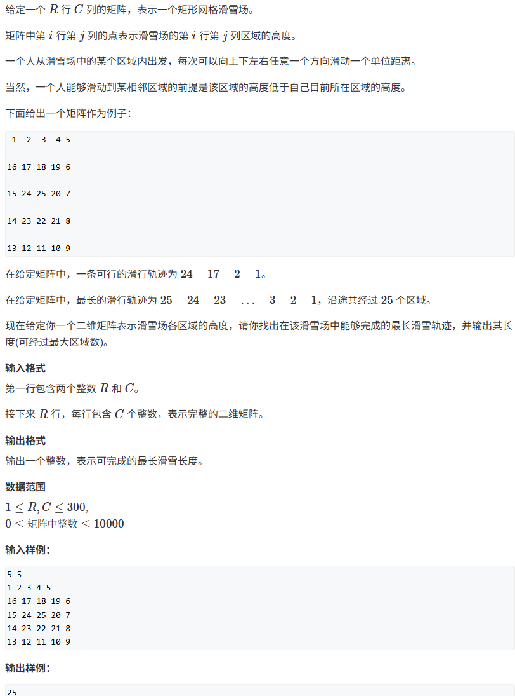

- 集合：从(i, j)出发，所有的路径
- 属性：路径最大值
- 状态计算：在当前(i, j)位置，可以选择上下左右移动，当然移动的时候你要考虑不超过边界，而且当前位置确实比下一个位置要高度要高

注意！！！！！！

```
递归的方向是严格递减的（h[a][b] < h[x][y]），所以递归不会形成环路（因为高度必须越来越低）。
最终递归会到达某个点，它的所有邻居都不满足 h[a][b] < h[x][y]（网格里一定有最小值！），此时递归终止，返回 dp[x][y] = 1（因为无法再扩展）。
```

```
int h[310][310];
int dp[310][310];
// 偏移量 
int dx[4] = {0, 0, -1, 1};
int dy[4] = {1, -1, 0, 0};
int n,m;
int solve(int x, int y) {
	// 记录有没有被算过
	if(dp[x][y]!=0) {
		return dp[x][y];
	}
	dp[x][y]=1;
	for(int i=0; i<4; i++) {
		int a = x+dx[i];
		int b = y+dy[i];
		if(a>=1&&a<=n&&b>=1&&b<=m&&h[a][b]<h[x][y]) {
			dp[x][y] = max(dp[x][y], solve(a, b)+1);
		}
	}
	return dp[x][y];
}
int main() {
	int ans = 0;
	scanf("%d %d",&n,&m);
	for(int i=1; i<=n; i++) {
		for(int j=1; j<=m; j++) {
			scanf("%d", &h[i][j]);
		}
	}
	for(int i=1; i<=n; i++) {
		for(int j=1; j<=m; j++) {
			ans = max(ans, solve(i, j));
		}
	}
	cout<<ans;
}
```

```
int p[400][400];
int n, m;
int max_len[600][600];
int dx[4]= {0, 0, -1, 1};
int dy[4]= {1, -1, 0, 0};
int ans = -1;
int dfs(int x, int y) {
	max_len[x][y]=1;
	for(int i=0; i<4; i++) {
		int new_x = x+dx[i];
		int new_y = y+dy[i];
		if(new_x>=1 && new_x<=n && new_y>=1 && new_y<=m && p[new_x][new_y]<p[x][y]) {
			if(max_len[new_x][new_y]==0) {
				max_len[x][y] = max(dfs(new_x, new_y)+1, max_len[x][y]);
			} else {
				max_len[x][y] = max(max_len[new_x][new_y]+1, max_len[x][y]);
			}
		}
	}
	return max_len[x][y];
}
int main() {
	cin>>n>>m;
	for(int i=1; i<=n; i++) {
		for(int j=1; j<=m; j++) {
			scanf("%d", &p[i][j]);
		}
	}
	for(int i=1; i<=n; i++) {
		for(int j=1; j<=m; j++) {
			if(max_len[i][j]!=0) {
				ans = max(max_len[i][j], ans);
			} else {
				ans = max(dfs(i, j), ans);
			}
		}
	}
	cout<<ans;
}
```

后来的写法

## 完全平方数


```

int dp[10010];
class Solution {
	public:
		int numSquares(int n) {
			for(int i=0; i<=n; i++) {
				if(i==0) {
					dp[0] = 0;
					continue;
				}
				if(i==1) {
					dp[1] =1;
					continue;
				}
				dp[i] = 99999;
				for(int j=0; j*j<=i; j++) {
					dp[i] = min(dp[i], 1 + dp[i-j*j]);
				}
			}
			return dp[n];
		}
};
```

dp 表示 i 这个数字最少需要多少完全平方数凑出来

对于每个数字 i ，dp[i]的求法是：

- 我们知道，每个i，能凑出它的完全平方数一定是在1到\sqrt(i) 这个范围内的，因此：集合的划分是从**1到 \sqrt(i)向下取整** 这个范围内
- 对于每个划分，我们都需要考虑当前dp[i]和 1+dp[i-j*j]的大小，取小者

## 最长的连续的有效括号

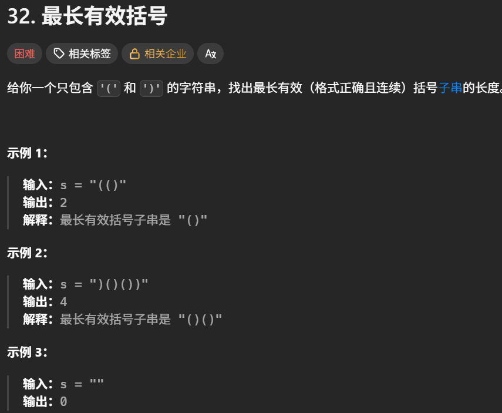

```
class Solution {
	public:
        int dp[30010];
		int longestValidParentheses(string s) {
			int ans = 0;
			for(int i=1;i<s.size();i++){
				if(s[i]==')'){
					if(s[i-1]=='('){
						if(i-2>=0){
							dp[i] = dp[i-2]+2;
						}else{
							dp[i] = 2;
						}
					}else{
						int x = i-dp[i-1]-1;
						if(x>=0 && s[x]=='('){
							if(x>=1){
								dp[i] = dp[i-1] + 2 + dp[x-1];
							}else{
								dp[i] = dp[i-1] + 2;
							}
						}
					}
				}
				ans = max(ans, dp[i]);
			}
			return ans;
		}
};
```

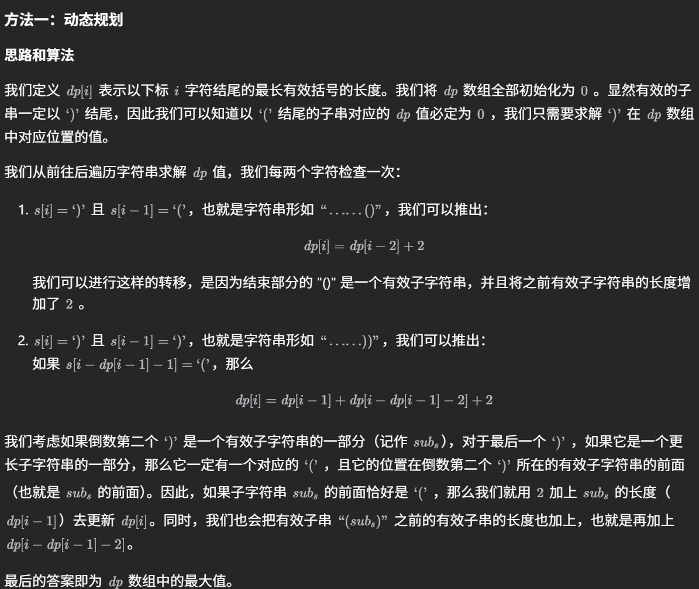

在边界处需要加一些**特判！**

## 买水果所需要的最少金币

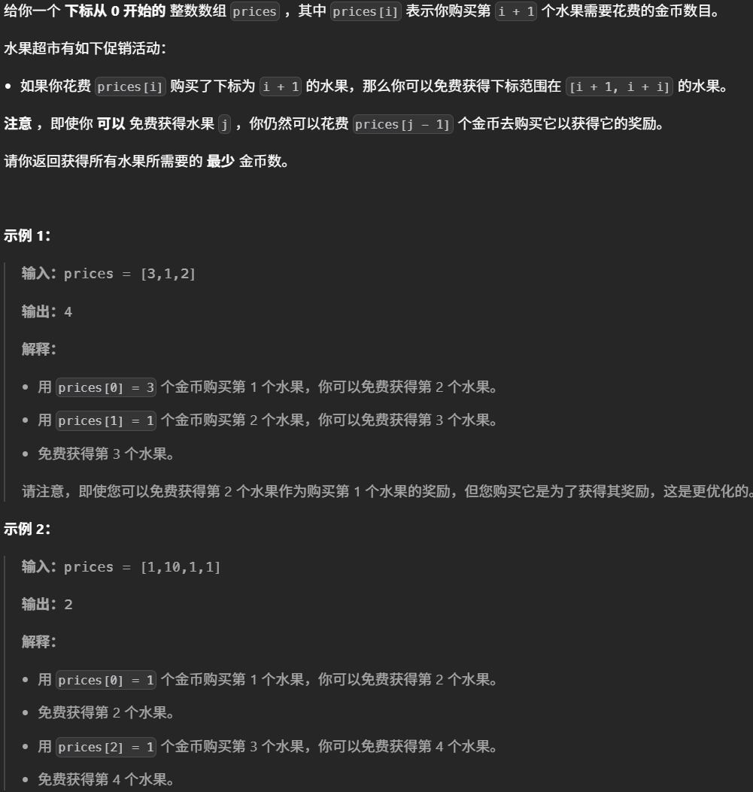

```
class Solution {
	public:
		int dp[1010][2];
		int minimumCoins(vector<int>& prices) {
			int n = prices.size();
			prices.insert(prices.begin(), 0);
			dp[1][1]=prices[1];
			dp[1][0]=prices[1];
			for(int i=2; i<prices.size(); i++) {
				dp[i][1]=min(dp[i-1][0]+prices[i], dp[i-1][1]+prices[i]);
				dp[i][0]=1e9;
				for(int j=i-1; 2*j>=i; j--) {
					dp[i][0]=min(dp[i][0], dp[j][1]);
				}
			}
			int ans = min(dp[n][1], dp[n][0]);
			return ans;
		}
};
```

## 最低票价

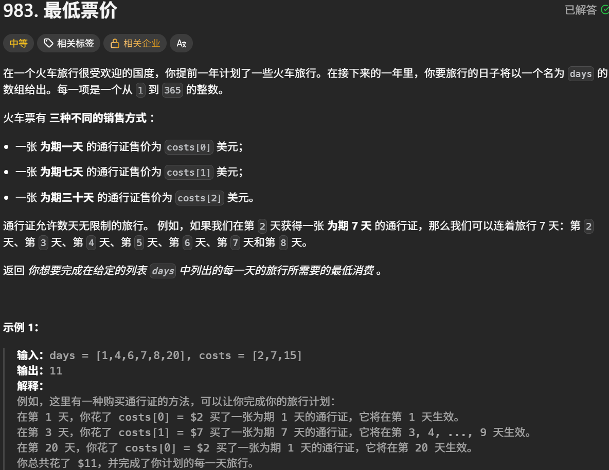

````
class Solution {
	public:
		int dp[10010];
		int mincostTickets(vector<int>& days, vector<int>& costs) {
			int pos=0;
			int n = days[days.size()-1];
			for(int i=1; i<=n; i++) {
				dp[i]=1e9;
			}
			for(int i=1; i<=n; i++) {
				dp[i]=dp[i-1];
				if(i==days[pos]) {
					dp[i]=min(dp[max(0, i-7)]+costs[1], dp[max(0, i-1)]+costs[0]);
					dp[i]=min(dp[i], dp[max(0, i-30)]+costs[2]);
					pos++;
				}
			}
			return dp[n];
		}
};
````

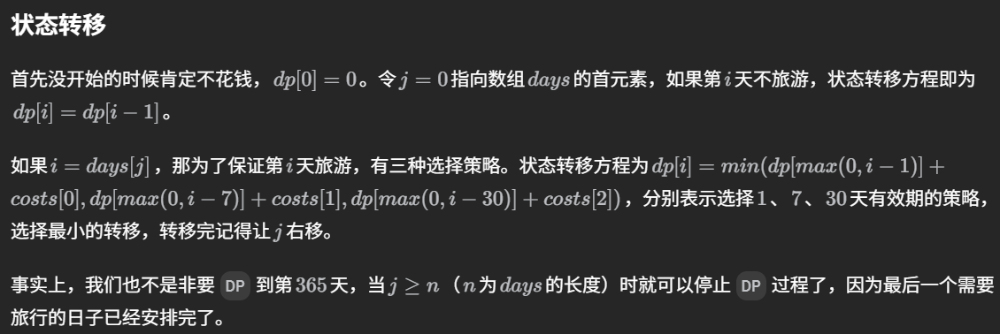

## 解决智力问题


````
class Solution {
	public:
		long long int dp[100100];
		long long mostPoints(vector<vector<int>>& questions) {
			dp[0]=questions[0][0];
			long long int ans = dp[0];
			for(int i=1; i<questions.size(); i++) {
				dp[i]=questions[i][0];
				for(int j=0; j<questions.size(); j++) {
					if(i>questions[j][1]+j) {
						dp[i]=max(dp[i], dp[j]+questions[i][0]);
					}
				}
				ans = max(ans, dp[i]);
			}
			return ans;
		}
};
````

```
最容易想到的做法
dp[i]表示到第i道题，我们可以获得的最大分数
第i题不做：直接就是dp[i-1]
第i题做：往前检查，取max
这样会超时
```

```
class Solution {
	public:
		long long int dp[100100];
		long long mostPoints(vector<vector<int>>& questions) {
			int n = questions.size()-1;
			dp[n]=questions[n][0];
			for(int i=n-1; i>=0; i--) {
				if(questions[i][1]+i+1<=n) {
					dp[i]=max(dp[i+1], dp[questions[i][1]+i+1]+questions[i][0]);
				} else {
					dp[i]=max(dp[i+1], (long long int)questions[i][0]);
				}
			}
			return dp[0];
		}
};
```

```
从后往前计算（可以通过question[i][1]直接访问）
dp[i]表示从第i题开始做，能得到的最大分数
第i题不做：直接就是dp[i+1]
第i题做：先检查有没有超出数组边界，然后再取max
注意，max函数必须是两个同类型比较，long long不能和int比较！！！
```

## 最大正方形

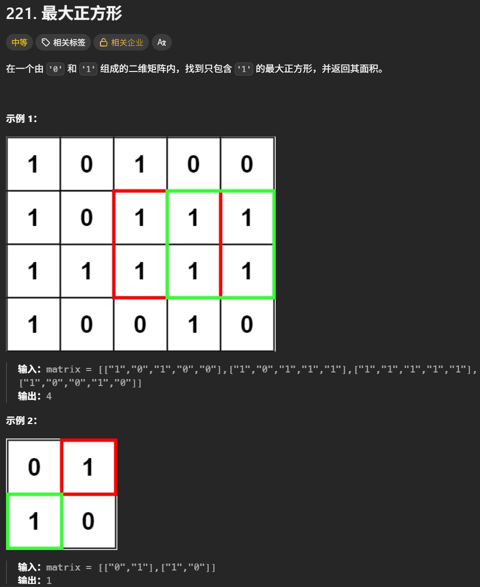

```
class Solution {
public:
    int maximalSquare(vector<vector<char>>& matrix) {
        if (matrix.size() == 0 || matrix[0].size() == 0) {
            return 0;
        }
        int maxSide = 0;
        int rows = matrix.size(), columns = matrix[0].size();
        vector<vector<int>> dp(rows, vector<int>(columns));
        for (int i = 0; i < rows; i++) {
            for (int j = 0; j < columns; j++) {
                if (matrix[i][j] == '1') {
                    if (i == 0 || j == 0) {
                        dp[i][j] = 1;
                    } else {
                        dp[i][j] = min(min(dp[i - 1][j], dp[i][j - 1]), dp[i - 1][j - 1]) + 1;
                    }
                    maxSide = max(maxSide, dp[i][j]);
                }
            }
        }
        int maxSquare = maxSide * maxSide;
        return maxSquare;
    }
};
```

```
int dp[400][400];
int qz_h[400][400];
int qz_l[400][400];
int matrixx[400][400];
class Solution {
	public:

		int maximalSquare(vector<vector<char>>& matrix) {
			int h, l;
			h = matrix.size();
			l = matrix[0].size();
			int ans = 0;

			for(int i=1; i<=h; i++) {
				for(int j=1; j<=l; j++) {
					matrixx[i][j] = matrix[i-1][j-1]-'0';
				}
			}

			for(int j=1; j<=l; j++) {
				if(matrixx[1][j]==1) {
					dp[1][j]=1;
				} else {
					dp[1][j]=0;
				}
				ans = max(ans, dp[1][j]);
			}
			for(int i=1; i<=h; i++) {
				if(matrixx[i][1]==1) {
					dp[i][1]=1;
				} else {
					dp[i][1]=0;
				}
				ans = max(ans, dp[i][1]);
			}

			for(int i=1; i<=h; i++) {
				for(int j=1; j<=l; j++) {
					qz_h[i][j]=qz_h[i][j-1]+matrixx[i][j];
				}
			}
			for(int j=1; j<=l; j++) {
				for(int i=1; i<=h; i++) {
					qz_l[i][j]=qz_l[i-1][j]+matrixx[i][j];
				}
			}

			for(int i=2; i<=h; i++) {
				for(int j=2; j<=l; j++) {
					if(matrixx[i][j]==1) {
						if(dp[i-1][j-1]==0) {
							dp[i][j]=1;
						} else {
							int len = sqrt(dp[i-1][j-1]);
							dp[i][j]=1;
							for(int k=len; k>=1; k--) {
								if(qz_h[i][j-1]-qz_h[i][j-k-1]==k && qz_l[i-1][j]-qz_l[i-k-1][j]==k) {
									dp[i][j] = max(dp[i][j], (k+1)*(k+1));
								} 
							}
						}
					}
					ans = max(ans, dp[i][j]);
				}
			}
			return ans;
		}
};
int main() {
	Solution a;
	vector<vector<char>> matrix = {
		{'0', '0', '0', '1'},
		{'1', '1', '0', '1'},
		{'1', '1', '1', '1'},
		{'0', '1', '1', '1'},
		{'0', '1', '1', '1'}
	};
	int ans = a.maximalSquare(matrix);
	cout<<ans;
}
```

```
dp[i][j]表示以（i， j）这个点为右下角的正方形的最大面积
dp[i][j] = min(min(dp[i - 1][j], dp[i][j - 1]), dp[i - 1][j - 1]) + 1;
递推公式表示：取“（i， j）左边和上边最大延伸的边长”和“左上角那个点构成最大矩形的边长”的最小值，再加1，就是这个点可以延伸出去构成正方形的最大边长。
```

## 统计全为1的正方形子矩阵

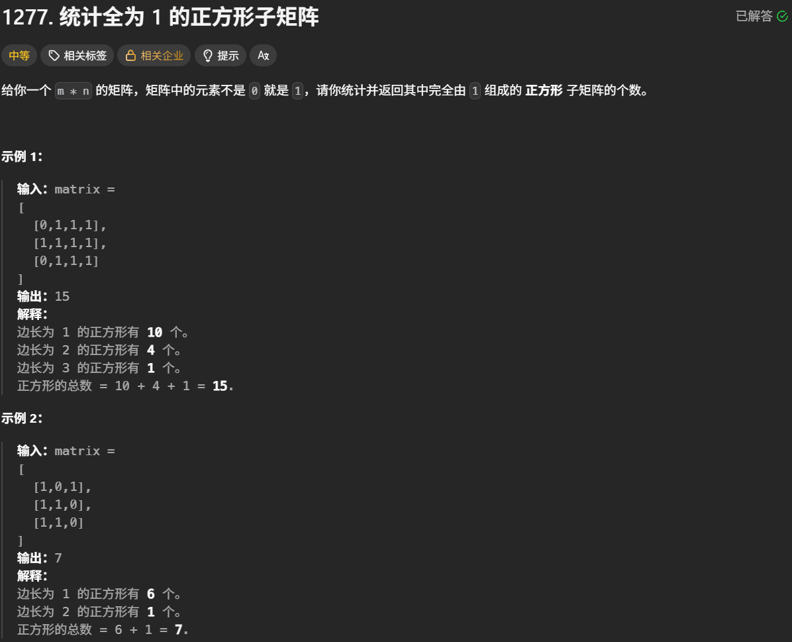

```
class Solution {
	public:
		int res[500][500];
		int dp[500][500];
		int countSquares(vector<vector<int>>& matrix) {
			int h = matrix.size();
			int l = matrix[0].size();
			for(int j=0; j<l; j++) {
				if(j==0) {
					if(matrix[0][0]==1) {
						res[0][0]=1;
						dp[0][0]=1;
					} else {
						res[0][0]=0;
						dp[0][0]=0;
					}
					continue;
				}
				if(matrix[0][j]==1) {
					dp[0][j]=1;
					res[0][j] = res[0][j-1]+1;
				} else {
					dp[0][j]=0;
					res[0][j] = res[0][j-1];
				}
			}

			for(int i=0; i<h; i++) {
				if(i==0) {
					if(matrix[0][0]==1) {
						res[0][0]=1;
						dp[0][0]=1;
					} else {
						res[0][0]=0;
						dp[0][0]=0;
					}
					continue;
				}
				if(matrix[i][0]==1) {
					dp[i][0]=1;
					res[i][0] = res[i-1][0]+1;
				} else {
					dp[i][0]=0;
					res[i][0] = res[i-1][0];
				}
			}

			for(int i=1; i<h; i++) {
				for(int j=1; j<l; j++) {
					if(matrix[i][j]==0) {
						dp[i][j]=0;
					} else {
						dp[i][j]=min(min(dp[i-1][j], dp[i][j-1]), dp[i-1][j-1])+1;
					}
					res[i][j] = res[i-1][j]+res[i][j-1]-res[i-1][j-1]+dp[i][j];
				}
			}
			return res[h-1][l-1];
		}
};
```

## 分割回文串Ⅱ

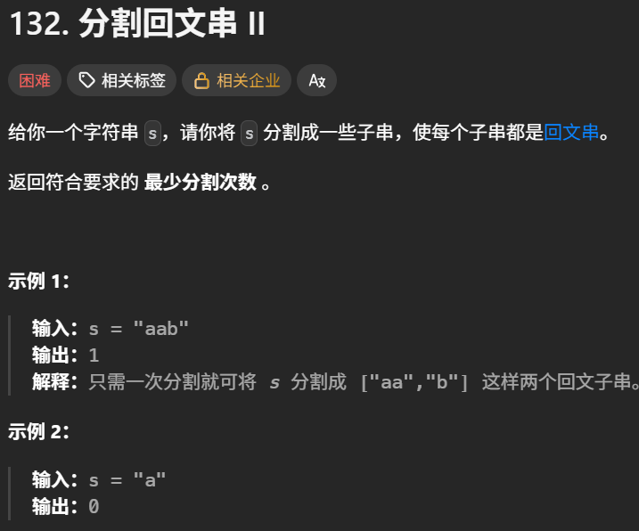

```
class Solution {
	public:
		int dp[10010];
		bool ishw[2010][2100];
		int minCut(string s) {
			for(int i=0; i<s.size(); i++) {
				ishw[i][i]=true;
			}
			for(int i=0; i+1<s.size(); i++) {
				int j = i+1;
				if(s[i]==s[j]) {
					ishw[i][j] = true;
				} else {
					ishw[i][j] = false;
				}
			}
			for(int i=s.size()-3; i>=0;i--) {
				for(int j=i+2; j<s.size(); j++) {
					if(s[i]==s[j]) {
						ishw[i][j] = ishw[i+1][j-1];
					} else {
						ishw[i][j] = false;
					}
				}
			}
			for(int i=0; i<s.size(); i++) {
				dp[i]=1e9;
				if(ishw[0][i]) {
					dp[i]=0;
					continue;
				}
				for(int j=i; j>=1; j--) {
					if(s[i]!=s[j]) {
						continue;
					}
					if(ishw[j][i]) {
						dp[i]=min(dp[i], dp[j-1]+1);
					}
				}
			}
			int n = s.size();
			return dp[n-1];
		}
};
```

```
ishw：预处理从i到j的子序列是否是回文序列
先处理长度为1和2的子序列，再处理长度为3的.注意循环顺序！！！！！！
```

## 最大化子数组的成本

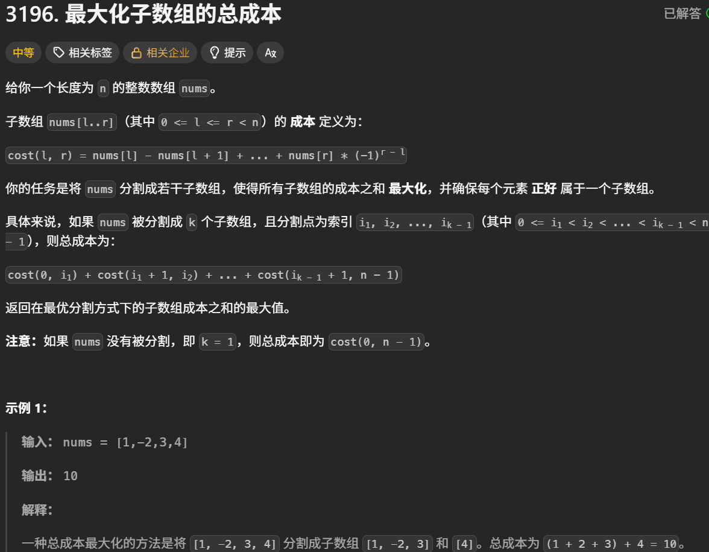

```
class Solution {
	public:
		long long int dp[100010];
		long long maximumTotalCost(vector<int>& nums) {
			dp[0]=nums[0];
			if(nums.size()>=2) {
				dp[1]=max(nums[0]+nums[1], nums[0]-nums[1]);
			}
			for(int i=2; i<nums.size(); i++) {
				dp[i]=max(dp[i-1]+nums[i], dp[i-2]+nums[i-1]-nums[i]);
			}
			int n = nums.size()-1;
			return dp[n];
		}
};
```

```
dp[i]=max(dp[i-1]+nums[i], dp[i-2]+nums[i-1]-nums[i]);
dp[i-3]的情况被包含在了dp[i-2]中，因此只需要往前看两个位置就好！
```

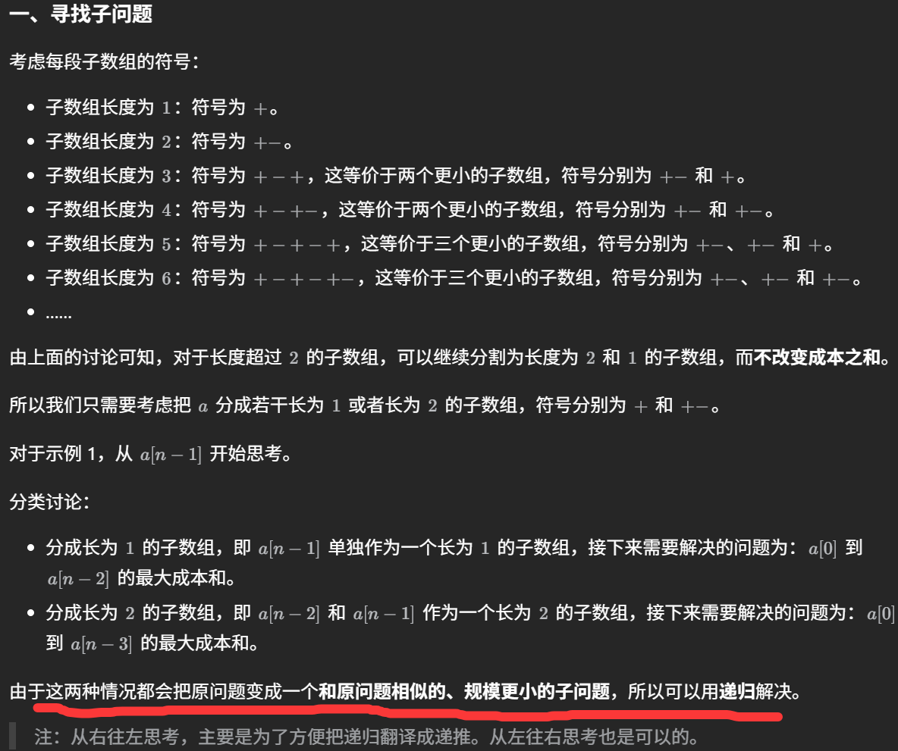

## 最长递增子序列的个数

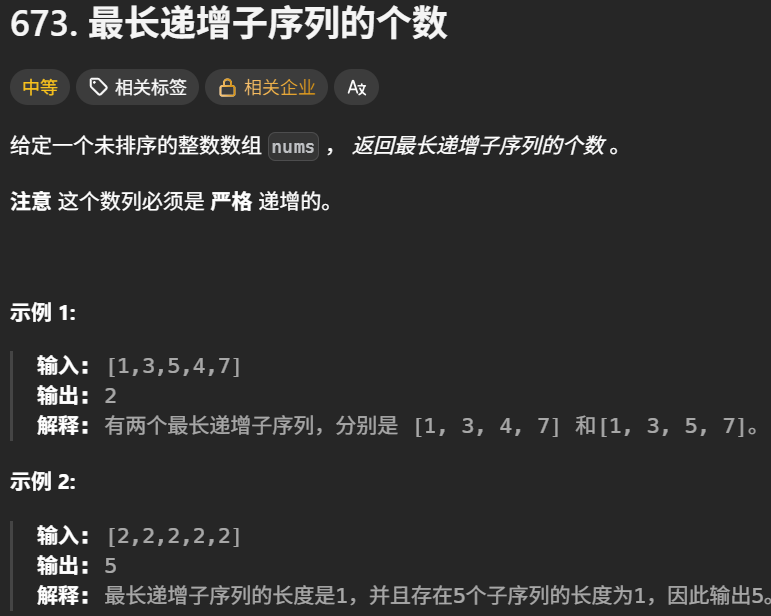

```
class Solution {
	public:
		int dp[10010];
		int max_num[10010];
		int findNumberOfLIS(vector<int>& nums) {
			for(int i=0; i<nums.size(); i++) {
				dp[i]=1;
				max_num[i]=1;
			}
			int ans=0;
			int max_len=1;
			for(int i=1; i<nums.size(); i++) {
				for(int j=0; j<i; j++) {
					if(nums[j]<nums[i]) {
						if(dp[j]+1>dp[i]) {
							max_num[i]=max_num[j];
						} else if(dp[j]+1==dp[i]) {
							max_num[i]+=max_num[j];
						}
						dp[i]=max(dp[i], dp[j]+1);
					}
				}
				max_len = max(max_len, dp[i]);
			}
			for(int i=0; i<nums.size(); i++) {
				if(dp[i]==max_len) {
					ans = ans+max_num[i];
				}
			}
			return ans;
		}
};
```

```
max_num[i]=max_num[j];
max_num[i]+=max_num[j];
找了很久的错误！
```

## 将三个组排序（问题转化成最长递增子序列）

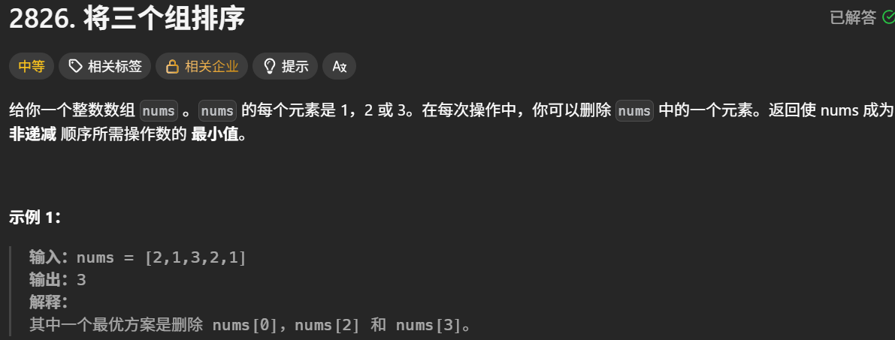

```
class Solution {
	public:
		int dp[1001];
		int minimumOperations(vector<int>& nums) {
			for(int i=0;i<nums.size();i++){
				dp[i]=1;
			}
			int temp=1;
			for(int i=1; i<nums.size(); i++) {
				for(int j=i-1; j>=0; j--) {
					if(nums[j]<=nums[i]) {
						dp[i] = max(dp[i], dp[j]+1);
					}
				}
				temp = max(temp, dp[i]);
			}
			int n = nums.size();
			return n-temp;
		}
};
```

## 得到山形数组的最少删除次数

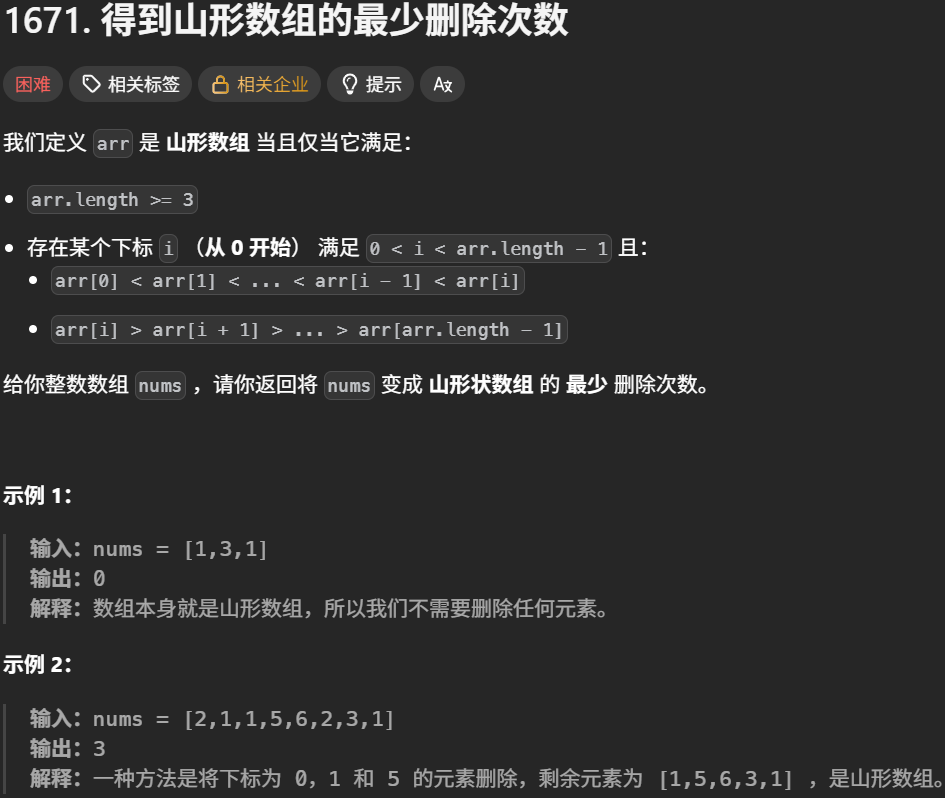

```
class Solution {
	public:
		int dp_z[10010];
		int dp_j[10010];
		int minimumMountainRemovals(vector<int>& nums) {
			for(int i=0; i<nums.size(); i++) {
				dp_z[i]=1;
				dp_j[i]=1;
			}
			for(int i=nums.size()-2; i>=0; i--) {
				for(int j=i+1; j<nums.size(); j++) {
					if(nums[j]<nums[i]) {
						dp_j[i]=max(dp_j[i], dp_j[j]+1);
					}
				}
			}
			for(int i=1; i<nums.size(); i++) {
				for(int j=i-1; j>=0; j--) {
					if(nums[j]<nums[i]) {
						dp_z[i] = max(dp_z[i], dp_z[j]+1);
					}
				}
			}
			int ans = 2e9;
			for(int i=1; i<nums.size()-1; i++) {
				int n1 = i;
				int n2 = nums.size()-i-1;
				int max_z=-1e9, max_j=-1e9;
				for(int k=0; k<=i-1; k++) {
					if(dp_z[k]>=max_z && nums[k]<nums[i]) {
						max_z = max(max_z, dp_z[k]);
					}
				}
				for(int k=i+1; k<nums.size(); k++) {
					if(dp_j[k]>=max_j && nums[k]<nums[i]) {
						max_j = max(max_j, dp_j[k]);
					}
				}
				ans = min(ans, n1-max_z+n2-max_j);
			}
			return ans;
		}
};
```

## 无矛盾的最佳球队

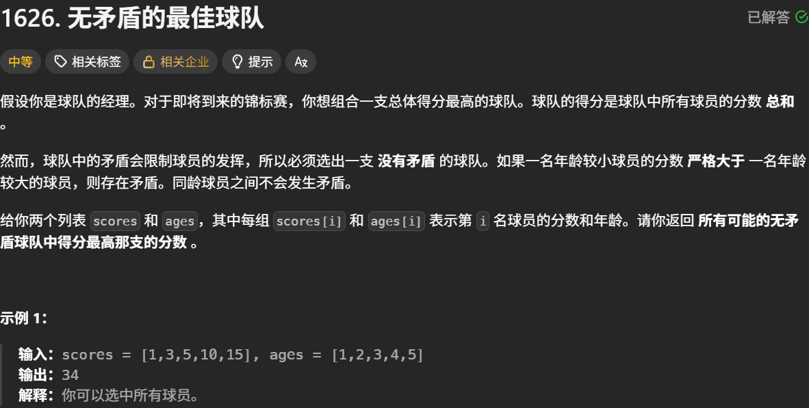

```
bool cmp(vector<int>& a, vector<int>& b) {
	if(a[1]==b[1]){
		return a[0]<b[0];
	}
	return a[1]<b[1];
}
class Solution {
	public:
		int dp[1010];
		int bestTeamScore(vector<int>& scores, vector<int>& ages) {
			vector<vector<int>> nums;
			for(int i=0; i<scores.size(); i++) {
				nums.push_back({scores[i], ages[i]});
			}
			sort(nums.begin(), nums.end(), cmp);
			dp[0]=nums[0][0];
			int ans =dp[0];
			for(int i=1; i<nums.size(); i++) {
				dp[i]=nums[i][0];
				for(int j=i-1; j>=0; j--) {
					if(nums[i][1]==nums[j][1] || (nums[i][1]!=nums[j][1] && nums[i][0]>=nums[j][0])) {
						dp[i]=max(dp[i], dp[j]+nums[i][0]);
					}
				}
				ans = max(ans, dp[i]);
			}
			return ans;
		}
};

```

```
按年龄从小到大排序，得分从小到大（一定要这样，为什么下面会说）

为什么要按年龄排序呢？有贪心的意味：
dp表示前0到i位球员，包含第i位球员，得分最高的分数
dp[i]的计算往前看：年龄一样，就计算更新一下max，年龄不一样，就比较一下分数，如果i的分数>=j的分数，那就更新一下max。（这么做的原因是：如果i的分数>=j的分数，那么一定可以更新，因为在j队伍中的年龄一定<=i并且得分一定<=j，所以一定不会有矛盾）

为什么排序的时候得分从小到大要排？当有三个人年龄一样，都是2，2，2，得分却是3，2，1这样直接更新max就不对了，因为可能有某队伍包含了这三个2，但是它的得分大于1小于3，此时直接比较最后一个2来更新max就不对了
```


## 任意子数组和的最大绝对值

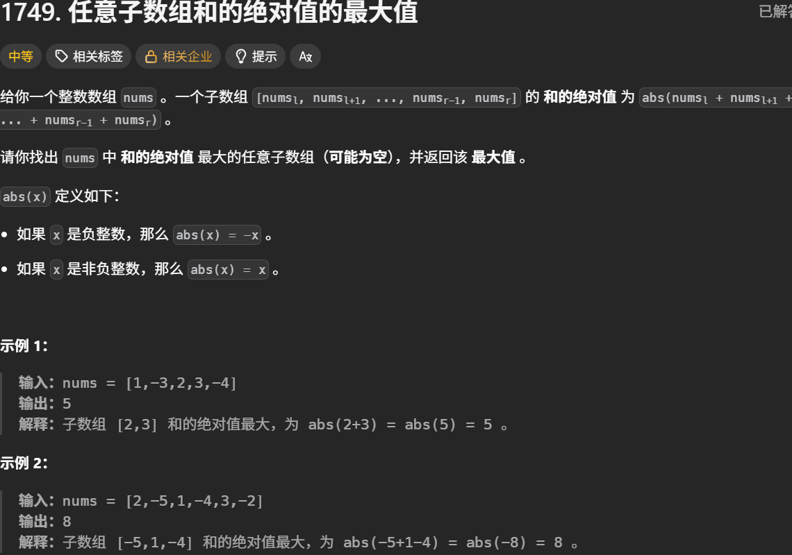

```
class Solution {
	public:
		int dp_min[100010];
		int dp_max[100010];
		int maxAbsoluteSum(vector<int>& nums) {
			for(int i=0; i<nums.size(); i++) {
				if(i==0) {
					dp_min[i]=nums[i];
					dp_max[i]=nums[i];
					continue;
				}
				dp_min[i] = min(nums[i], dp_min[i-1]+nums[i]);
				dp_max[i] = max(nums[i], dp_max[i-1]+nums[i]);
			}
			int ans = -1e9;
			for(int i=0; i<nums.size(); i++) {
				ans = max(ans, abs(dp_min[i]));
				ans = max(ans, abs(dp_max[i]));
			}
			return ans;
		}
};
```

```
一个变量绝对值的最大值，可能是这个变量的最大值的绝对值，也可能是这个变量的最小值的绝对值。题目要求任意子数组和的绝对值的最大值，可以分别求出子数组和的最大值和子数组和的最小值，最后对绝对值求一个max即可
```

```
最快的办法是
由于子数组和等于两个前缀和的差，那么取前缀和中的最大值与最小值，它俩的差就是答案。
如果最大值在最小值右边，那么算的是最大子数组和。
如果最大值在最小值左边，那么算的是最小子数组和的绝对值（相反数）。
```

## 统计异或值为给定值的路径数目

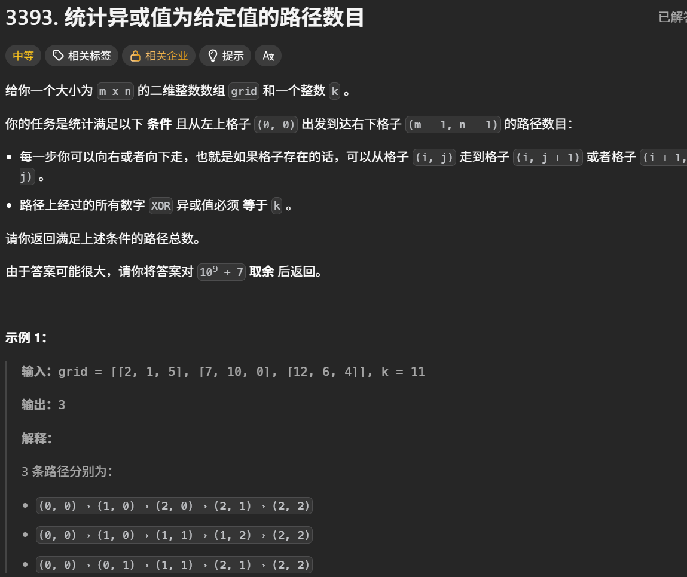

```
class Solution {
	public:
		int mod = 1e9+7;
		int dp[400][400][80];
		int countPathsWithXorValue(vector<vector<int>>& grid, int k) {
			int h = grid.size();
			int l = grid[0].size();
			dp[0][0][grid[0][0]]=1;
			for(int i=1; i<h; i++) {
				for(int j=0; j<40; j++) {
					if(dp[i-1][0][j]!=0) {
						dp[i][0][grid[i][0]^j]=1;
					}
				}
			}
			for(int i=1; i<l; i++) {
				for(int j=0; j<40; j++) {
					if(dp[0][i-1][j]!=0) {
						dp[0][i][grid[0][i]^j]=1;
					}
				}
			}
			for(int i=1; i<h; i++) {
				for(int j=1; j<l; j++) {
					for(int t=0; t<40; t++) {
						dp[i][j][grid[i][j]^t]=(dp[i][j][grid[i][j]^t]+dp[i-1][j][t])%mod;
					}
					for(int t=0; t<40; t++) {
						dp[i][j][grid[i][j]^t]=(dp[i][j][grid[i][j]^t]+dp[i][j-1][t])%mod;
					}
				}
			}
			int ans =0;
			return dp[h-1][l-1][k];
		}
};

```

```
dp的第三维度记录异或值
别忘%mod
```

## 矩阵的最大非负积

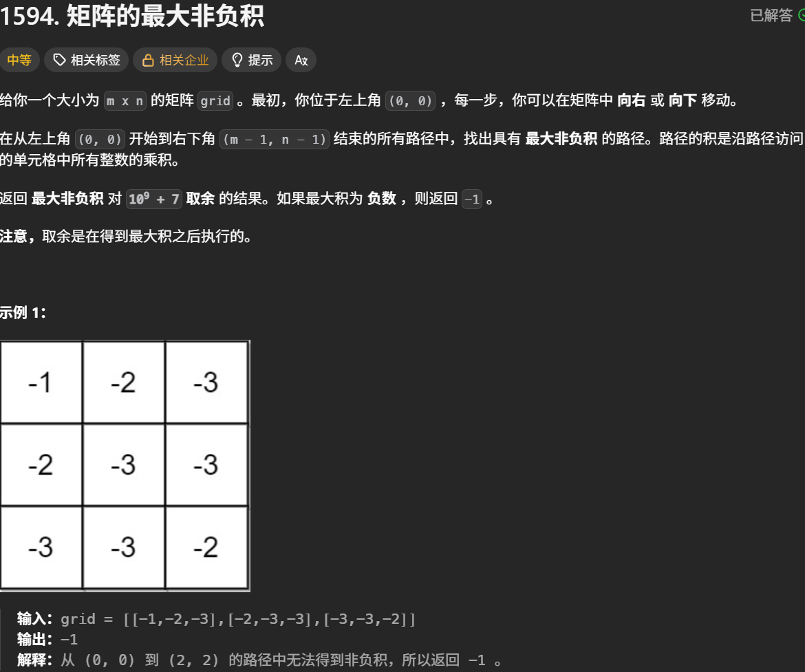

```
class Solution {
	public:
		int h, l;
		long long int ans = -1e9;
		int mod = 1e9+7;
		long long int dp[30][30][2];
		int maxProductPath(vector<vector<int>>& grid) {
			int h = grid.size();
			int l = grid[0].size();
			dp[0][0][1]=grid[0][0];
			dp[0][0][0]=dp[0][0][1];
			for(int i=1; i<h; i++) {
				dp[i][0][1]=dp[i-1][0][1]*grid[i][0];
				dp[i][0][0]=dp[i][0][1];
			}
			for(int i=1; i<l; i++) {
				dp[0][i][1]=dp[0][i-1][1]*grid[0][i];
				dp[0][i][0]=dp[0][i][1];
			}
			for(int i=1;i<h;i++){
				for(int j=1;j<l;j++){
					int max_ele = -1e9;
					int min_ele = 1e9;
					dp[i][j][1] = max(grid[i][j]*dp[i-1][j][1], grid[i][j]*dp[i-1][j][0]);
					dp[i][j][0] = min(grid[i][j]*dp[i-1][j][1], grid[i][j]*dp[i-1][j][0]);
					
					dp[i][j][1] = max(dp[i][j][1], grid[i][j]*dp[i][j-1][1]);
					dp[i][j][1] = max(dp[i][j][1], grid[i][j]*dp[i][j-1][0]);
					
					dp[i][j][0] = min(dp[i][j][0], grid[i][j]*dp[i][j-1][1]);
					dp[i][j][0] = min(dp[i][j][0], grid[i][j]*dp[i][j-1][0]);
				}
			}
			if(dp[h-1][l-1][1]<0){
				return -1;
			}
			return dp[h-1][l-1][1]%mod;
		}
};

```

```
维护好每个最大值就好
```

##

# DFS

## 排列数字（选择问题）

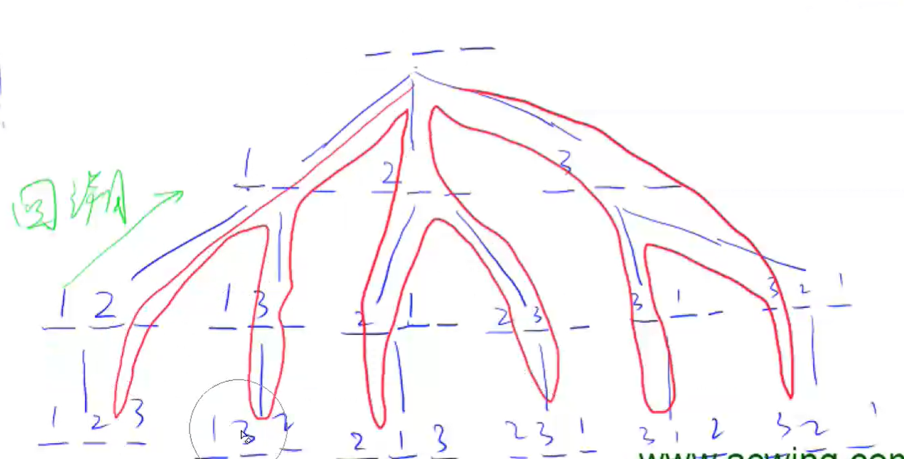

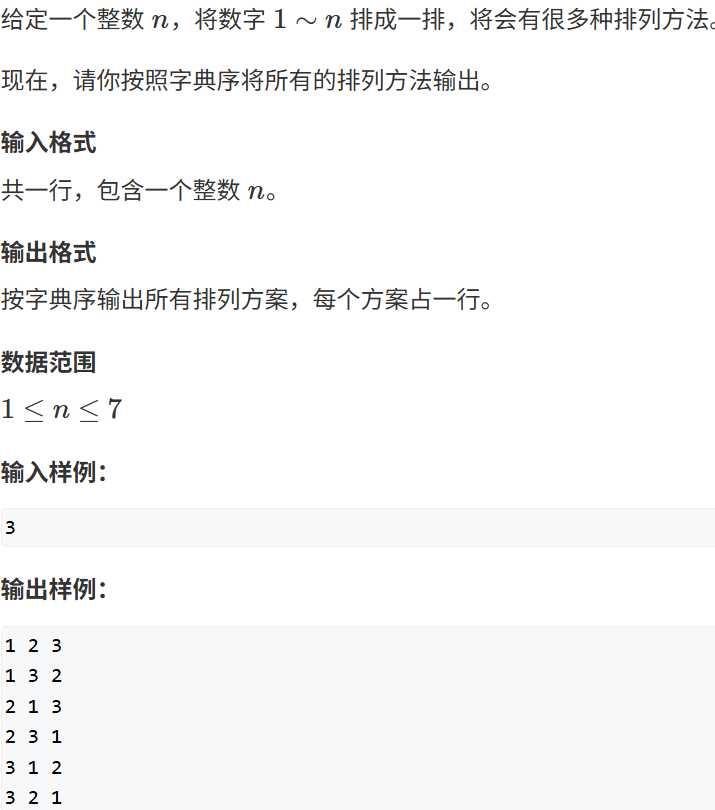

```
int n;
int p[10];
int use[10];
void dfs(int x) {
	if(x==n+1) {
		for(int i=1; i<=n; i++) {
			cout<<p[i]<<' ';
		}
		cout<<endl;
		return;
	}
	for(int i=1; i<=n; i++) {
		if(use[i]==0) {
			p[x] = i;
			use[i]=1;
			dfs(x+1);
			use[i]=0;
		}
	}
}
int main() {
	scanf("%d", &n);
	dfs(1);
}
```

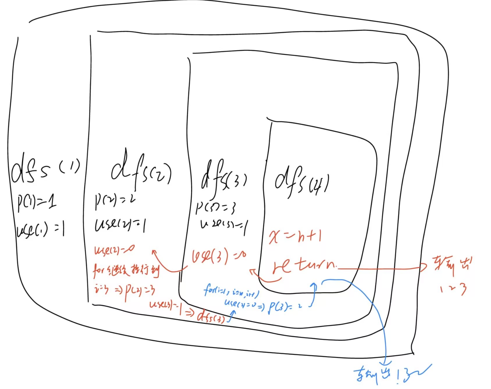

力扣上的题目，nums\[i]可以是负数，换成hash表

```
class Solution {
	public:
		vector<int> temp;
		vector<vector<int>> ans;
		unordered_map<int, bool> use;
		void dfs(vector<int>& nums) {
			if(temp.size()==nums.size()) {
				ans.push_back(temp);
				return;
			}
			for(int i=0;i<nums.size();i++){
				if(use[nums[i]]==false){
					use[nums[i]]=true;
					temp.push_back(nums[i]);
					dfs(nums);
					temp.pop_back();
					use[nums[i]]=false;
				}
			}
			return;
		}
		vector<vector<int>> permute(vector<int>& nums) {
			for(int i=0;i<nums.size();i++){
				use[nums[i]]=false;
			}
			dfs(nums);
			return ans;
		}
};
```

## 排列数字Ⅱ

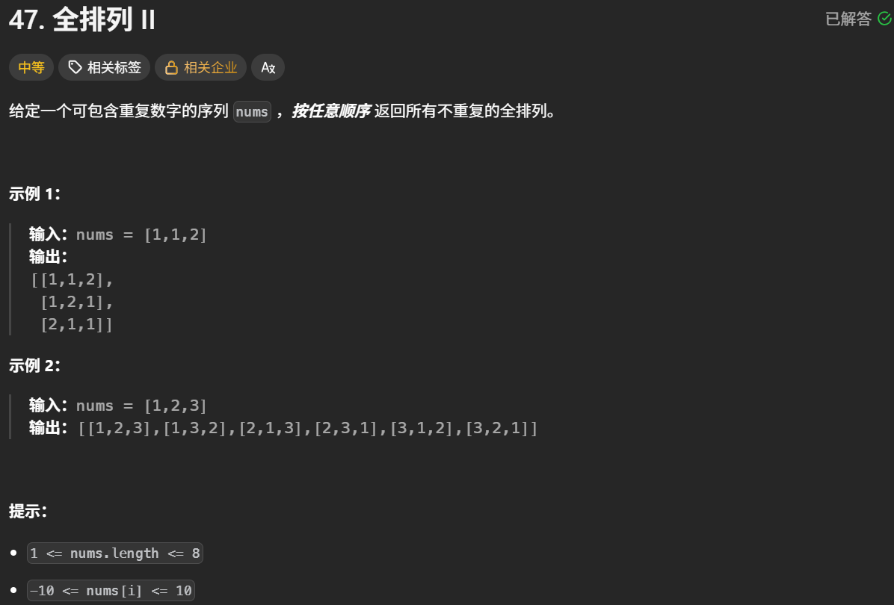

```
class Solution {
	public:
		vector<int> temp;
		set<vector<int>> ans;
		bool use[100];
		void dfs(vector<int>& nums) {
			if(temp.size()==nums.size()) {
				ans.insert(temp);
				return;
			}
			for(int i=0; i<nums.size(); i++) {
				if(use[i]==false) {
					use[i]=true;
					temp.push_back(nums[i]);
					dfs(nums);
					temp.pop_back();
					use[i]=false;
				}
			}
			return;
		}
		vector<vector<int>> permuteUnique(vector<int>& nums) {
			for(int i=0; i<nums.size(); i++) {
				use[i]=false;
			}
			dfs(nums);
			vector<vector<int>> res;
			for(const auto& ele:ans){
				res.push_back(ele);
			}
			return res;
		}
};
int main(){
	Solution a;
	vector<int> nums = {1,1,2};
	vector<vector<int>> r = a.permuteUnique(nums);
	for(int i=0;i<r.size();i++){
		for(int j=0;j<r[i].size();j++){
			cout<<r[i][j]<<' ';
		}
		cout<<endl;
	}
}
```

这里用的set去重复

如果不用set的话

```
class Solution {
	public:
		vector<int> temp;
		vector<vector<int>> ans;
		bool use[100];
		void dfs(vector<int>& nums) {
			if(temp.size()==nums.size()) {
				ans.push_back(temp);
				return;
			}
			for(int i=0; i<nums.size(); i++) {
				if(i>0 && nums[i]==nums[i-1] && use[i-1]==false){
					continue;
				}
				if(use[i]==false) {
					use[i]=true;
					temp.push_back(nums[i]);
					dfs(nums);
					temp.pop_back();
					use[i]=false;
				}
			}
			return;
		}
		vector<vector<int>> permuteUnique(vector<int>& nums) {
			sort(nums.begin(), nums.end()); 
			for(int i=0; i<nums.size(); i++) {
				use[i]=false;
			}
			dfs(nums);
			return ans;
		}
};
```

先排序

```
if(i>0 && nums[i]==nums[i-1] && use[i-1]==false){
	continue;
}
```

## 子集问题（选择问题）

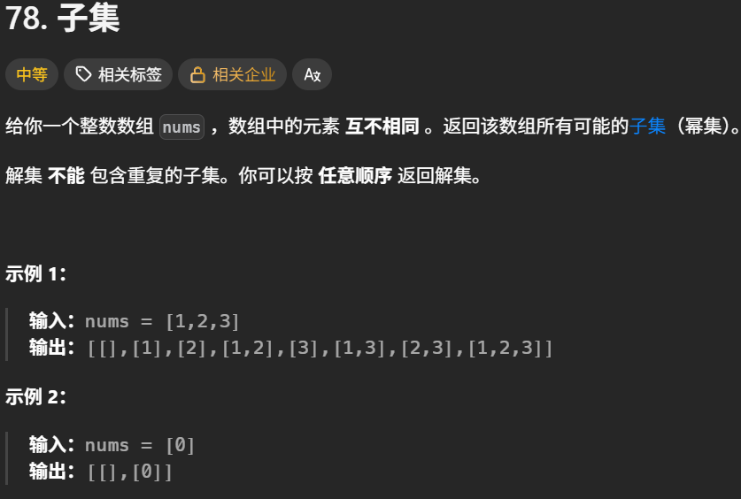

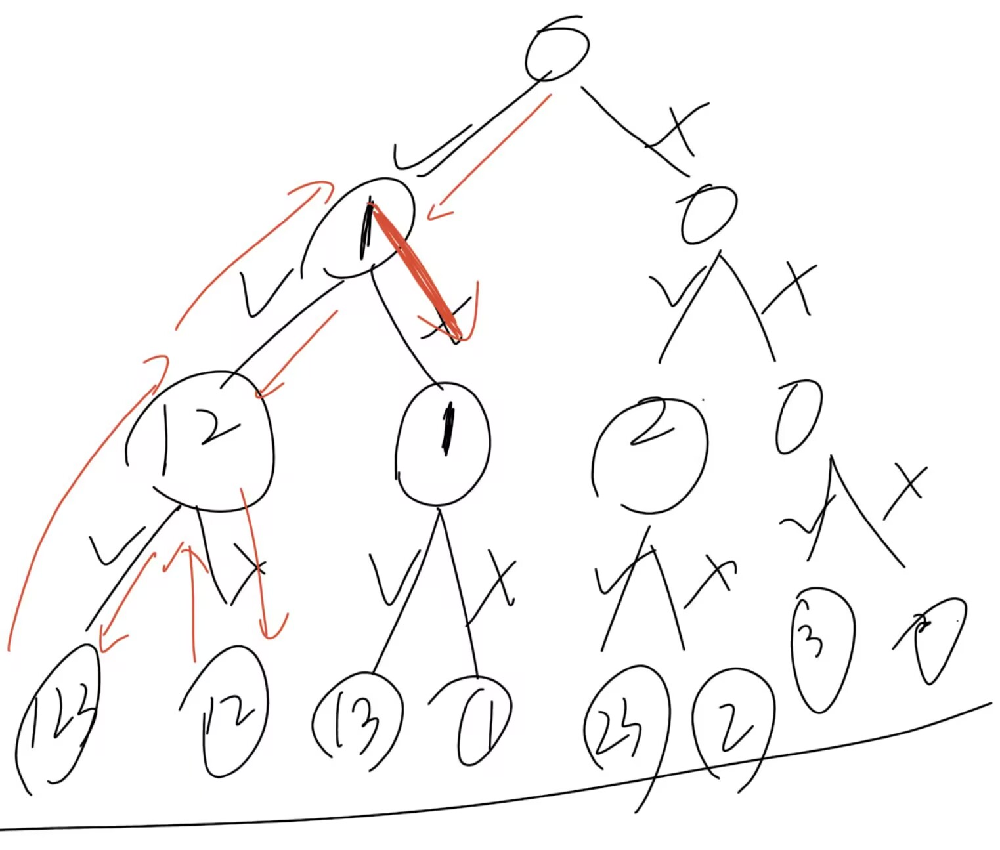

```
class Solution {
	public:
		int n;
		vector<vector<int>> ans;
		vector<int> p;
		void dfs(int x, vector<int>& nums) {
			if(x==n){
				ans.push_back(p);
				return;
			}
			// 不选
			dfs(x+1, nums);
			
			// 选
			p.push_back(nums[x]);
			dfs(x+1, nums);
			p.pop_back();
			return;
		}
		vector<vector<int>> subsets(vector<int>& nums) {
			n = nums.size();
			dfs(0, nums);
			return ans;
		}
};
```

搜的是目前放到了数组中的第几位上，这么个搜索方向肯定能搜完

每个位置上都有两个选择，选和不选。选完回溯要记得还原

**终止条件后不需要还原！！！！！**

## N皇后问题

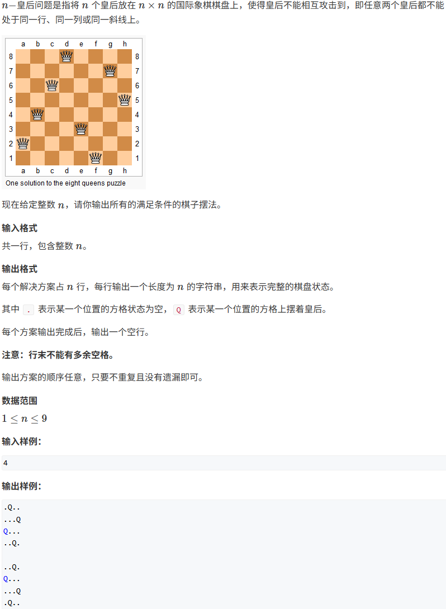

搜的是：第 x 行里面有哪些**列**能放 Q ？

比如说有4行，那么就是找一个排列：

- — — — —，表示4行的每一行里哪一列能放？那么问题就是变成了：
  - 找1到4的全排列，然后按照 Q 的摆放规则进行剪枝

```
bool h[20];
bool l[20];
bool dj[100];
bool fdj[100];
int n;
char pan[20][20];
void dfs(int x) {
	if(x==n+1) {
		for(int i=1; i<=n; i++) {
			for(int j=1; j<=n; j++) {
				cout<<pan[i][j];
			}
			cout<<endl;
		}
		cout<<endl; 
		return;
	}
	for(int i=1;i<=n;i++){
		int y = i;
		if(h[x]==false && l[y]==false && fdj[y-x+n+1]==false && dj[y+x-n+1]==false){
			h[x]=true;
			l[y]=true;
			fdj[y-x+n+1]=true;
			dj[y+x-n+1]=true;
			pan[x][y]='Q';
			dfs(x+1);
			h[x]=false;
			l[y]=false;
			fdj[y-x+n+1]=false;
			dj[y+x-n+1]=false;
			pan[x][y]='.';
		}
	}
	return;
}
int main() {
	cin>>n;
	for(int i=1; i<=n; i++) {
		for(int j=1; j<=n; j++) {
			pan[i][j]='.';
		}
	}
	dfs(1);
}

```

```
int n;
char ans[20][20];
int hang[20], lie[20], dj[20], fdj[20];
void dfs(int x, int y ,int s) {
	if(y==n+1) {
		y=1;
		x++;
	}
	if(x==n+1) {
		if(s==n) {     
			for(int i=1; i<=n; i++) {
				for(int j=1; j<=n; j++) {
					cout<<ans[i][j];
				}
				cout<<endl;
			}
			cout<<endl;
		}
		return;
	}
	
	// 不放皇后
	dfs(x, y+1, s);

	// 放皇后
	if(hang[x]==0 && lie[y]==0 && dj[y+x-2]==0 && fdj[y-x+n-1]==0) {
		ans[x][y] = 'Q';
		hang[x] = 1;
		lie[y]=1;
		dj[y+x-2]=1;
		fdj[y-x+n-1]=1;

		dfs(x, y+1, s+1);

		hang[x] = 0;
		lie[y]=0;
		dj[y+x-2]=0;
		fdj[y-x+n-1]=0;
		ans[x][y] = '.';
	}

}
int main() {
	scanf("%d", &n);
	for(int i=1; i<=n; i++) {
		for(int j=1; j<=n; j++) {
			ans[i][j] = '.';
		}
	}
	dfs(1, 1, 0);
}
```

这种办法（正常人的思路）是：按照 Z 字路径去搜索，每一个位置都有选和不选两种路径，不选好说，直接进行。选的话要符合要求才能选（注意回溯的时候要还原）

**终止条件后不需要还原！！！！！**

## 单词搜索

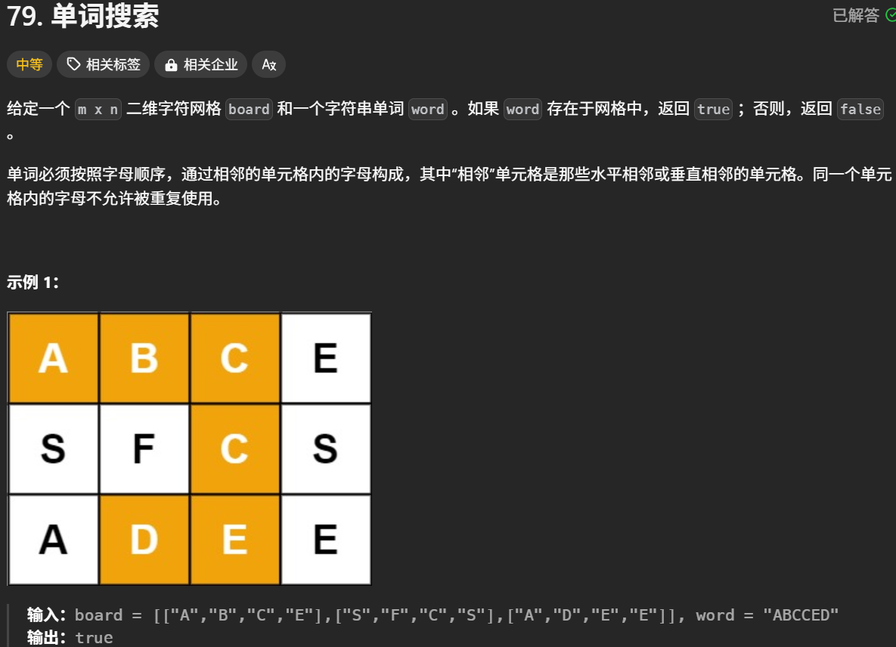

```
int h, l;
int a[20][20];
class Solution {
	public:
		bool dfs(int x, int y, int s, vector<vector<char>>& board, string word) {
			if(x==-1 || x==h || y==-1 || y==l || board[x][y]!=word[s] || a[x][y]==1) {
				return false;
			}
			if(s==word.size()-1) {
				return true;
			}
			a[x][y] = 1;
			bool ans = dfs(x, y+1, s+1, board, word)||dfs(x, y-1, s+1, board, word)||dfs(x-1, y, s+1, board, word)||dfs(x+1, y, s+1, board, word);
			a[x][y] = 0;
			return ans;
		}
		bool exist(vector<vector<char>>& board, string word) {
			h = board.size();
			l = board[0].size();
			bool ans=0;
			for(int i=0; i<h; i++) {
				for(int j=0; j<l; j++) {
					ans = ans || dfs(i, j, 0, board, word);
				}
			}
			return ans;
		}
};
```

- 在主程序里构建循环：把每一个格子都当作一个起点，开始搜索
- dfs里面，向四个方向搜索
- 如果
  - 超出边界，返回false
  - 当前单词不匹配，返回false
  - 当前格子在同一个起点下被搜索过了，返回false
- 只要没有被返回false，都要给这个格子记录一下他被搜索了
- 回溯的时候，把所有搜索过的格子的记录都重置掉，来给下面的其他格子作为起点时不会有冲突

## 岛屿搜索

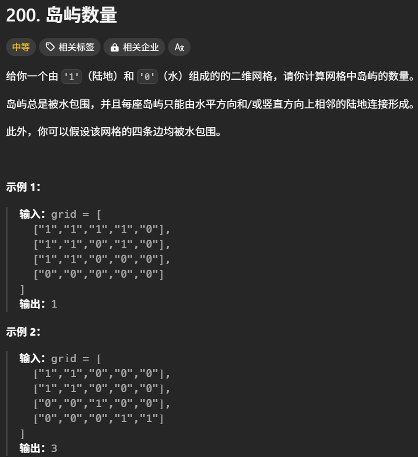

```
class Solution {
	public:
		int a[400][400];
		int h, l;
		void dfs(int x, int y, vector<vector<char>>& grid) {
//			cout<<x<<' '<<y<<endl;
			if(x==-1 || x==h || y==-1 || y==l || a[x][y]==1 || grid[x][y]=='0') {
				return;
			}
			a[x][y] = 1;
			dfs(x, y+1, grid);
			dfs(x, y-1, grid);
			dfs(x-1, y, grid);
			dfs(x+1, y, grid);
			return;
		}
		int numIslands(vector<vector<char>>& grid) {
			h = grid.size();
			int ans = 0;
			l = grid[0].size();
			for(int i=0; i<h; i++) {
				for(int j=0; j<l; j++) {
					if(grid[i][j]=='1' && a[i][j]==0) {
						dfs(i, j, grid);
						ans++;
					}
				}
			}
			return ans;
		}
};
```

下一版代码：

```
int n,m;
int d[100][100];
bool use[100][100];
void dfs(int x, int y) {
	if(d[x][y]==0 || x>n || y>m || x<1 || y<1 || use[x][y]==true) {
		return;
	}
	// xia
	use[x][y]=true;
	dfs(x, y+1);
	dfs(x+1, y);
//	dfs(x-1, y);
	dfs(x, y-1);
	return;
}
int main() {
	int ans=0;
	cin>>n>>m;
	for(int i=1; i<=n; i++) {
		for(int j=1; j<=m; j++) {
			scanf("%d", &d[i][j]);
		}
	}
	for(int i=1; i<=n; i++) {
		for(int j=1; j<=m; j++) {
			if(d[i][j]==1 && use[i][j]==false) {
				dfs(i, j);
				ans++;
			}
		}
	}
	cout<<ans;
}
```

```
注意：
1. 虽然我们从左上角开始搜索，但是我们得搜索方向一定是四个方向都要涵盖。
如果没有右方向，则会出现这个样例答案是2：
0 0 0
0 1 0
1 1 1

如果没有上方向，这会出现下面这例子答案是2：
0 1 1
1 1 1

2. x>n || y>m || x<1 || y<1这几个条件一定都要涵盖！当有一个位置是-1得时候，就会有数组越界，导致内存超限！
```

## 岛屿最大面积

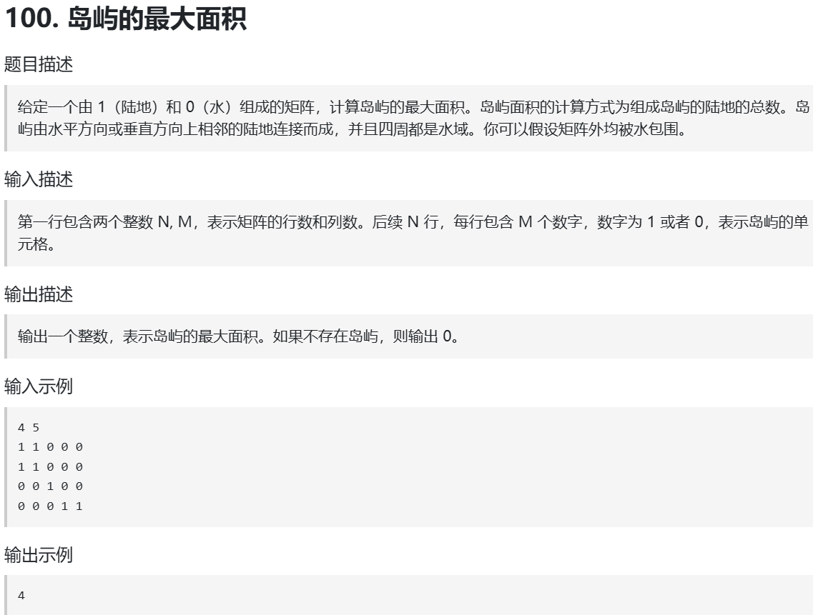

```
int n,m;
int d[100][100];
bool use[100][100];
int ans=0;
int dfs(int x, int y) {
	if(d[x][y]==0 || x>n || y>m || x<1 || y<1 || use[x][y]==true) {
		return 0;
	}
	// xia
	int S=1;
	ans = max(ans, S);
	use[x][y]=true;
	S+=dfs(x, y+1);
	S+=dfs(x+1, y);
	S+=dfs(x-1, y);
	S+=dfs(x, y-1);
	return S;
}
int main() {
	cin>>n>>m;
	for(int i=1; i<=n; i++) {
		for(int j=1; j<=m; j++) {
			scanf("%d", &d[i][j]);
		}
	}
	for(int i=1; i<=n; i++) {
		for(int j=1; j<=m; j++) {
			if(d[i][j]==1 && use[i][j]==false) {
				int S = dfs(i, j);
				ans = max(ans, S);
			}
		}
	}
	cout<<ans;
}
```

## 孤岛的面积

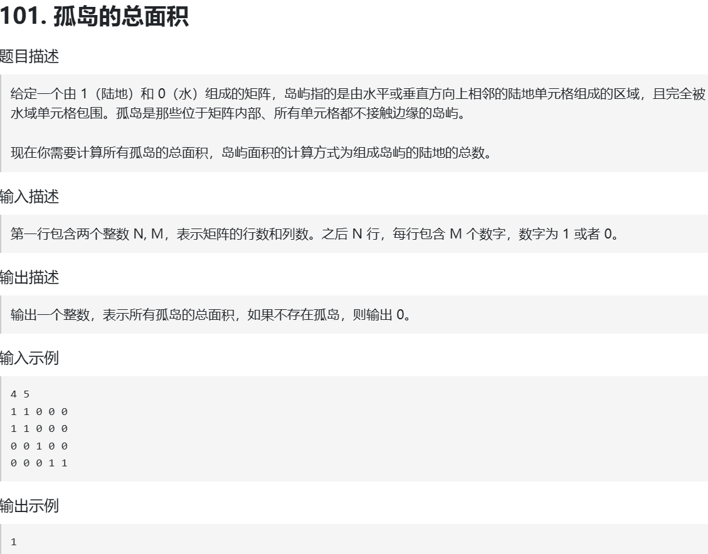

```
int n,m;
int d[100][100];
bool use[100][100];
int ans=0;
bool is_lonely=true;
int dfs(int x, int y) {
	if(x==n+1 || x==0 || y==0 || y==m+1) {
		is_lonely=false;
		return 0;
	}
	if(d[x][y]==0 || use[x][y]==true) {
		return 0;
	}
	int S=1;
	use[x][y]=true;
	S+=dfs(x, y+1);
	S+=dfs(x+1, y);
	S+=dfs(x-1, y);
	S+=dfs(x, y-1);
	return S;
}
int main() {
	cin>>n>>m;
	for(int i=1; i<=n; i++) {
		for(int j=1; j<=m; j++) {
			scanf("%d", &d[i][j]);
		}
	}
	for(int i=1; i<=n; i++) {
		for(int j=1; j<=m; j++) {
			if(d[i][j]==1 && use[i][j]==false) {
				is_lonely=true;
				int S = dfs(i, j);
				cout<<S<<endl;
				if(is_lonely==true) {
					ans+=S;
				}
			}
		}
	}
	cout<<ans;
}
```

```
记录当搜到边界外的点的时候，说明当前这个岛屿不可能是孤岛，用is_lonely记录！
```

## 沉没孤岛

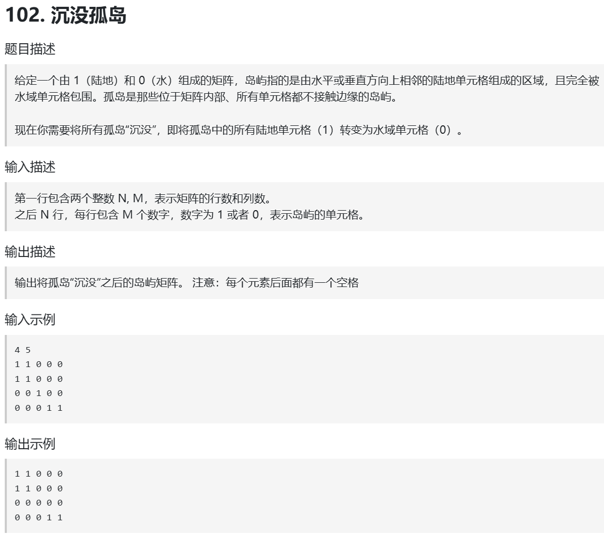

```
int g[100][100];
int n, m;
bool use[100][100];
bool exist[100][100];
bool is_lonely(int x, int y) {
	bool temp=true;
	if(x==0 || x==n+1 || y==0 || y==m+1) {
		return false;
	}
	if(exist[x][y]==true || g[x][y]==0) {
		return true;
	}
	exist[x][y]=true;
	temp = temp & is_lonely(x+1, y);
	temp = temp & is_lonely(x, y+1);
	temp = temp & is_lonely(x-1, y);
	temp = temp & is_lonely(x, y-1);
	return temp;
}
void dfs(int x, int y, bool isgudao) {
	if(use[x][y]==true || g[x][y]==0) {
		return;
	}
	use[x][y]=true;
	if(isgudao==true) {
		g[x][y]=0;
	}
	dfs(x+1, y, isgudao);
	dfs(x, y+1, isgudao);
	dfs(x-1, y, isgudao);
	dfs(x, y-1, isgudao);
	return;
}
int main() {
	cin>>n>>m;
	for(int i=1; i<=n; i++) {
		for(int j=1; j<=m; j++) {
			scanf("%d", &g[i][j]);
		}
	}
	for(int i=1; i<=n; i++) {
		for(int j=1; j<=m; j++) {
			if(g[i][j]==1 && use[i][j]==false) {
				bool temp = is_lonely(i, j);
				dfs(i, j, temp);
			}
		}
	}
	for(int i=1; i<=n; i++) {
		for(int j=1; j<=m; j++) {
			cout<<g[i][j]<<' ';
		}
		cout<<endl;
	}
}
```

最傻瓜的做法，先判断这个岛屿是不是孤岛，然后再消除孤岛

两次dfs

下面的做法：先溜边把非孤岛处理成0，再输出

```
int g[100][100];
int d[100][100];
int n, m;
bool use[100][100];
void dfs(int x, int y) {
	if(x<1 || x>n || y<1 || y>m || g[x][y]==0 || use[x][y]==true) {
		return;
	}
	use[x][y]=true;
	g[x][y]=0;
	dfs(x+1, y);
	dfs(x-1, y);
	dfs(x, y+1);
	dfs(x, y-1);
	return;
}
int main() {
	cin>>n>>m;
	for(int i=1; i<=n; i++) {
		for(int j=1; j<=m; j++) {
			scanf("%d", &g[i][j]);
			d[i][j]=g[i][j];
		}
	}
	for(int j=1; j<=m; j++) {
		if(g[1][j]==1 && use[1][j]==false) {
			dfs(1, j);
		}
	}
	for(int i=1; i<=n; i++) {
		if(g[i][m]==1 && use[i][m]==false) {
			dfs(i, m);
		}
	}
	for(int i=m; i>=1; i--) {
		if(g[n][i]==1 && use[n][i]==false) {
			dfs(n, i);
		}
	}
	for(int i=n; i>=1; i--) {
		if(g[i][1]==1 && use[i][1]==false) {
			dfs(i, 1);
		}
	}
	for(int i=1; i<=n; i++) {
		for(int j=1; j<=m; j++) {
			if(d[i][j]==1 && g[i][j]==1){
				cout<<0<<' ';
			}else{
				cout<<d[i][j]<<' ';
			}
		}
		cout<<endl;
	}
}
```

## 建造最大岛屿

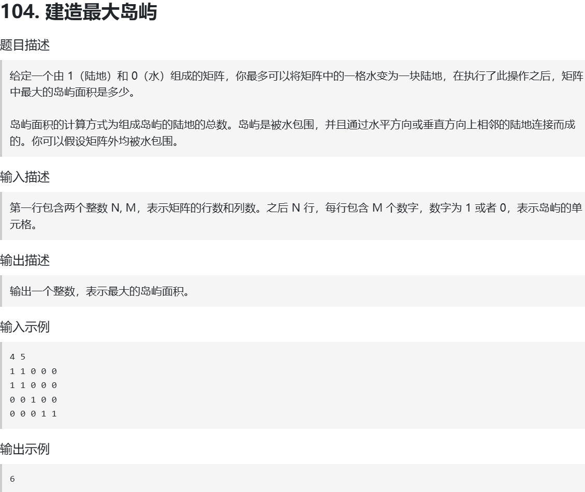

```
int n,m;
int g[100][100];
int hao[100][100];
int key=1;
bool use[100][100];
int dx[4]= {0, 0, -1, 1};
int dy[4]= {1, -1, 0, 0};
unordered_map<int, int> dic_S;
int dfs(int x, int y) {
	if(x<1 || x>n || y<1 || y>m || g[x][y]==0 || use[x][y]==true) {
		return 0;
	}
	int S =1;
	use[x][y]=true;
	hao[x][y]=key;
	S = S+dfs(x+1, y);
	S = S+dfs(x, y+1);
	S = S+dfs(x-1, y);
	S = S+dfs(x, y-1);
	return S;
}
int main() {
	int ans = 1;
	cin>>n>>m;
	for(int i=1; i<=n; i++) {
		for(int j=1; j<=m; j++) {
			scanf("%d", &g[i][j]);
		}
	}
	for(int i=1; i<=n; i++) {
		for(int j=1; j<=m; j++) {
			if(g[i][j]==1 && use[i][j]==false) {
				int S = dfs(i, j);
				dic_S[key]=S;
				ans = max(ans, S);
				key++;
			}
		}
	}

	for(int i=1; i<=n; i++) {
		for(int j=1; j<=m; j++) {
			if(g[i][j]==0) {
				int temp=1;
				bool dir[25000]= {false};
				for(int k=0; k<4; k++) {
					int x = i+dx[k];
					int y = j+dy[k];
					if(x<1 || x>n || y<1 || y>m || g[x][y]==0) {
						continue;
					} else {
						int idx = hao[x][y];
						if(dir[idx]==false) {
							temp = temp + dic_S[idx];
							dir[idx]=true;
						}
					}
				}
				ans = max(ans, temp);
			}
		}
	}
	cout<<ans;
}
```

````
先把岛的面积算出来
然后遍历每一处水域，加一下周围岛屿的面积（借助哈希表查询岛屿序号）
````

## 电话号码的字母组合（选择问题）

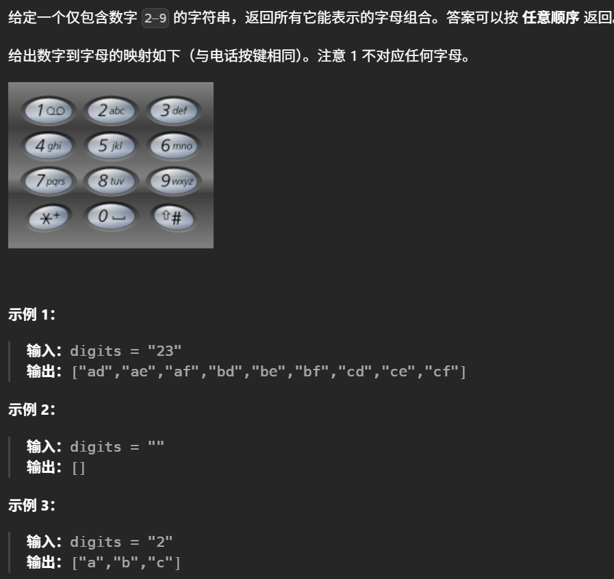

```
int cx[100][100];
class Solution {
	public:
		string temp;
		unordered_map<char, string> dic;
		vector<string> ans;
		void dfs(int x, string digits) {
			if(x==digits.size()) {
				ans.push_back(temp);
//				cout<<x<<endl;
				return;
			}
			char t = digits[x];
			string s = dic[t];
			for(int i=0; i<s.size(); i++) {
				if(cx[x][s[i]-'a']==0) {
					temp.push_back(s[i]);
					cx[x][s[i]-'a']=1;
					dfs(x+1, digits);
					cx[x][s[i]-'a']=0;
					temp.pop_back();
				}
			}
			return;
		}
		vector<string> letterCombinations(string digits) {
			dic['2'] = "abc";
			dic['3'] = "def";
			dic['4'] = "ghi";
			dic['5'] = "jkl";
			dic['6'] = "mno";
			dic['7'] = "pqrs";
			dic['8'] = "tuv";
			dic['9'] = "wxyz";
			if(digits.size()==0) {
				return ans;
			}
			dfs(0, digits);
			return ans;
		}
};
```

## 组合总数（选择问题）

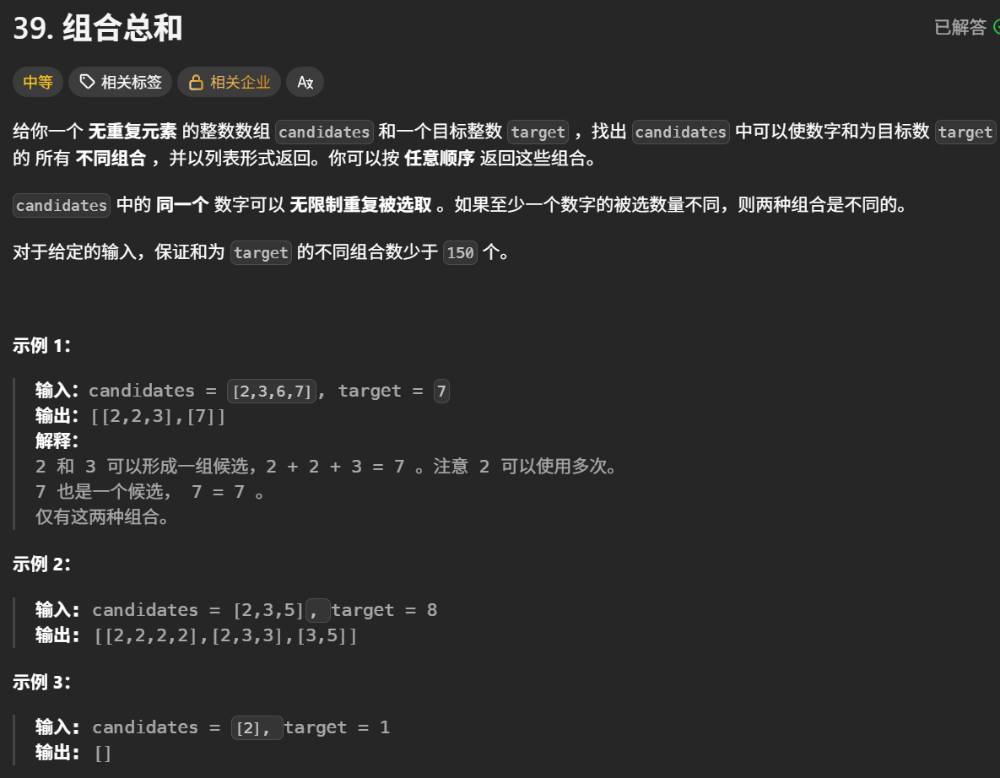

```
class Solution {
	public:
		vector<vector<int>> ans;
		vector<int> temp;
		void dfs(vector<int>& nums, int target, int pos, int sum) {
			if(sum>target) {
				return;
			}
			if(sum>=target) {
				ans.push_back(temp);
				return;
			}
			for(int i=pos; i<nums.size(); i++) {
				temp.push_back(nums[i]);
				dfs(nums, target, i, sum+nums[i]);
				temp.pop_back();
			}
			return;
		}
		vector<vector<int>> combinationSum(vector<int>& candidates, int target) {
			dfs(candidates, target, 0, 0);
			return ans;
		}
};
```

以candidates的位数作为搜索方向。

求和等于target做一次答案记录

求和超过target则回溯，做恢复

在目前这个位置上，仍然可以添加自己！（i=pos）

## 组合总数Ⅱ（选择问题）

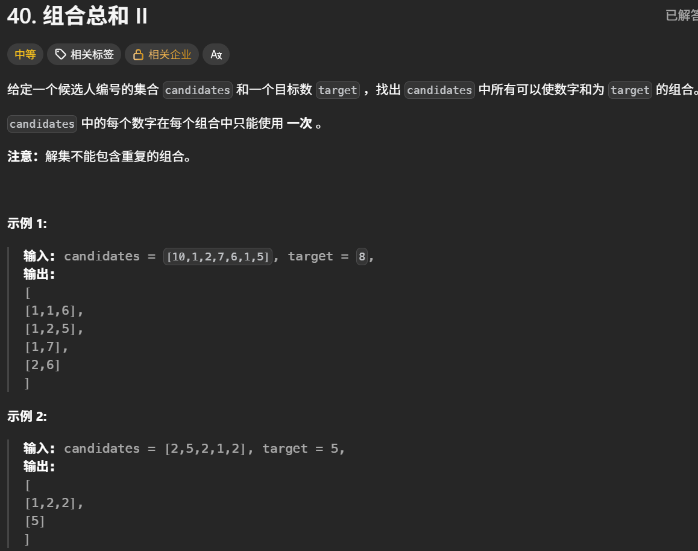

```
class Solution {
	public:
		vector<vector<int>> res;
		vector<int> temp;
		void dfs(vector<int>& nums, int target, int pos, int sum) {
			if(sum==target) {
				res.push_back(temp);
				return;
			}
			if(sum>target || pos==nums.size()) {
				return;
			}
			temp.push_back(nums[pos]);
			dfs(nums, target, pos+1, sum+nums[pos]);
			temp.pop_back();
			
			int skip = pos;
			while(skip<nums.size() && nums[skip]==nums[pos]){
				skip++;
			} 
			dfs(nums, target, skip, sum);
			
			return;
		}
		vector<vector<int>> combinationSum2(vector<int>& candidates, int target) {
			sort(candidates.begin(), candidates.end());
			dfs(candidates, target, 0, 0);
			return res;
		}
};
```

可以用set<vector\<int>>去重，在最后使用会爆内存，在回溯里面使用会超时(set.insert是logn复杂度)

先排序、如果当前元素不选，往后跳，直到找到不是该元素为止

```
int skip = pos;
while(skip<nums.size() && nums[skip]==nums[pos]){
	skip++;
} 
dfs(nums, target, skip, sum);
```

## 非递减子序列（选择问题）

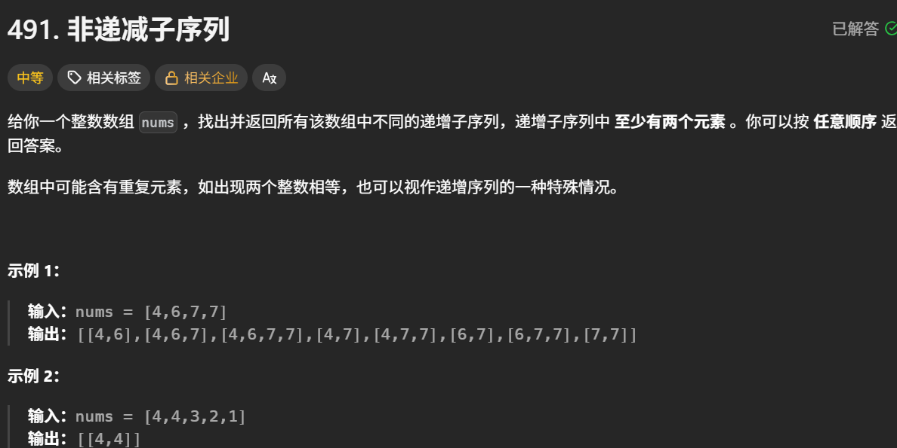

```
class Solution {
	public:
		vector<int> temp;
		set<vector<int>> ans;
		void dfs(vector<int>& nums, int pos) {
			if(pos==nums.size()) {
				if(temp.size()>=2) {
					ans.insert(temp);
				}
				return;
			}
			dfs(nums, pos+1);
			if(temp.size()==0 || nums[pos]>=temp[temp.size()-1]) {
				temp.push_back(nums[pos]);
				dfs(nums, pos+1);
				temp.pop_back();
			}
			return;
		}
		vector<vector<int>> findSubsequences(vector<int>& nums) {
			dfs(nums, 0);
			vector<vector<int>> res;
			for(const auto& ele : ans) {
				res.push_back(ele);
			}
			return res;
		}
};
```

set去重！

```
set的插入操作是.insert()
```

## 所有能构成原串的回文子串的组合（分割问题）

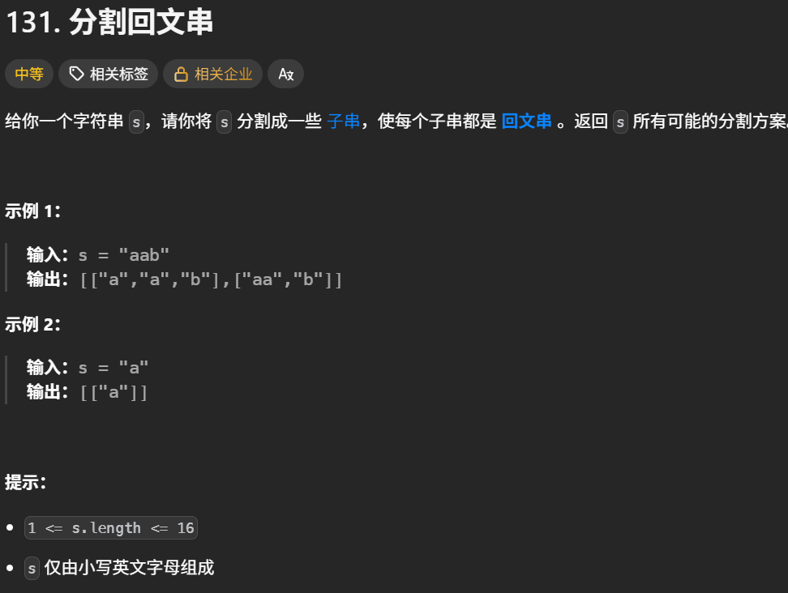

```
class Solution {
	public:
		// 从fg后一个点开始是下一个片段
		vector<string> res;
		vector<vector<string>> ans;
		bool hw(string s){
			string temp;
			for(int i=s.size()-1;i>=0;i--){
				temp.push_back(s[i]);
			}
			if(temp==s){
				return true;
			}else{
				return false;
			}
		}
		void dfs(string s, int nowpos, int fg) {
			if(nowpos==s.size()) {
				ans.push_back(res);
				return;
			}
			if(nowpos!=s.size()-1) {
				dfs(s, nowpos+1, fg);
			}
			string temp = s.substr(fg+1, nowpos-fg);
			bool success = hw(temp);
			if(success==true) {
				res.push_back(temp);
				dfs(s, nowpos+1, nowpos);
				res.pop_back();
			}
			return;
		}
		vector<vector<string>> partition(string s) {
			dfs(s, 0, -1);
			return ans;
		}
};
```

在每个s的char的位置上，都有分割与否的选择

- 我们的分割都是在他后边分出去，因此我们fg的开始是-1
- 分割的时候，一定检查一遍当前分完这段 子串 是不是一个回文串，是的话你再分
- 当深搜到最后一个位置的char时，必须分割，不能不分

以上都保证了

```
if(nowpos==s.size()) {
	ans.push_back(res);
	return;
}
```

到这一步，res里存的一定是题干要求的一个解！

## 括号生成

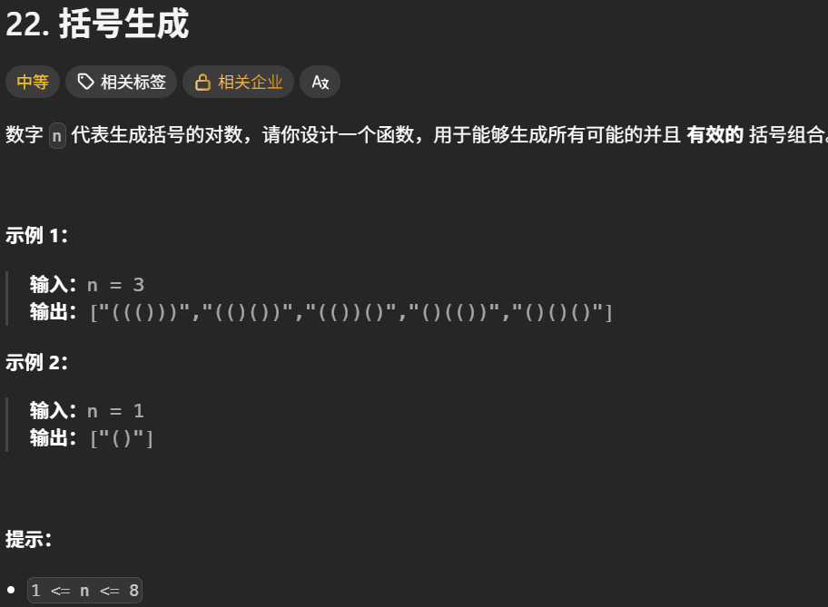

```
class Solution {
	public:
		vector<string> ans;
		string temp;
		void dfs(int n, int l_num, int r_num) {
			if(l_num==n && r_num==n) {
				ans.push_back(temp);
				return;
			}
			if(l_num>n) {
				return;
			}
			if(l_num==0) {
				temp.push_back('(');
				dfs(n, 1, 0);
			} else {
				temp.push_back('(');
				dfs(n, l_num+1, r_num);
				temp.pop_back();

				if(r_num<l_num) {
					temp.push_back(')');
					dfs(n, l_num, r_num+1);
					temp.pop_back();
				}
			}
			return;
		}
		vector<string> generateParenthesis(int n) {
			dfs(n, 0, 0);
			return ans;
		}
};
```

## 树的重心

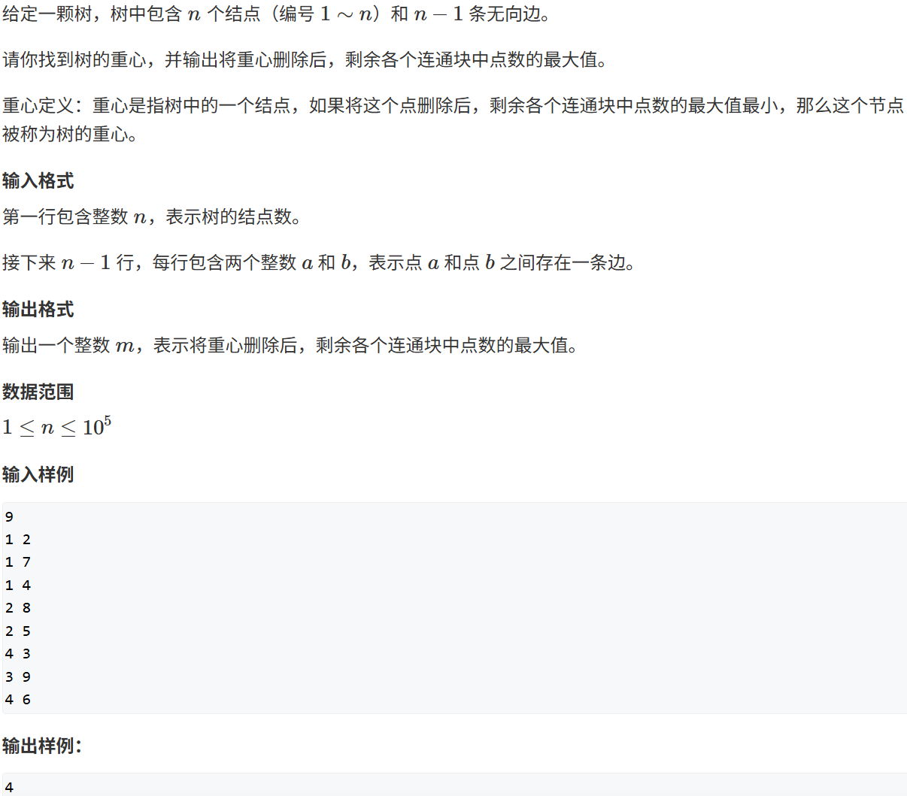

```
int ans = INT_MAX;
int h[100010]; // 每一个节点都有一个h链表，记录哪些点与他有边相连 
int e[200010]; // 存的是节点的实际编号 
int ne[200010]; // 当前索引这个点，它的下一个节点的索引是多少 
int idx=0; // 每个节点在内存空间中存储时的索引（并非它的实际编号，只是存储的索引） 
int n;
bool use[100010];
void add(int a, int b){
	e[idx]=b;
	ne[idx]=h[a];
	h[a]=idx;
	idx++;
}
int dfs(int x){
	use[x]=true;
	int sum = 1;
	int res = -1;
	for(int i=h[x];i!=-1;i=ne[i]){
		int j=e[i];
		if(use[j]==false){
			int s = dfs(j);
			res = max(res, s);
			sum+=s;
		} 
	} 
	res = max(res, n-sum);
	ans = min(ans ,res);
	return sum;
}
int main(){
	memset(h, -1, sizeof h);
	cin>>n;
	for(int i=1;i<=n-1;i++){
		int a, b;
		cin>>a>>b;
		add(a, b);
		add(b, a);
	}
	int final = dfs(1);
	cout<<ans;
	return 0;
}
```

树，是一个无向连通图，所以用邻接表存的时候是：

- e[]存的是索引下的这个节点的实际编号
- 每一个节点都要开一个h[]，记录他的所有儿子节点，h[]是实际编号的第i个节点其第一个儿子节点的索引是谁
- ne[]存的是当前索引指向的这个节点，跟他  同属于某个节点的  儿子节点的  节点的  索引
- 查边add(a, b)，由于是无向图，因此查的时候还要add(b, a)
- 正因为无向图插边是双向的，因此idx会到达n的二倍，因此所有用idx访问的数组他们的大小都应该开的比2n大一些

dfs的操作：

- dfs到某个编号的节点时候，遍历它的儿子节点

## 视频拼接（更像贪心）

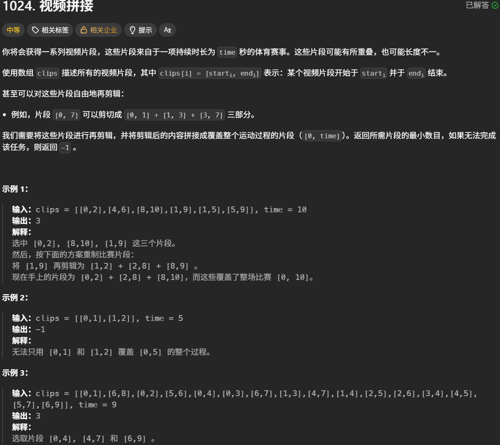

```
bool cmp(vector<int> a, vector<int> b) {
	if(a[0]==b[0]) {
		return a[1]<b[1];
	}
	return a[0]<b[0];
}
class Solution {
	public:
		int ans = 110;
		void dfs(vector<vector<int>>& clips, int start, int time, int num) {
			int nowl = clips[start][0];
			int nowr = clips[start][1];
			if(nowr>=time) {
				cout<<nowl<<' '<<nowr<<endl;
				ans = min(ans, num);
				return;
			}
			if(start==clips.size()-1 || clips[start+1][0]>nowr) {
				return;
			}
			int pos=start+1;
			int max_ele=clips[start+1][1];
			for(int i=start+1; i<clips.size(); i++) {
				if(clips[i][0]<=nowr) {
					if(clips[i][1]>max_ele) {
						max_ele = clips[i][1];
						pos = i;
					}
				}
				if(clips[i][0]>nowr || i==clips.size()-1) {
					if(clips[i][0]>nowr) {
						dfs(clips, pos, time, num+1);
						break;
					} else {
						dfs(clips, i, time, num+1);
					}
				}
			}
			return;
		}
		int videoStitching(vector<vector<int>>& clips, int time) {
			sort(clips.begin(), clips.end(), cmp);
			for(int i=0; i<clips.size(); i++) {
				if(clips[i][0]==0) {
					dfs(clips, i, time, 1);
				} else {
					break;
				}
			}
			if(ans==110) {
				return -1;
			}
			return ans;
		}
};
int main() {
	Solution a;
	vector<vector<int>> clips = {{0,1},{6,8},{0,2},{5,6},{0,4},{0,3},{6,7},{1,3},{4,7},{1,4},{2,5},{2,6},{3,4},{4,5},{5,7},{6,9}};
	int time = 9;
	int ans = a.videoStitching(clips, time);
	cout<<ans;
}
```

- 先找0打头的
- 每一次都往后推进，记录左边界符合条件的，且右边界最远的！！！
- 嵌套dfs回溯后直接break即可
- 注意return的条件

还有个动规做法，见dp区

## 二叉树的叶子节点个数

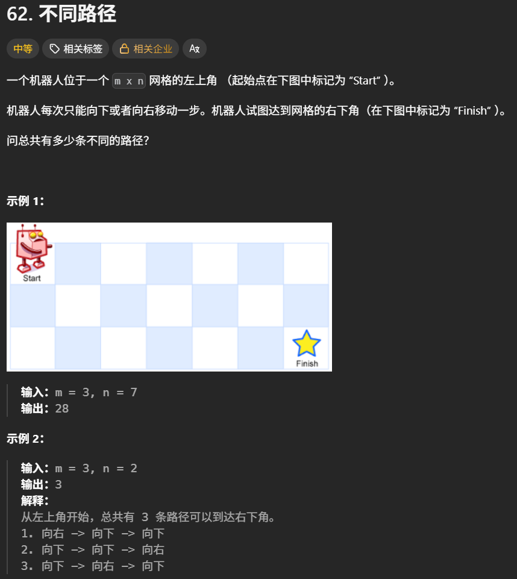

```
class Solution {
	public:
		int dfs(int i, int j, int m, int n){
			if(i>m || j>n){
				return 0;
			}
			if(i==m && j==n){
				return 1;
			}
			return dfs(i+1, j, m, n)+dfs(i, j+1, m, n);
		}
		int uniquePaths(int m, int n) {
			int ans = dfs(1, 1, m, n);
			return ans;
		}
};
```

本题会超时

## 树形DP——没有上司的舞会

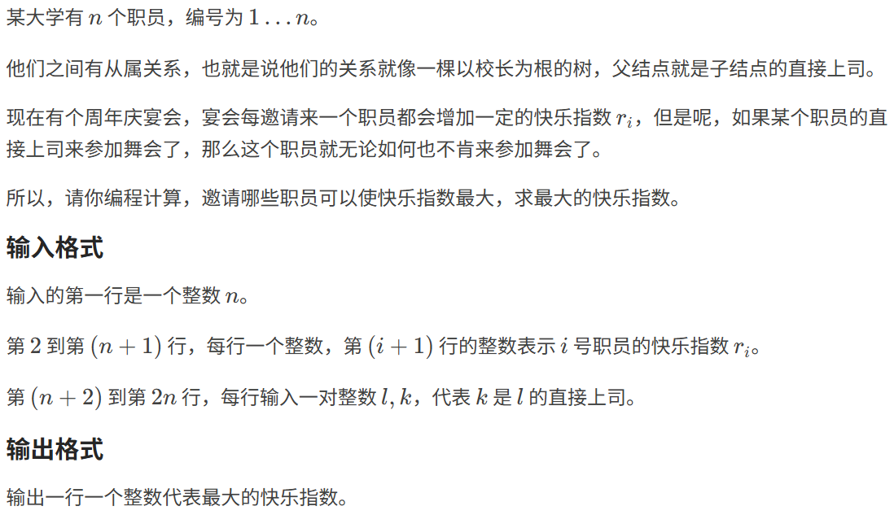

```
7
1
1
1
1
1
1
1
1 3
2 3
6 4
7 4
4 5
3 5

5
```

```
int n;
int v[6010];
bool father[6010];
int h[6010];
int e[12100];
int ne[12100];
int dp[6010][2];
int idx=0;
int fnode;
void add(int a, int b) {
	e[idx]=b;
	ne[idx]=h[a];
	h[a]=idx;
	idx++;
}
// 这也是个典型的后序遍历模板
void dfs(int node) {
	dp[node][0] = 0;
	dp[node][1] = v[node];
	for(int i=h[node]; i!=-1; i=ne[i]) {
		int j = e[i];
		dfs(j);
		dp[node][1] += dp[j][0];
		dp[node][0] += max(dp[j][0], dp[j][1]);
	}
}
int main() {
	cin>>n;
	for(int i=1; i<=n; i++) {
		scanf("%d", &v[i]);
	}
	memset(h, -1, sizeof h);
	for(int i=n+2; i<=2*n; i++) {
		int l, k;
		cin>>l>>k;
		add(k, l);
		father[l]=true;
	}
	for(int i=1; i<=n; i++) {
		if(father[i]==false) {
			fnode = i;
			break;
		}
	}
	dfs(fnode);
	int ans = max(dp[fnode][1], dp[fnode][0]);
	cout<<ans;
}
```

从下往上遍历——后序遍历

dfs的开头，赋予每个人参加or不参加获得的“基本快乐指数”

回溯到父亲节点时，把子节点的快乐指数累加到父亲节点上

- 注意父节点是怎么确定的！

## 行程安排（欧拉回路 / 找到即可）

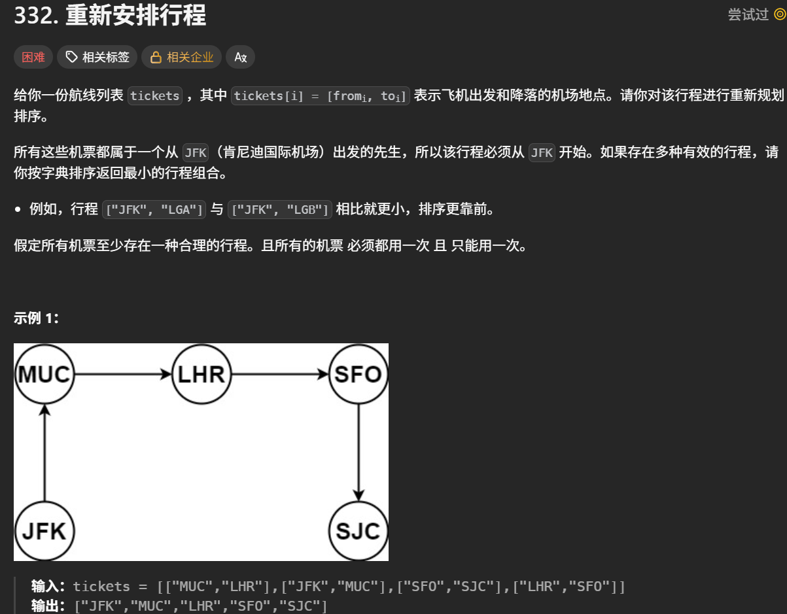

```
class Solution {
	public:
		int all;
		vector<string> ans;
		unordered_map<string, map<string, int>> dic;
		bool dfs(string pos, int num) {
			if(num==all) {
				return true;
			}
			bool success = false;
			auto& schedule = dic[pos];
			for(const auto& ele:schedule) {
				if(ele.second>0) {
					dic[pos][ele.first]--;
					ans.push_back(ele.first);
					success = dfs(ele.first, num+1);
					if(success==true) {
						return true;
					}
					dic[pos][ele.first]++;
					ans.pop_back();
				}
			}
			return false;
		}
		vector<string> findItinerary(vector<vector<string>>& tickets) {
			all = tickets.size();
			for(int i=0; i<tickets.size(); i++) {
				string start = tickets[i][0];
				string end = tickets[i][1];
				dic[start][end]++;
			}
			string start = "JFK";
			ans.push_back(start);
			bool success = dfs(start, 0);
			return ans;
		}
};
```

由于要按照字典序，所以：

```
unordered_map<string, map<string, int>> dic;
```

由于我们获取“值”的时候是一个map，所以我们为了防止重复拷贝，直接：

```
auto& schedule = dic[pos];
```

## 解数独（找到即可）

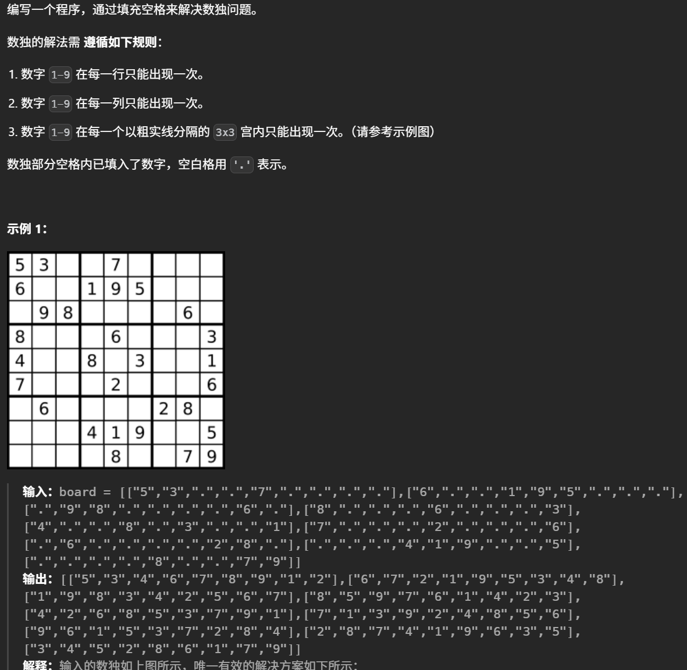

不同于N皇后，它是在每一行里遍历每一个列

这个题是：**遍历每一个点**，然后遍历1到9，合格的放进去

```
class Solution {
	public:
        bool use[20][20][20];
        bool h[20][20];
        bool l[20][20];
		bool dfs(vector<vector<char>>& board) {
			for(int j=0; j<9; j++) {
				for(int i=0; i<9; i++) {
					int x = j;
					int y = i;
					if(board[x][y]=='.') {
						for(int num=1; num<=9; num++) {
							int pos_h = ceil((x+1)*1.0/3);
							int pos_l = ceil((y+1)*1.0/3);
							if(h[x][num]==false && l[y][num]==false && use[pos_h][pos_l][num]==false) {
								board[x][y] = num+'0';
								h[x][num]=true;
								l[y][num]=true;
								use[pos_h][pos_l][num]=true;

								if(dfs(board)==true) {
									return true;
								}

								use[pos_h][pos_l][num]=false;
								h[x][num]=false;
								l[y][num]=false;
								board[x][y] = '.';
							}
						}
						return false;
					}
				}
			}
			return true;
		}
		void solveSudoku(vector<vector<char>>& board) {
			for(int i=0; i<9; i++) {
				for(int j=0; j<9; j++) {
					int x = i+1;
					int y = j+1;
					int pos_h = ceil(x*1.0/3);
					int pos_l = ceil(y*1.0/3);
					if(board[i][j]!='.') {
						use[pos_h][pos_l][board[i][j]-'0']=true;
						h[i][board[i][j]-'0']=true;
						l[j][board[i][j]-'0']=true;
					}
				}
			}
			bool success = dfs(board);
		}
};
```

如果走到头了，也就是右下角那个点，会跑完整个for，最后return true。回溯每一层接收到这个true信号，也全部都return true

如果有一个位置跑完了整个1到9这9个数字都没有合适的，说明之前的排布就有问题，要回溯回去修改，所以要 return false

## 除法求值

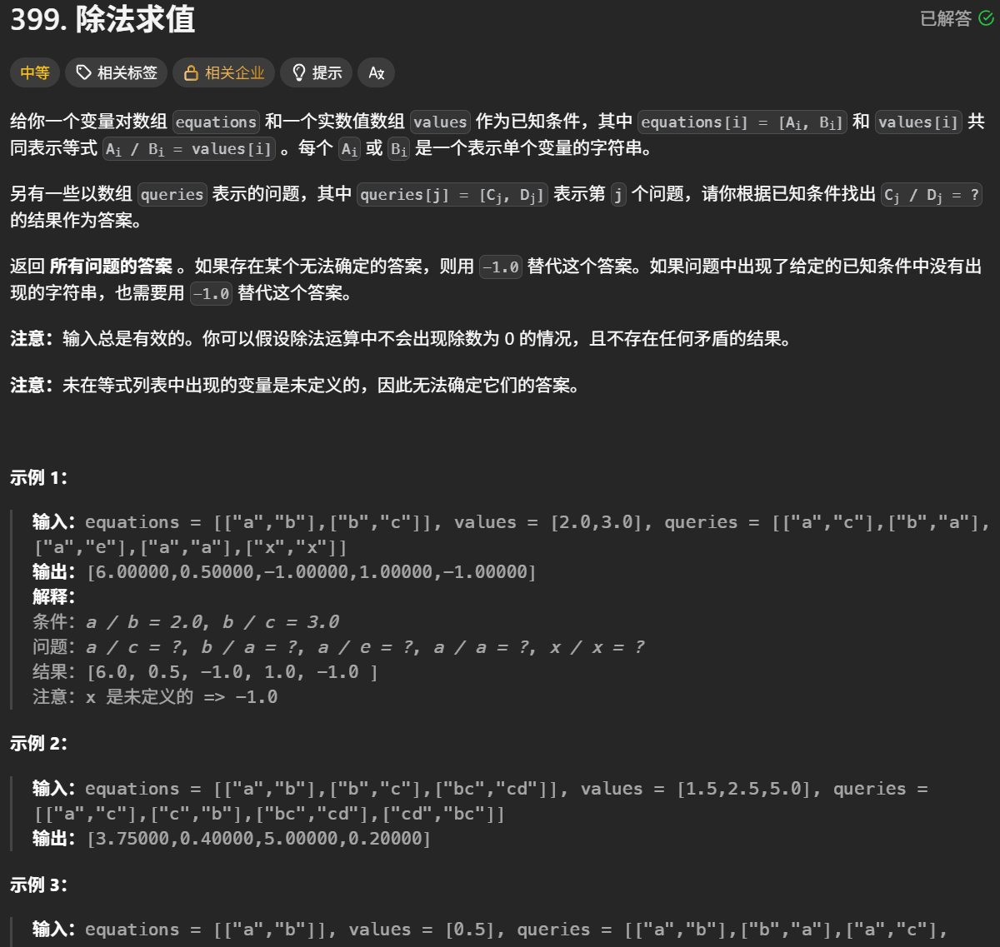

```
class Solution {
	public:
		unordered_map<string, bool> use;
		unordered_map<string, map<string, double>> dic;
		double temp_ans;
		void dfs(string a, string b, double num) {
			if(a==b) {
				temp_ans=num;
				return;
			}
			use[a]=true;
			auto x = dic[a];
			for(const auto& ele:x) {
				if(use[ele.first]==true) {
					continue;
				}
				dfs(ele.first, b, num*ele.second);
			}
			return;
		}
		vector<double> calcEquation(vector<vector<string>>& equations, vector<double>& values, vector<vector<string>>& queries) {
			for(int i=0; i<equations.size(); i++) {
				dic[equations[i][0]][equations[i][1]]=values[i];
				dic[equations[i][1]][equations[i][0]]=1.0/values[i];
				use[equations[i][0]]=false;
				use[equations[i][1]]=false;
			}
			vector<double> ans;
			for(int i=0; i<queries.size(); i++) {
				string a = queries[i][0];
				string b = queries[i][1];
				if(dic.find(a)==dic.end() || dic.find(b)==dic.end()) {
					ans.push_back(-1.0);
				} else {
					temp_ans=-1.0;
					for(auto& ele:use){
						ele.second=false;
					}
					dfs(a, b, 1);
					ans.push_back(temp_ans);
				}
			}
			return ans;
		}
};
```

```
遍历所有边，抓住一条边深搜！
搜过的边不要再搜了

如果要修改值，遍历的时候不要加const
for(auto& ele:use){
	ele.second=false;
}
```

## 字典序排数字

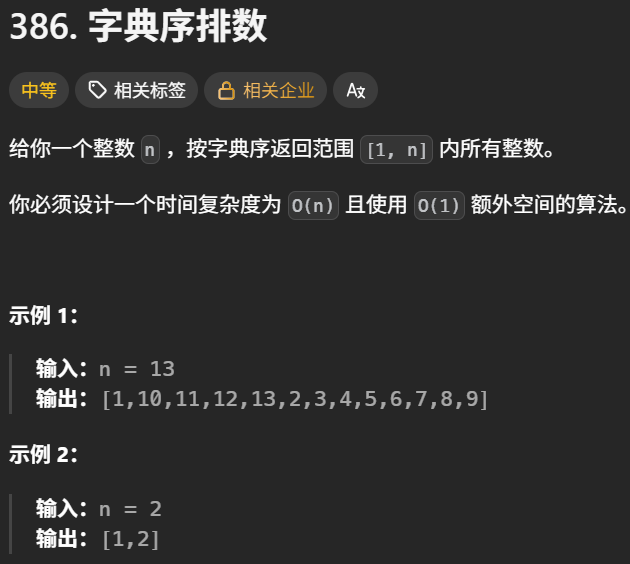

专业做法，深搜

```
class Solution {
	public:
		vector<int> ans;
		void dfs(int x, int n) {
			if(x>n) {
				return;
			}
			if(x!=0){
				ans.push_back(x);
			}
			for(int i=0; i<=9; i++) {
				if(x==0 && i==0){
					continue;
				}
				dfs(x*10+i, n);
			}
			return;
		}
		vector<int> lexicalOrder(int n) {
			dfs(0, n);
			return ans;
		}
};
```

作弊做法用set\<string>

```
class Solution {
	public:
		int tonum(string temp) {
			int ans=0;
			for(int i=0;i<temp.size();i++){
				ans=ans*10+temp[i]-'0'; 
			}
			return ans;
		}
		vector<int> lexicalOrder(int n) {
			vector<int> ans;
			set<string> dic;
			for(int i=1; i<=n; i++) {
				string temp = to_string(i);
				dic.insert(temp);
			}
			for(const auto& ele:dic) {
				string temp = ele;
				int a = tonum(temp);
				ans.push_back(a);
			}
			return ans;
		}
};
```

## 两个城市间路径的最小分数

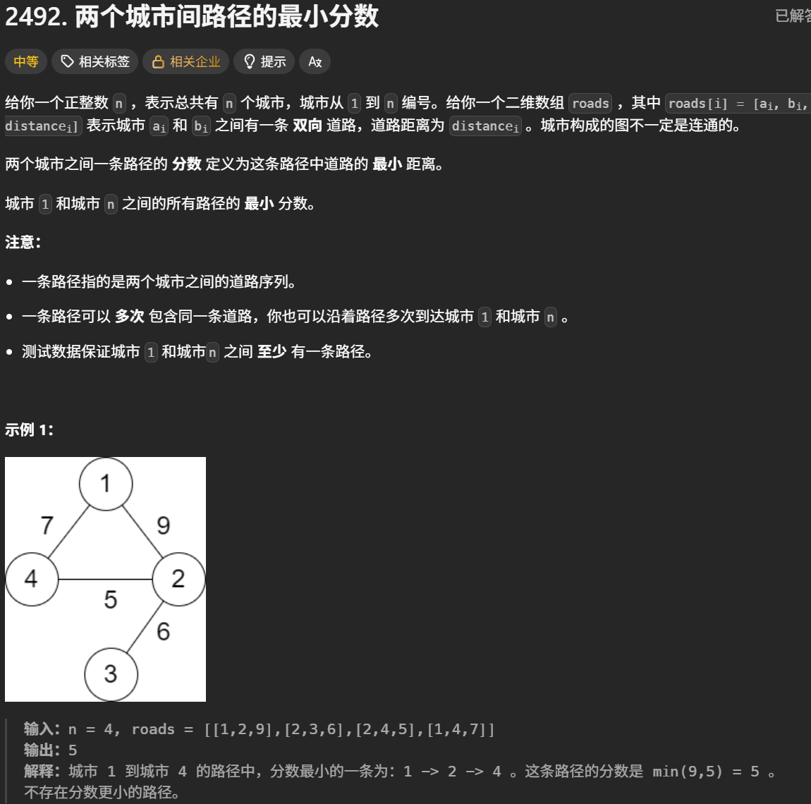

```
class Solution {
	public:
		int h[100100];
		int ne[220200];
		int e[220200];
		int w[220200];
		int idx=0;
		int ans = 1e9;
		bool use[100010];
		void add(int a, int b, int c) {
			e[idx]=b;
			w[idx]=c;
			ne[idx]=h[a];
			h[a]=idx;
			idx++;
		}
		void dfs(int hao) {
			cout<<hao<<endl;
			for(int i=h[hao]; i!=-1; i=ne[i]) {
				int j = e[i];
				ans = min(ans, w[i]);
				if(use[j]==false) {
					use[j]=true;
					dfs(j);
				}
			}
		}
		int minScore(int n, vector<vector<int>>& roads) {
			memset(h, -1, sizeof h);
			for(int i=0; i<roads.size(); i++) {
				add(roads[i][0], roads[i][1], roads[i][2]);
				add(roads[i][1], roads[i][0], roads[i][2]);
			}
			dfs(1);
			return ans;
		}
};

```

````
一开始的想法，use代表边是否走过，也就是更新use[i]
但是这样不如：
ans = min(ans, w[i]);
if(use[j]==false) {
		}
原因：这个点走过了，我们就不去dfs它了，只需要更新一下边权值就行（边权值的更新不受use影响，但是use要负责剪枝）
````

# BFS

## BFS的模板

处理权重是1的最短路问题时候，考虑BFS。第一次搜到这个点时候，就是最短值！！！

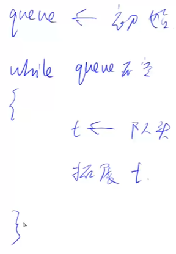

## 水流问题

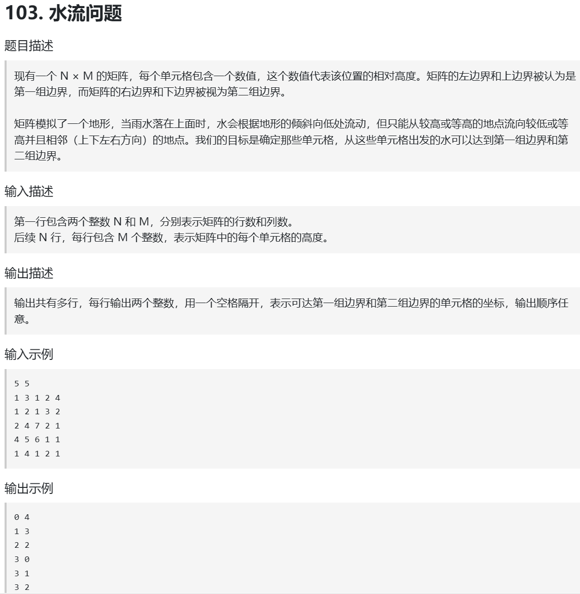

```
int n, m;
int g[200][200];
int dx[4]= {0, 0, -1, 1};
int dy[4]= {1, -1, 0, 0};
bool bfs(int x, int y) {
	bool firstb=false;
	bool secondb=false;
	vector<vector<int>> dui;
	int tou=0, wei=0;
	dui.push_back({x, y});
	bool use[200][200] = {false};
	use[x][y]=true;
	while(tou<=wei) {
		int pos_x = dui[tou][0];
		int pos_y = dui[tou][1];
		tou++;
		if(pos_x==1 || pos_y==1) {
			firstb=true;
		}
		if(pos_x==n || pos_y==m) {
			secondb=true;
		}
		if(firstb==true && secondb==true) {
			return true;
		}
		for(int i=0; i<4; i++) {
			int new_x = pos_x+dx[i];
			int new_y = pos_y+dy[i];
			if(new_x>=1 && new_x<=n && new_y>=1 && new_y<=m && g[new_x][new_y]<=g[pos_x][pos_y] && use[new_x][new_y]==false) {
				dui.push_back({new_x, new_y});
				use[new_x][new_y]=true;
				wei++;
			}
		}
	}
	return false;
}
int main() {
	cin>>n>>m;
	for(int i=1; i<=n; i++) {
		for(int j=1; j<=m; j++) {
			scanf("%d", &g[i][j]);
		}
	}
	for(int i=1; i<=n; i++) {
		for(int j=1; j<=m; j++) {
			bool success = bfs(i, j);
			if(success==true) {
				cout<<i-1<<' '<<j-1<<endl;
			}
		}
	}
}
```

## 走迷宫

深搜只能保证搜到终点，不保证搜的是最短路

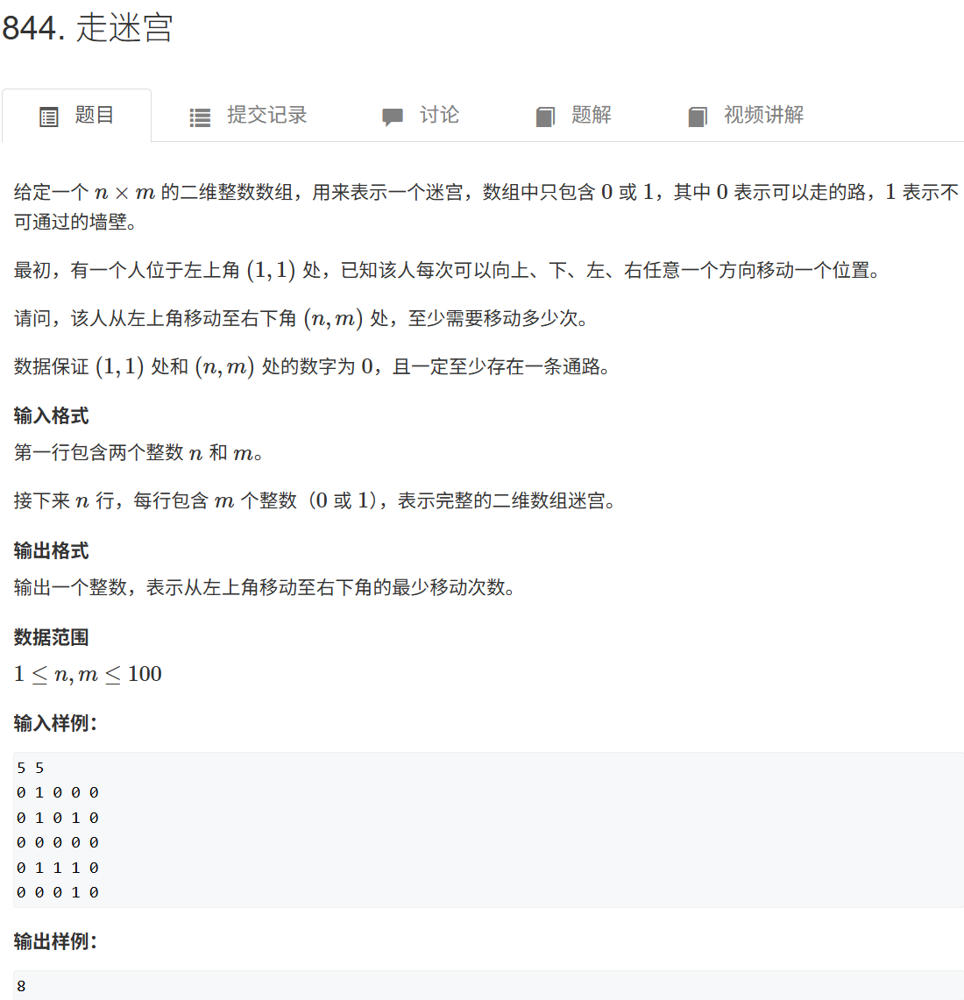

```
int n,m;
int g[111][111];
int d[111][111];
int dx[4] = {0, 0, -1, 1};
int dy[4] = {1, -1, 0, 0};
int bfs() {
	vector<vector<int>> dui;
	int tou = 0;
	int wei = 0;
	for(int i=1; i<=n; i++) {
		for(int j=1; j<=m; j++) {
			d[i][j] = -1;
		}
	}
	d[1][1] = 0;
	dui.push_back({1, 1});
	while(tou<=wei) {
		int x = dui[tou][0];
		int y = dui[tou][1];
		for(int i=0; i<4; i++) {
			int x_new = x+dx[i];
			int y_new = y+dy[i];
			if(x_new>=1 && x_new<=n && y_new>=1 && y_new<=m && g[x_new][y_new]==0 && d[x_new][y_new]==-1) {
				d[x_new][y_new] = d[x][y] + 1;
				dui.push_back({x_new, y_new});
				wei++;
			}
		}
		tou++;
	}
	return d[n][m];
}
int main() {
	scanf("%d %d", &n,&m);
	for(int i=1; i<=n; i++) {
		for(int j=1; j<=m; j++) {
			scanf("%d", &g[i][j]);
		}
	}
	int ans = bfs();
	cout<<ans;
	return 0;
}
```

有个判断条件很长：

```
if(x_new>=1 && x_new<=n && y_new>=1 && y_new<=m && g[x_new][y_new]==0 && d[x_new][y_new]==-1)
```

- 先判断移动后的坐标是否 **超格子** 了
- 在判断它是不是**能走**
- 在判断它是不是第一次计算距离，如果不是那不需要更新（因为BFS是一圈一圈找，这个点之前被算过，那一定是**最小的**）

## 最快腐烂

```
int d[22][22];
class Solution {
	public:

		int dx[4]= {0, 0, -1, 1};
		int dy[4]= {1, -1, 0, 0};
		int n, m;
		bool use[22][22];
		void bfs(int x, int y, vector<vector<int>>& grid) {
			memset(use, false, sizeof use);
			vector<vector<int>> dui;
			int tou=0,wei=0;
			dui.push_back({x, y});
			d[x][y]=0;
			use[x][y]=true;
			while(tou<=wei) {
				int pos_x = dui[tou][0];
				int pos_y = dui[tou][1];
				tou++;
				for(int i=0; i<4; i++) {
					int new_x = pos_x+dx[i];
					int new_y = pos_y+dy[i];
					if(new_x>=0 && new_x<n && new_y>=0 && new_y<m && grid[new_x][new_y]==1 && use[new_x][new_y]==false) {
						if(d[new_x][new_y]==-1) {
							d[new_x][new_y] = d[pos_x][pos_y]+1;
						} else {
							d[new_x][new_y]=min(d[new_x][new_y], d[pos_x][pos_y]+1);
						}
						use[new_x][new_y]=true;
						dui.push_back({new_x, new_y});
						wei++;
					}
				}
			}
		}
		int orangesRotting(vector<vector<int>>& grid) {
			vector<vector<int>> fl;
			vector<vector<int>> orange;
			memset(d, -1, sizeof d);
			n = grid.size();
			m = grid[0].size();
			for(int i=0; i<grid.size(); i++) {
				for(int j=0; j<grid[0].size(); j++) {
					if(grid[i][j]==2) {
						fl.push_back({i, j});
					}
					if(grid[i][j]==1 || grid[i][j]==2) {
						orange.push_back({i, j});
					}
				}
			}
			for(int i=0; i<fl.size(); i++) {
				bfs(fl[i][0], fl[i][1], grid);
			}
			int ans = 0;
			for(int i=0; i<orange.size(); i++) {
				int x = orange[i][0];
				int y = orange[i][1];
				if(d[x][y]==-1) {
					ans =-1;
					break;
				}
				ans=max(ans, d[x][y]);
			}
			if(ans==-1) {
				return -1;
			} else {
				return ans;
			}
		}
};
```

## 图中点的层次

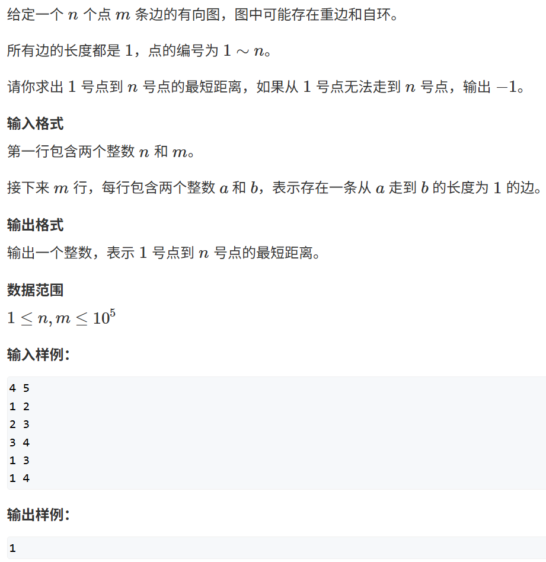

```
int h[100010];
int e[200010];
int ne[200010];
int d[200010];
int idx=0;
int n, m;
void add(int a, int b) {
	e[idx]=b;
	ne[idx]=h[a];
	h[a]=idx;
	idx++;
}
int bfs() {
	memset(d, -1, sizeof d);
	vector<int> dui;
	int tou = 0;
	int wei = 0;
	dui.push_back(1);
	d[1]=0;
	while(tou<=wei) {
		int x = dui[tou];
		tou++;
		for(int i=h[x]; i!=-1; i=ne[i]) {
			int j = e[i];
			if(d[j]==-1) {
				dui.push_back(j);
				d[j]=d[x]+1;
				wei++;
			}
		}
	}
	return d[n];
}
int main() {
	cin>>n>>m;
	memset(h, -1, sizeof h);
	for(int i=1; i<=m; i++) {
		int a,b;
		cin>>a>>b;
		add(a, b);
	}
	cout<<bfs()<<endl;
	return 0;
}
```

## 图像渲染

```
class Solution {
	public:
		int ys;
		int dx[4]= {0, 0, -1, 1};
		int dy[4]= {1, -1, 0, 0};
		int n, m;
		bool use[100][100];
		void bfs(vector<vector<int>>& image, int sr, int sc, int color) {
			use[sr][sc]=true;
			vector<vector<int>> dui;
			dui.push_back({sr, sc});
			int tou=0;
			int wei=0;
			while(tou<=wei) {
				int x = dui[tou][0];
				int y = dui[tou][1]; 
				tou++; 
				for(int i=0; i<4; i++) {
					int new_x = x+dx[i];
					int new_y = y+dy[i];
					if(new_x>=0 && new_y>=0 && new_x<n && new_y<m && use[new_x][new_y]==false && image[new_x][new_y]==ys) {
						image[new_x][new_y] = color;
						dui.push_back({new_x, new_y});
						use[new_x][new_y]=true;
						wei++;
					}
				}
			}
		}
		vector<vector<int>> floodFill(vector<vector<int>>& image, int sr, int sc, int color) {
			memset(use, false, sizeof use);
			n = image.size();
			m = image[0].size();
			ys = image[sr][sc];
			image[sr][sc] = color;
			bfs(image, sr, sc, color);
			return image;
		}
};
```

## 拓扑序列

只有有向图才有

**有向无环图一定存在拓扑序列**（也就是它一定存在一个入度为0的点），**有向无环图**也被称为**拓扑图**

若一个由图中所有点构成的序列 A 满足：对于图中的每条边 (x,y)，x 在 A 中都出现在 y 之前，则称 A 是该图的一个拓扑序列。——**拓扑序列本质上是节点编号的一个排序**，具体找法如下：

- 找一个入度为0的点，把它和它的所有出边删掉，更新剩下点的入度
- 再找一个入度为0的点，重复上述操作（这一步导致了 **拓扑排序可以不唯一**）

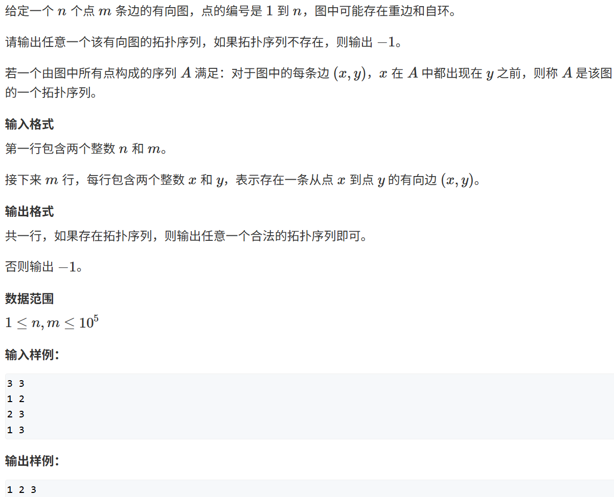

```
int n, m;
int h[100010];
int ne[200010];
int e[200010];
int idx = 0;
vector<int> dui;
void add(int a, int b) {
	e[idx]=b;
	ne[idx]=h[a];
	h[a]=idx;
	idx++;
}
void bfs(vector<int>& rd) {
	int tou=0, wei=-1;
	for(int i=1; i<rd.size(); i++) {
		if(rd[i]==0) {
			dui.push_back(i);
			wei++;
		}
	}
	while(dui.size()!=0 && tou<=wei) {
		int point = dui[tou];
		tou++;
		for(int i=h[point]; i!=-1; i=ne[i]) {
			int j = e[i];
			rd[j]--;
			if(rd[j]==0) {
				dui.push_back(j);
				wei++;
			}
		}
	}
}
int main() {
	cin>>n>>m;
	vector<int> rd(n+1, 0);
	memset(h, -1, sizeof h);
	for(int i=1; i<=m; i++) {
		int a, b;
		cin>>a>>b;
		add(a, b);
		rd[b]++;
	}
	bfs(rd);
	if(dui.size()==n) {
		for(int i=0; i<dui.size(); i++) {
			cout<<dui[i]<<' ';
		}
	} else {
		cout<<-1<<endl;
	}
	return 0;
}
```

注意：

- 队列开启while循环的时候，不仅是tou<=wei，还要考虑dui是不是空的，因为有环图可能没有入度为0的起点
- 队列里的情况就是拓扑排序中的一种结果
- wei开头一定是-1，因为可能存在dui里没元素的情况（也就是没有入度为0的点）
- 在之前的BFS中wei=0是因为他一定有元素可以进来。。。。
- 不需要特殊处理重边和自环！！！！！

## 访问所有节点的最短路径

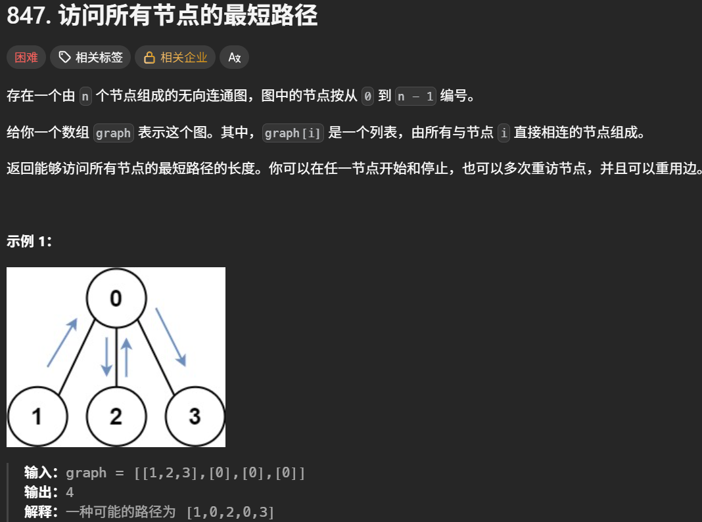

```
class Solution {
	public:
		int bfs(int x, vector<vector<int>>& graph, int goal_mask) {
			bool use[20][10000]= {false};
			vector<vector<int>> dui;
			dui.push_back({x, 0|(1<<x), 0});
			int tou=0, wei=0;
			use[x][0|(1<<x)]=true;
			while(tou<=wei) {
				int index = dui[tou][0];
				int mask = dui[tou][1];
				int dis = dui[tou][2];
				tou++;
				if(mask==goal_mask) {
					return dis;
				}
				for(int i=0; i<graph[index].size(); i++) {
					int j = graph[index][i];
					if(use[j][mask|(1<<j)]==false) {
						dui.push_back({j, mask|(1<<j), dis+1});
						wei++;
						use[j][mask|(1<<j)]=true;
					}
				}
			}
			return 1;
		}
		int shortestPathLength(vector<vector<int>>& graph) {
			int n = graph.size()-1;
			int ans = 1e9;
			int goal_mask = 0;
			for(int i=0; i<=n; i++) {
				goal_mask=goal_mask | (1<<i);
			}
			for(int i=0; i<=n; i++) {
				int t = bfs(i, graph, goal_mask);
				ans=min(ans, t);
			}
			return ans;
		}
};
```

```
最短路，权重又是1，直接宽搜

起点不知道是哪个？所以我们把所有点都塞到队列里。宽搜保证了：第一次更新该节点的状态时，一定是最短路

我们要记录当前这个点的状态，也就是mask

save[hao][mask]数组记录搜到hao这个点，状态是mask，他是否已经被搜过了

由于可以重复访问一个点，但是我们又不想陷入环里的重复循环：
由save[hao][mask]的判重策略决定：同节点 + 同mask 才拦；同节点 + 更大mask 不拦；不同节点 + 同/更大mask 也不拦。这样天然支持“为覆盖新节点而再次经过旧节点/边”。
这也是为什么 BFS 能保证“最短路径长度”：我们在状态图（节点是 (u,mask)）上做普通 BFS，第一次到达 mask==goal 的层数就是最短步数。

2^0+2^1+2^2+...+2^(n-1)==((2<<n)-1)
<<运算符小于-  一定要套括号！
```

## 单词接龙

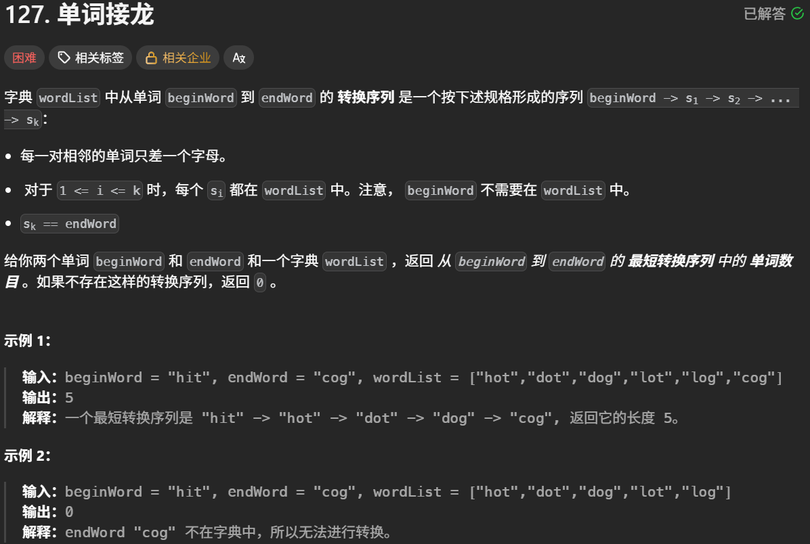

```
class Solution {
	public:
		unordered_map<string, vector<string>> dic;
		unordered_map<string, bool> use;
		unordered_map<string, int> distance;
		int bfs(string s, string end) {
			vector<string> dui;
			int tou=0, wei=0;
			dui.push_back(s);
			use[s]=true;
			distance[s]=1;
			while(tou<=wei) {
				string temp = dui[tou];
				if(temp==end) {
					break;
				}
				tou++;
				vector<string> x = dic[temp];
				for(int i=0; i<x.size(); i++) {
					if(use[x[i]]==false) {
						dui.push_back(x[i]);
						distance[x[i]]=distance[temp]+1;
						wei++;
						use[x[i]]=true;
					}
				}
			}
			return distance[end];
		}
		int ladderLength(string beginWord, string endWord, vector<string>& wordList) {
			unordered_map<string, bool> cx;
			wordList.push_back(beginWord);
			for(int i=0; i<wordList.size(); i++) {
				cx[wordList[i]]=true;
				use[wordList[i]]=false;
			}
			for(int i=0; i<wordList.size(); i++) {
				for(int j=0; j<wordList[i].size(); j++) {
					string s = wordList[i];
					for(int k=0; k<26; k++) {
						s[j]='a'+k;
						if(cx.find(s)!=cx.end()) {
							dic[wordList[i]].push_back(s);
						}
					}
				}
			}
//			for(const auto&ele:dic){
//				cout<<ele.first<<endl;
//				for(int i=0;i<ele.second.size();i++){
//					cout<<ele.second[i]<<' ';
//				}
//				cout<<endl;
//			}
			int ans = bfs(beginWord, endWord);
			return ans;
		}
};
```

```
unordered_map<string, vector<string>> dic：记录这个单词可以变成谁？
unordered_map<string, bool> use：记录BFS中某个单词是否被用过
unordered_map<string, int> distance：记录当前这个单词到开头单词的距离
```

## 跳跃游戏Ⅳ

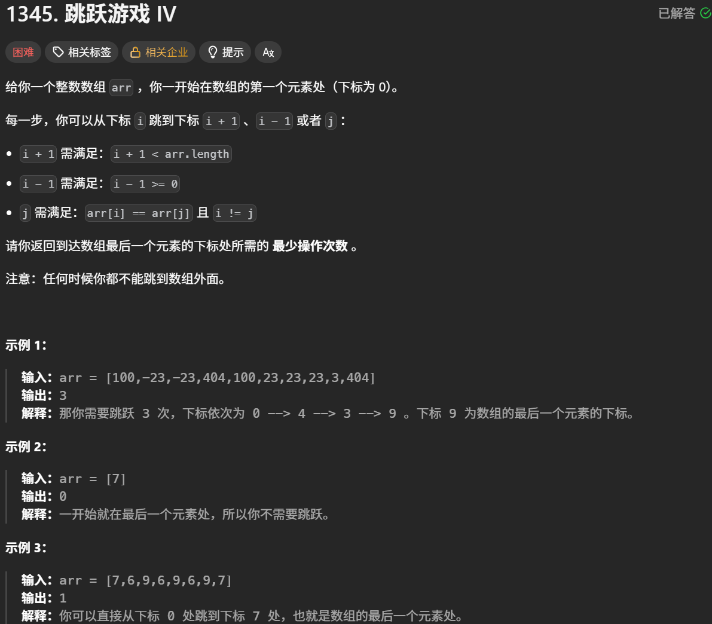

```
class Solution {
	public:
		unordered_map<int, vector<int>> equal;
		int bfs(int start, int end, vector<int>& arr) {
			unordered_map<int, bool> use;
			unordered_map<int, int> dis;
			vector<int> dui;
			dui.push_back(start);
			int tou=0 ,wei=0;
			use[dui[tou]]=true;
			dis[dui[tou]]=0;
			while(tou<=wei) {
				int idx = dui[tou];
				if(idx==end) {
					break;
				}
				tou++;
				if(idx-1>=0 && use[idx-1]==false) {
					dui.push_back(idx-1);
					use[idx-1]=true;
					wei++;
					dis[idx-1]=dis[idx]+1;
				}
				if(idx+1<arr.size() && use[idx+1]==false) {
					dui.push_back(idx+1);
					use[idx+1]=true;
					wei++;
					dis[idx+1]=dis[idx]+1;
				}
				auto& x = equal[arr[idx]];
				for(int i=0; i<x.size(); i++) {
					if(x[i]==idx || x[i]==idx+1 || x[i]==idx-1) {
						continue;
					}
					if(use[x[i]]==false) {
						dui.push_back(x[i]);
						use[x[i]]=true;
						wei++;
						dis[x[i]]=dis[idx]+1;
					}
				}
				equal[arr[idx]].clear();
			}
			return dis[end];
		}
		int minJumps(vector<int>& arr) {
			int n = arr.size()-1;
			for(int i=0; i<arr.size(); i++) {
				equal[arr[i]].push_back(i);
			}
			int ans = bfs(0, n, arr);
			return ans;
		}
};
```

```
能看出来这个题是BFS就很容易了
```

```
class Solution {
	public:
		unordered_map<int, vector<int>> equal;
		int bfs(int start, int end, vector<int>& arr) {
			unordered_map<int, bool> use;
			unordered_map<int, int> dis;
			vector<int> dui;
			dui.push_back(start);
			int tou=0 ,wei=0;
			use[dui[tou]]=true;
			dis[dui[tou]]=0;
			while(tou<=wei) {
				int idx = dui[tou];
				if(idx==end) {
					break;
				}
				tou++;
				if(idx-1>=0 && use[idx-1]==false) {
					dui.push_back(idx-1);
					use[idx-1]=true;
					wei++;
					dis[idx-1]=dis[idx]+1;
				}
				if(idx+1<arr.size() && use[idx+1]==false) {
					dui.push_back(idx+1);
					use[idx+1]=true;
					wei++;
					dis[idx+1]=dis[idx]+1;
				}
				auto& x = equal[arr[idx]];
				for(int i=0; i<x.size(); i++) {
					if(x[i]==idx || x[i]==idx+1 || x[i]==idx-1) {
						continue;
					}
					if(use[x[i]]==false) {
						dui.push_back(x[i]);
						use[x[i]]=true;
						wei++;
						dis[x[i]]=dis[idx]+1;
					}
				}
				equal[arr[idx]].clear();
			}
			return dis[end];
		}
		int minJumps(vector<int>& arr) {
			int n = arr.size()-1;
			for(int i=0; i<arr.size(); i++) {
				equal[arr[i]].push_back(i);
			}
			int ans = bfs(0, n, arr);
			return ans;
		}
};
```

```
每次for遍历完equal时候，一定要equal[arr[idx]].clear();
否则会有很多重复的位置被for遍历，导致复杂度升级到n2
对于arr = {1, 1, 1, ..., 1}，那么每次 BFS 走到一个下标时，都会遍历整个长度为 n 的 vector，导致 O(n^2) 的复杂度，直接TLE

没有必要单独开一个unordered_map<int, vector<int>> dic;来记录当前这个位置可以跳到哪些位置（空间复杂度最坏n2，直接MLE），我们直接在BFS中遍历equal即可！
```

## 八数码

```
原题见ACWING
```

```
int bfs(string start) {
	vector<pair<string, int>> dui;
	unordered_map<string, bool> use;
	dui.push_back({start, 0});
	string goal = "12345678x";
	int tou=0, wei=0;
	int dx[4]= {0, 0, -1, 1};
	int dy[4]= {1, -1, 0, 0};
	while(tou<=wei) {
		auto Q = dui[tou];
		tou++;
		string s = Q.first;
		int dis = Q.second;
		if(s==goal) {
			return dis;
		}
		if(use[s]==true) {
			continue;
		}
		use[s]=true;
		int index = s.find('x');
		int x = index/3;
		int y = index%3;
		for(int i=0; i<4; i++) {
			int x_new = x+dx[i];
			int y_new = y+dy[i];
			if(x_new>=0 && x_new<=2 && y_new>=0 && y_new<=2) {
				int index_temp = x_new*3 + y_new;
				string s_temp = s;
				s_temp[index] = s[index_temp];
				s_temp[index_temp] = 'x';
				dui.push_back({s_temp, dis+1});
				wei++;
			}
		}
	}
	return -1;
}
int main() {
	string start;
	for(int i=1; i<=9; i++) {
		char a;
		cin>>a;
		if(a!=' ') {
			start.push_back(a);
		}
	}
	int ans = bfs(start);
	cout<<ans;
}
```

```
3*3变成一个string，坐标转换索引：int index_temp = x_new*3 + y_new;
string变成一个3*3，索引转换坐标：int x = index/3;    int y = index%3;
```

## 01迷宫

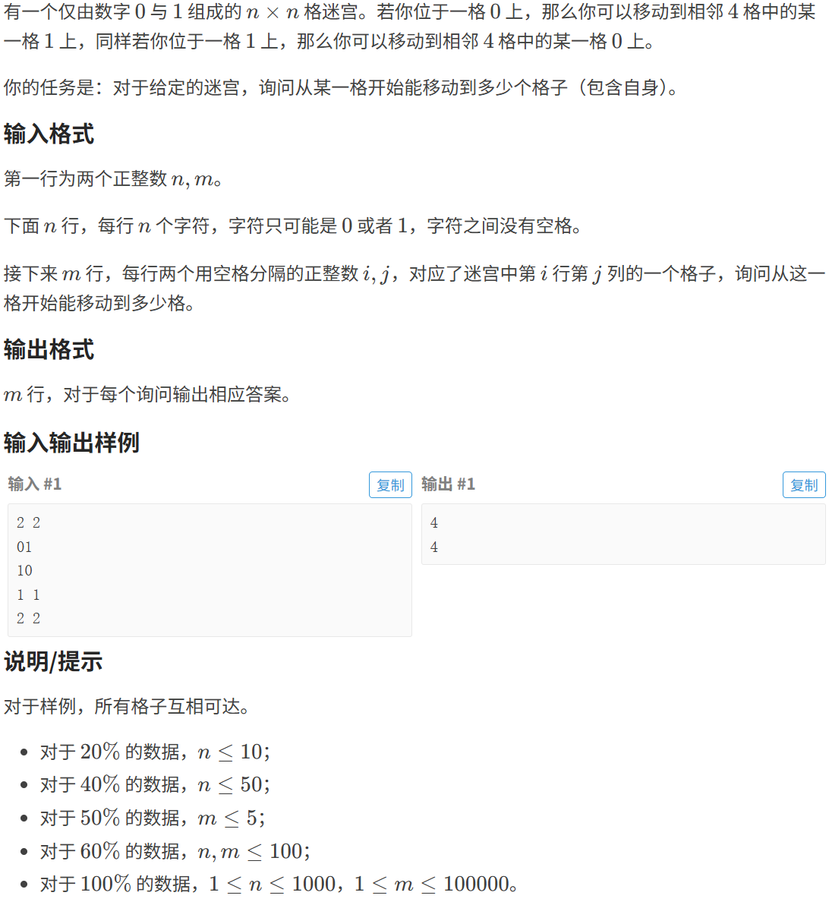

```
int n, m;
int nums[2000][2000];
int q[2000][2000];
int dx[4]= {0, 0, -1, 1};
int dy[4]= {1, -1, 0, 0};
bool use[2000][2000];
void bfs(int x, int y) {
	if(nums[x][y]!=0){
		return;
	}
	vector<vector<int>> dui;
	int tou=0, wei=0;
	dui.push_back({x, y});
	use[x][y]=true;
	int ans=1;
	while(tou<=wei) {
		int x1 = dui[tou][0];
		int y1 = dui[tou][1];
		tou++;
		int goal = 1-q[x1][y1];
		for(int i=0; i<4; i++) {
			int a = x1+dx[i];
			int b = y1+dy[i];
			if(a>=1 && a<=n && b>=1 && b<=n && q[a][b]==goal && use[a][b]==false) {
				dui.push_back({a, b});
				wei++;
				ans++;
				use[a][b]=true;
			}
		}
	}
	for(int i=0; i<dui.size(); i++) {
		nums[dui[i][0]][dui[i][1]]=ans;
	}
}
int main() {
	cin>>n>>m;
	for(int i=1; i<=n; i++) {
		string s;
		cin>>s;
		for(int j=0; j<s.size(); j++) {
			q[i][j+1]=s[j]-'0';
		}
	}
	while(m--) {
		int x, y;
		cin>>x>>y;
		bfs(x, y);
		cout<<nums[x][y]<<endl;
	}
}
```

```
一开始，我是在bfs中开了一个 bool use[][]={false}
这样每次开就会超时，直接高效利用nums数组
进队的置成-1，每次进队前看他是否是-1
反正最后-1的部分都会被修改为正确答案
```

# 树和图的存储

考虑 **有向图** 的存储（树是无向连通图， 无向图是特殊的有向图）

## 稠密图（边多）——邻接矩阵

**一定要考虑自环和重边的情况**

g[a]\[b]记录节点a到b的信息，有重边就保留一条，存储稠密图（点少边多）

具体细节见《迪杰斯特拉》

## 恋爱传话（这题太细节了）

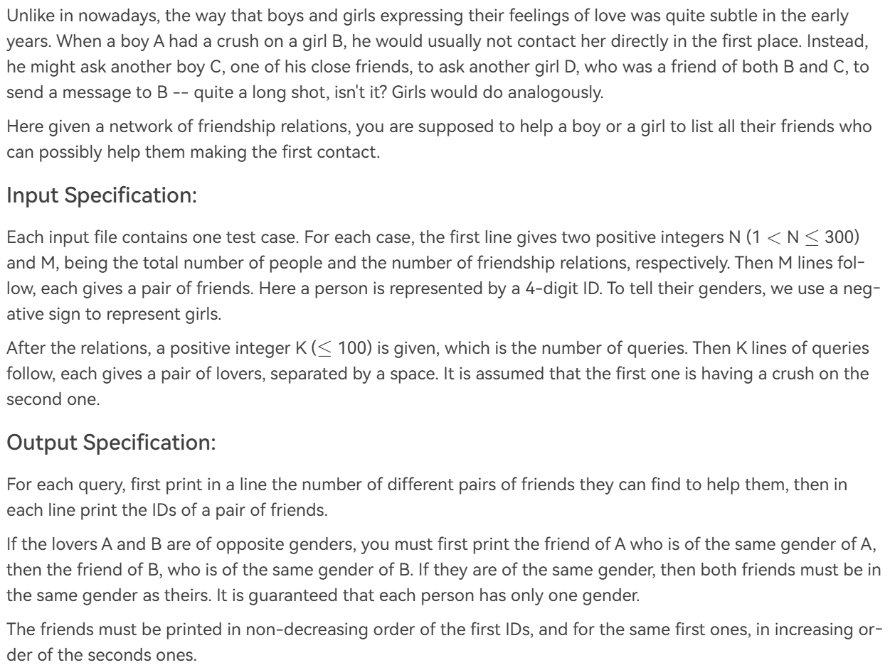

大致意思就是：给一对谈恋爱的，找俩朋友传话，性别有要求。每个人都是4位数字的编号**（这不代表编号绝对值取值范围在1000-9999！！！！！，但是int a，cin>>a时输入的是0001，a其实赋值成了1）**

一直通不过的样例点是：**-0000认不出来是女的**

```
int g[10001][10001];
int main() {
	int n, m;
	cin>>n>>m;
	unordered_map<int, int> gender;
	for(int i=1; i<=m; i++) {
		string p, q;
		cin>>p>>q;
		int a, b;
		if(p[0]=='-') {
			a=-stoi(p);
			gender[a]=-1;
		} else {
			a=stoi(p);
			gender[a]=1;
		}
		if(q[0]=='-') {
			b=-stoi(q);
			gender[b]=-1;
		} else {
			b=stoi(q);
			gender[b]=1;
		}
		g[a][b]=1;
		g[b][a]=1;
	}
	int K;
	cin>>K;
	while(K--) {
		int a, b;
		cin>>a>>b;
		int gender_1, gender_2;
		if(a<0) {
			gender_1=-1;
			a=-a;
		} else {
			gender_1=1;
		}
		if(b<0) {
			gender_2=-1;
			b=-b;
		} else {
			gender_2=1;
		}
		vector<int> temp_a;
		for(int i=0; i<=9999; i++) {
			if(g[a][i]==1 && gender[i]*gender_1==1 && i!=b && i!=a) {
				temp_a.push_back(i);
			}
		}
		vector<vector<int>> ans;
		for(int j=0; j<temp_a.size(); j++) {
			int c = temp_a[j];
			for(int i=0; i<=9999; i++) {
				if(g[c][i]==1 && gender[i]==gender_2 && g[i][b]==1 && i!=a && i!=b) {
					ans.push_back({c, i});
				}
			}
		}
		cout<<ans.size()<<endl;
		for(int i=0; i<ans.size(); i++) {
			printf("%04d %04d\n",ans[i][0], ans[i][1]);
		}
	}
}
```

**stoi(s)：把一个带正负号的string变成数字！！！！**有前导0没问题：stoi(+0123)=123

## 稀疏图——邻接表

**边的个数小于节点个数的平方：E<$V^{2}$**

**无需考虑自环和重边的情况**

几个节点开几个单链表，存**这个点可以到达哪些节点**

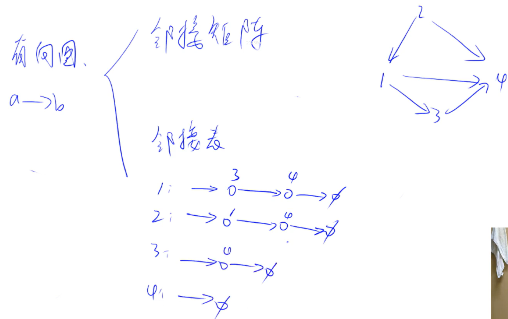

利用头插法插入一条边

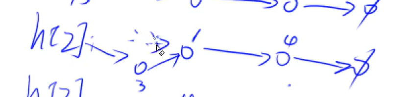

具体细节见《树的重心》

# 最短路 / 最小生成树 /  二分图 

## 总结

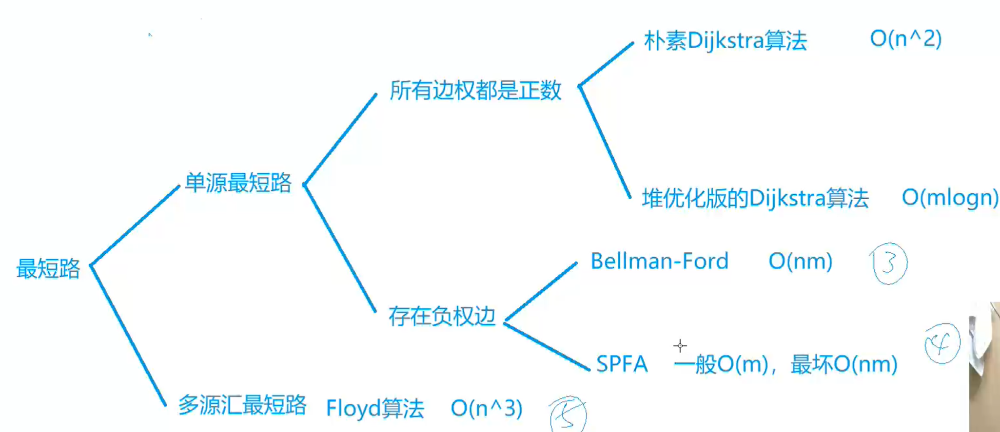

## 迪杰斯特拉（一定不能存在负权边）

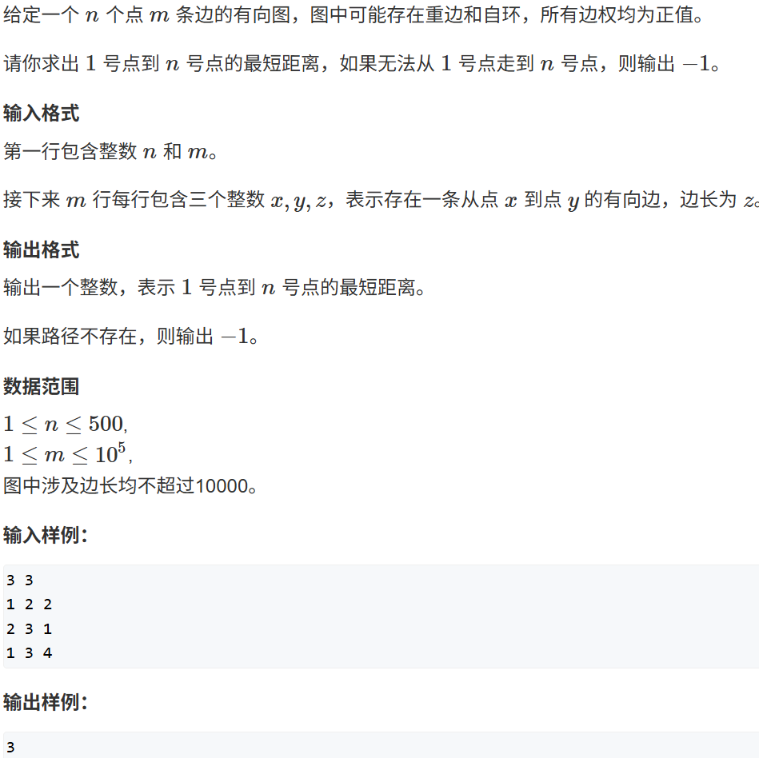

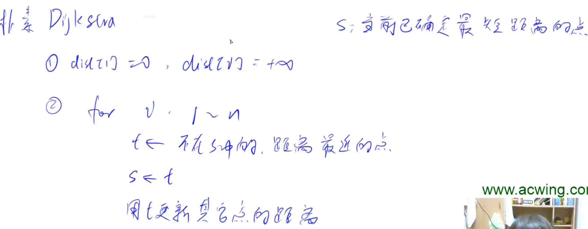


````
int n,m;
int g[510][510];
int min_dis[510];
bool s[510];
int djstl() {
	min_dis[1] = 0;
	for(int i=2; i<=n; i++) {
		min_dis[i] = 1e9;
	}
	for(int i=1; i<=n; i++) {
		int t=-1;
		for(int j=1; j<=n; j++) {
			if(s[j]==0 && (t==-1 || min_dis[j]<min_dis[t])) {
				t = j;
			}
		}
		s[t] = true;
		for(int j=1; j<=n; j++) {
			if(s[j]==0) {
				min_dis[j] = min(min_dis[j], min_dis[t]+g[t][j]);
			}
		}
	}
	if(min_dis[n]==1e9) {
		return -1;
	} else {
		return min_dis[n];
	}
}
int main() {
	scanf("%d %d", &n,&m);
	for(int i=1; i<=n; i++) {
		for(int j=1; j<=n; j++) {
			g[i][j] = 1e9;
			if(i==j) {
				g[i][j] = 0;
			}
		}
	}
	while(m--) {
		int p1, p2, c;
		scanf("%d %d %d",&p1,&p2,&c);
		if(p1!=p2) {
			g[p1][p2] = min(g[p1][p2], c);
		}
	}
	int ans = djstl();
	cout<<ans<<endl;
}
````

参数说明：

- g是一个邻接矩阵，存的是第i个点到第j个点的距离（事实上，处理有向无向边都OK，无向边无非就是g\[i][j] =g\[j]][i]）
- min_dis是一个答案数组，存的是第i个节点到起点的最短距离
- s是一个bool数组，0表示第i个点还不是最短距离，1则表示已经算出了它到起点的最短距离、

处理输入：

- 先把邻接矩阵所有i不等于j的地方赋成一个无穷大（**千万不能用INT_MAX，1e9就行）**，i==j的地方赋成0
- 由于输入会有**自环和重边**，因此要**特判**！

djstl：

- 先把min_dis初始化，方法如代码
- 从1到n遍历每一个节点，计算其到起点的最短距离，开启循环：
- 找到一个没有被计算到最短距离的点（s[i]==false），并且它在min_dis中的值是所有false的点的最小值，把他记录下来（t）
- t到起点的最短距离找到了，s[t]=true
- 把所有s[i]==false点的min_dis中的距离更新一下：他本来的值和从起点到t在从t到该点的距离 取一个最小值

## 优化后的板子

这里是个稀疏图，用邻接表存

```
int h[150100];
int ne[250100];
int e[250100];
int w[250100];
int idx = 0;
int min_dis[150100];
int s[150100];
int n, m;
typedef pair<int, int> PII;
void add(int a, int b, int c) {
	e[idx]=b;
	w[idx]=c;
	ne[idx]=h[a];
	h[a]=idx;
	idx++;
}
int djstl() {
	for(int i=2; i<=n; i++) {
		min_dis[i]=1e9;
	}
	priority_queue<PII, vector<PII>, greater<PII>> dui;
	dui.push({0, 1});
	min_dis[1] = 0;
	while(dui.size()!=0) {
		auto x = dui.top();
		dui.pop();
		int distance = x.first;
		int hao = x.second;
		if(s[hao]==true){
			continue;
		}
		s[hao]=true;
		for(int i=h[hao]; i!=-1; i=ne[i]) {
			int j = e[i];
			if(min_dis[j]>min_dis[hao]+w[i]) {
				min_dis[j]=min_dis[hao]+w[i];
				dui.push({min_dis[j] ,j});
			}
		}
	}
	if(min_dis[n]==1e9) {
		return -1;
	} else {
		return min_dis[n];
	}
}
int main() {
	cin>>n>>m;
	memset(h, -1, sizeof h);
	for(int i=1; i<=m; i++) {
		int a, b, c;
		cin>>a>>b>>c;
		add(a, b, c);
	}
	int ans = djstl();
	cout<<ans;
	return 0;
}
```

- 便捷定义：typedef pair<int, int> PII;
- 开一个小顶堆！！！！priority_queue<PII, vector\<PII>, greater\<PII>> dui;
- s数组是存《当前这个编号是否已经找到最短长度》，一定要开，防止极限超时
- 只有min_dis更新的点才会被拉到队列中去
- 请一定记住，堆中pair<int, int>是按照第一个做的排序，因此一定把distance放在第一位，编号放在第二位

## 字符串接龙

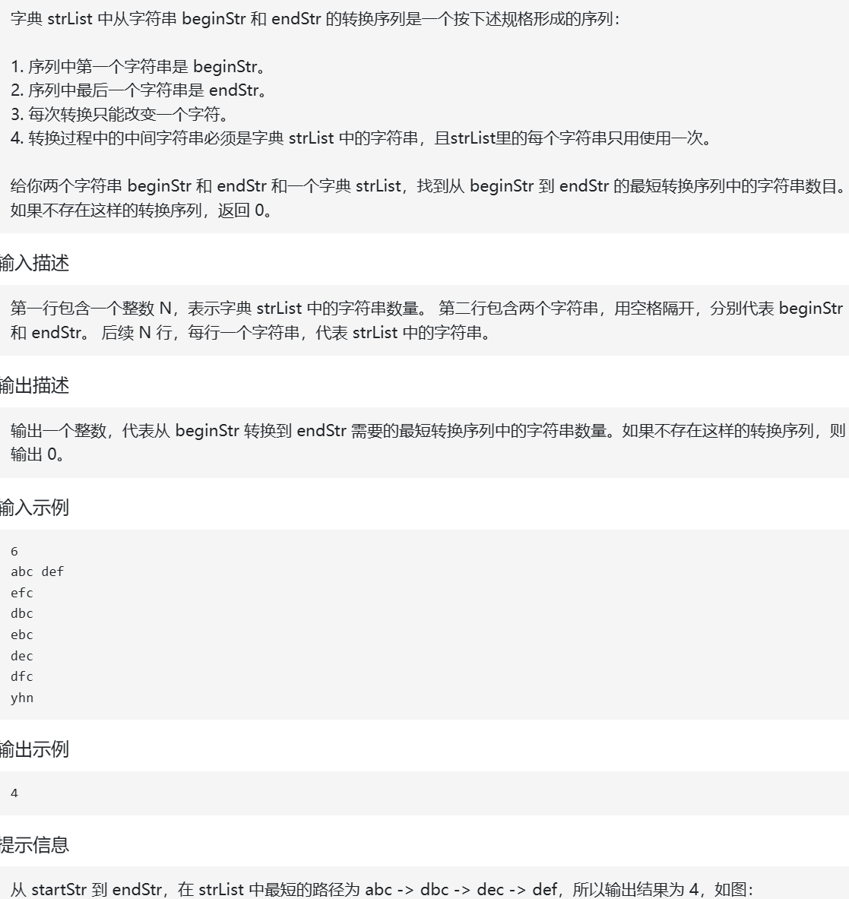

```
int n;
string beginstr, endstr;
unordered_map<string, bool> dic;
unordered_map<string, int> hao;
int h[600];
int ne[100010];
int e[100010];
int idx=0;
int min_dis[100010];
bool use[100010];
typedef pair<int, int> PII;
void add(int a, int b) {
	e[idx]=b;
	ne[idx]=h[a];
	h[a]=idx;
	idx++;
}
int djstl() {
	priority_queue<PII, vector<PII>, greater<PII>> dui;
	for(int i=1; i<2*n; i++) {
		min_dis[i]=1e9;
	}
	min_dis[1]=1;
	dui.push({1, 1});
	while(dui.size()!=0) {
		auto x = dui.top();
		dui.pop();
		int dis = x.first;
		int index = x.second;
		if(use[index]==true) {
			continue;
		}
		use[index]=true;
		for(int i=h[index]; i!=-1; i=ne[i]) {
			int j = e[i];
			if(min_dis[j]>min_dis[index]+1) {
				min_dis[j]=min_dis[index]+1;
				dui.push({min_dis[j], j});
			}
		}
	}
	if(min_dis[2]==1e9) {
		return 0;
	}
	return min_dis[2];
}
int main() {
	cin>>n;
	cin>>beginstr>>endstr;
	dic[beginstr]=true;
	hao[beginstr]=1;
	dic[endstr]=true;
	hao[endstr]=2;
	for(int i=1; i<=n; i++) {
		string temp;
		cin>>temp;
		dic[temp]=true;
		if(hao.find(temp)==hao.end()) {
			hao[temp]=i+2;
		}
	}
	memset(h, -1, sizeof h);
	for(const auto& ele: dic) {
		string s = ele.first;
		for(int k=0; k<s.size(); k++) {
			for(int j=0; j<26; j++) {
				string temp = s;
				temp[k]='a'+j;
				if(dic.find(temp)!=dic.end()) {
					int x = hao[s];
					int y = hao[temp];
					add(x, y);
				}
			}
		}
	}
	int ans = djstl();
	cout<<ans;
}

```

```
一直过不去的是：endstr和beginstr也会出现在字典里，这个时候不要在修改hao里的值了！
if(dic.find(temp)!=dic.end())这里一定要这么写，不然false的也会加入dic，for(ele:dic)会一直进行
```

## 进阶版迪杰斯特拉

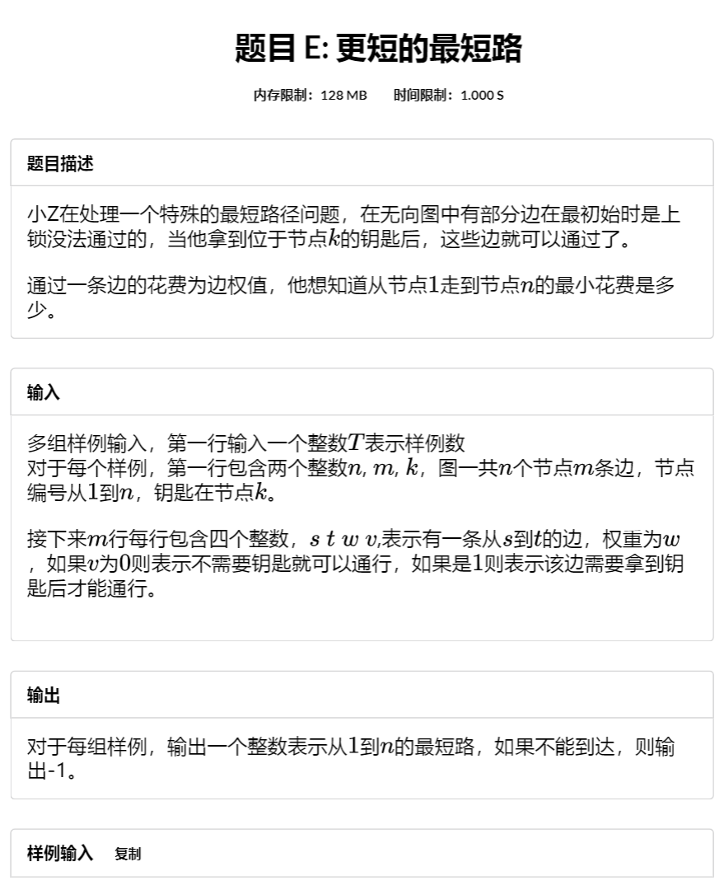

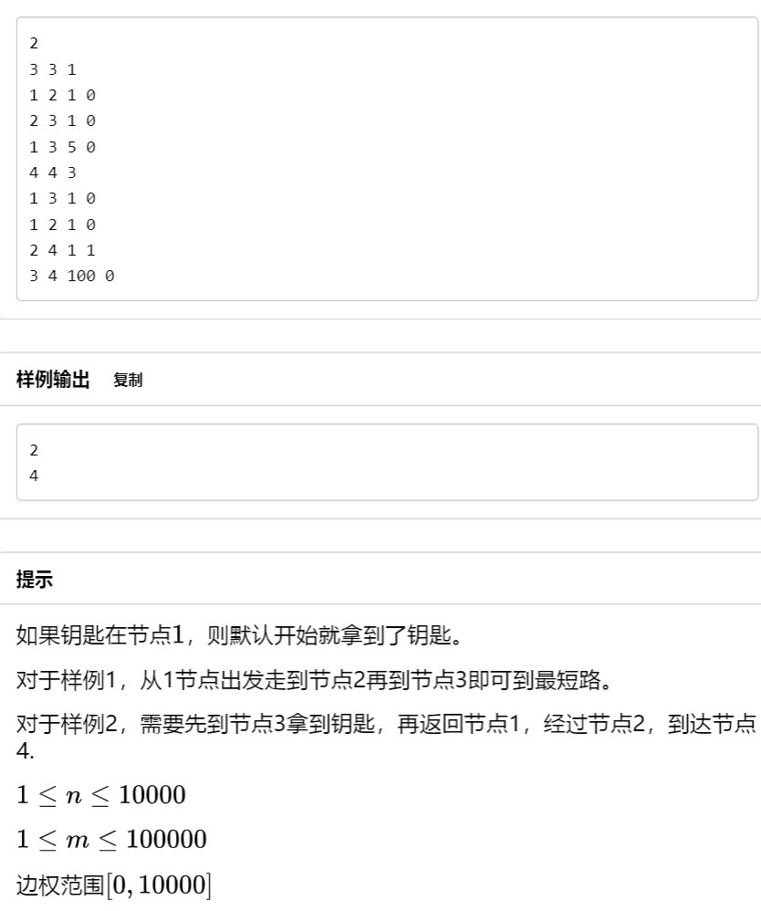

```
int g[10010][10010];
bool q[10010][10010];
bool s[10010];
int min_dis[10010];
int n,m,k;
int djstl() {
	min_dis[1] = 0;
	for(int i=2; i<=n; i++) {
		min_dis[i] = 1e9;
	}
	for(int i=1; i<=n; i++) {
		int t = -1;
		for(int j=1; j<=n; j++) {
			if(s[j]==0 && (t==-1 || min_dis[j]<min_dis[t])) {
				t = j;
			}
		}
		s[t] = true;
		for(int j=1; j<=n; j++) {
			if(s[j]==0 && q[t][j]==0) {
				min_dis[j] = min(min_dis[j], min_dis[t] + g[t][j]);
			}
		}
	}

	int ans1 = min_dis[n];
	int ans2_temp = min_dis[k];
	
	for(int i=1; i<=n; i++) {
		s[i]=false;
	}
	for(int i=1; i<=n; i++) {
		if(i!=k) {
			min_dis[i] = 1e9;
		} else {
			min_dis[i] = 0;
		}
	}

	for(int i=1; i<=n; i++) {
		int t = -1;
		for(int j=1; j<=n; j++) {
			if(s[j]==0 && (t==-1 || min_dis[j]<min_dis[t])) {
				t = j;
			}
		}
		s[t] = true;
		for(int j=1; j<=n; j++) {
			if(s[j]==0) {
				min_dis[j] = min(min_dis[j], min_dis[t] + g[t][j]);
			}
		}
	}
	int ans2 = ans2_temp + min_dis[n];
	int ans = min(ans1, ans2);

	if(ans==1e9) {
		return -1;
	} else {
		return ans;
	}
}
int main() {
	int N;
	scanf("%d", &N);
	while(N--) {
		int p1, p2, c, ky;
		scanf("%d %d %d",&n,&m,&k);
		for(int i=1; i<=n; i++) {
			for(int j=1; j<=n; j++) {
				if(i!=j) {
					g[i][j] = 1e9;
				} else {
					g[i][j] = 0;
				}
			}
		}
		for(int i=1; i<=n; i++) {
			scanf("%d %d %d %d",&p1,&p2,&c,&ky);
			if(p1!=p2) {
				g[p1][p2] = min(g[p1][p2], c);
				g[p2][p1] = min(g[p2][p1], c);
			}
			q[p1][p2] = ky;
		}
		int ans = djstl();
		cout<<ans<<endl;
	}
}
```

没别的好招了，搜两次吧那就！

第二次搜的时候事实上是将起点换成了 k 节点，对此你只需要做以下操作即可：

- 将s[]中的点都改成false
- 将min_dis中除了k这个节点的点都改成1e9

## 概率最大的路径

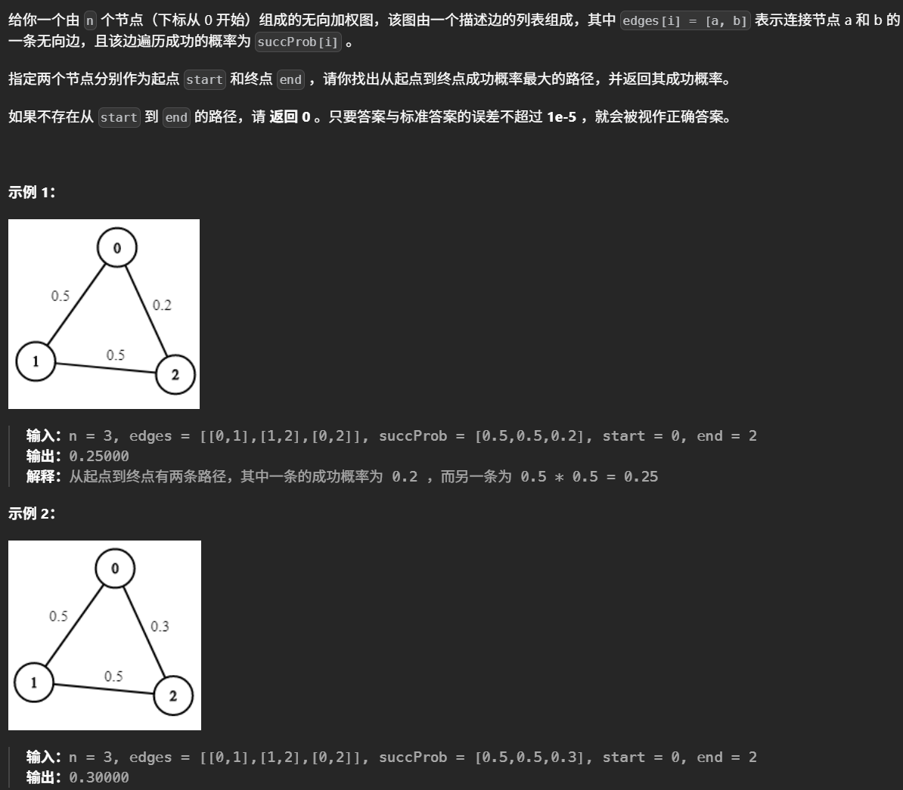

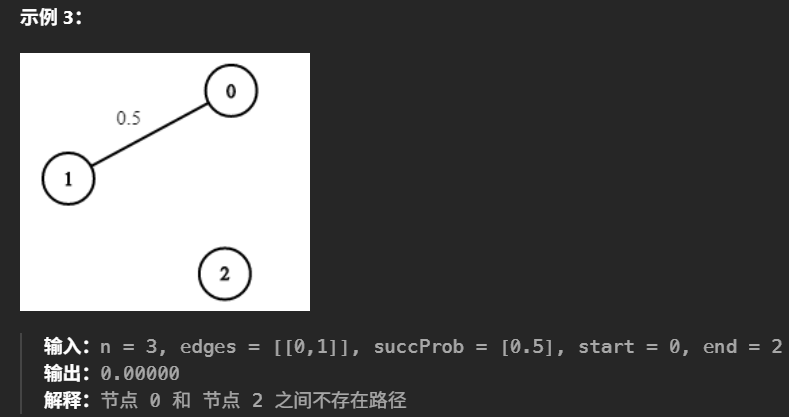

```
class Solution {
	public:
		int h[100100];
		int ne[210100];
		int e[210100];
		double w[210100];
		int idx = 0;
		typedef pair<double, int> PII;
		double max_dis[100100];
		bool s[10010];
		void add(int a, int b, double c) {
			w[idx] = c;
			e[idx] = b;
			ne[idx] = h[a];
			h[a] = idx;
			idx++;
		}
		double djstl(int n, int start, int end) {
			for(int i=0; i<=n; i++) {
				max_dis[i]=-1e9;
			}
			priority_queue<PII> dui;
			dui.push({1, start});
			max_dis[start]=1;
			while(dui.size()!=0) {
				auto x = dui.top();
				dui.pop();
				double distance = x.first;
				int pos = x.second;
				if(s[pos]==true) {
					continue;
				}
				s[pos]=true;
				for(int i=h[pos]; i!=-1; i=ne[i]) {
					int j = e[i];
					if(max_dis[j]<max_dis[pos]*w[i]) {
						max_dis[j]=max_dis[pos]*w[i];
						dui.push({max_dis[j], j});
					}
				}
			}
			if(max_dis[end]==-1e9) {
				return 0;
			}
			return max_dis[end];
		}
		double maxProbability(int n, vector<vector<int>>& edges, vector<double>& succProb, int start_node, int end_node) {
			memset(h, -1, sizeof h);
			for(int i=0; i<edges.size(); i++) {
				add(edges[i][0], edges[i][1], succProb[i]);
				add(edges[i][1], edges[i][0], succProb[i]);
			}
			double ans = djstl(n, start_node, end_node);
			return ans;
		}
};
```

首个点的max_dis是1......，push的是{1， start}

注意是pair<double, int>

## 优化版邻接矩阵的DJSTL

```
typedef pair<int, int> PII;
class Solution {
	public:
		int g[1000][1000];
		int min_dis[10000];
		bool use[10000];
		int djstl(int n, int start) {
			int ans = 0;
			priority_queue<PII, vector<PII>, greater<PII>> dui;
			dui.push({0, start});
			for(int i=1;i<=n;i++){
				min_dis[i]=1e9;
			}
			min_dis[start]=0;
			while(dui.size()!=0){
				auto x = dui.top();
				dui.pop();
				int pos = x.second;
				if(use[pos]==true){
					continue;
				}
				use[pos]=true;
				for(int i=1;i<=n;i++){
					if(use[i]==false){
						min_dis[i]=min(min_dis[i], min_dis[pos]+g[pos][i]);
						dui.push({min_dis[i], i});
					}
				}
			}
			for(int i=1;i<=n;i++){
				ans = max(ans, min_dis[i]);
			}
			if(ans==1e9){
				return -1;
			}else{
				return ans;
			}
		}
		int networkDelayTime(vector<vector<int>>& times, int n, int k) {
			for(int i=1; i<=n; i++) {
				for(int j=1; j<=n; j++) {
					g[i][j]=1e9;
					if(i==j) {
						g[i][i]=0;
					}
				}
			}
			for(int i=0; i<times.size(); i++) {
				if(times[i][0]!=times[i][1]) {
					g[times[i][0]][times[i][1]]=min(g[times[i][0]][times[i][1]], times[i][2]);
				}
			}
			int ans = djstl(n, k);
            return ans;
		}
};
```

## 最短距离且最小成本的旅游计划

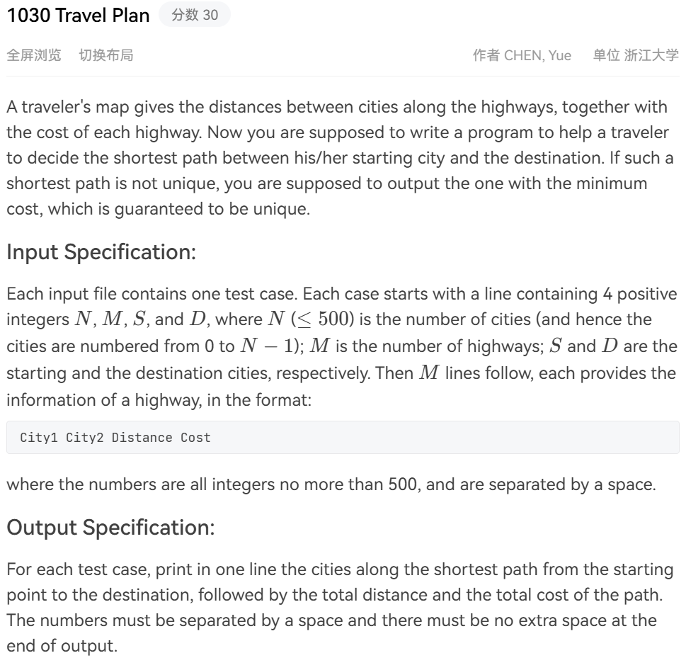

```
int n, m, start, endd;
int h[1010];
int ne[2010];
int e[2010];
int idx = 0;
int dis[2010];
int cost[2010];
int min_dis[1010];
int min_cost[1010];
int pre[1010];
typedef vector<int> PII;
void add(int a, int b, int d, int c) {
	e[idx] = b;
	dis[idx] = d;
	cost[idx] = c;
	ne[idx] = h[a];
	h[a] = idx;
	idx++;
}
void djstl() {
	priority_queue<PII, vector<PII>, greater<PII>> dui;
	dui.push({0, 0, start});
	for(int i=0; i<=n; i++) {
		min_dis[i]=1e9;
		min_cost[i]=1e9;
	}
	min_dis[start]=0;
	min_cost[start]=0;
	while(dui.size()!=0) {
		auto x = dui.top();
		dui.pop();
		int pos = x[2];
		for(int i=h[pos]; i!=-1; i=ne[i]) {
			int j = e[i];
			if(min_dis[j]>min_dis[pos]+dis[i]) {
				min_dis[j]=min_dis[pos]+dis[i];
				pre[j]=pos;
				min_cost[j]=min_cost[pos]+cost[i];
				dui.push({min_dis[j], min_cost[j], j});
			} else if(min_dis[j]==min_dis[pos]+dis[i]) {
				if(min_cost[j]>min_cost[pos]+cost[i]) {
					pre[j]=pos;
					min_cost[j]=min_cost[pos]+cost[i];
					dui.push({min_dis[j], min_cost[j], j});
				}
			}
		}
	}
	vector<int> lj;
	for(int i=endd; i!=-1; i=pre[i]) {
		lj.push_back(i);
	}
	for(int i=lj.size()-1; i>=0; i--) {
		cout<<lj[i]<<' ';
	}
	cout<<min_dis[endd]<<' ';
	cout<<min_cost[endd];
}
int main() {
	memset(h, -1, sizeof h);
	memset(pre, -1, sizeof pre);
	cin>>n>>m>>start>>endd;
	for(int i=1; i<=m; i++) {
		int a, b, d, c;
		cin>>a>>b>>d>>c;
		add(a, b, d, c);
		add(b, a, d, c);
	}
	djstl();
}
```

```
4 5 0 3
0 1 1 20
1 3 2 30
0 3 4 10
0 2 2 20
2 3 1 20


0 2 3 3 40
```

priority_queue是按照vector<>中依次元素的大小排序的

## 规定时间内到达目的地的最小花费

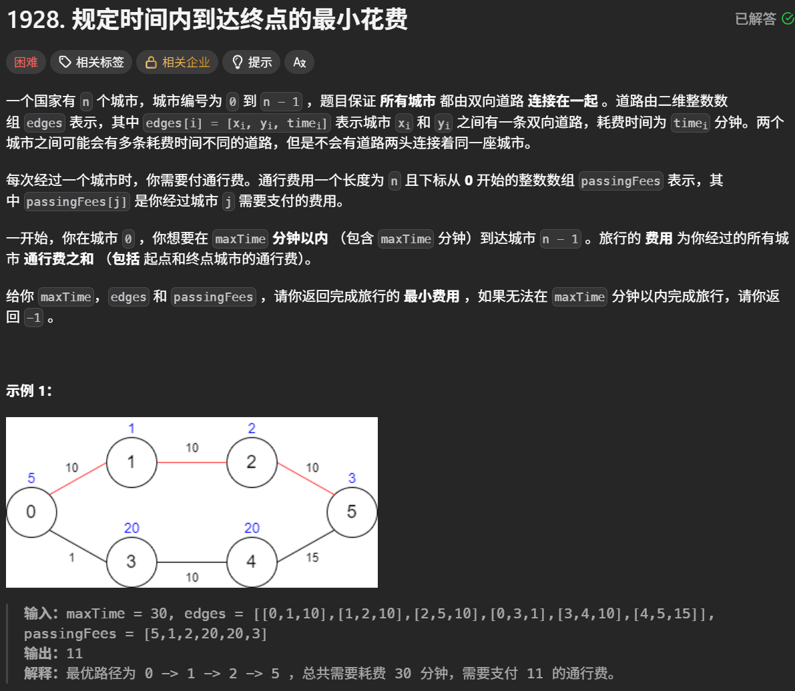

```
class Solution {
	public:
		int h[10100];
		int ne[20010];
		int e[20010];
		int idx=0;
		int time[20010];
		int min_fee[10100];
		int min_time[10100];
		void add(int a, int b, int c) {
			e[idx]=b;
			time[idx]=c;
			ne[idx]=h[a];
			h[a]=idx;
			idx++;
		}
		int djstl(int maxtime, vector<int>& fee) {
			for(int i=1; i<fee.size(); i++) {
				min_fee[i]=1e9;
				min_time[i]=1e9;
			}
			int n = fee.size()-1;
			min_fee[0]=fee[0];
			priority_queue<vector<int>, vector<vector<int>>, greater<vector<int>>> dui;
			dui.push({min_fee[0], 0, 0});
			while(dui.size()) {
				auto x = dui.top();
				dui.pop();
				int index = x[2];
				int ptime = x[1];
				int pfee = x[0];
				if(index==n) {
					return pfee;
				}
				for(int i=h[index]; i!=-1; i=ne[i]) {
					int j = e[i];
					if(ptime+time[i]>maxtime) {
						continue;
					}
					if(min_time[j]>ptime+time[i] || min_fee[j]>pfee+fee[j]) {
						min_time[j] = ptime+time[i];
						min_fee[j] = pfee+fee[j];
						dui.push({min_fee[j], min_time[j], j});
					}
				}
			}
			return -1;
		}
		int minCost(int maxTime, vector<vector<int>>& edges, vector<int>& passingFees) {
			memset(h, -1, sizeof h);
			for(int i=0; i<edges.size(); i++) {
				add(edges[i][0], edges[i][1], edges[i][2]);
				add(edges[i][1], edges[i][0], edges[i][2]);
			}
			int ans = djstl(maxTime, passingFees);
			return ans;
		}
};
```

如果最短的路径时间不满足条件

那么

```
if(ntime < min_time[nid] || ncost < min_fee[nid]) {
		min_fee[nid]  = ncost;
		min_time[nid] = ntime;
		dui.push({ncost, ntime, nid});
}
```

中往队列里塞入的时间更小但是路径不一定最短的可以发挥作用

```
当前栈顶弹出的ptime和pfee，不一定就是min_time和min_fee，你要用当前的pfee和ptime
同时：min_time不一定真是最小的time！
```


## 访问消失节点的最少时间

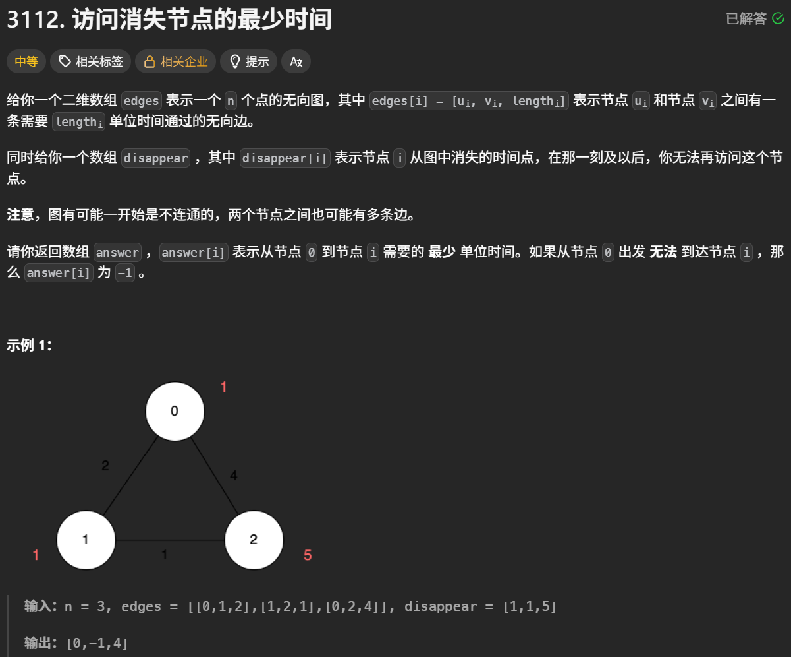

```
class Solution {
	public:
		int h[111000];
		int ne[210000];
		int e[210000];
		int idx=0;
		int w[210000];
		bool use[210000];
		int min_dis[210000];
		unordered_map<int, int> xs;
		void add(int a, int b, int c) {
			w[idx]=c;
			e[idx]=b;
			ne[idx]=h[a];
			h[a]=idx;
			idx++;
		}
		vector<int> djstl(int n) {
			for(int i=0; i<=n-1; i++) {
				min_dis[i]=1e9;
			}
			min_dis[0]=0;
			priority_queue<vector<int>, vector<vector<int>>, greater<vector<int>>> dui;
			dui.push({min_dis[0], 0});
			while(dui.size()!=0) {
				auto x = dui.top();
				dui.pop();
				int dis = x[0];
				int hao = x[1];
				if(use[hao]==true) {
					continue;
				}
				if(min_dis[hao]>=xs[hao]) {
					continue;
				}
				use[hao]=true;
				for(int i=h[hao]; i!=-1; i=ne[i]) {
					int j = e[i];
					if(min_dis[j]>min_dis[hao]+w[i]) {
						min_dis[j]=min_dis[hao]+w[i];
						dui.push({min_dis[j], j});
					}
				}
			}
			vector<int> ans;
			for(int i=0; i<n; i++) {
				if(min_dis[i]>=xs[i]) {
					min_dis[i]=-1;
				}
				ans.push_back(min_dis[i]);
			}
			return ans;
		}
		vector<int> minimumTime(int n, vector<vector<int>>& edges, vector<int>& disappear) {
			for(int i=0; i<disappear.size(); i++) {
				xs[i]=disappear[i];
			}
			memset(h, -1, sizeof h);
			for(int i=0; i<edges.size(); i++) {
				int a = edges[i][0];
				int b = edges[i][1];
				int c = edges[i][2];
				add(a, b, c);
				add(b, a, c);
			}
			vector<int> ans = djstl(n);
			return ans;
		}
};
```

```
if(min_dis[hao]>=xs[hao]) {
	continue;
}
```

当对头处理到的这个节点消失了，就把他跳过就行

## 有负权回路，最短路不一定存在！！

## Bellman-Ford算法

循环k次之后，dis数组的含义是：**从起点    走不超过k条边    走到每个点的最短距离**

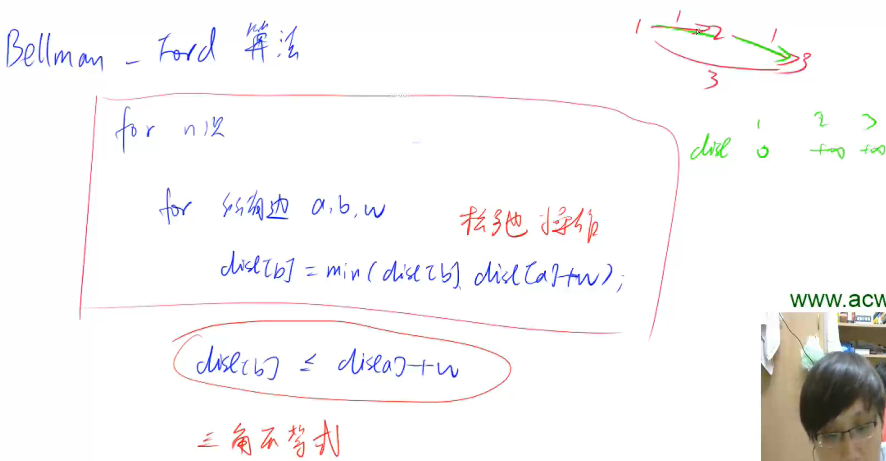

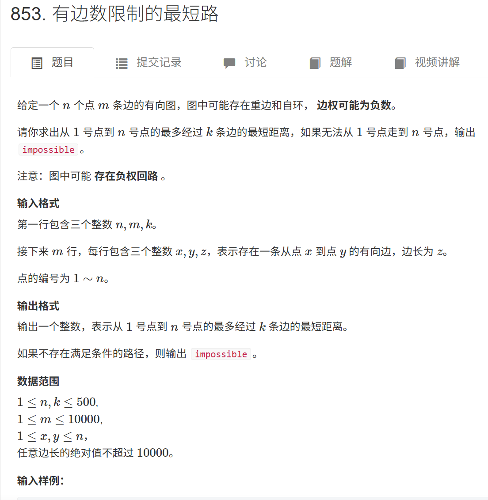

```
struct Edge {
	int a;
	int b;
	int w;
} edges[10020];
int n,m,k;
int min_dis[510];
int backup[510];
int bf() {
	for(int i=0; i<510; i++) {
		min_dis[i]=1e9;
	}
	min_dis[1]=0;
	for(int i=1; i<=k; i++) {
		memcpy(backup, min_dis, sizeof backup);
		for(int i=1; i<=m; i++) {
			int a=edges[i].a;
			int b=edges[i].b;
			int w=edges[i].w;
			min_dis[b]=min(min_dis[b], w+backup[a]);		
		}
	}
	if(min_dis[n]>1e9/2){
		return 1e9;
	}
	return min_dis[n];
}
int main() {
	cin>>n>>m>>k;
	for(int i=1; i<=m; i++) {
		int a, b, w;
		cin>>a>>b>>w;
		edges[i]= {a, b, w};
	}
	int ans = bf();
	if(ans==1e9){
		cout<<"impossible";
	}else{
		cout<<ans;
	}
}
```

一定要记得

```
memcpy(backup, min_dis, sizeof backup);
min_dis[b]=min(min_dis[b], w+backup[a]);		
记住，第一个循环的K指的是K条边
```

这个题是最多经过k条边，如果是最多经过k个点，那么循环的时候要好好思考

## K站中转最便宜的机票

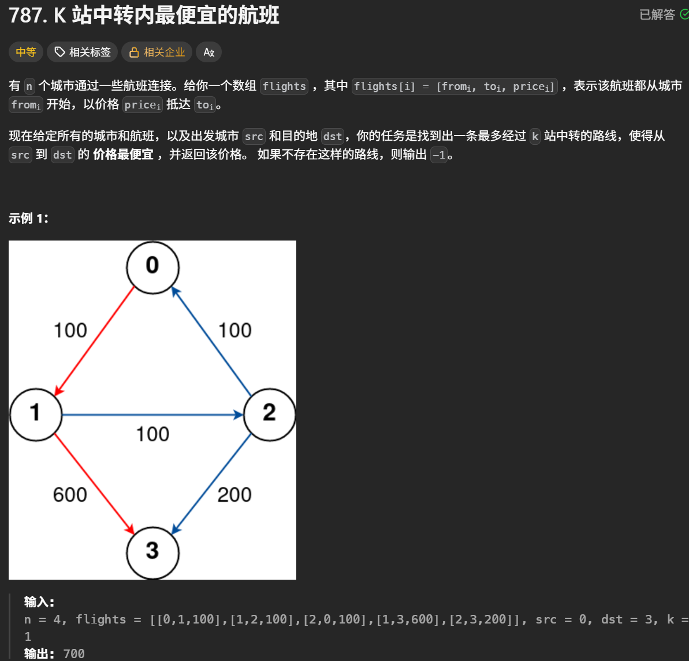

```
class Solution {
	public:
		int min_dis[110];
		int backup[110];
		int bf(vector<vector<int>>& flights, int start, int end, int k) {
			for(int i=0;i<110;i++){
				min_dis[i]=1e9;
			}
			min_dis[start]=0;
			for(int i=1;i<=k+1;i++){
				memcpy(backup, min_dis, sizeof backup);
				for(int i=0;i<flights.size();i++){
					int a = flights[i][0];
					int b = flights[i][1];
					int w = flights[i][2];
					min_dis[b] = min(min_dis[b], backup[a]+w);
				}
			}
			if(min_dis[end]>1e9/2){
				return 1e9;
			}
			return min_dis[end];
		}
		int findCheapestPrice(int n, vector<vector<int>>& flights, int src, int dst, int k) {
			int start = src;
			int end = dst;
			int ans = bf(flights, start, end, k);
			if(ans==1e9){
				return -1;
			}
			return ans;
		}
};
```

```
这个是最多经过K个点，但是按题干要求，点个数不包括起点终点，因此应该遍历k+1条边！
```

## spfa算法

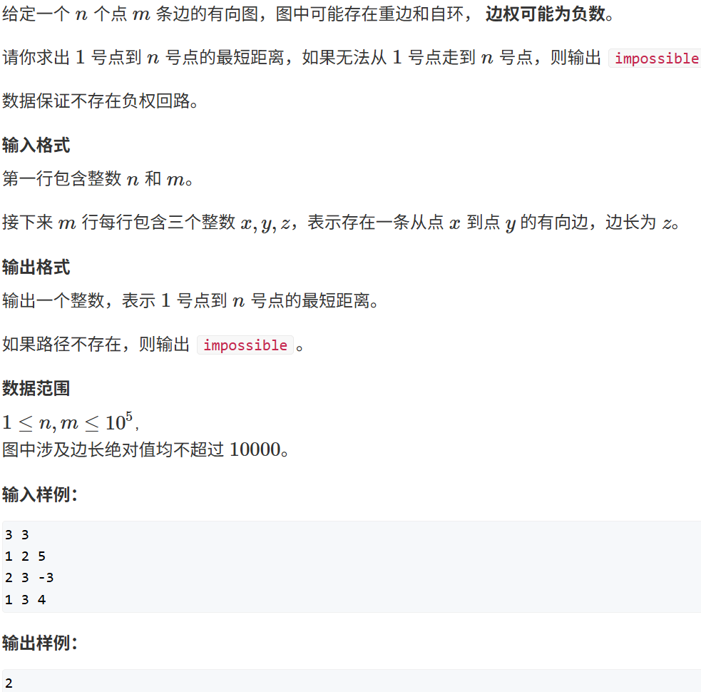

```
int n, m;
int h[100010];
int ne[100010];
int e[100010];
int idx=0;
int w[100010];
bool use[100010];
int min_dis[100010];
void add(int a, int b, int c) {
	e[idx]=b;
	w[idx]=c;
	ne[idx]=h[a];
	h[a]=idx;
	idx++;
}
int spfa() {
	for(int i=1; i<=n; i++) {
		min_dis[i]=1e9;
	}
	vector<int> dui;
	dui.push_back(1);
	min_dis[1]=0;
	int tou=0, wei=0;
	use[1]=true;
	while(tou<=wei) {
		int index = dui[tou];
		tou++;
		use[index]=false;
		for(int i=h[index]; i!=-1; i=ne[i]) {
			int j=e[i];
			if(min_dis[j]>min_dis[index]+w[i]) {
				min_dis[j]=min_dis[index]+w[i];
				if(use[j]==false) {
					dui.push_back(j);
					wei++;
					use[j]=true;
				}
			}
		}
	}
	return min_dis[n];
}
int main() {
	cin>>n>>m;
	memset(h, -1, sizeof h);
	for(int i=1; i<=m; i++) {
		int a, b, c;
		cin>>a>>b>>c;
		add(a, b, c);
	}
	int ans = spfa();
	if(ans==1e9) {
		cout<<"impossible";
	} else {
		cout<<ans;
	}
}
```

```
路径a->b
只有a更新了（从起点到a距离更小了），那么b才会更小
所以开个队列记录更新的节点，不需要遍历所有的边了！
队列中存的是上一轮所有距离变小的点
开一个use数组，记录当前这个节点是否在队列里：每次取队头的时候置成false。更新距离后，如果该点已经在队列里，不需要更新use数组！

因为队列里都是由起点更新到的点，不存在bellman-ford算法中未更新的点同样被边更新的情况。
```

## spfa算法判断负权回路

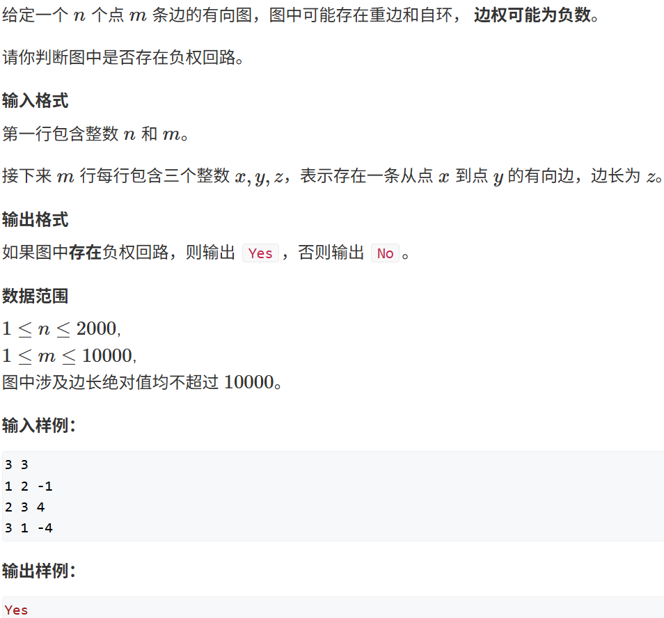

```
int h[2100];
bool use[2100];
int ne[11000];
int e[11000];
int idx=0;
int w[11000];
int min_dis[2100];
int num[2100];
void add(int a, int b, int c) {
	e[idx]=b;
	w[idx]=c;
	ne[idx]=h[a];
	h[a]=idx;
	idx++;
}
int n, m;
bool spfa() {
	vector<int> dui;
	int tou=0,wei=0;
	for(int i=1; i<=n; i++) {
		dui.push_back(i);
		use[i]=true;
		wei++;
	}
	while(tou<=wei) {
		int hao = dui[tou];
		tou++;
		use[hao]=false;
		if(num[hao]>=n) {
			return true;
		}
		for(int i=h[hao]; i!=-1; i=ne[i]) {
			int j =e[i];
			if(min_dis[j]>min_dis[hao]+w[i]) {
				min_dis[j]=min_dis[hao]+w[i];
				num[j]=num[hao]+1;
				if(use[j]==false) {
					use[j]=true;
					dui.push_back(j);
					wei++;
				}
			}
		}
	}
	return false;
}
int main() {
	cin>>n>>m;
	memset(h, -1, sizeof h);
	for(int i=1; i<=m; i++) {
		int a, b, c;
		cin>>a>>b>>c;
		add(a, b, c);
	}
	bool ans = spfa();
	if(ans==true) {
		cout<<"Yes";
	} else {
		cout<<"No";
	}
}
```

```
初始所有点都往队列里面扔
min_dis全部都0就行
开一个num，记录每个点到超级源点经过了几条边？
如果有负权回路，那么一定有一条最短路会一直在这个回路上绕圈，最后使得经过的边>=n（n个节点就是n-1条边），根据抽屉原理，此时一定存在某个点被经过了两边，也就出现了回路！
```

## 从1开始的负环

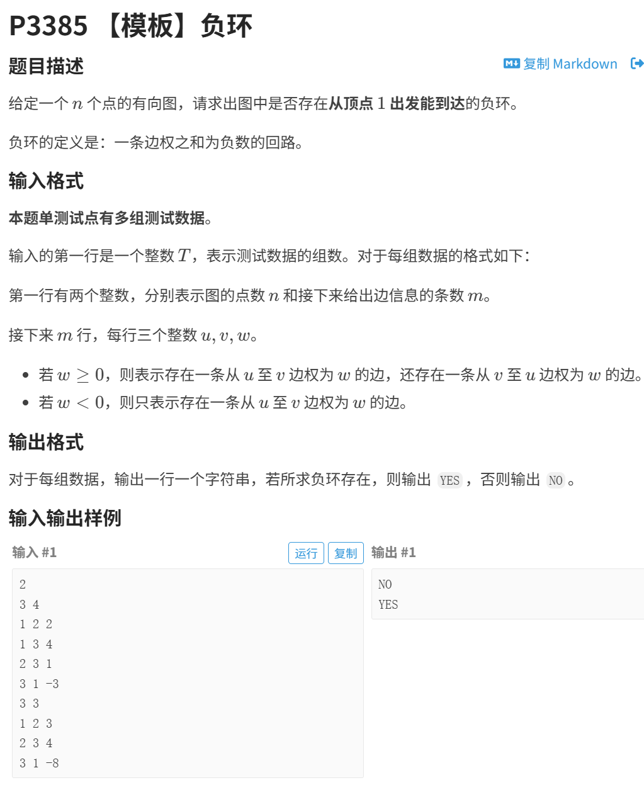

```
int h[2020];
int ne[6010];
int e[6010];
int idx=0;
int w[6010];
int min_dis[2020];
int nums[2020];
bool use[2020];
void add(int a, int b, int c) {
	e[idx]=b;
	w[idx]=c;
	ne[idx]=h[a];
	h[a]=idx;
	idx++;
}
bool spfa(int n, int m) {
	vector<int> dui;
	int tou=0, wei=0;
	for(int i=1; i<=n; i++) {
		min_dis[i]=1e9;
	}
	dui.push_back(1);
	min_dis[1]=0;
	use[1]=true;
	while(tou<=wei) {
		int index = dui[tou];
		tou++;
		use[index]=false;
		if(nums[index]>=n) {
			return true;
		}
		for(int i=h[index]; i!=-1; i=ne[i]) {
			int j = e[i];
			if(min_dis[j]>min_dis[index]+w[i]) {
				min_dis[j]=min_dis[index]+w[i];
				nums[j]=nums[index]+1;
				if(use[j]==false) {
					dui.push_back(j);
					wei++;
					use[j]=true;
				}
			}
		}
	}
	return false;
}
int main() {
	int T;
	cin>>T;
	while(T--) {
		int n, m;
		cin>>n>>m;
		idx=0;
		memset(h, -1, sizeof h);
		memset(ne, 0, sizeof ne);
		memset(e, 0, sizeof e);
		memset(w, 0, sizeof w);
		memset(nums, 0, sizeof nums);
		memset(use, false, sizeof use);
		for(int i=1; i<=m; i++) {
			int a, b, c;
			cin>>a>>b>>c;
			if(c>=0) {
				add(a, b, c);
				add(b, a, c);
			} else {
				add(a, b, c);
			}
		}
		bool ans = spfa(n, m);
		if(ans==true) {
			cout<<"YES"<<endl;
		} else {
			cout<<"NO"<<endl;
		}
	}
}
```

```
把1号元素入队，然后min_dis[1]=0，其余min_dis为1e9
```

## Floyd算法（多源最短路）（可以处理负权边）

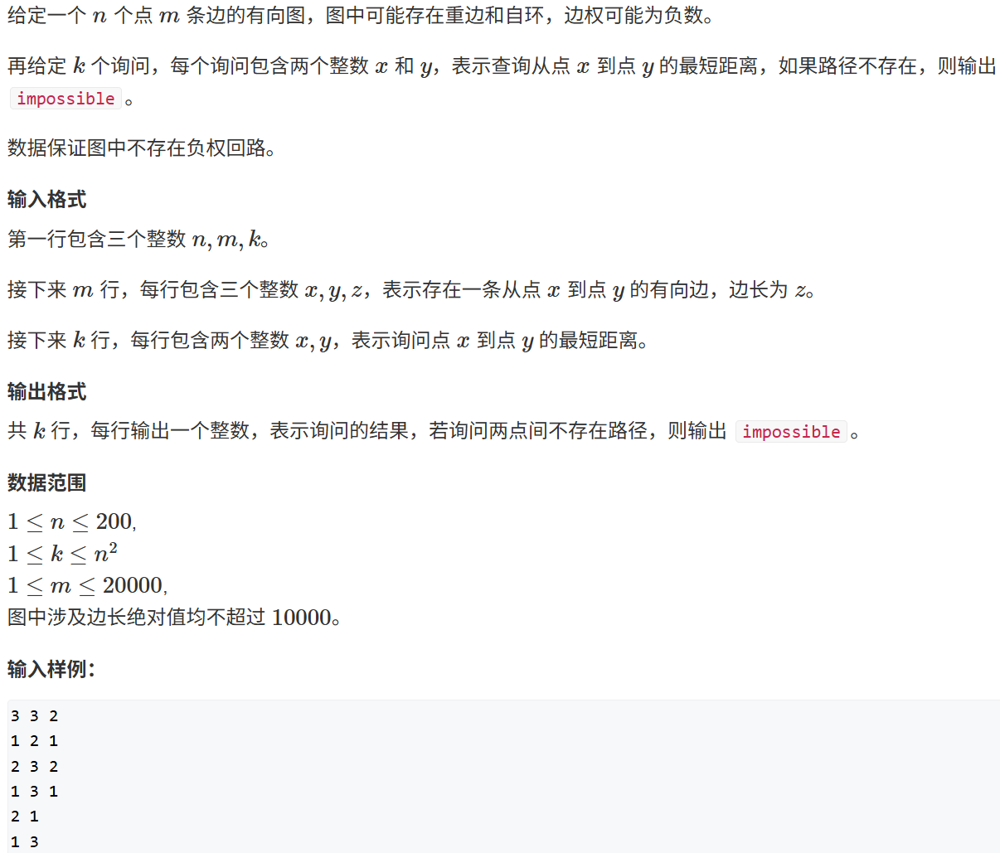

```
int g[400][400];
int n, m, k;
void floyd() {
	for(int k=1; k<=n; k++) {
		for(int i=1; i<=n; i++) {
			for(int j=1; j<=n; j++) {
				dp[i][j] = min(dp[i][j], dp[i][k]+dp[k][j]);
			}
		}
	}
}
int main() {
	cin>>n>>m>>k;
	for(int i=1; i<=n; i++) {
		for(int j=1; j<=n; j++) {
			if(i!=j) {
				dp[i][j]=1e9;
			}
		}
	}
	for(int i=1; i<=m; i++) {
		int a, b, c;
		cin>>a>>b>>c;
		g[a][b] = min(g[a][b], c);
	}
	floyd();
	while(k--) {
		int a, b;
		cin>>a>>b;
		if(g[a][b]>1e9/2){
			cout<<"impossible"<<endl;
		}else{
			cout<<g[a][b]<<endl;
		}
	}
}
```

```
floyd算法中，一定要先遍历k，再遍历i和j
究其原因在于其本质是一个 动态规划去掉了一维数组
d[k][i][j] = min(d[k - 1][i][j], d[k - 1][i][k] + d[k - 1][k][j])
k其实指的是i经过至多k个点到达j的最短距离
```

## 最小生成树

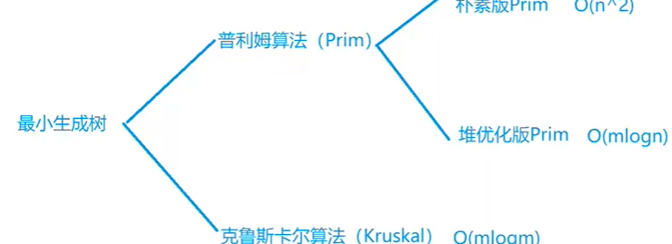

## prime算法(完全可以处理负环)

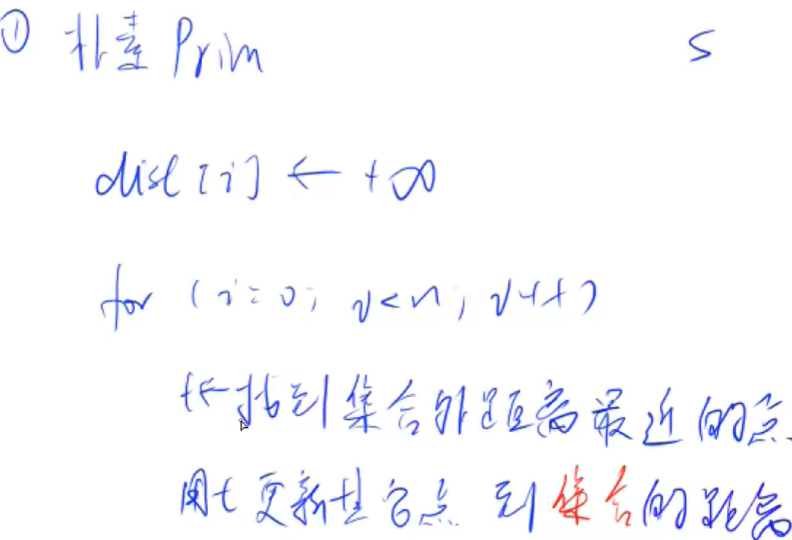

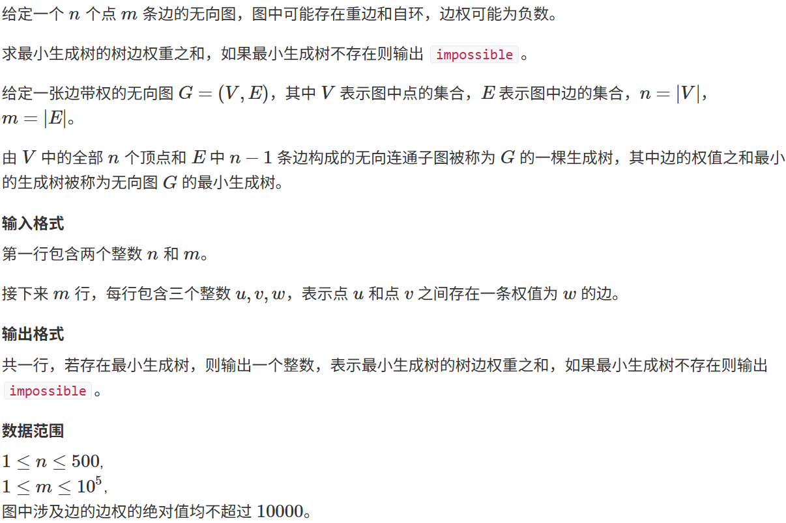

```
int n, m;
int g[1000][1000];
int min_dis[1000];
bool exist[1000];
int prime() {
	int ans=0;
	for(int i=1; i<=n; i++) {
		min_dis[i]=1e9;
	}
	for(int i=1; i<=n; i++) {
		int idx=-1;
		for(int j=1; j<=n; j++) {
			if(exist[j]==false && (idx==-1 || min_dis[j]<min_dis[idx])) {
				idx = j;
			}
		}
		if(i!=1 && min_dis[idx]==1e9) {
			return 1e9;
		}
		if(i!=1) {
			ans+=min_dis[idx];
		}
		exist[idx]=true;
		for(int j=1; j<=n; j++) {
			if(exist[j]==false) {
				min_dis[j] = min(min_dis[j], g[idx][j]);
			}
		}
	}
	return ans;
}
int main() {
	cin>>n>>m;
	for(int i=1; i<=n; i++) {
		for(int j=1; j<=n; j++) {
			g[i][j]=1e9;
		}
	}
	for(int i=1; i<=m; i++) {
		int a, b, c;
		cin>>a>>b>>c;
		g[a][b] = g[b][a] = min(g[a][b], c);
	}
	int ans = prime();
	if(ans==1e9) {
		cout<<"impossible";
	} else {
		cout<<ans;
	}
}
```

```
准备工作：
g数组全部初始化为1e9
min_dis全部初始化为1e9：这个数组记录的是每个点到集合的最短距离

prime算法中主要步骤：
1. 遍历n次
2. 找当前没放进集合中，距离集合最近的那个点
3. 判断当前找到的这个最短距离是不是1e9，是的话就是说明这个点和集合没有路径，失败
4. 记录答案
（3和4都要注明n不是第1次）
5. exist更新
6. 更新不在集合里的点到集合的最短距离，记住一定是不在集合里的点！！！！！（如果存在负的自环，就会出现问题）
```

## Kruskal算法

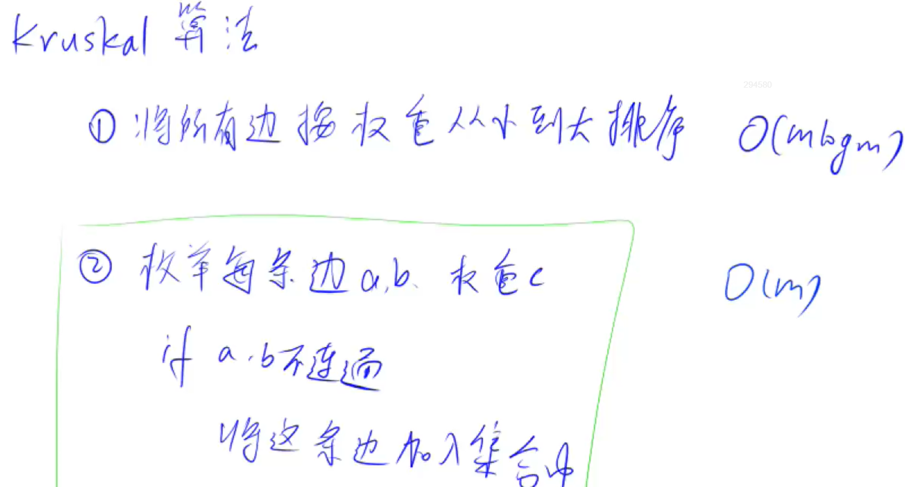


```
int n, m;
int p[400010];
bool cmp(vector<int>& a, vector<int>& b){
	return a[2]<b[2];
}
int find(int x){
	if(x!=p[x]){
		p[x]=find(p[x]);
	}
	return p[x];
}
int main() {
	cin>>n>>m;
	vector<vector<int>> bian;
	for(int i=1;i<=m;i++){
		int a, b, c;
		cin>>a>>b>>c;
		bian.push_back({a, b, c});
	}
	sort(bian.begin(), bian.end(), cmp);
	for(int i=1;i<=n;i++){
		p[i]=i;
	}
	int ans = 0;
	int num_bian = 0;
	for(int i=0;i<bian.size();i++){
		int a = bian[i][0];
		int b = bian[i][1];
		if(find(a)!=find(b)){
			p[find(a)]=find(b);
			num_bian++;
			ans+=bian[i][2];
		}
	}
	if(num_bian!=n-1){
		cout<<"impossible";
	}else{
		cout<<ans;
	}
}
```

## 二分图

二分图 当且仅当 图中不含有奇数环（环的边数是奇数）

# 技巧

## 荷兰国旗问题

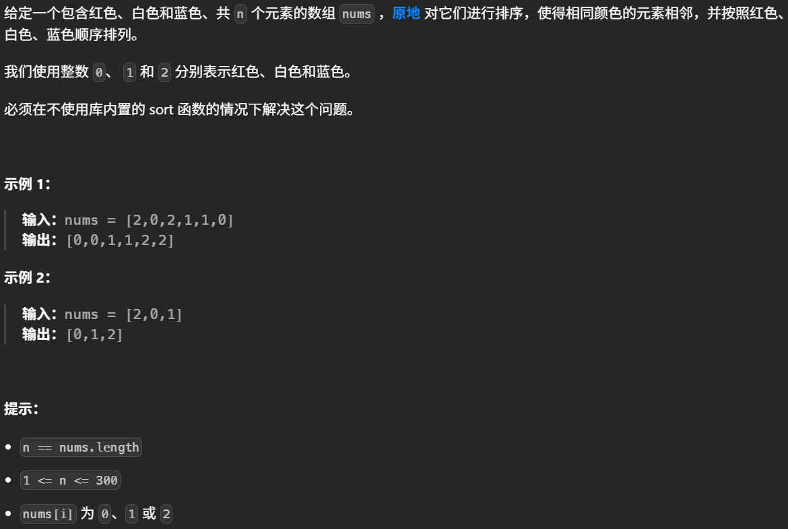

```
class Solution {
	public:
		void sortColors(vector<int>& nums) {
			int temp=-1;
			for(int i=0; i<nums.size(); i++) {
				if(nums[i]==0) {
					temp++;
					nums.erase(nums.begin()+i);
					nums.insert(nums.begin(), 0);
				}
			}
			for(int i=temp+1; i<nums.size(); i++) {
				if(nums[i]==1) {
					nums.erase(nums.begin()+i);
					nums.insert(nums.begin()+temp+1, 1);
				}
			}
		}
};
```

## 快乐数

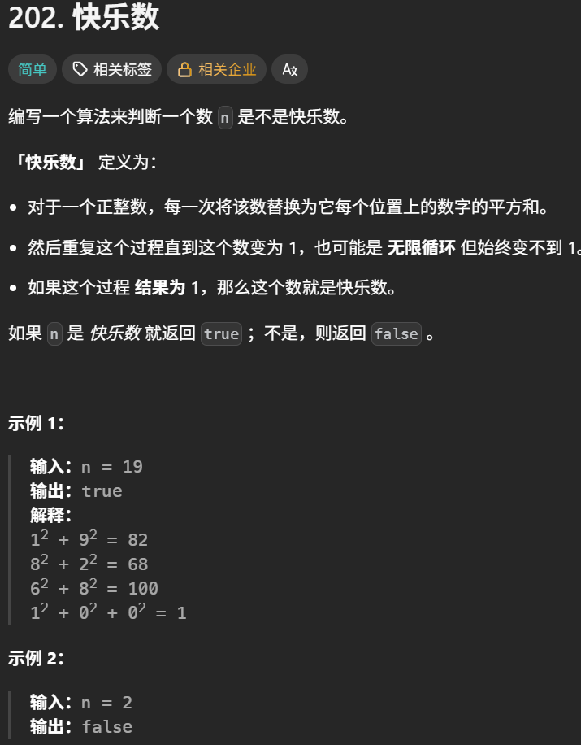

``` 
class Solution {
	public:
		int pfh(int n) {
			int ans = 0;
			while(n!=0) {
				int x = n%10;
				ans = ans + x*x;
				n = n/10;
			}
			return ans;
		}
		bool isHappy(int n) {
			bool ans = 0;
			unordered_map<int, bool> dic;
			dic[n] = 1;
			while(1) {
				n = pfh(n);
				if(dic[n]==1) {
					if(n==1) {
						ans = true;
					} else {
						ans = false;
					}
					break;
				} else {
					dic[n] = 1;
				}
			}
			return ans;
		}
};
```

## 下一个排列顺序

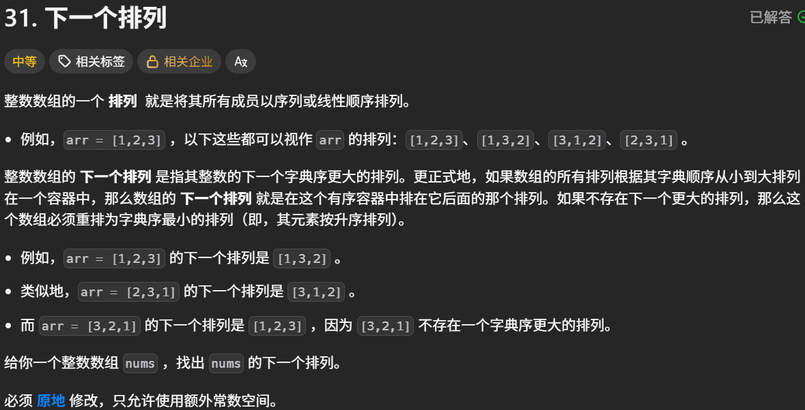

```
class Solution {
	public:
		void nextPermutation(vector<int>& nums) {
			if(nums.size()==1) {
				return;
			}
			for(int i=nums.size()-2; i>=0; i--) {
				if(nums[i]<nums[i+1]) {
					int pos, ele=1e8;
					for(int j=i+1; j<nums.size(); j++) {
						if(nums[j]>nums[i] && nums[j]<=ele) {
							pos=j;
							ele=nums[j];
						}
					}
					int temp = nums[pos];
					nums[pos]=nums[i];
					nums[i]=temp;
					reverse(nums.begin()+i+1, nums.end());
					return;
				}
			}
			reverse(nums.begin(), nums.end());
			return;
		}
};
```

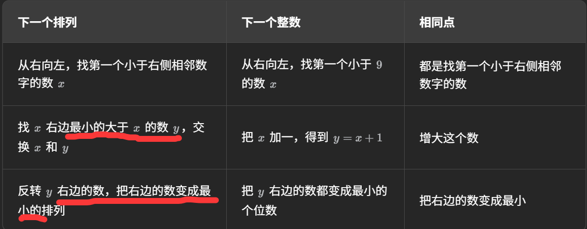

```
注意，是找右边最小的大于x的数字y，即便是等于x的y，也要找最右边的那个y。
比如说2333：
如果找最近的3，那就是3233，然后反转变成3332
如果找最远的3，那就是3332，然后反转变成3233
注意reverse函数左闭右开
```

# 模拟

## PTA 150 / 1150

## 使数组元素互不相同需要的最少操作次数

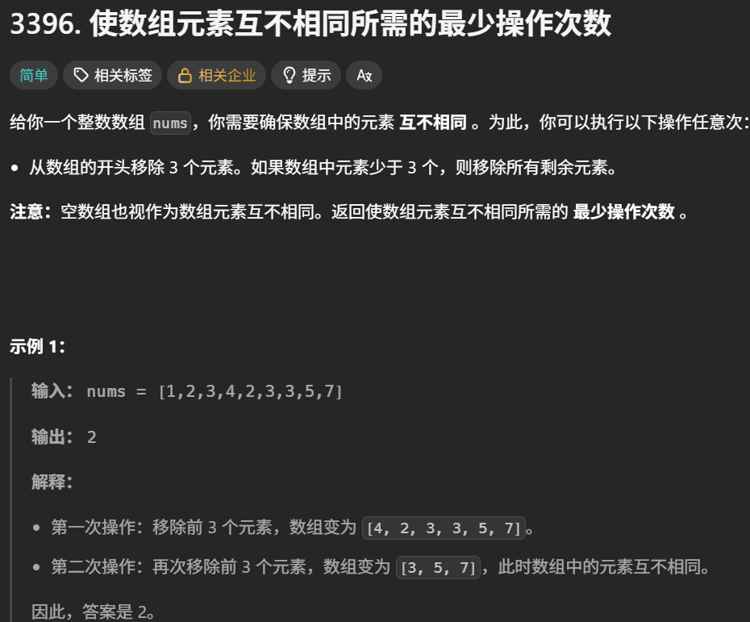

```
class Solution {
	public:
		int minimumOperations(vector<int>& nums) {
			unordered_map<int, bool> cx;
			int pos = -1;
			for(int i=nums.size()-1;i>=0;i--){
				if(cx.find(nums[i])==cx.end()){
					cx[nums[i]]=true;
				}else{
					pos=i;
					break;
				}
			}
			if(pos==-1){
				return 0;
			} else{
				return ceil((pos+1)*1.0/3);
			}
		}
};
```

```
直接倒着数，找到第一个曾经出现过的元素，然后返回(pos+1)*1.0/3上取整就行
```

## 日期转换星期

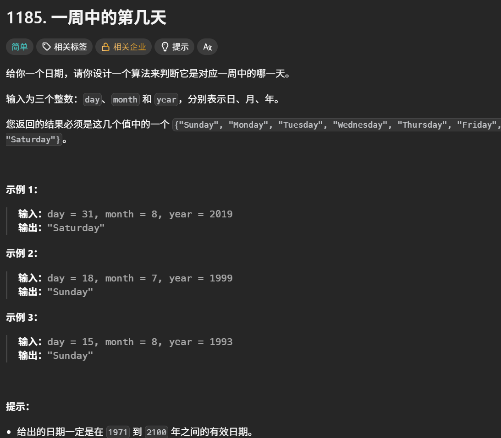

````
class Solution {
	public:
		string dayOfTheWeek(int day, int month, int year) {
			vector<int> nums = {31, 28, 31, 30, 31, 30, 31, 31, 30, 31, 30, 31};
			vector<string> dic = {"Sunday", "Monday", "Tuesday", "Wednesday", "Thursday", "Friday", "Saturday"};
			int ans =4;
			for(int i=1971; i<year; i++) {
				ans=ans+365;
				if((i%4==0&&i%100!=0) || (i%400==0)) {
					ans++;
				}
			}
			for(int i=1;i<month;i++){
				ans=ans+nums[i-1];
				if(i==2 && ((year%4==0&&year%100!=0) || (year%400==0))){
					ans++;
				}
			}
			ans=ans+day;
			return dic[ans%7];
		}
};
````

# 天津大学夏令营机试题目

## 掩码匹配

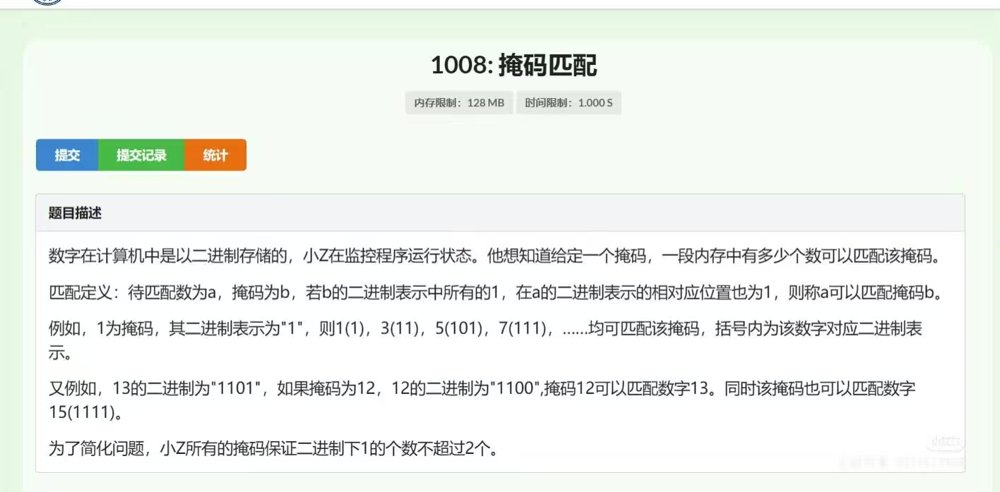

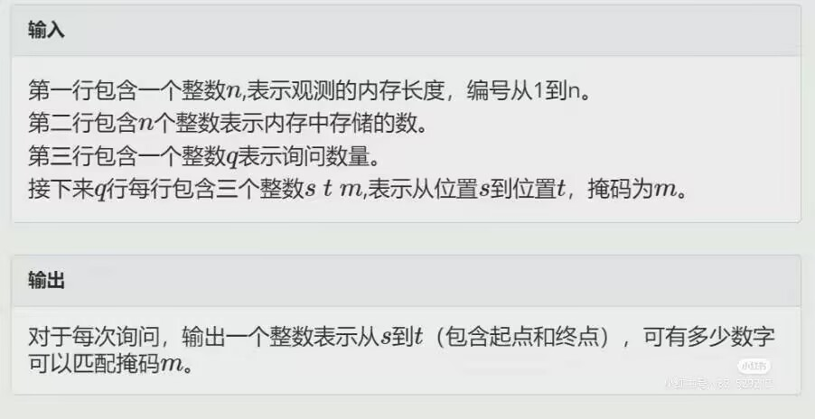

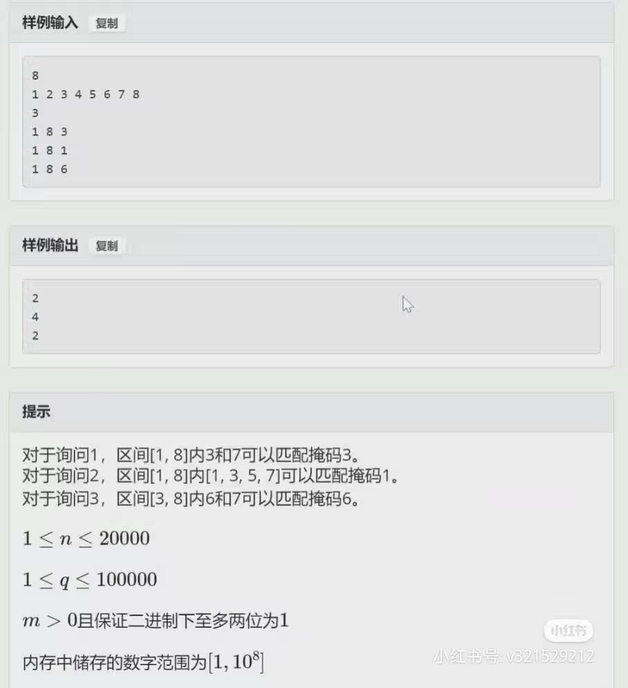

8
1 2 3 4 5 6 7 8
3
1 8 3
1 8 1
1 8 6

注意：x & (1<<j) 表示 检查x的第j位是否为1

```cpp
int dp[20010][32][32]; // 记录前i个数字里面，第j和k位都是1的个数（相当于一个前缀和）
// 2的30次方大概是1e9 

int main() {
    int n, q;
    scanf("%d", &n);
    // 预处理dp数组
    for(int i = 1; i <= n; i++) {
        int x;
        scanf("%d", &x);
        for(int j = 0; j <= 30; j++) {
            for(int k = 0; k <= 30; k++) {
                dp[i][j][k] = dp[i-1][j][k];
                // x&(1<<j)表示x的第j位是不是1 
                if((x & (1 << j)) && (x & (1 << k))) {
                    dp[i][j][k]++;
                }
            }
        }
    }
    scanf("%d", &q);
    for(int i = 1; i <= q; i++) {
        int l, r, m;
        int q = -1, p = -1;
        scanf("%d %d %d", &l, &r, &m);
        
        // 找出m中为1的最高两位
        for(int j = 0; j <= 30; j++) {
            if(m & (1 << j)) {
                if(q == -1) {
                    q = j;
                } else if(p == -1) {
                    p = j;
                }
            }
        }
        // 如果只有1位1，那么实际上查询的dp后两个维度相等即可 
        if(p == -1) {
            p = q;
        }
        cout << dp[r][q][p] - dp[l-1][q][p] << endl;
    }
    return 0;
}
```

```
int a[100010];
int qz[30][30][100010];
int main() {
	int n;
	cin>>n;
	for(int i=1; i<=n; i++) {
		scanf("%d", &a[i]);
	}
	for(int i=0; i<30; i++) {
		for(int j=0; j<30; j++) {
			for(int k=1; k<=n; k++) {
				qz[i][j][k] = qz[i][j][k-1];
				int x = a[k];
				if((x&(1<<i)) && (x&(1<<j))) {
					qz[i][j][k]++;
				}
			}
		}
	}
	int q;
	cin>>q;
	while(q--) {
		int l,r,m;
		cin>>l>>r>>m;
		int pos1=-1,pos2=-1;
		for(int i=0; i<30; i++) {
			if(m&(1<<i) && pos1==-1) {
				pos1 = i;
			}
			if(m&(1<<i) && pos1!=-1) {
				pos2 = i;
			}
		}
		int ans;
		if(pos2!=-1) {
			ans = qz[pos1][pos2][r]-qz[pos1][pos2][l-1];
		} else {
			ans = qz[pos1][pos1][r]-qz[pos1][pos1][l-1];
		}
		cout<<ans<<endl;
	}
}
```

第二版如上

## 区间覆盖

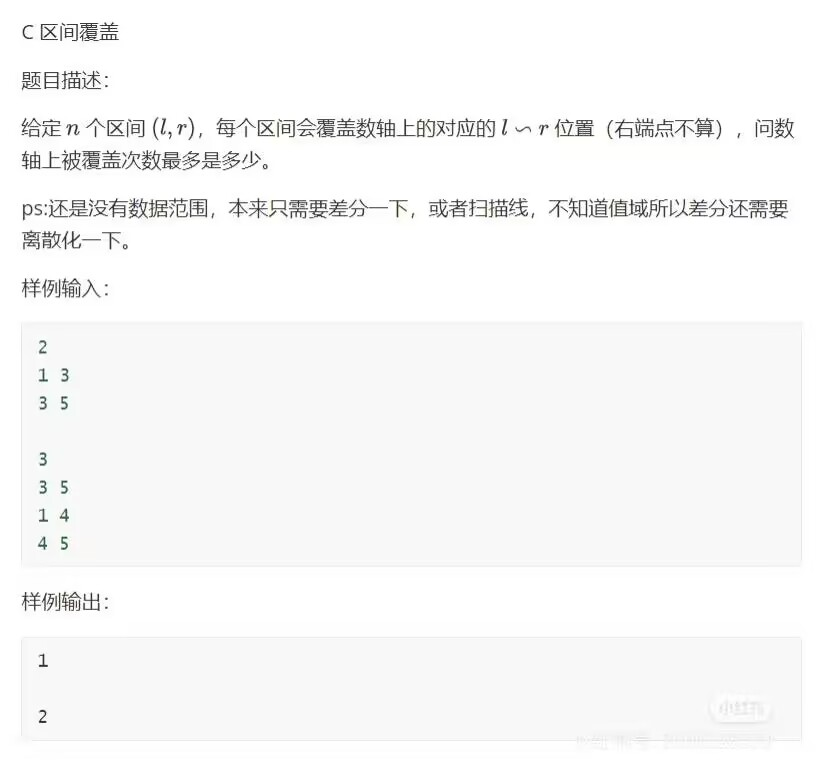

    vector<int> map; // 存储所有区间的端点（离散化用）
    
    // 二分查找：在离散化后的数组中找 x 的位置（1-based）
    int find(int x) {
        int l = 0, r = map.size() - 1;
        while(l < r) {
            int mid = l + r >> 1;
            if(map[mid] >= x) {
                r = mid;
            } else {
                l = mid + 1;
            }
        }
        return r + 1; // map_num 中下标从1开始计数，因此要加1 
    }
    
    int main() {
        int n;
        vector<vector<int>> qj; // 存储所有区间 [l, r]
        scanf("%d", &n);
        for(int i=1; i<=n; i++) {
            int l,r;
            scanf("%d %d", &l,&r);
            // 存下来每一对区间 
            qj.push_back({l, r});
            // 存下来每一对区间的端点（覆盖个数只需关注端点）
            map.push_back(l);
            map.push_back(r);
        }
        // 排序+去重（离散化关键步骤）
        sort(map.begin(), map.end());
        map.erase(unique(map.begin(), map.end()), map.end());
    
        // 构造差分容器（下标从1开始）
        vector<int> map_num(map.size()+1, 0);
    
        // 遍历所有区间，构造差分数组
        for(int i=0; i<qj.size(); i++) {
            int left,right;
            left = find(qj[i][0]); // 左端点离散化后的位置
            right = find(qj[i][1]); // 右端点离散化后的位置
            map_num[left]++;  // 区间开始位置+1
            map_num[right]--; // 区间结束位置-1
        }
    
        // 求前缀和并统计最大重叠数
        int ans=0;
        for(int i=0; i<map_num.size(); i++) {
            if(i==0) {
                map_num[i] = map_num[i]; // 第一个元素无需处理
            } else {
                map_num[i] = map_num[i] + map_num[i-1]; // 前缀和计算
            }
            ans = max(ans, map_num[i]); // 更新最大值
        }
        cout<<ans;
        return 0;
    }
## 字符串压缩

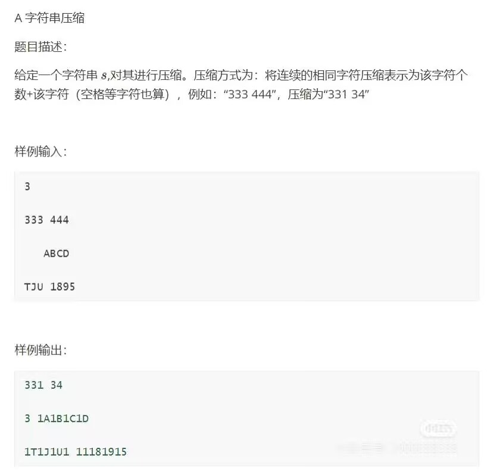

    int main() {
    	int n;
    	scanf("%d", &n);
    	cin.ignore();
    	for(int i=1; i<=n; i++) {
    		string s;
    		string ans;
    		char t;
    		getline(cin, s);
    		int temp=0;
    		for(int j=0; j<s.size(); j++) {
    			if(j==0) {
    				temp=1;
    				continue;
    			}
    			if(s[j]==s[j-1]) {
    				temp++;
    			} else {
    				t = temp + '0';
    				ans.push_back(t);
    				ans.push_back(s[j-1]);
    				temp=1;
    			}
    		}
    		t = temp + '0';
    		ans.push_back(t);
    		ans.push_back(s[s.size()-1]);
    		for(int j=0; j<ans.size(); j++) {
    			cout<<ans[j];
    		}
    		cout<<endl;
    	}
    }
## 机器分配

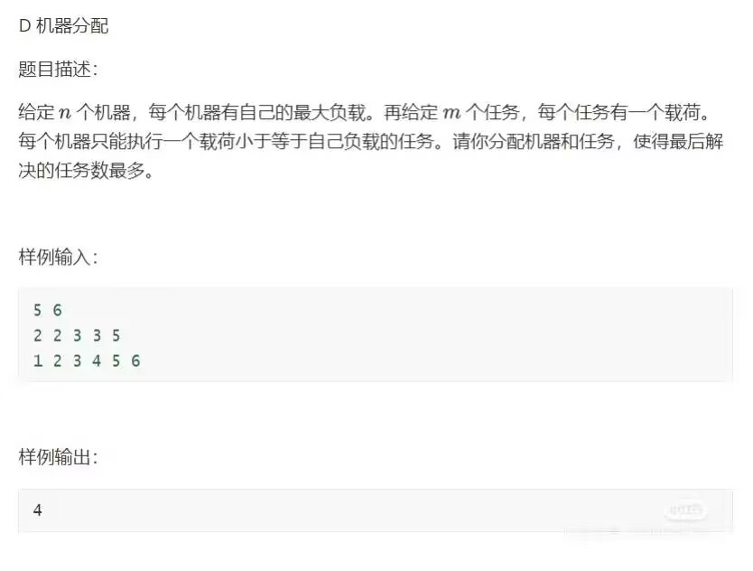

```
int main() {
	int n,x,m;
	vector<int> me;
	vector<int> rw;
	int ans=0;
	scanf("%d %d", &n, &m);
	for(int i=1; i<=n; i++) {
		scanf("%d", &x);
		me.push_back(x);
	}
	for(int i=1; i<=m; i++) {
		scanf("%d", &x);
		rw.push_back(x);
	}
	sort(rw.begin(), rw.end());
	sort(me.begin(), me.end());
	int l=0,r=0;
	while(l<me.size() && r<rw.size()) {
		if(me[l]>=rw[r]) {
			ans++;
			l++;
			r++;
		} else {
			l++;
		}
	}
	cout<<ans;
	return 0;
}
```

## 整数化

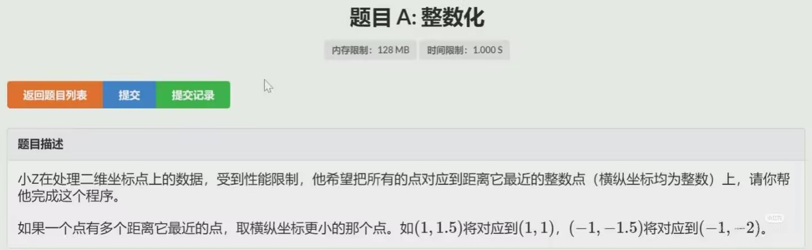

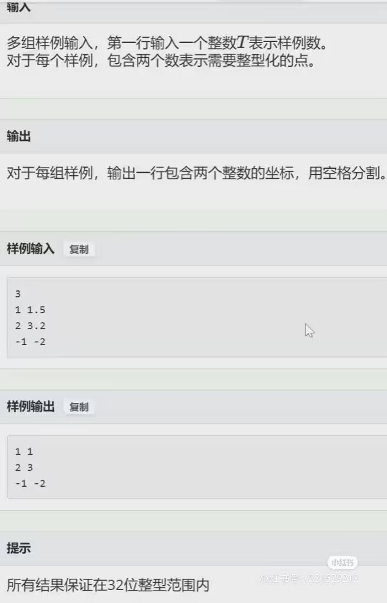

```
int zhuan(double x) {
	double temp;
	int y = x;// x的整数位
//	cout<<y<<endl;
	temp = y;// x整数位换成浮点型
	if(x>=0) {
		if((x-temp)>0.5) {
			return y+1;
		} else {
			return y;
		}
	} else {
		if((temp-x)>=0.5) {
			return y-1;
		} else {
			return y;
		}
	}
}
int main() {
	int n;
	scanf("%d", &n);
	for(int i=1; i<=n; i++) {
		double l,r;
		int x,y;
		cin>>l>>r; 
		x = zhuan(l);
		y = zhuan(r);
		cout<<x<<' '<<y<<endl;
	}
}
```

## 最长完美区间

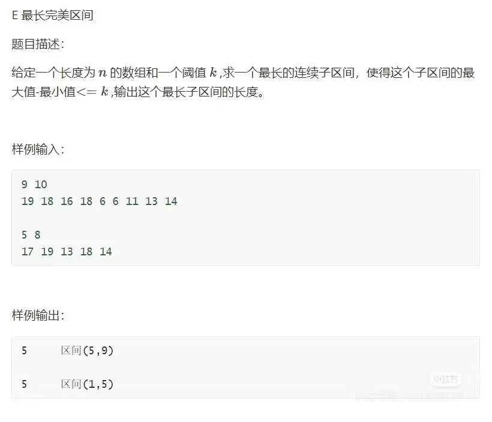

```
int main() {
	int n,k;
	vector<int> num;
	num.push_back(-1);
	scanf("%d %d",&n,&k);
	int x = floor(log2(n));
	vector<vector<int>> dp_max(n+1, vector<int>(x+1, 0));
	vector<vector<int>> dp_min(n+1, vector<int>(x+1, 0));
	for(int i=1; i<=n; i++) {
		int x;
		scanf("%d", &x);
		num.push_back(x);
	}
	int len=1;
	for(int mi=0; len<=n; mi++) {
		len = 1<<mi;
		for(int i=1; i+len-1<=n; i++) {
			int j = i+len-1;
			if(i==j) {
				dp_max[i][mi] = num[i];
				dp_min[i][mi] = num[i];
			} else {
				dp_max[i][mi] = max(dp_max[i][mi-1], dp_max[j-(1<<(mi-1))+1][mi-1]);
				dp_min[i][mi] = min(dp_min[i][mi-1], dp_min[j-(1<<(mi-1))+1][mi-1]);
			}
		}
	}
	int l=1,r=1;
	int ans = 1;
	while(r<=n) {
		ans = max(ans, r-l+1);
		int y = floor(log2(r-l+1));
		int max_ele = max(dp_max[l][y], dp_max[r-(1<<y)+1][y]);
		int min_ele = min(dp_min[l][y], dp_min[r-(1<<y)+1][y]);
		if(max_ele - min_ele<=k) {
			r++;
		} else {
			l++;
		}
	}
	cout<<ans;
	return 0;
}
```

```
int main() {
	int n,k;
	vector<int> num;
	scanf("%d %d",&n,&k);
	for(int i=0; i<=n-1; i++) {
		int x;
		scanf("%d", &x);
		num.push_back(x);
	}
	int l=0,r=0;
	multiset<int> ms;
	int ans = 0;
	while(r<=n-1) {
		ms.insert(num[r]);
		while(ms.size()!=0 && *ms.rbegin()-*ms.begin()>k) {
			ms.erase(ms.find(num[l]));
			l++;
		}
		ans = max(ans, r-l+1);
		r++;
	}
	cout<<ans;
	return 0;
}
```

## 指标转换

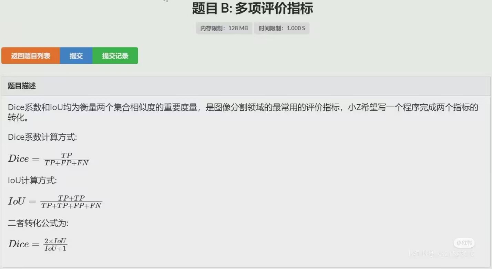

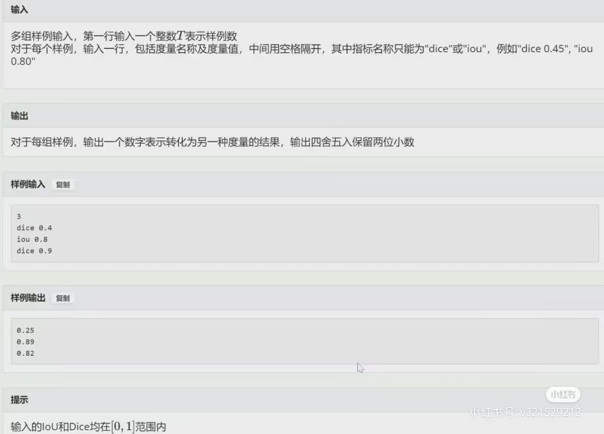

```
int main() {
	int n;
	scanf("%d",&n);
	for(int i=1; i<=n; i++) {
		string s;
		double x;
		cin>>s;
		scanf("%lf", &x);
		if(s=="iou") {
			double y;
			y = (2 * x) / (x + 1);
			printf("%.2f\n", y);
		} else {
			double y;
			y = x / (2 -x);
			printf("%.2f\n", y);
		}
	}
	return 0;
}
```

## 跳着数数

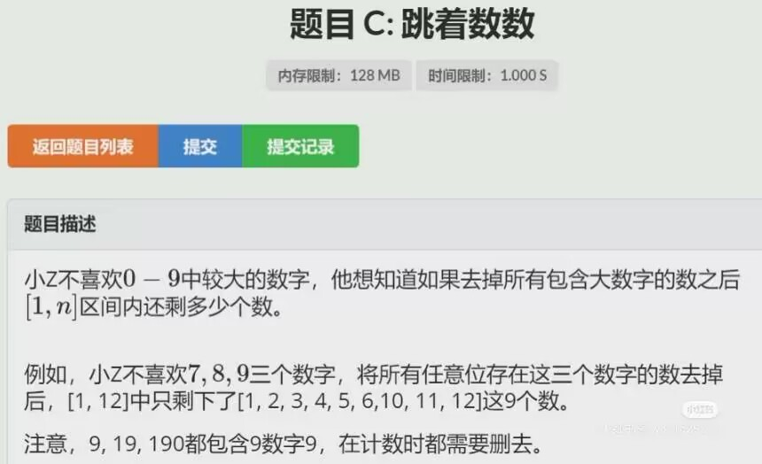

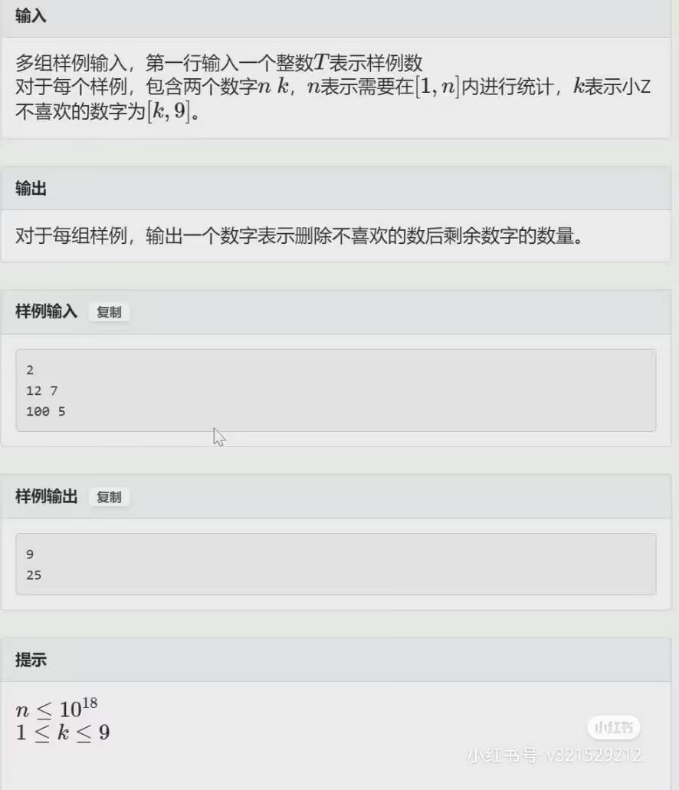

```
int f(vector<int>& number, int i, bool is_limit, bool is_num, int x) {
	if(i==number.size()) {
		return is_num;
	}
	int ans=0;
	if(is_num==false) {
		ans+=f(number, i+1, false, false, x);
	}

	int lb,ub;
	if(is_limit==true) {
		ub=number[i];
	} else {
		ub=9;
	}
	if(is_num==true) {
		lb=0;
	} else {
		lb=1;
	}
	ub=min(ub, x-1);
	for(int k=lb; k<=ub; k++) {
		ans+=f(number, i+1, is_limit&(k==ub), true, x);
	}
	return ans;
}
int main() {
	int T;
	cin>>T;
	while(T--) {
		int n, x;
		cin>>n>>x;
		vector<int> number;
		while(n!=0) {
			number.insert(number.begin(), n%10);
			n=n/10;
		}
		int ans = f(number, 0, true, false, x);
		cout<<ans<<endl;
	}
}
```

## 买水果

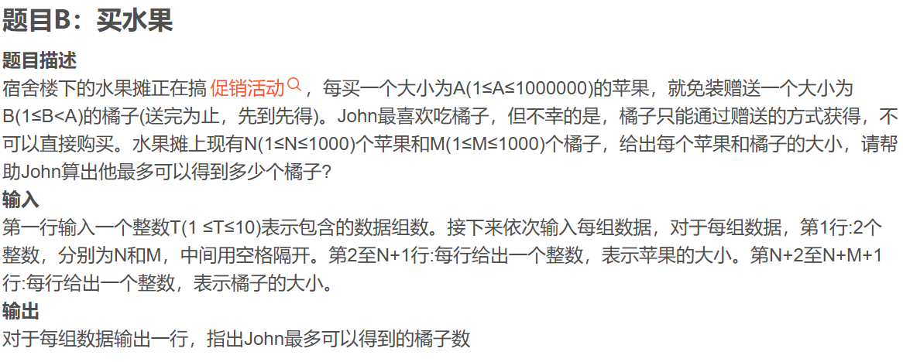

```
int main() {
	int T;
	cin>>T;
	while(T--) {
		int n,m;
		cin>>n>>m;
		vector<int> pg;
		vector<int> jz;
		for(int i=1; i<=n; i++) {
			int x;
			scanf("%d", &x);
			pg.push_back(x);
		}
		for(int i=1; i<=m; i++) {
			int x;
			scanf("%d", &x);
			jz.push_back(x);
		}
		int l=0,r=0;
		int ans=0;
		sort(pg.begin(), pg.end());
		sort(jz.begin(), jz.end());
		while(l<=n-1 && r<=m-1) {
			if(pg[l]>jz[r]) {
				ans++;
				l++;
				r++;
			} else {
				l++;
			}
		}
		cout<<ans<<endl;
	}
}eturn 0;
}
```

样例

```
input:
3 3
4 5 6 
3 4 5
output:
3


input:
3 3
1 8 7 
1 6 8
output:
2
```

## 异或游戏

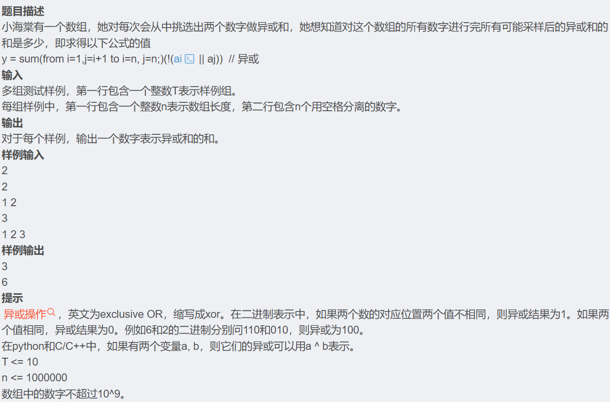

```
int main() {
	int T;
	scanf("%d", &T);
	while(T--) {
		int n;
		vector<int> num;
		vector<int> num_1(9,0);
		num.push_back(-1);
		scanf("%d", &n);
		for(int t=1; t<=n; t++) {
			int x;
			scanf("%d", &x);
			num.push_back(x);
			for(int i=0; i<=8; i++) {
				if(x&(1<<i)) {
					num_1[i]++;
				}
			}
		}
		int ans = 0;
		for(int i=0; i<=8; i++) {
			ans = ans + (1<<i)*(num_1[i])*(n - num_1[i]);
		}
		cout<<ans<<endl;
	}
}
```

开一个数字，计算num数组里面，第 i (0~9) 位是 1 的总个数。

异或计算，实际上就是例如：

假如说，总共 7 个 (n) 数字，第 0 位上 1 的总个数是 5 个 (num_i[0])，那么这七个数字互相异或运算，真正对答案有贡献的实际上就是C\_\{5}^{1} × C_\{1}^{2}，也就是 (num_1[i]) * (n - num_1[i])，那么在第 0 位上，实际上就是 2 的 0 次方，它一共被贡献了 (num_1[i]) * (n - num_1[i]) 个！

## 预约会议室

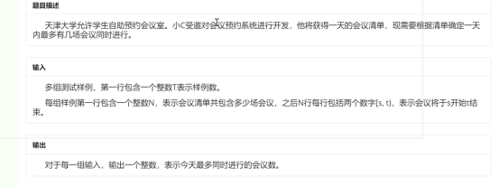

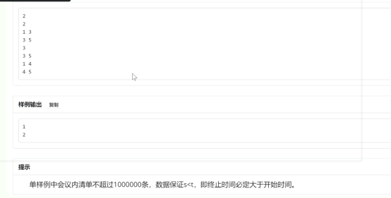

```
bool cmp(vector<int> a, vector<int> b) {
	if(a[0]!=b[0]) {
		return a[0]<b[0];
	}
	return a[1]>b[1];
}
int main() {
	int N;
	scanf("%d", &N);
	while(N--) {
		int n;
		vector<vector<int>> qj;
		scanf("%d", &n);
		for(int i=1; i<=n; i++) {
			int l,r;
			scanf("%d %d", &l,&r);
			qj.push_back({l ,r});
		}
		sort(qj.begin(), qj.end(), cmp);
		int ans = 0;
		int temp = 1;
		for(int i=0; i<qj.size(); i++) {
			if(i==0) {
				continue;
			}
			if(qj[i][0]<qj[i-1][1]) {
				qj[i][1] = min(qj[i][1], qj[i-1][1]);
				temp++;
			} else {
				ans = max(ans, temp);
				temp = 0;
			}
		}
		cout<<ans<<endl;
	}
	return 0;
}
```

## 恰好出现两次的最长字串

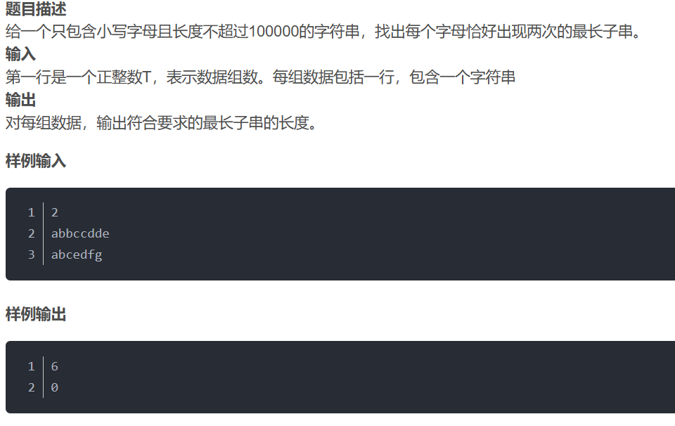

```
int qz[30][100010];
int main() {
	int T;
	scanf("%d", &T);
	while(T--) {
		string s;
		cin>>s;
		int ans = 0;
		for(int i=1; i<=s.size(); i++) {
			for(int j=0; j<26; j++) {
				if(s[i-1]-'a'==j) {
					qz[j][i] = qz[j][i-1] + 1;
				} else {
					qz[j][i] = qz[j][i-1];
				}
			}
		}

		int len = s.size();
		for(int i=1; i<=len; i++) {
			for(int j=0; j+i-1<len; j++) {
				int success = 1;
				for(int k=0; k<26; k++) {
					if(qz[k][j+i] - qz[k][j] !=2 && qz[k][j+i] - qz[k][j] !=0) {
						success = 0;
						break;
					}
				}
				if(success == 1) {
					ans = max(ans, i);
					break;
				}
			}
		}
		cout<<ans<<endl;
	}
	return 0; 
}
```

- 先把每个字母在前 i 个字母中出现的次数先算一遍,相当于一个前缀和
- 然后在遍历每种长度,在 固定长度 和 固定了该长度的区间 后,查看26个字母中的每一个,如果他出现的次数不是0或者2,那么就break

不难发现，本题的答案一定是偶数，因此可以优化区间长度的遍历

```
for(int i=2; i<=len; i=i*2)
```

## 更短的最短路

见 迪杰斯特拉部分

## 复原IP地址（分割问题）

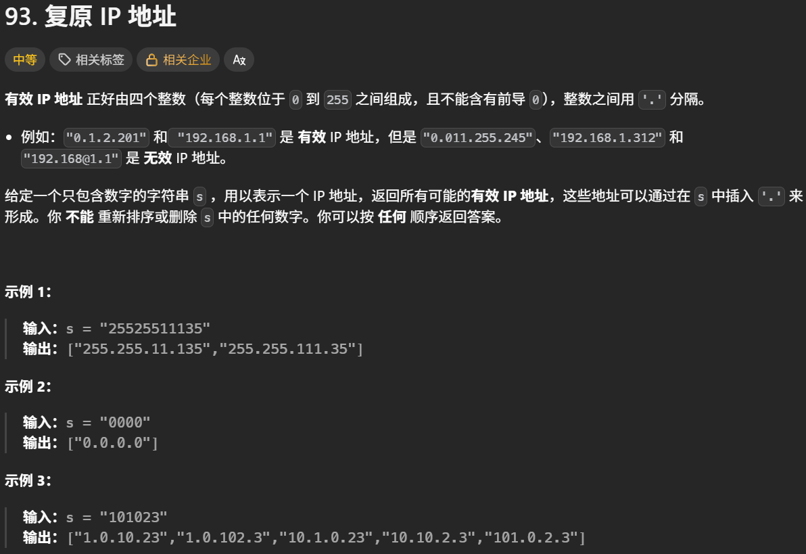

```
class Solution {
	public:
		vector<string> res;
		vector<string> ans;
		bool check(string s) {
			if(s.size()>1 && s[0]=='0') {
				return false;
			}
			if(s.size()>=4){
				return false;
			}
			long long int num=0;
			for(int i=0; i<s.size(); i++) {
				num = num*10 + s[i]-'0';
			}
			if(num>255) {
				return false;
			}
			return true;
		}
		void dfs(string s, int nowpos, int fg) {
			if(res.size()>4){
				return;
			}
			if(nowpos==s.size()) {
				if(res.size()==4) {
					string b;
					for(int i=0; i<res.size(); i++) {
						string a = res[i];
						b = b+a+'.';
					}
					b.pop_back();
					ans.push_back(b);
				}
				return;
			}
			if(nowpos!=s.size()-1) {
				dfs(s, nowpos+1, fg);
			}
			string temp = s.substr(fg+1, nowpos-fg);
			bool success = check(temp);
			if(success==true) {
				res.push_back(temp);
				dfs(s, nowpos+1, nowpos);
				res.pop_back();
			}
			return;
		}
		vector<string> restoreIpAddresses(string s) {
			dfs(s, 0, -1);
			return ans;
		}
};
```

```
if(res.size()>4){
	return;
}
```

这句话不加也能过，但是加了起到了一个剪枝作用，会提升一些速度


## 海棠节

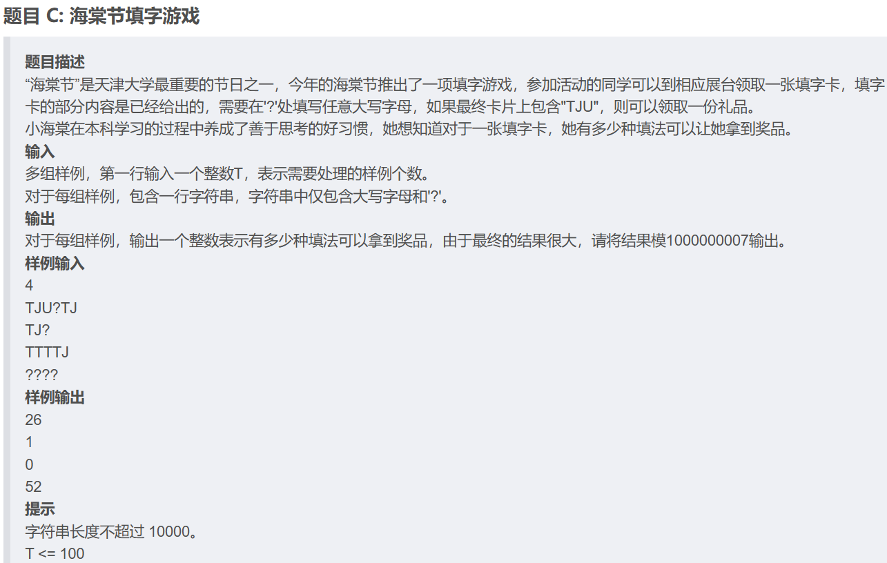

```
int ans = 0;
int mod = 1000000007;
void dfs(int x, string s, string temp) {
	if(x==s.size()) {
		for(int i=0; i<temp.size(); i++) {
			if(i+1>temp.size()-1 || i+2>temp.size()-1) {
				return;
			} else {
				if(temp[i]=='T' && temp[i+1]=='J' && temp[i+2]=='U') {
					ans = (ans+1)%mod;
					break;
				}
			}
		}
		return;
	}
	if(s[x]!='?') {
		temp.push_back(s[x]);
		dfs(x+1, s, temp);
	} else {
		for(int i=1; i<=26; i++) {
			temp.push_back('A'+i-1);
			dfs(x+1, s, temp);
			temp.pop_back();
		}
	}
	return;
}
int main() {
	int n;
	scanf("%d", &n);
	while(n--) {
		ans = 0;
		string s;
		cin>>s;
		string temp;
		dfs(0, s, temp);
		cout<<ans<<endl; 
	}
}
```

## 覆盖

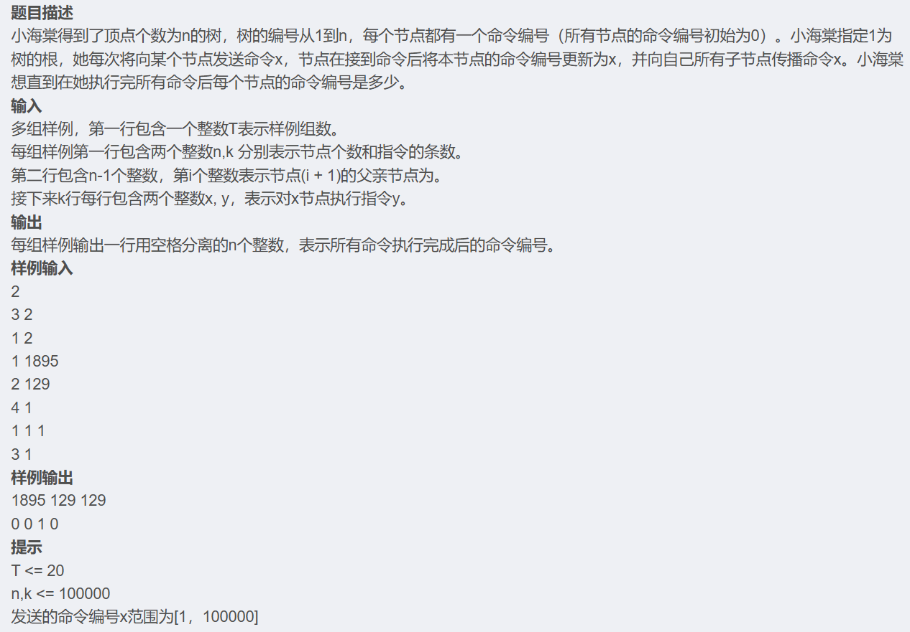

```
int h[100100];
int ne[201000];
int idx=0;
int e[200010];
void add(int a, int b) {
	e[idx]=b;
	ne[idx]=h[a];
	h[a]=idx;
	idx++;
}
bool use[200010];
void bfs(int jd, int zl, vector<int>& ans) {
	memset(use, false, sizeof use);
	vector<int> dui;
	ans[jd]=zl;
	dui.push_back(jd);
	int tou=0, wei=0;
	while(tou<=wei) {
		int pos = dui[tou];
		use[pos]=true;
		tou++;
		for(int i=h[pos]; i!=-1; i=ne[i]) {
			int j = e[i];
			if(use[j]==false) {
				dui.push_back(j);
				wei++;
				ans[j]=zl;
			}
		}
	}
}
int main() {
	int T;
	cin>>T;
	while(T--) {
		memset(h, -1, sizeof h);
		int n,k;
		cin>>n>>k;
		vector<int> ans(n+1, 0);
		for(int i=1; i<=n-1; i++) {
			int a;
			cin>>a;
			add(a, i+1);
		}
		for(int i=1; i<=k; i++) {
			int jd, zl;
			cin>>jd>>zl;
			bfs(jd, zl, ans);
		}
		for(int i=1; i<ans.size(); i++) {
			cout<<ans[i]<<' ';
		}
		cout<<endl;
	}
}
```

## 美丽序列

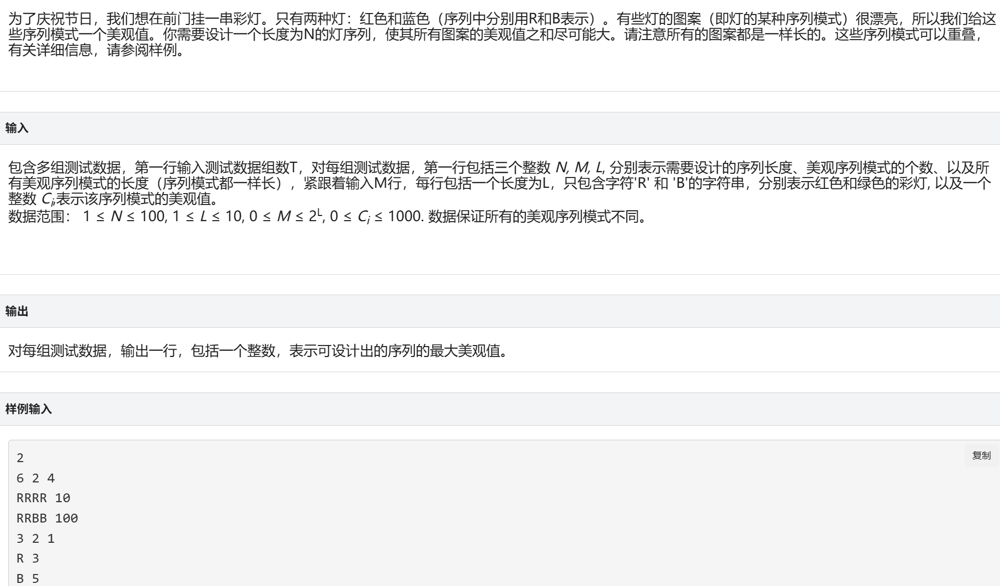

```
int dp[200][10000];
int main() {
	int N,M,L;
	unordered_map<string, int> dic;
	unordered_map<int, string> dic_mask;
	cin>>N>>M>>L;
	for(int i=1; i<=M; i++) {
		string s;
		int a;
		cin>>s>>a;
		dic[s]=a;
		int t=0;
		for(int i=L-1; i>=0; i--) {
			if(s[i]=='B') {
				t=(t|(1<<(L-1-i)));
			}
		}
		dic_mask[t]=s;
	}
	int ans = 0;
	for(int i=1; i<=N-L+1; i++) {
		for (int mask = 0; mask < (1 << (L - 1)); mask++) {
			int mask_B = ((mask<<1)|1);
			int mask_R = (mask<<1);
			int houzhui_B=0;
			int houzhui_R=0;
			for(int k=0; k<L-1; k++) {
				houzhui_B = (houzhui_B | (mask_B&(1<<k)));
				houzhui_R = (houzhui_R | (mask_R&(1<<k)));
			}
			dp[i][houzhui_B] = max(dp[i][houzhui_B], dp[i-1][mask] + dic[dic_mask[mask_B]]);
			dp[i][houzhui_R] = max(dp[i][houzhui_R], dp[i-1][mask] + dic[dic_mask[mask_R]]);
			ans = max({ans, dp[i][houzhui_B], dp[i][houzhui_R]});
		}
	}
	cout<<ans;
}
```


# 华东师范软件夏令营

## 下棋

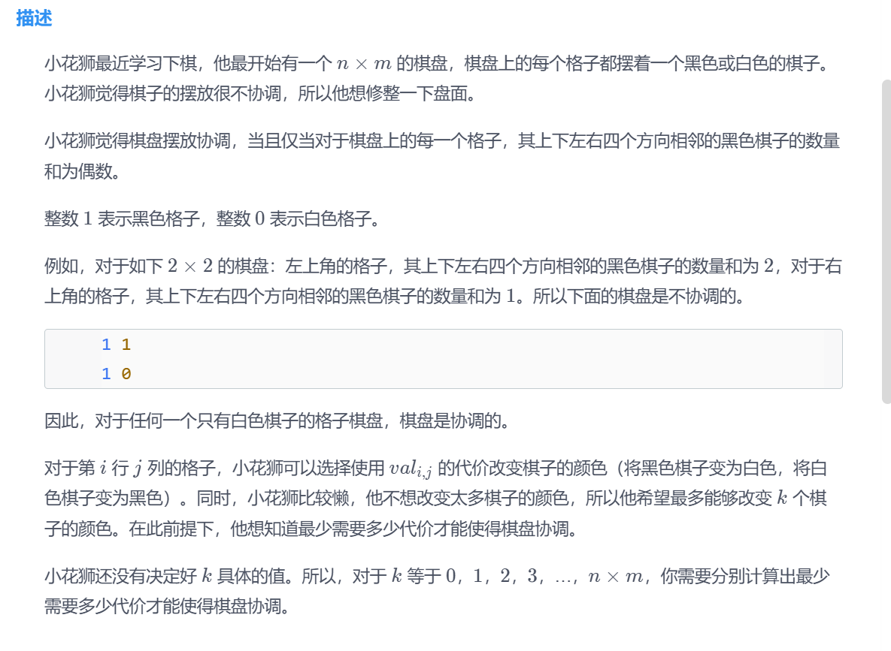

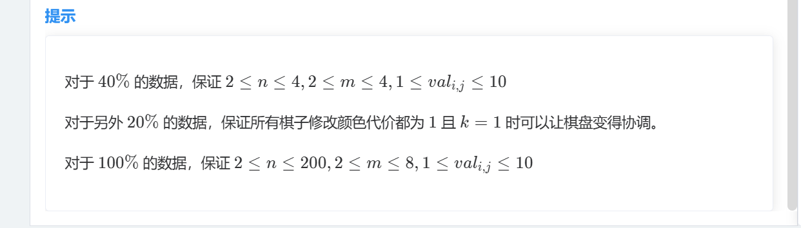


## 种花

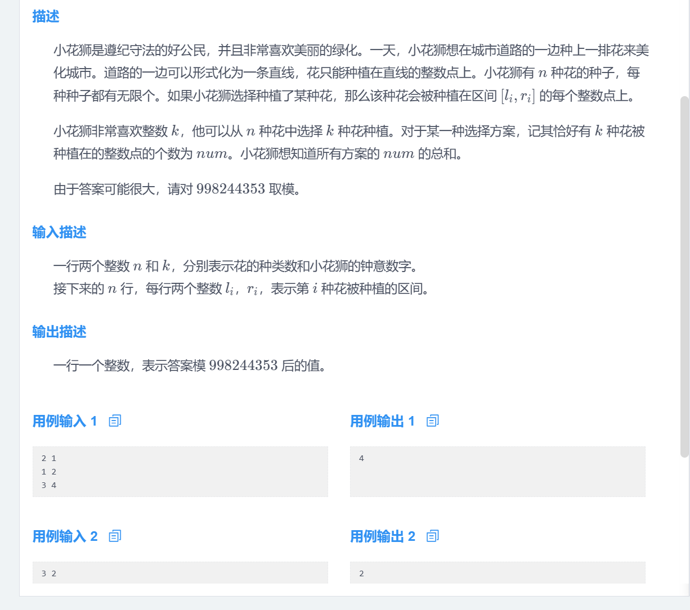

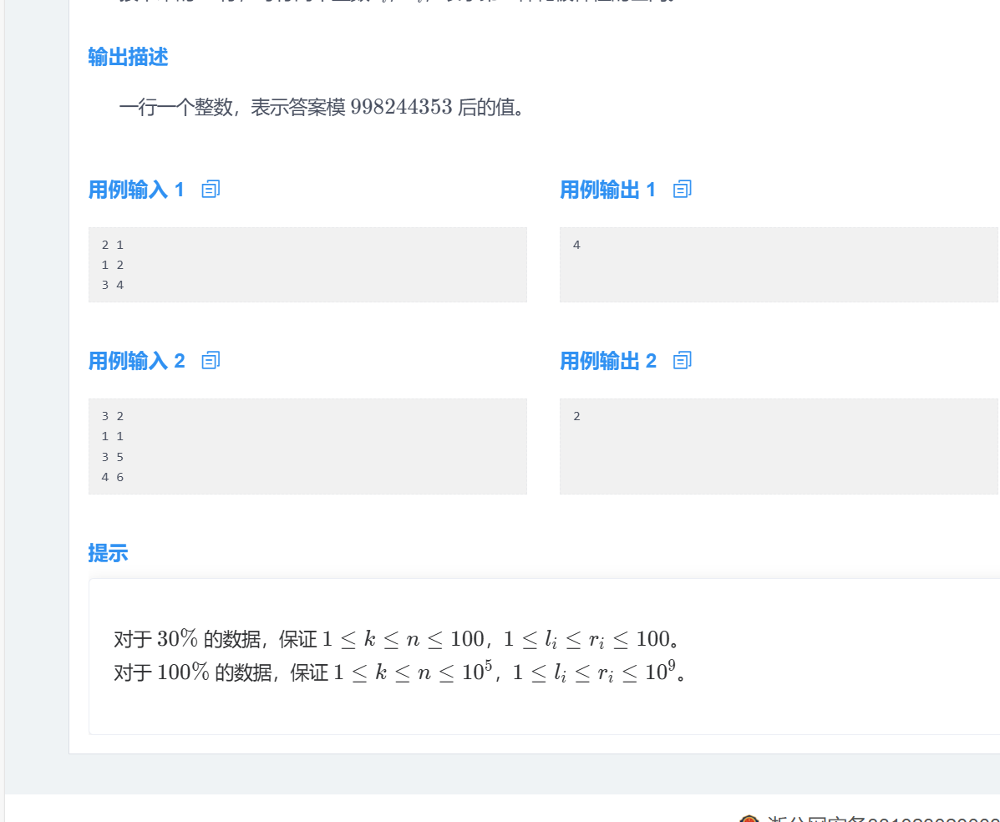

## 表达式

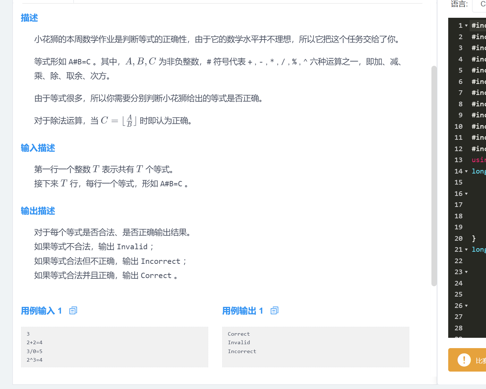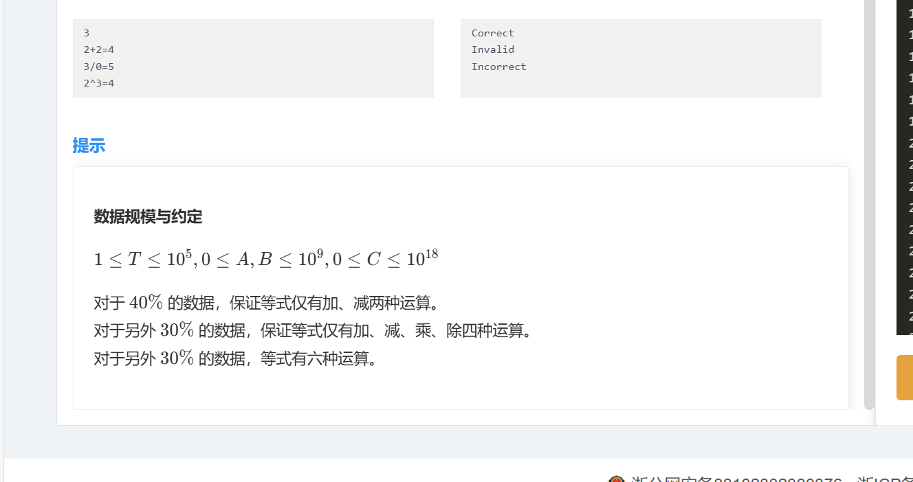


# 山东ilearn机试题

## 淘金游戏


## 魔法阵


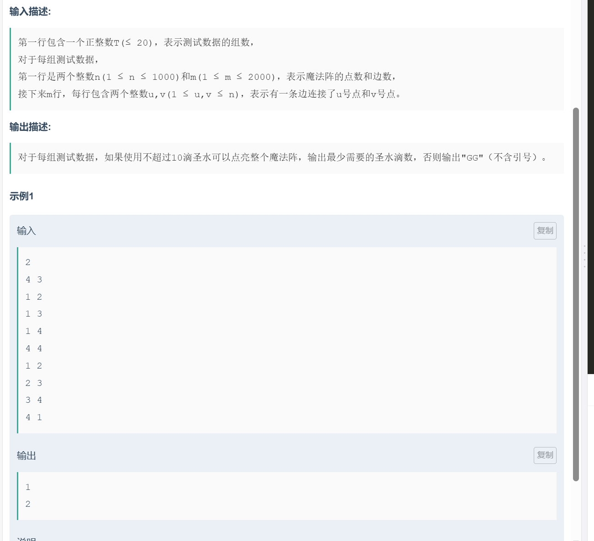

```
bool cmp(vector<int> a, vector<int> b) {
	return a[0]<b[0];
}
bool cover(vector<int>& choose, vector<vector<int>>& edge) {
	bool success=false;
	int i;
	for(i=0; i<edge.size(); i++) {
		int a = edge[i][0];
		int b = edge[i][1];
		bool temp = false;
		for(int j=0; j<choose.size(); j++) {
			if(choose[j]==a || choose[j]==b) {
				temp=true;
				break;
			}
		}
		if(temp==false) {
			break;
		}
	}
	if(i==edge.size()) {
		success=true;
	}
	return success;
}
int main() {
	int T;
	cin >> T;
	while (T--) {
		int ans = INT_MAX;
		int n, m;
		cin >> n >> m;
		vector<vector<int>> edge;
		for(int i=1; i<=m; i++) {
			int a, b;
			cin>>a>>b;
			if(a>b) {
				int t=a;
				a=b;
				b=t;
			}
			edge.push_back({a, b});
		}
		sort(edge.begin(), edge.end(), cmp);
		edge.erase(unique(edge.begin(), edge.end()), edge.end());
		for(int k=1; k<=10; k++) {
			vector<bool> mask(n, false);
			bool success;
			fill(mask.end()-min(k, n), mask.end(), true); // 后k位置为true
			do {
				vector<int> choose;
				for(int i=0; i<mask.size(); i++) {
					if(mask[i]==true) {
						choose.push_back(i+1);
					}
				}
				success = cover(choose, edge);
				if(success) {
					ans = k;
					break;
				}
			} while(next_permutation(mask.begin(), mask.end()));
			if(success==true) {
				break;
			}
		}
		if(ans==INT_MAX) {
			cout<<"GG"<<endl;
		} else {
			cout<<ans<<endl;
		}
	}
	return 0;
}

```

超时写法，注意几点：

- ```
  fill(mask.end()-min(k, n), mask.end(), true); // 后k位置为true
  ```

- next_permutation来生成固定k后的所有排列组合（针对vector）

- 注意用sort和unique对 重边 / 自环 进行去重

# PGone

## 最大连续子序列

```
https://pgcode.cn/problem/1584
```

```
#include <iostream>
#include <vector>
#include <cmath>
#include <queue>
#include <map>
#include <algorithm>
#include <set>
#include <string>
#include <climits>
#include <cstring>
#include <numeric>
#include <unordered_map>
using namespace std;
// 20
int main() {
	int n;
	while(cin>>n && n!=0) {
		vector<int> num;
		vector<vector<int>> rmax;
		num.push_back(0);
		int qz[2*n]= {0};
		bool all_negitive=true;
		for(int i=1; i<=n; i++) {
			int a;
			cin>>a;
			num.push_back(a);
			if(a>=0){
				all_negitive=false;
			}
		}
		if(all_negitive==true){
			cout<<0<<' '<<num[1]<<' '<<num[n]<<endl;
			continue;
		}
		for(int i=1; i<=n; i++) {
			qz[i] = qz[i-1]+num[i];
		}
		int max_ele=1e9;
		int max_pos;
		for(int i=n; i>=1; i--) {
			if(i==n) {
				max_ele = qz[i];
				max_pos = i;
				rmax.push_back({max_ele, max_pos});
				continue; 
			}
			if(qz[i]>=max_ele) {
				rmax.push_back({max_ele, max_pos});
				max_ele = qz[i];
				max_pos = i;
			}else{
				rmax.push_back({max_ele, max_pos});
			}
		}
		
		reverse(rmax.begin(), rmax.end());	
		int x = rmax[0][0];
		int y = rmax[0][1];
		rmax.insert(rmax.begin(), {x, y});

		int ans_l=0;
		int ans_r=0;
		int ans=-1e9;
		
		for(int i=n; i>=0; i--) {
			if(ans==-1e9 || rmax[i][0]-qz[i]>=ans) {
				ans = rmax[i][0]-qz[i];
				ans_l = num[i+1];
				ans_r = num[rmax[i][1]];
			}
		}
		cout<<ans<<' '<<ans_l<<' '<<ans_r<<endl;
	}
}
```

```
if(qz[i]>=max_ele) {
	rmax.push_back({max_ele, max_pos});
	max_ele = qz[i];
	max_pos = i;
}else{
	rmax.push_back({max_ele, max_pos});
}
大于等于才更新max_ele和max_pos
但是，我们不能拿第i个减去qz第i个，所以要先pushback在更新，相当于当前这个i还是用之前的最大值
```

# 二轮

## 排序型贪心

### 执行操作后不同元素的最大数量

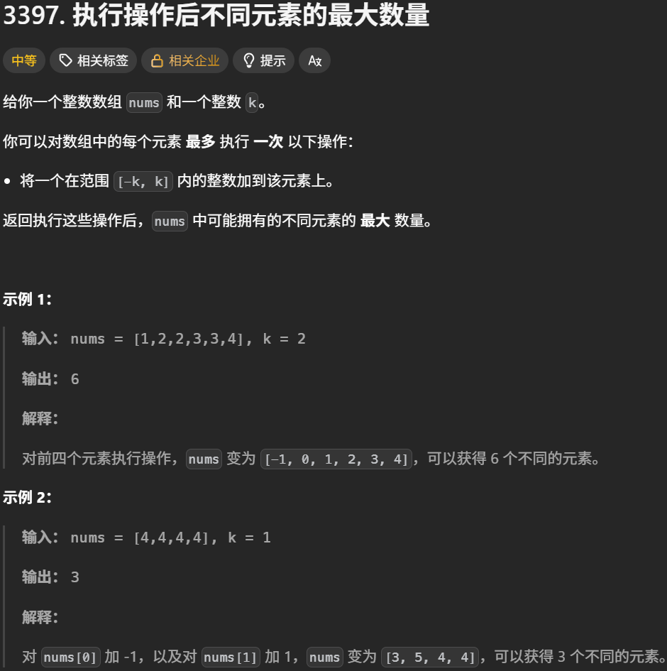

```
class Solution {
	public:
		int maxDistinctElements(vector<int>& nums, int k) {
			sort(nums.begin(), nums.end());
			int ans=0;
			for(int i=0; i<nums.size(); i++) {
				if(i==0) {
					nums[i]=nums[i]-k;
					continue;
				}
				if(nums[i]>nums[i-1]) {
					nums[i]=max(nums[i]-k, nums[i-1]+1);
				} else {
					nums[i]=min(nums[i-1]+1, nums[i]+k);
				}
			}
			unordered_map<int, bool> cx;
			for(int i=0; i<nums.size(); i++) {
				if(cx.find(nums[i])==cx.end()) {
					ans++;
					cx[nums[i]]=true;
				}
			}
			return ans;
		}
};
```

```
先排序

第一个元素，尽可能排在最左边

如果当前这个元素在前一个元素右边，尽可能让他往左靠，但是要在能力范围之内，所以：nums[i]=max(nums[i]-k, nums[i-1]+1);

如果当前这个元素在前一个元素左边，尽可能让他往右靠，但是要在能力范围之内，所以：
nums[i]=min(nums[i-1]+1, nums[i]+k);
```

### 吃披萨

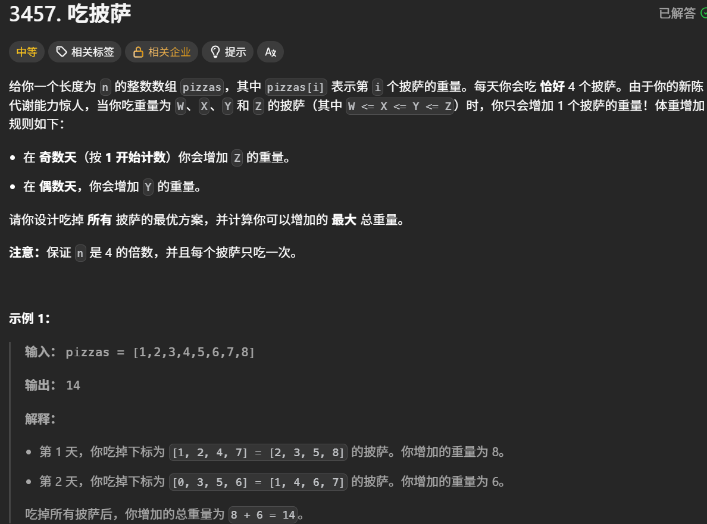

```
class Solution {
	public:
		long long maxWeight(vector<int>& pizzas) {
			long long int ans = 0;
			int n = pizzas.size()/4;
			int jishu = ceil(n*1.0/2);
			int oushu = floor(n*1.0/2);
			sort(pizzas.begin(), pizzas.end());
			for(int i=1; i<=jishu; i++) {
				ans+=pizzas[pizzas.size()-1];
				pizzas.erase(pizzas.end()-1);
			}
			for(int i=1; i<=oushu; i++) {
				pizzas.erase(pizzas.end()-1);
				ans+=pizzas[pizzas.size()-1];
                pizzas.erase(pizzas.end()-1);
			}
			return ans;
		}
};
```

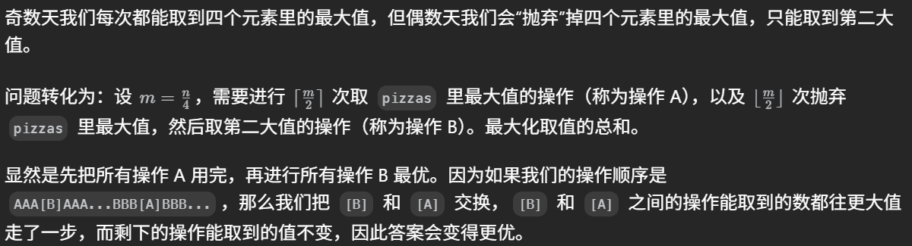

### 心算挑战

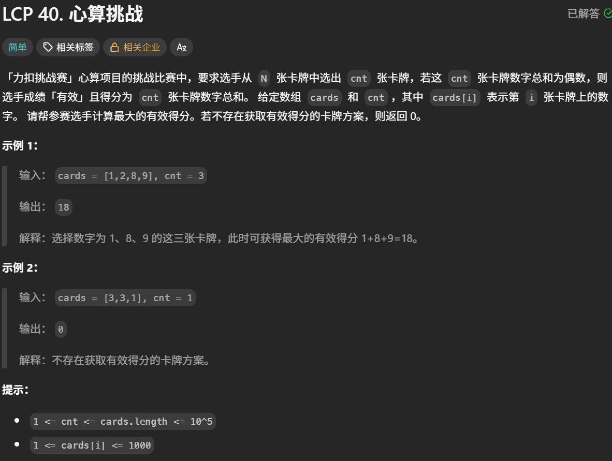

```
class Solution {
	public:
		int maximumScore(vector<int>& cards, int cnt) {
			sort(cards.begin(), cards.end());
			int sum=0;
			int min_jishu=1e9;
			int min_oushu=1e9;
			for(int i=1; i<=cnt; i++) {
				if(cards[cards.size()-i]%2==0) {
					min_oushu = cards[cards.size()-i];
				}
				if(cards[cards.size()-i]%2!=0) {
					min_jishu = cards[cards.size()-i];
				}
				sum+=cards[cards.size()-i];
			}
			if(sum%2==0) {
				return sum;
			} else {
				int max_jishu=0;
				int max_oushu=0;
				for(int i=cards.size()-cnt-1; i>=0; i--) {
					if(max_oushu==0 && cards[i]%2==0) {
						max_oushu=cards[i];
					}
					if(max_jishu==0 && cards[i]%2!=0) {
						max_jishu=cards[i];
					}
				}
				int ans = 0;
				if(max_jishu!=0 && min_oushu!=1e9) {
					ans = max(ans, sum-min_oushu+max_jishu);
				}
				if(max_oushu!=0 && min_jishu!=1e9) {
					ans = max(ans, sum-min_jishu+max_oushu);
				}
				return ans;
			}
		}
};
```

```
先从后往前加cnt个数字，检查是不是偶数
不是偶数的话说明这些数字里奇数的个数不合理

从前找：最大的奇数换掉里面最小的偶数 或者 最大的偶数换掉最小的奇数
全都找不到了，那就return 0
```

### 数组列表中的最大距离

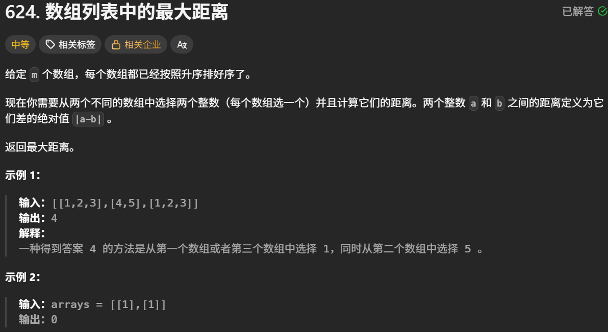

```
给定两个区间，他们俩的距离一定是：max-min或者min-max。因此遍历所有区间，一直维护最大的max和最小min，每来一个新区间就和当前的max和min计算一下就好
```

```
class Solution {
	public:
		int maxDistance(vector<vector<int>>& arrays) {
			int ans = 0;
			int T = arrays.size()-1;
			int min_ele;
			int max_ele;
			for(int i=0; i<arrays.size(); i++) {
				if(i==0) {
					min_ele = arrays[0][0];
					max_ele = arrays[0][arrays[0].size()-1];
					continue;
				}
				ans = max(ans, abs(min_ele-arrays[i][arrays[i].size()-1]));
				ans = max(ans, abs(arrays[i][0]-max_ele));
				max_ele = max(max_ele, arrays[i][arrays[i].size()-1]);
				min_ele = min(min_ele, arrays[i][0]);
			}
			return ans;
		}
};
```

## 单序列配对贪心

### 救生艇


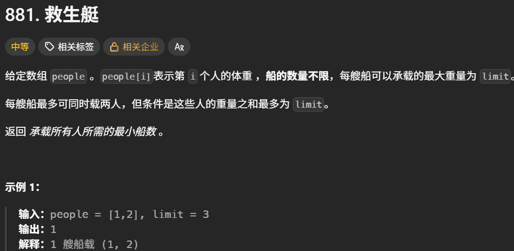

```
class Solution {
	public:
		int numRescueBoats(vector<int>& people, int limit) {
			sort(people.begin(), people.end());
			int ans = 0;
			int l=0;
			for(int i=people.size()-1; i>=0; i--) {
				if(l>i){
					break;
				}
				if(i!=l && people[i]+people[l]<=limit) {
					l++;
				}
				ans++;
			}
			return ans;
		}
};
```

```
尽可能充分利用一艘船的容积——优先插入体重大的，再用小的去补
注意l超过了i就要break
相加的时候一定看l是不是等于i！！
```

### 数组中最大数对和的最小值

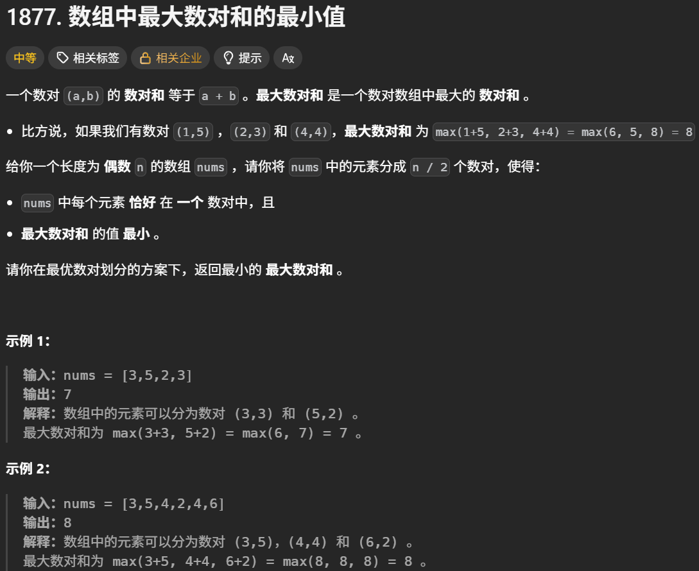

```
class Solution {
	public:
		int minPairSum(vector<int>& nums) {
			sort(nums.begin(), nums.end());
			priority_queue<int> dui;
			int l=0, r=nums.size()-1;
			while(l<r) {
				dui.push(nums[r]+nums[l]);
				r--;
				l++;
			}
			int ans = dui.top();
			return ans;
		}
};
```

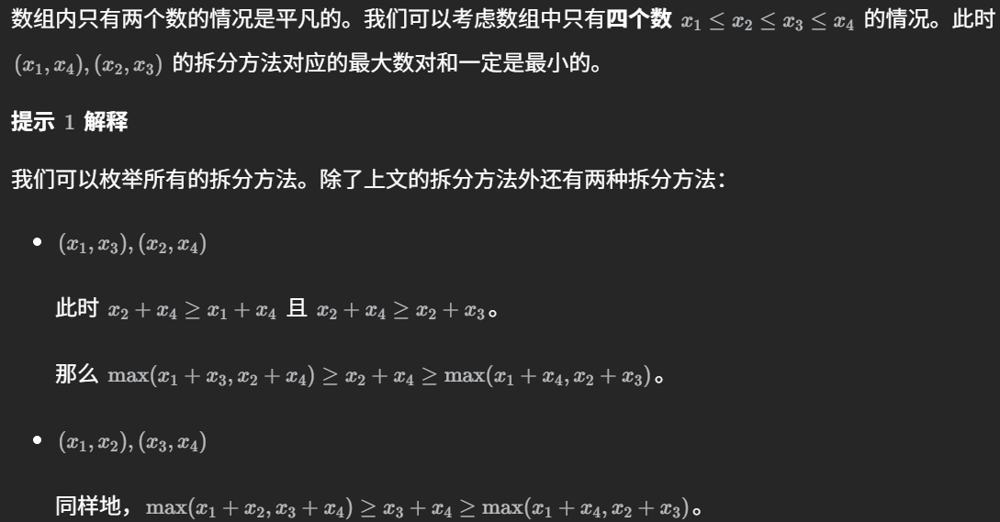

## 双序列配对贪心

### 优势洗牌

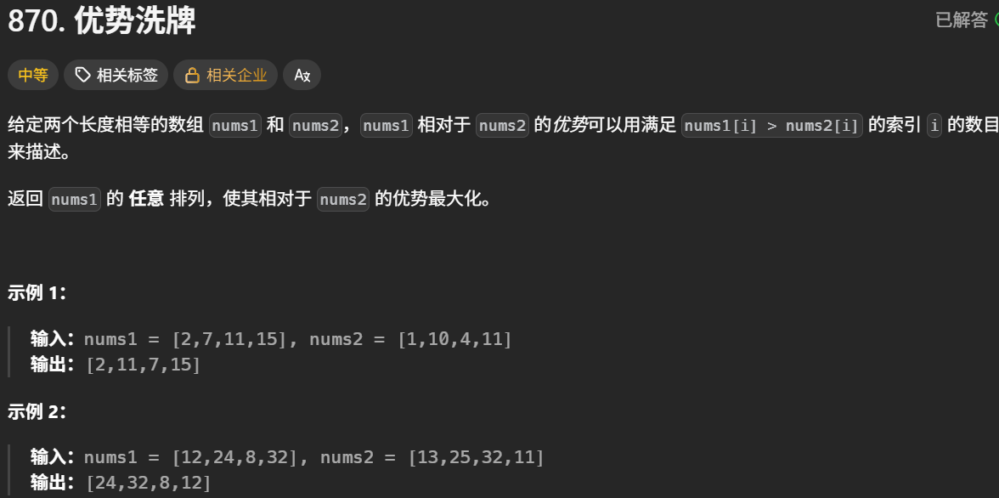

```
class Solution {
	public:
		vector<int> advantageCount(vector<int>& nums1, vector<int>& nums2) {
			vector<vector<int>> temp1;
			vector<vector<int>> temp2;
			int n = nums1.size();
			vector<int> ans(n, 0);
			for(int i=0; i<nums1.size(); i++) {
				temp1.push_back({nums1[i], i});
			}
			for(int i=0; i<nums2.size(); i++) {
				temp2.push_back({nums2[i], i});
			}
			sort(temp1.begin(), temp1.end());
			sort(temp2.begin(), temp2.end());
			int l=0, r=0;
			int max_bound = nums2.size()-1;
			while(l<nums1.size() && r<max_bound+1) {
				if(temp1[l][0]>temp2[r][0]) {
					ans[temp2[r][1]]=temp1[l][0];
					l++;
					r++;
				} else {
					ans[temp2[max_bound][1]]=temp1[l][0];
					l++;
					max_bound--;
				}
			}
			return ans;
		}
};
```

```
田忌赛马
```

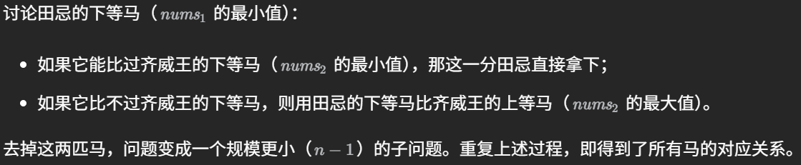

## 从左/右开始贪心

### 使二进制数组全部变成1需要的最少操作次数

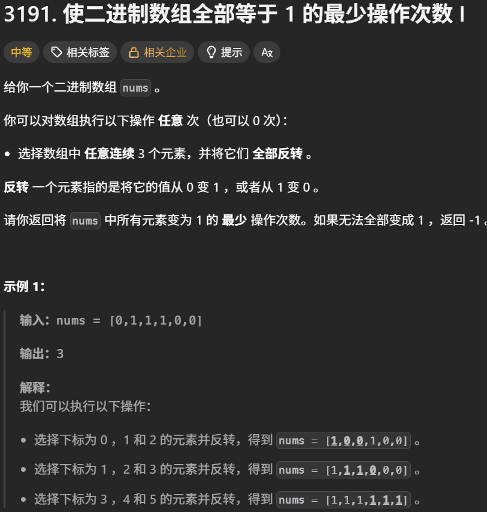

```
class Solution {
	public:
		int minOperations(vector<int>& nums) {
			int ans = 0;
			for(int i=0;i<nums.size();i++){
				if(nums[i]==0){
					if(i+2>=nums.size()){
						return -1;
					}else{
						ans++;
						nums[i]=1-nums[i];
						nums[i+1]=1-nums[i+1];
						nums[i+2]=1-nums[i+2];
					}
				}
			}
			return ans;
		}
};
```

```
兄弟们，贪心直接模拟就行了，碰到0就是一定要翻转的，做这个题的时候，忽然有点感慨人生，这道题就像人生，只有走到最后，才知道这条路是不是对的。
```

```
要注意，翻转是可以交换的，所以如果必须要动你看到的第一个零，那你直接动了，是不会错的，因为最优的翻转方法，一定也动了第一个零。
```

```
从头到尾直接翻过去就行了，也比较好理解，当你遇到一个nums[i]=0的i时必然要做一次三个元素的翻转，此时不翻就还得回来翻，是划不来的。
```

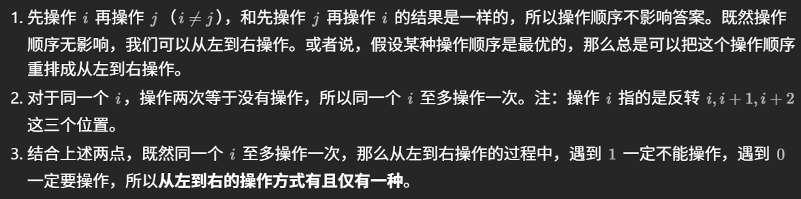

### 覆盖所有点的最少矩形数目

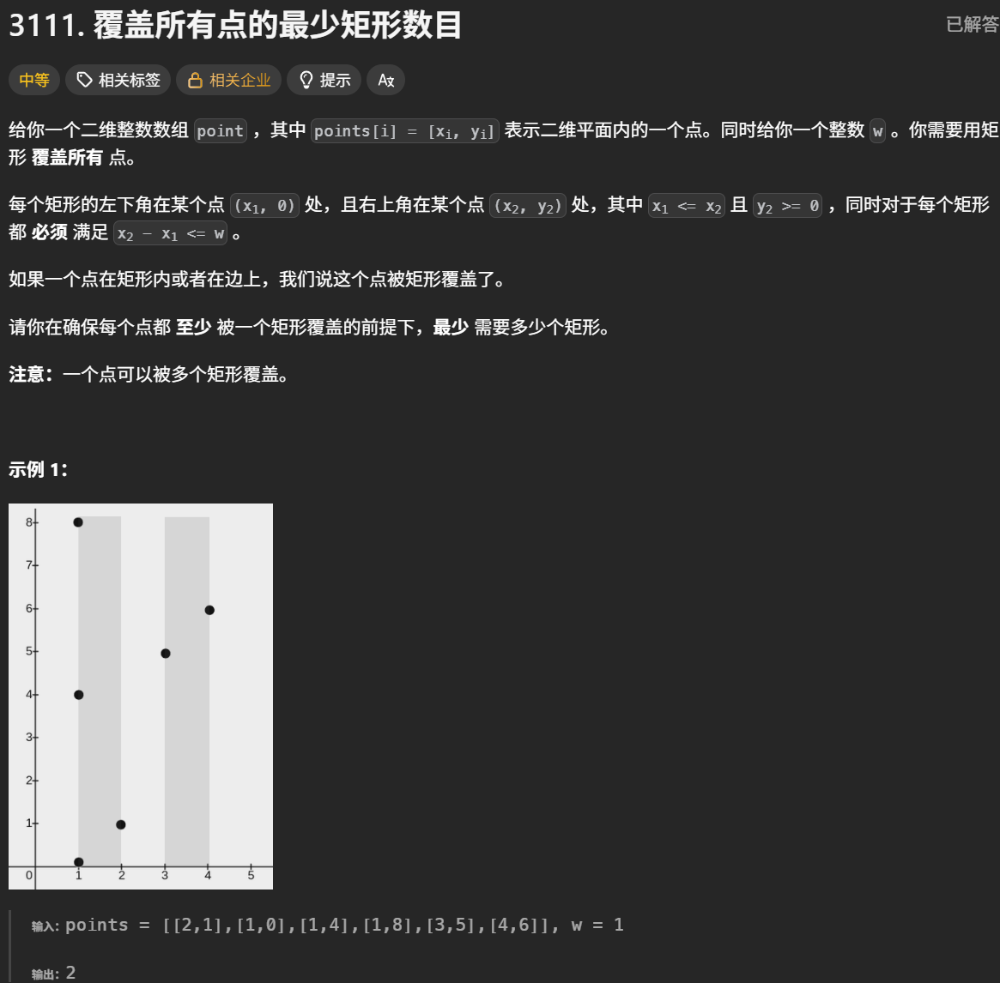

```
class Solution {
	public:
		int minRectanglesToCoverPoints(vector<vector<int>>& points, int w) {
			sort(points.begin(), points.end());
			int r=-1;
			int ans = 0;
			for(int i=0;i<points.size();i++){
				if(r<points[i][0]){
					ans++;
					r = points[i][0]+w;
				}
			}
			return ans;
		}
};
```

```
维护一个右边界，判断当前这个点是不是在右边界左边
```

### 数组元素相等转换

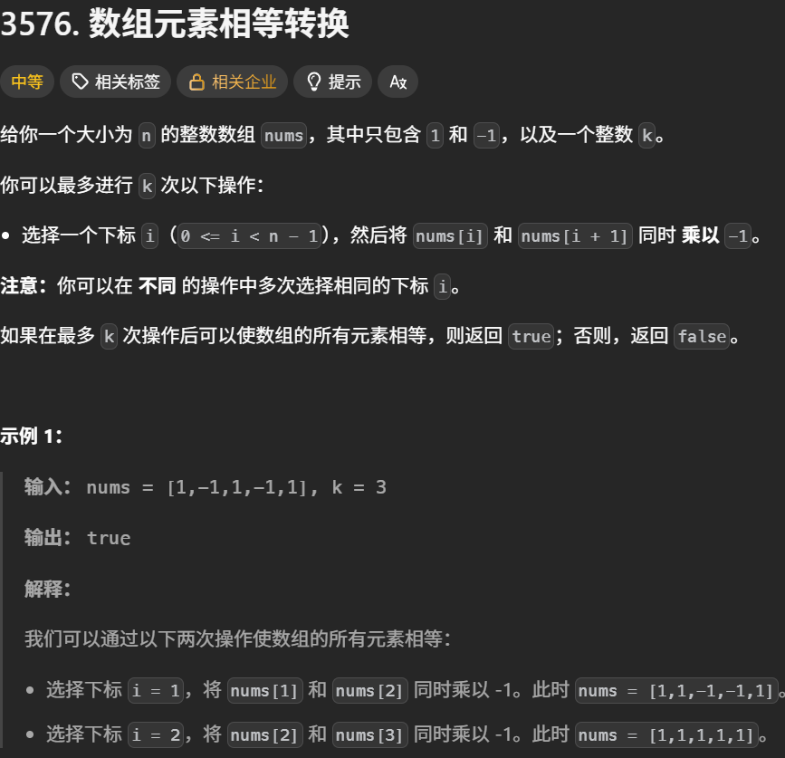

```
class Solution {
	public:
		bool canMakeEqual(vector<int>& nums, int k) {
			int ans=0;
			int ans1=0;
			int goal=-1;
			vector<int> nums1 = nums;
			int n = nums.size();
			for(int i=0; i<nums.size(); i++) {
				if(nums[i]==goal) {
					if(i+1>n-1) {
						ans=1e9;
						break;
					}
					ans++;
					nums[i]=-nums[i];
					nums[i+1]=-nums[i+1];
				}
			}
			goal=1;
			for(int i=0; i<nums1.size(); i++) {
				if(nums1[i]==goal) {
					if(i+1>n-1) {
						ans1=1e9;
						break;
					}
					ans1++;
					nums1[i]=-nums1[i];
					nums1[i+1]=-nums1[i+1];
				}
			}
			int res = min(ans1, ans);
			if(res==1e9||res>k){
				return false;
			}
			return true;
		}
};

```

```
1和-1都试一下，看最小值就行
```

## 划分型贪心

### 三段式数组Ⅰ

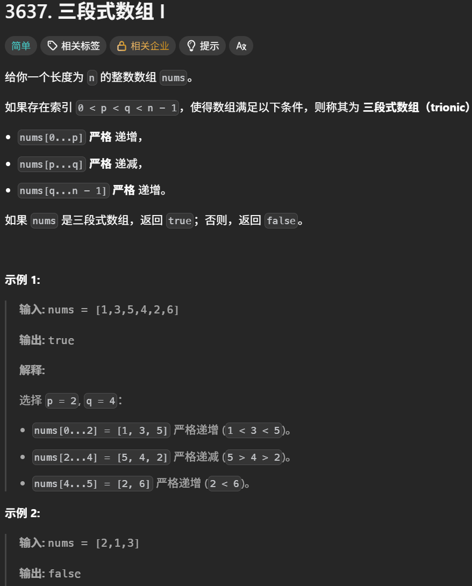

```
class Solution {
	public:
		bool isTrionic(vector<int>& nums) {
			if(nums.size()<4) {
				return false;
			}
			int p = -1;
			for(int i=1; i<nums.size(); i++) {
				if(nums[i]<=nums[i-1]) {
					p = i-1;
					break;
				}
			}
			if(p==-1 || p==0) {
				return false;
			}

			int q = -1;
			for(int i=p+1; i<nums.size(); i++) {
				if(nums[i]>=nums[i-1]) {
					q = i-1;
					break;
				}
			}
			if(q==-1 || q==nums.size()-1 || q==p) {
				return false;
			}

			bool success=true;
			for(int i=q+1; i<nums.size(); i++) {
				if(nums[i]<=nums[i-1]){
					success = false;
					break;
				}
			}
			
			return success;
		}
};
```

```
依次找p、q
特判：
if(p==-1 || p==0)（p直接没找到、或者直接就是原来的起点数字）
if(q==-1 || q==nums.size()-1 || q==p)（q直接没找到、或者直接就是原来的起点数字、或者是结尾数字）
```

### 平衡装运的最大数量

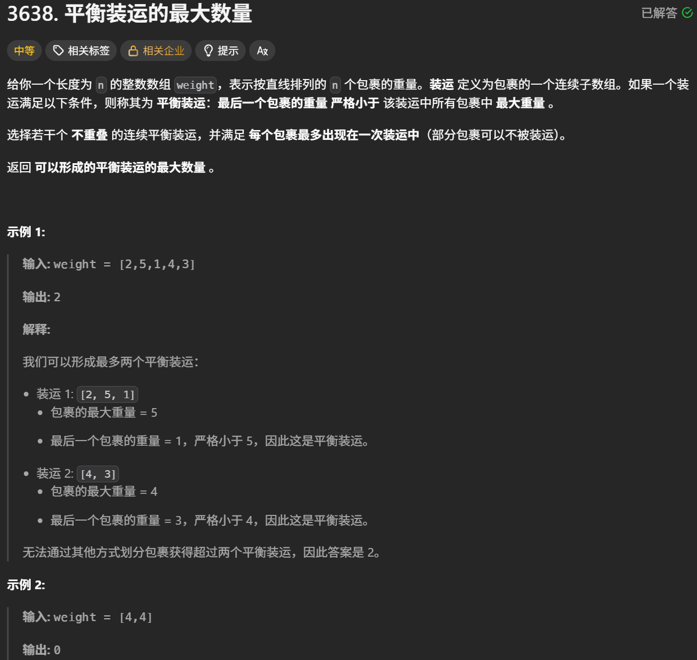

```
class Solution {
	public:
		int maxBalancedShipments(vector<int>& weight) {
			int ans =0;
			for(int i=1;i<weight.size();i++){
				if(weight[i]<weight[i-1]){
					ans++;
					i=i+1;
				}
			}
			return ans;
		}
};
```

```
只要weight[i]<weight[i-1]，就可以在这切一刀划分
```

### 分组的最大数量

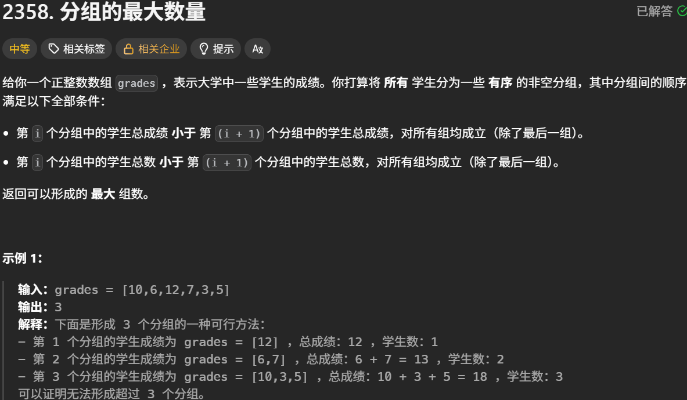

```
class Solution {
	public:
		int maximumGroups(vector<int>& grades) {
			int num=1;
			int ans =0;
			for(int i=0; i<grades.size(); i++) {
				if(i+num-1>=grades.size()) {
					break;
				}
                ans++;
				i=i+num-1;
				num++;
			}
			return ans;
		}
};
```

```
前面的分组尽可能拿最小的
前一个分组尽可能比后一个分组多1
排序后可以发现，答案就是——1+2+3+4+...+n
事实上O1就能搞定
```

## 枚举再贪心

### 拿出最少数目的豆子

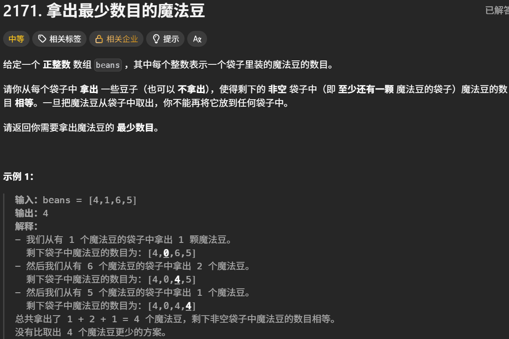

```
class Solution {
	public:
		int check(long long int x, vector<int>& nums){
			int l=0, r=nums.size()-1;
			while(l<r){
				int mid = l+r+1>>1;
				if(nums[mid]<x){
					l=mid;
				}else{
					r=mid-1;
				}
			}
			if(nums[r]<x){
				return r;
			}else{
				return -1;
			}
		}
		long long minimumRemoval(vector<int>& beans) {
			sort(beans.begin(), beans.end());
			long long int sum=0;
			for(int i=0; i<beans.size(); i++) {
				sum=sum+beans[i];
			}
			int n = beans.size();
			long long int ans=1e15;
			for(int i=0; i<=beans[beans.size()-1]; i++) {
				long long int x = i;
				int pos = check(x, beans);
				if(pos==-1){
					ans = min(ans, sum-n*x);
				}else{
					ans = min(ans, sum-x*(n-pos-1));
				}
			}
			return ans;
		}
};
```

```
枚举保持相同的豆子数
先排序
快速计算要抽掉多少个豆子——少的直接全部拿走，多的拿走一些——二分查找第一个小于目标豆子数的豆子的下标
```

### 重新排列后的最大子矩阵

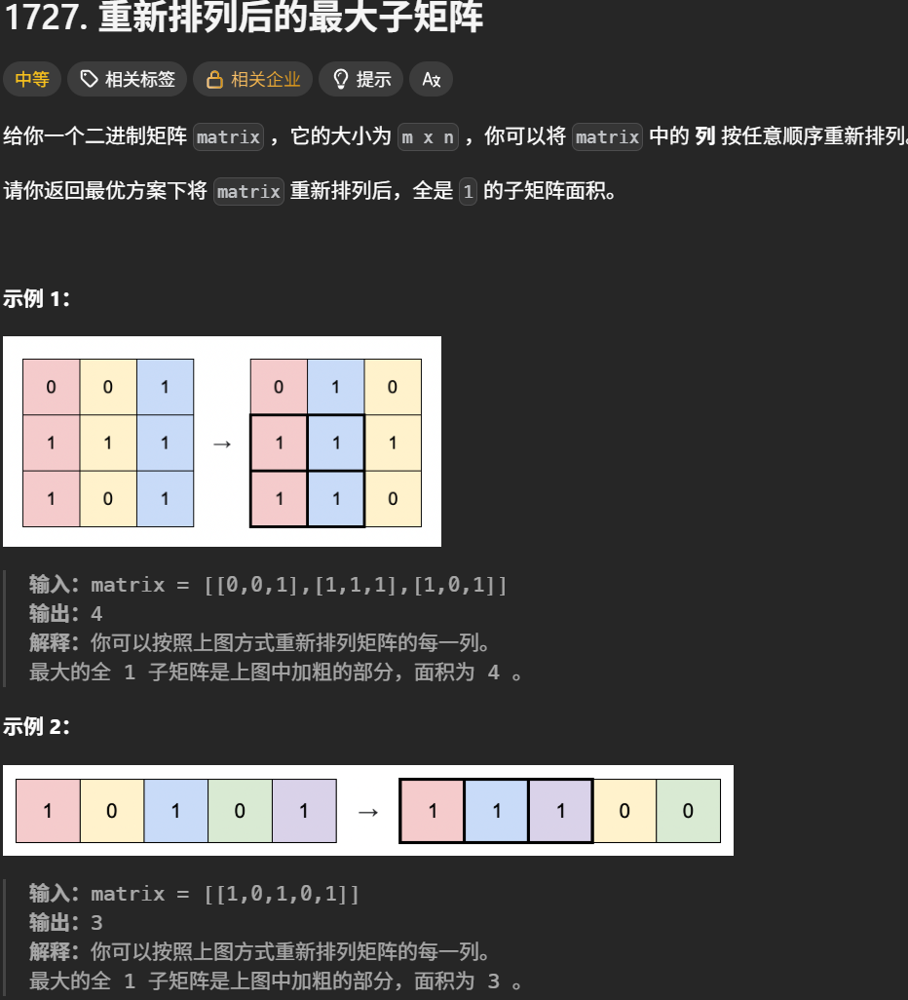

```
bool cmp(int a, int b) {
	return a>b;
}
class Solution {
	public:
		int largestSubmatrix(vector<vector<int>>& matrix) {
			int h = matrix.size();
			int l = matrix[0].size();
			vector<vector<int>> qz(h+1, vector<int>(l+1, 0));
			for(int j=1; j<=l; j++) {
				for(int i=1; i<=h; i++) {
					qz[i][j] = matrix[i-1][j-1];
				}
			}
			for(int j=1; j<=l; j++) {
				for(int i=1; i<=h; i++) {
					if(qz[i][j]!=0) {
						qz[i][j] = qz[i-1][j]+qz[i][j];
					} else {
						qz[i][j]=0;
					}
				}
			}
			int ans = 0;
			for(int i=1; i<=h; i++) {
				sort(qz[i].begin(), qz[i].end(), cmp);
				for(int j=0; j<l; j++) {
					ans = max(ans, qz[i][j]*(j+1));
				}
			}
			return ans;
		}
};
```

```
间断前缀和——位置上是0的不计算前缀和
从大到小排序
直接更新答案
```

### 成为K特殊字符串需要删除的最少次数

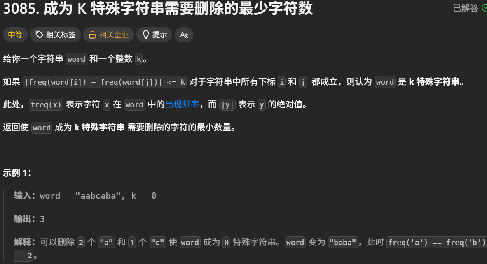

```
class Solution {
	public:
		int minimumDeletions(string word, int k) {
			unordered_map<char, int> dic;
			for(int i=0; i<word.size(); i++) {
				dic[word[i]]++;
			}
			vector<int> nums;
			for(const auto& ele:dic) {
				nums.push_back(ele.second);
			}
			int ans = 1e9;
			for(const auto& ele:dic) {
				char a = ele.first;
				int goal = ele.second;
				int sum =0;
				for(int i=0; i<nums.size(); i++) {
					if(nums[i]<goal){
						sum=sum+nums[i];
					}else if(goal+k<nums[i]){
						sum=sum+nums[i]-goal-k;
					}
				}
				ans = min(ans, sum);
			}
			return ans;
		}
};
```

```
猜想：删除字母后，在所有出现次数最少的字母中，一定存在没被删除过的字母。
证明：反证法，假设所有出现次数最少的字母，都至少被删除一个。我们把这些字母的出现次数都增加一，即出现次数的最小值加一，仍然满足题目「出现次数绝对差 ≤k」的要求，但总删除次数更少了，矛盾。故猜想成立。

枚举每个字母出现的次数，做为那个没被删过的字母，以它为基准调整其他元素：小于的直接删，比他大k的删到合格
```

## 交换论证贪心

### 最小处理时间

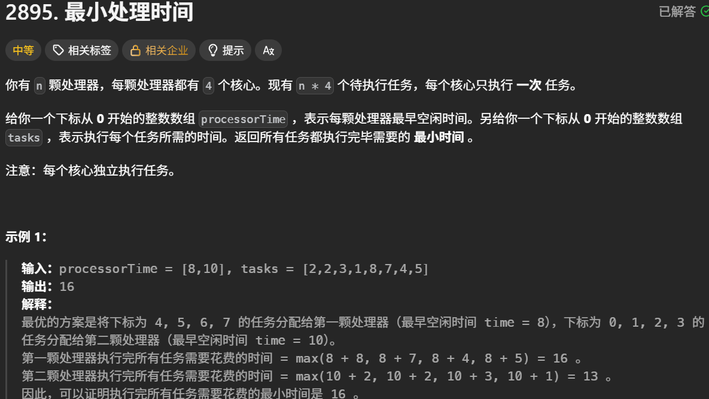

```
bool cmp(int a, int b){
	return a>b;
}
class Solution {
	public:
		int minProcessingTime(vector<int>& processorTime, vector<int>& tasks) {
			sort(processorTime.begin(), processorTime.end());
			sort(tasks.begin(), tasks.end(), cmp);
			int k=0;
			int ans = -1;
			for(int i=0;i<tasks.size();i++){
				int max_ele = tasks[i]+processorTime[k];
				for(int j=i;j<=i+3;j++){
					max_ele = max(max_ele, tasks[j]+processorTime[k]);
				}
				k++;
				i=i+3;
				ans = max(ans, max_ele);
			}
			return ans;
		}
};
```

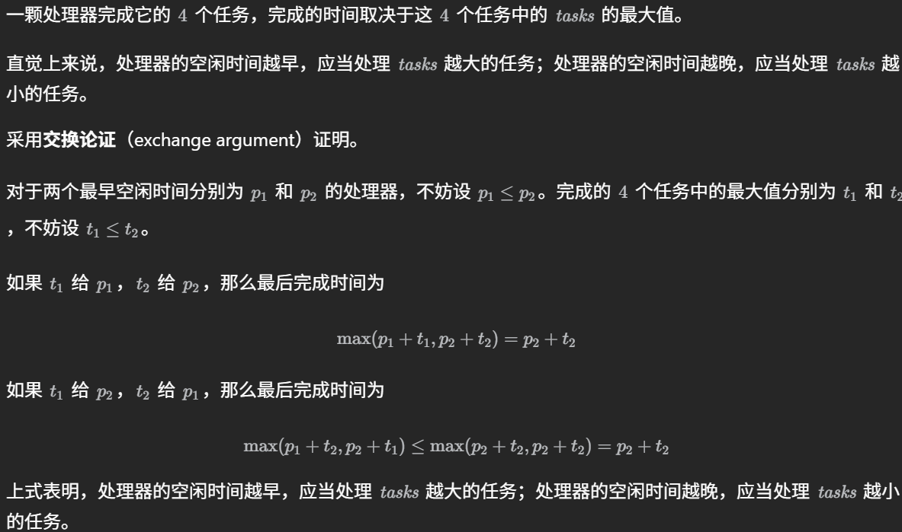

### 最大数

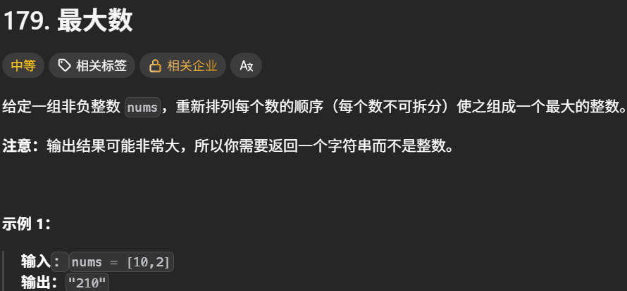

```
bool cmp(string a, string b) {
	return a+b>b+a;
}
class Solution {
	public:
		string largestNumber(vector<int>& nums) {
			vector<string> num;
			for(int i=0; i<nums.size(); i++) {
				string temp = to_string(nums[i]);
				num.push_back(temp);
			}
			sort(num.begin(), num.end(), cmp);
			string ans;
			for(int i=0; i<num.size(); i++) {
				ans = ans + num[i];
			}
			if(ans[0]=='0'){
				return "0";
			}
			return ans;
		}
};
```

```
注意比较器的写法！直接写需求

对于 nums 中的任意两个值 a 和 b，我们无法直接从常规角度上确定其大小/先后关系。
但我们可以根据「结果」来决定 a 和 b 的排序关系：
如果拼接结果 ab 要比 ba 好，那么我们会认为 a 应该放在 b 前面。
```

## 贪心+优先队列

### 吃苹果的最大数目

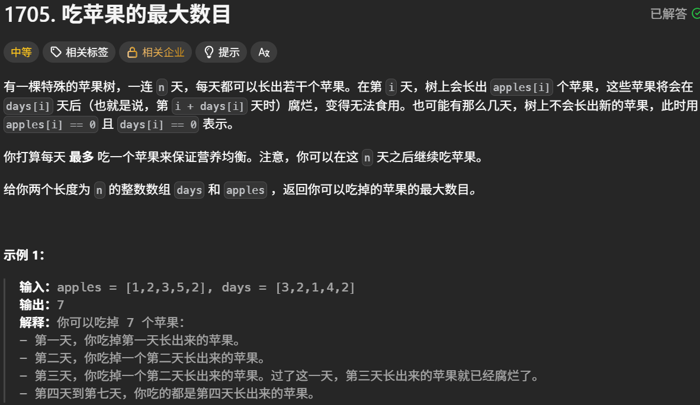

```
class Solution {
	public:
		typedef pair<int, int> PII;
		int eatenApples(vector<int>& apples, vector<int>& days) {
			priority_queue<PII, vector<PII>, greater<PII>> dui;
			int ans = 0;
			for(int i=0; i<apples.size() || dui.size()!=0; i++) {
				while(dui.size()!=0 && dui.top().first<i) {
					dui.pop();
				}
				if(i<apples.size() && apples[i]!=0) {
					dui.push({i+days[i]-1, apples[i]});
				}
				if(dui.size()) {
					auto x = dui.top();
					dui.pop();
					int date = x.first;
					int num = x.second;
					if(num-1!=0) {
						dui.push({date, num-1});
					}
					ans++;
				}
			}
			return ans;
		}
};
```

```
正常人的直觉：尽早把快过期的吃完！
用一个小根堆维护最早的过期日期，以及在这个日期里还有多少苹果能吃
循环里
 - 首先把过期的剔除掉
 - 把今天新产的苹果加进去
 - 今天要吃苹果了！
注意边界条件！
```

## 贪心or动规

### 摆动序列

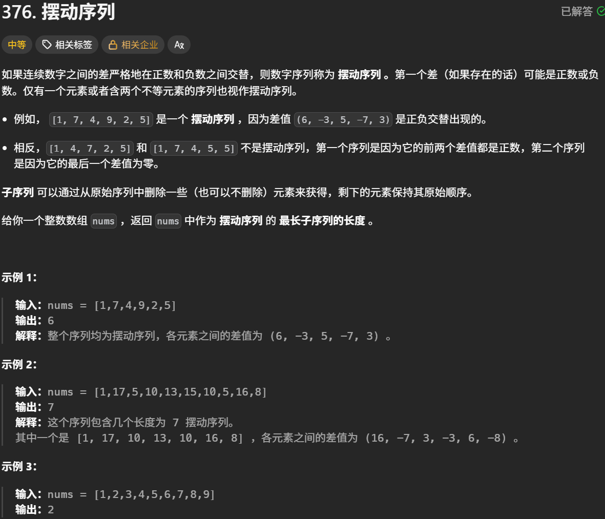

```
贪心做法：
class Solution {
	public:
		int wiggleMaxLength(vector<int>& nums) {
			if(nums.size()==1) {
				return 1;
			}
			if(nums.size()==2 && nums[1]==nums[0]) {
				return 1;
			}
			vector<int> number;
			for(int i=1; i<nums.size(); i++) {
				if(nums[i]-nums[i-1]!=0) {
					number.push_back(nums[i]-nums[i-1]);
				}
			}
			int temp = 1;
			for(int i=0; i<number.size(); i++) {
				if(number[i]>0) {
					temp=1;
					break;
				}
				if(number[i]<0) {
					temp=-1;
					break;
				}
			}
			int pos=0;
			int ans = 1;
			while(pos<number.size()) {
				if(temp==1) {
					int i;
					for(i=pos; i<number.size(); i++) {
						if(number[i]<0) {
							pos=i;
							temp=-1;
							ans++;
							break;
						}
					}
					if(i==number.size()) {
						ans++;
						break;
					}
				} else {
					int i;
					for(i=pos; i<number.size(); i++) {
						if(number[i]>0) {
							pos=i;
							temp=1;
							ans++;
							break;
						}
					}
					if(i==number.size()) {
						ans++;
						break;
					}
				}
			}
			return ans;
		}
};
```

```
先处理特殊情况
然后
- 处理number数组，等于0的直接别加进去
- 看第一个点后面的点趋势是什么？升则temp=1，降则temp=-1
- 从当前这个点往后找，temp=1则找到最后一个负数，否则找最近一个正数
- 注意，如果找到number数组结尾还没有break的，说明找不到了，ans++后直接退出循环
```

```
动规做法：
class Solution {
	public:
		int dp[10010][2];
		int wiggleMaxLength(vector<int>& nums) {
			dp[0][1]=1;
			dp[0][0]=1;
			int ans = 1;
			for(int i=1; i<nums.size(); i++) {
				dp[i][0]=1;
				dp[i][1]=1;
				for(int j=0; j<i; j++) {
					if(nums[j]>nums[i]) {
						dp[i][0]=max(dp[i][0], dp[j][1]+1);
					}
					if(nums[j]<nums[i]) {
						dp[i][1] = max(dp[i][1], dp[j][0]+1);
					}
				}
				ans = max(ans, dp[i][1]);
				ans = max(ans, dp[i][0]);
			}
			return ans;
		}
};
```

```
dp[i][0]表示当前这个点作为波谷
dp[i][1]表示当前这个点作为波峰
```

### 最大子数组和

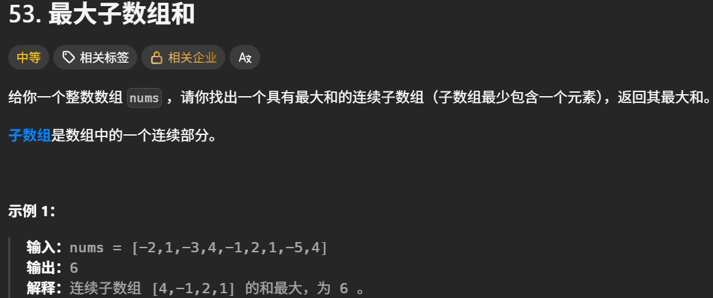

```
class Solution {
	public:
		int maxSubArray(vector<int>& nums) {
			int sum=0;
			int ans=-1e9;
			for(int i=0; i<nums.size(); i++) {
				sum+=nums[i];
				ans = max(ans, sum);
				if(sum<0) {
					sum=0;
				}
			}
			return ans;
		}
};
```

```
如果 -2 1 在一起，计算起点的时候，一定是从 1 开始计算，因为负数只会拉低总和，这就是贪心贪的地方！
局部最优：当前“连续和”为负数的时候立刻放弃，从下一个元素重新计算“连续和”，因为负数加上下一个元素 “连续和”只会越来越小。
全局最优：选取最大“连续和”
局部最优的情况下，并记录最大的“连续和”，可以推出全局最优。
```

```
class Solution {
	public:
		int dp[100010];
		int maxSubArray(vector<int>& nums) {
			dp[0] = nums[0];
			int ans = dp[0];
			for(int i=1;i<nums.size();i++){
				dp[i] = max(nums[i], dp[i-1]+nums[i]);
				ans = max(dp[i], ans);
			}
			return ans;
		}
};
```

### 买卖股票的最佳时机Ⅱ

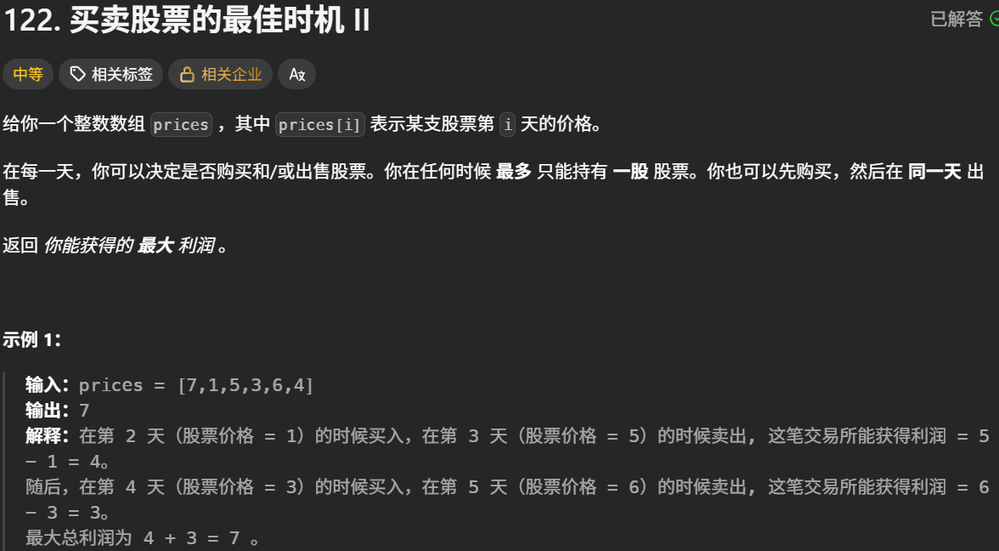

```
class Solution {
	public:
		int maxProfit(vector<int>& prices) {
			int sum=0;
			for(int i=1;i<prices.size();i++){
				if(prices[i]-prices[i-1]>0){
					sum+=prices[i]-prices[i-1];
				}
			} 
			return sum;
		}
};
```

````
假如第 0 天买入，第 3 天卖出，那么利润为：prices[3] - prices[0]。

相当于(prices[3] - prices[2]) + (prices[2] - prices[1]) + (prices[1] - prices[0])。

此时就是把利润分解为每天为单位的维度，而不是从 0 天到第 3 天整体去考虑！

那么根据 prices 可以得到每天的利润序列：(prices[i] - prices[i - 1]).....(prices[1] - prices[0])。

其实我们需要收集每天的正利润就可以，收集正利润的区间，就是股票买卖的区间，而我们只需要关注最终利润，不需要记录区间。

dp做法见dp
````

## 二分答案（最值）

### 变为活跃状态最小时间——字符串的子串计数

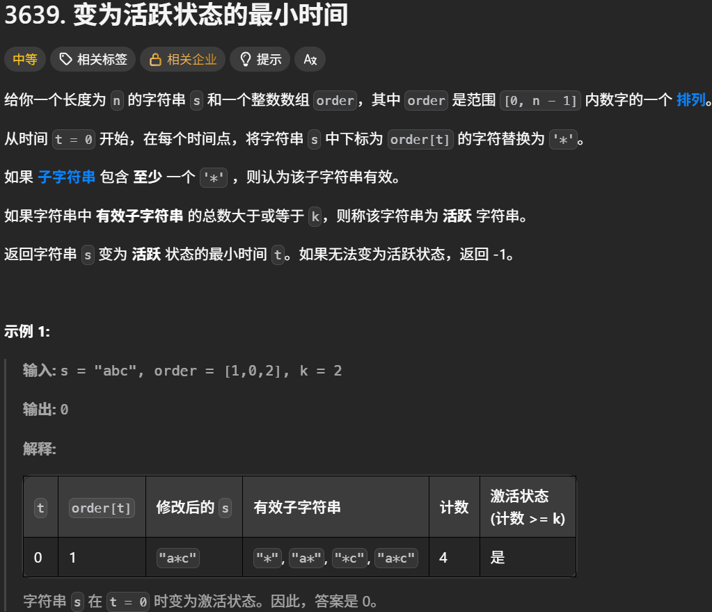

```
class Solution {
	public:
		long long int pos_xing[100010];
		bool check(string s, int k) {
			int num=-1;
			for(int i=0; i<s.size(); i++) {
				if(s[i]=='*') {
					num=i;
				}
				pos_xing[i] = num;
			}
			long long int ans=0;
			for(int i=0; i<s.size(); i++) {
				ans=ans+pos_xing[i]+1;
			}
			if(ans>=k) {
				return true;
			} else {
				return false;
			}
		}
		int minTime(string s, vector<int>& order, int k) {
			long long int n = s.size();
			long long int up;
			if(n%2==0) {
				up = n/2*(n+1);
			} else {
				up = (n+1)/2 *n;
			}
			if(k>up) {
				return -1;
			}
//			
//			string a = s;
//			unordered_map<int, string> dic;
//			for(int i=0;i<order.size();i++){
//				int pos = order[i];
//				a[pos]='*';
//				dic[i]=a;
//			}
//			
			int l = 0, r = order.size()-1;
			while(l<r) {
				int mid = (l+r)/2;
				string temp = s;
				for(int i=0; i<=mid; i++) {
					int pos = order[i];
					temp[pos]='*';
				}
				if(check(temp, k)) {
					r=mid;
				} else {
					l=mid+1;
				}
			}
			return r;
		}
};
```

```
典型的二分答案————时间越长，改的*越多，有效字符串越多，越有可能超过要求k

二分时间

check的是>=k的最小时间，因此是第二种二分模型

字符串的子串计数
check中，我们记录当前这个点左边最近的*的位置是多少，这样我们直接遍历枚举就能知道当前string能有多少个有效字符串
比如说 _, _, *, a，由a结尾的有效字符串就是3（2-0+1）
长度为n的*字符串有1+2+3+...+n个有效字符串，如果全改成*还没法大于k，那就直接返回-1

string a = s;
unordered_map<int, string> dic;
for(int i=0;i<order.size();i++){
	int pos = order[i];
	a[pos]='*';
	dic[i]=a;
}
这样空间复杂度就是1e5*1e5，直接MLE
```

### 字符相同的最短子字符串Ⅱ

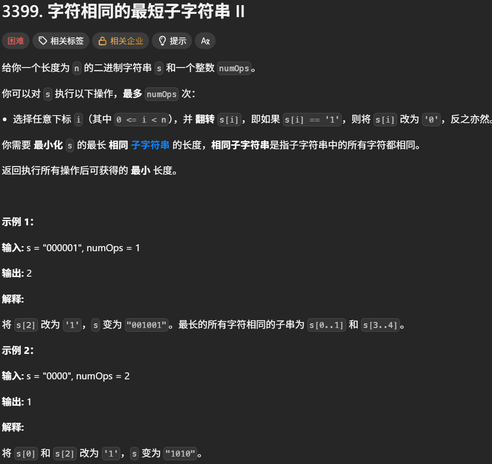

```
class Solution {
	public:
		bool check(int m, string s, int limit) {
			if(m==1) {
				int diff_1=0, start_1=0;
				for(int i=0; i<s.size(); i++) {
					if((s[i]-'0')!=start_1) {
						diff_1++;
					}
					start_1=1-start_1;
				}
				int diff_2=0, start_2=1;
				for(int i=0; i<s.size(); i++) {
					if((s[i]-'0')!=start_2) {
						diff_2++;
					}
					start_2=1-start_2;
				}
				int ans = min(diff_1, diff_2);
				if(ans>limit) {
					return false;
				} else {
					return true;
				}
			}
			int ans=0;
			for(int i=0; i<s.size(); i++) {
				char number = s[i];
				int pos=i;
				while(pos<s.size() && s[pos]==number) {
					pos++;
				}
				if(pos==s.size()) {
					pos=s.size()-1;
				} else {
					pos--;
				}
				ans=ans+floor((pos-i+1)*1.0/(m+1));
				i=pos;
			}
			if(ans>limit) {
				return false;
			} else {
				return true;
			}
		}
		int minLength(string s, int numOps) {
			int l=1, r=s.size();
			while(l<r) {
				int mid = (l+r)/2;
				if(check(mid, s, numOps)) {
					r=mid;
				} else {
					l=mid+1;
				}
			}
			return r;
		}
};
```

```
在s串中，找到每一个连续的部分，然后这一部分就需要分 floor(len/(m+1))次，m=1要特判，无非就是010101...和101010....
```

### 范围内整数的最大得分

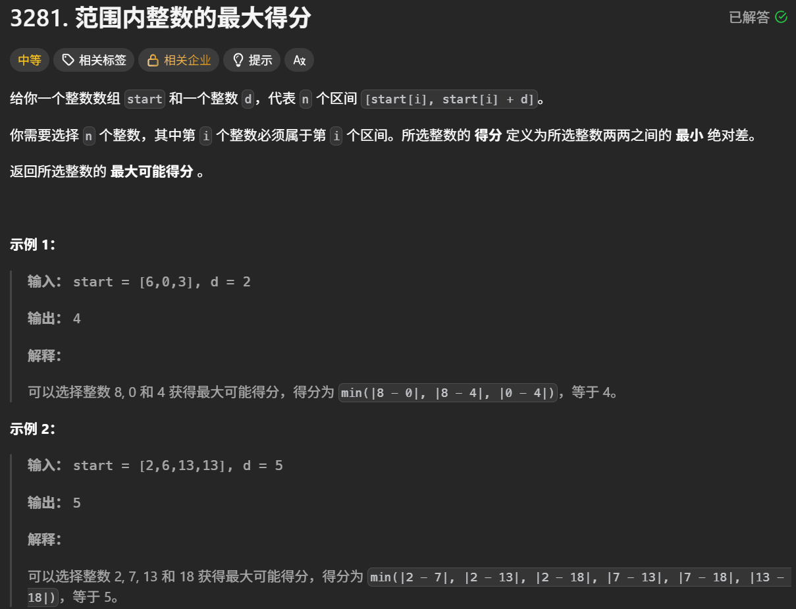

```
class Solution {
	public:
		bool check(long long int x, vector<int>& start, long long int d){
			long long int pos = start[0];
			for(int i=0;i<start.size()-1;i++){
				long long int temp = pos+x;
				if(temp>start[i+1]+d){
					return false;
				}else if(temp<=start[i+1]+d && temp>=start[i+1]){
					pos = temp;
				}else if(temp<start[i+1]){
					pos = start[i+1];
				}
			}
			return true;
		}
		int maxPossibleScore(vector<int>& start, int d) {
			sort(start.begin(), start.end());
			long long int l=0, r=1e12;
			while(l<r){
				long long int mid = l+r+1>>1;
				if(check(mid, start, d)){
					l=mid;
				}else{
					r=mid-1;
				}
			}
			return r;
		}
};
```

```
二分+贪心
贪心：从第一个区间的左端点开始，每次加mid：
— 超过下一个区间右端点，那就false
- 超过下一个区间左端点但没超过右端点，那就更新pos
- 没超过下一个区间左端点，pos更新成下一个区间左端点
```

### 礼盒的最大甜蜜度

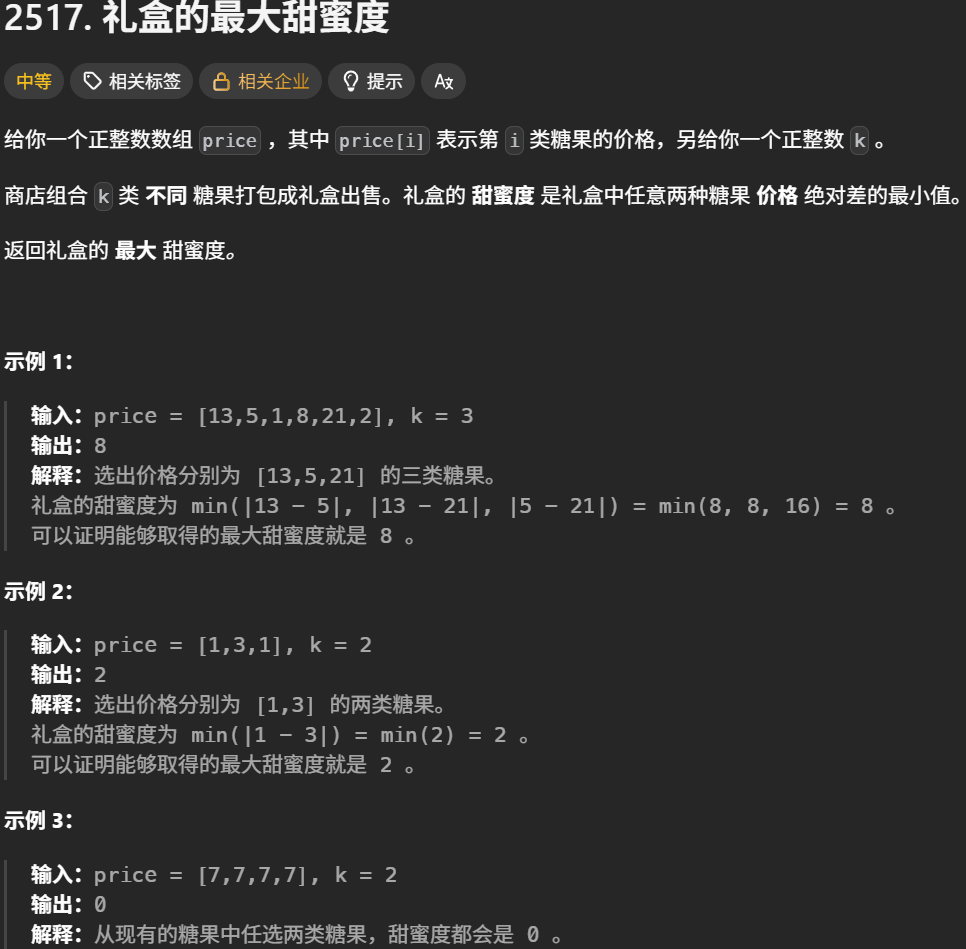

```
class Solution {
	public:
		bool check(int x, vector<int>& price, int k) {
			int ans = 1;
			for(int i=0; i<price.size(); i++) {
				int j;
				for(j=i+1; j<price.size(); j++) {
					if(price[j]-price[i]>=x) {
						ans++;
						break;
					}
				}
				i=j-1;
			}
			if(ans>=k) {
				return true;
			}
			return false;
		}
		int maximumTastiness(vector<int>& price, int k) {
			sort(price.begin(), price.end());
			int l=-1, r=1e9;
			while(l<r) {
				int mid = l+r+1>>1;
				if(check(mid, price, k)) {
					l=mid;
				} else {
					r=mid-1;
				}
			}
			return r;
		}
};
```

```
二分+贪心
- 给定一个甜蜜度x
- 排序price
- 从第一个元素开始，从i+1开始，找第一个使得price[j]-price[i]>=x的j
- 从上一个j开始接着往后找
- 省着用较小的price
```

## 二分答案（第k个小/大数）

### 乘法表中第K小的数字

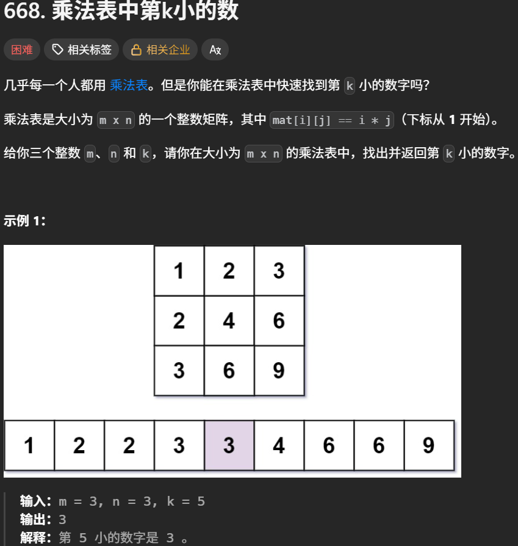

```
class Solution {
	public:
		bool check(int x, int m, int n, int k){
			int ans=0;
			for(int i=1;i<=m;i++){
				ans=ans+min(x/i, n);
			}
			if(ans<k){
				return false;
			}
			return true;
		}
		int findKthNumber(int m, int n, int k) {
			int l=1, r=m*n;
			while(l<r) {
				int mid=(l+r)/2;
				if(check(mid, m, n, k)){
					r=mid;
				}else{
					l =mid+1;
				}
			}
			return r;
		}
};
```

```
找第k小的数字：
二分那个数字x
x要满足：算上他自己，小于等于x的数字有k个
如果小于等于x的数字个数大于k，我们要把右边界往左压缩——实际上我们求的就是右区间的最左端点

遍历每一行，每一行都是行数i的倍数，看看m×i<=x的合法m（m不能超过列数）有多少个？
```

### 找出第k小的数对距离（二分套二分、二分套双指针）

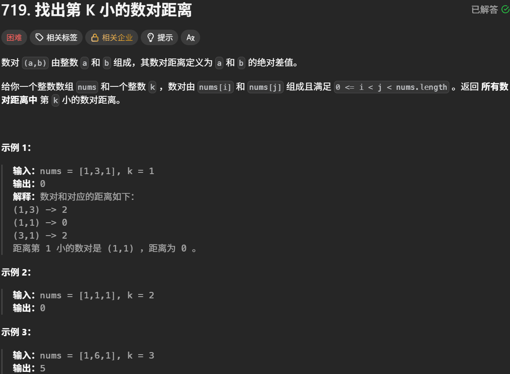

```
class Solution {
	public:
		bool check(int x, vector<int>& nums, int k) {
			int ans =0;
			for(int i=0;i<nums.size()-1;i++){
				int j = nums.size()-1;
				int l =i, r=j;
				while(l<r){
					int mid = l+r+1>>1;
					if(abs(nums[mid]-nums[i])<=x){
						l=mid;
					}else{
						r=mid-1;
					}
				}
				ans = ans+r-i;
			}
			if(ans>=k) {
				return true;
			}
			return false;
		}
		int smallestDistancePair(vector<int>& nums, int k) {
			int l=0, r=1e9;
			sort(nums.begin(), nums.end());
			while(l<r) {
				int mid = l+r>>1;
				if(check(mid, nums, k)) {
					r=mid;
				} else {
					l=mid+1;
				}
			}
			return r;
		}
};
```

```
二分套二分
内层二分：枚举左端点，二分“从左端点到数组末尾”，寻找最后一个使得abs(nums[r]-nums[i])<=x的那个数字的位置r
当前左端点可以组成的合法数对个数是 r-i
```

```
class Solution {
	public:
		bool check(int x, vector<int>& nums, int k) {
			int pos=0;
			int ans=0;
			for(int j=1;j<nums.size();j++){
				while(abs(nums[j]-nums[pos])>x){
					pos++;
				}
				ans = ans + j-pos;
			}
			if(ans>=k){
				return true;
			}
			return false;
		}
		int smallestDistancePair(vector<int>& nums, int k) {
			int l=0, r=1e9;
			sort(nums.begin(), nums.end());
			while(l<r) {
				int mid = l+r>>1;
				if(check(mid, nums, k)) {
					r=mid;
				} else {
					l=mid+1;
				}
			}
			return r;
		}
};
```

```
二分套双指针
枚举右端点，循环里检查左端点，找到第一个合法的左端点（pos）。左端点不会回头，因为《更往右的右端点 和 更往左的左端点 一定不合法》
```

### 第N个神奇数字（容斥原理）

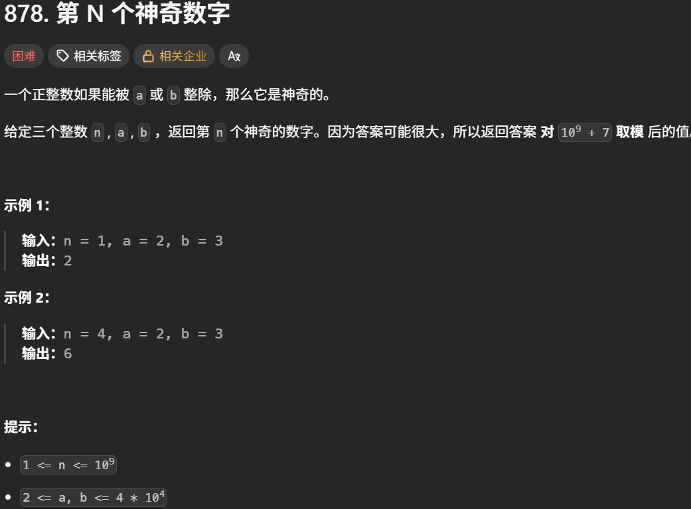

```
long long int mod = 1e9+7;
class Solution {
	public:
		long long int gcd(long long int a, long long int b) {
			if (a % b == 0) return b;
			else return gcd(b, a % b);
		}
		bool check(long long int x, int n, long long int a, long long int b) {
			long long int temp = gcd(a, b);
			long long int ans = x/a+x/b-x/(a*b/temp);
			if(ans>=n) {
				return true;
			}
			return false;
		}
		int nthMagicalNumber(int n, int a, int b) {
			long long int l=1, r=1e15;
			while(l<r) {
				long long int mid = l+r>>1;
				if(check(mid, n, a, b)) {
					r=mid;
				} else {
					l=mid+1;
				}
			}
			long long int ans = r%mod;
			return ans;
		}
};
```

```
正整数如果能被 a 或 b 整除，那么它是神奇的。

给定一个数字x，比x小的且能被 a 或 b 整除的数字有x/a+x/b-x/(a*b/temp)个
（这其中包括a的倍数（小于x的）、b的倍数（小于x的）、再减去二者共同的倍数（x/最小公倍数））

注意r一开始的取值要大很多！！且全部的都是longlong！！

注意最后对答案取模
```

## 树

### 二叉树的建立和层序遍历

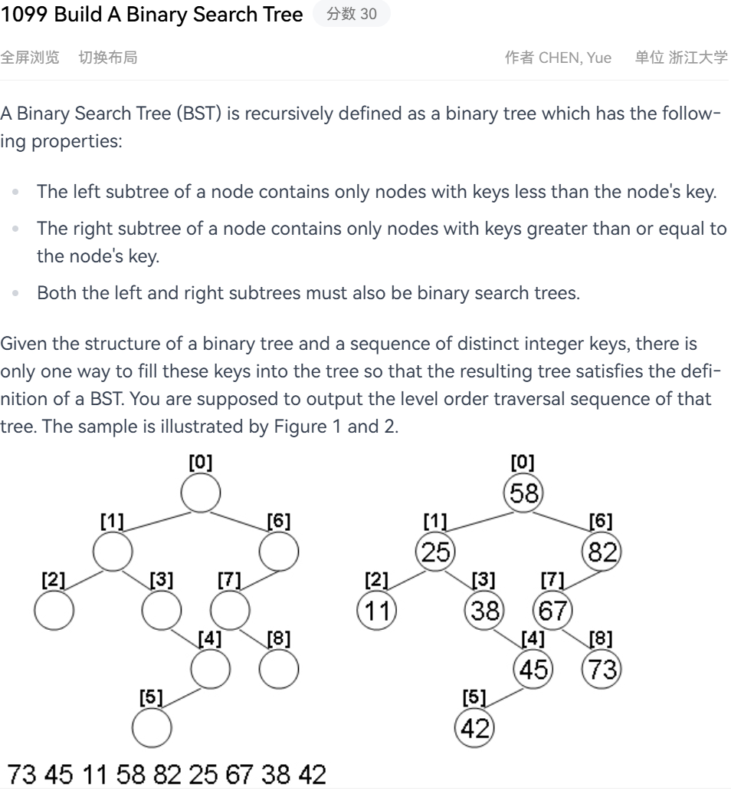

```
int n;
vector<int> lnode;
vector<int> rnode;
vector<int> number;
int value[10000];
int js=0;
void zx(int x) {
	if(x==-1) {
		return;
	}
	zx(lnode[x]);
	value[x]=number[js];
	js++;
	zx(rnode[x]);
	return;
}
void bfs() {
	vector<int> dui;
	dui.push_back(0);
	int tou=0, wei=0;
	vector<int> ans;
	while(tou<=wei) {
		int node = dui[tou];
		tou++;
		ans.push_back(value[node]);
		if(lnode[node]!=-1) {
			dui.push_back(lnode[node]);
			wei++;
		}
		if(rnode[node]!=-1) {
			dui.push_back(rnode[node]);
			wei++;
		}
	}
	for(int i=0; i<ans.size(); i++) {
		if(i!=ans.size()-1) {
			cout<<ans[i]<<' ';
		}else{
			cout<<ans[i];
		}
	}
	return;
}
int main() {
	cin>>n;
	for(int i=0; i<=n-1; i++) {
		int a, b;
		cin>>a>>b;
		lnode.push_back(a);
		rnode.push_back(b);
	}
	for(int i=1; i<=n; i++) {
		int a;
		cin>>a;
		number.push_back(a);
	}
	sort(number.begin(), number.end());
	zx(0);
	bfs();
}
```

```
线索二叉树中序遍历得到的是一个《有序的》，在本题中，则是升序
用俩数组，一个存左节点，一个存右节点

先中序遍历把每个结点的值存好
然后bfs层序遍历

9
1 6
2 3
-1 -1
-1 4
5 -1
-1 -1
7 -1
-1 8
-1 -1
73 45 11 58 82 25 67 38 42

58 25 82 11 38 67 45 73 42
```

### 根据前中序建立二叉树并镜像翻转

```
int preorder[1000];
int inorder[1000];
int L[1000];
int R[1000];
unordered_map<int, int> dic;
int create(int zl, int zr, int ql, int qr) {
	if(zl>zr) {
		return -1;
	}
	int root = preorder[ql];
	int pos = dic[root];
	int leftsize = pos-zl;
	int leftnumber = create(zl, pos-1, ql+1, ql+leftsize);
	int rightnumber = create(pos+1, zr, ql+leftsize+1, qr);
	L[root] = leftnumber;
	R[root] = rightnumber;
	return root;
}
void bfs(int root) {
	vector<int> dui;
	int tou=0, wei=0;
	dui.push_back(root);
	vector<int> ans;
	while(tou<=wei) {
		int number = dui[tou];
		tou++;
		ans.push_back(number);
		if(R[number]!=-1) {
			dui.push_back(R[number]);
			wei++;
		}
		if(L[number]!=-1) {
			dui.push_back(L[number]);
			wei++;
		}
	}
	for(int i=0; i<ans.size(); i++) {
		if(i!=ans.size()-1) {
			cout<<ans[i]<<' ';
		}else{
			cout<<ans[i];
		}
	}
}
int main() {
	int n;
	cin>>n;
	for(int i=1; i<=n; i++) {
		scanf("%d", &inorder[i]);
		dic[inorder[i]]=i;
	}
	for(int i=1; i<=n; i++) {
		scanf("%d", &preorder[i]);
	}
	int root = create(1, n, 1, n);
	bfs(root);
}
```

### 二叉树的左视图

```
1174 Left-View of Binary Tree
左视图：输出每一层最左边那个点
```

```
int inorder[10000];
int preorder[10000];
int L[10000];
int R[10000];
int n;
bool use[10000];
unordered_map<int, int> dic;
int create(int zl, int zr, int ql, int qr) {
	if(zl>zr) {
		return -1;
	}
	int root = preorder[ql];
	int pos = dic[root];
	int leftsize = pos-zl;
	int leftnumber = create(zl, pos-1, ql+1, ql+leftsize);
	int rightnumber = create(pos+1, zr, ql+leftsize+1, qr);
	L[root] = leftnumber;
	R[root] = rightnumber;
	return root;
}
void bfs(int root) {
	vector<vector<int>> dui;
	int tou=0, wei=0;
	vector<int> ans;
	dui.push_back({root, 1});
	while(tou<=wei) {
		auto x = dui[tou];
		tou++;
		int index = x[0];
		int level = x[1];
		if(use[level]==false) {
			ans.push_back(index);
			use[level]=true;
		}
		if(L[index]!=-1) {
			dui.push_back({L[index], level+1});
			wei++;
		}
		if(R[index]!=-1) {
			dui.push_back({R[index], level+1});
			wei++;
		}
	}
	for(int i=0; i<ans.size(); i++) {
		if(i!=ans.size()-1) {
			cout<<ans[i]<<' ';
		} else {
			cout<<ans[i];
		}
	}
}
int main() {
	cin>>n;
	for(int i=1; i<=n; i++) {
		scanf("%d", &inorder[i]);
		dic[inorder[i]]=i;
	}
	for(int i=1; i<=n; i++) {
		scanf("%d", &preorder[i]);
	}
	int root = create(1, n, 1, n);
	bfs(root);
}
```

### 文件路径(树的双亲表示法)

```
1178 File Path
按照空格数存储每个文件的父亲节点是谁
```

```
int space(string s) {
	int ans=0;
	for(int i=0; i<s.size(); i++) {
		if(s[i]==' ') {
			ans++;
		} else {
			break;
		}
	}
	return ans;
}
int main() {
	int n;
	cin>>n;
	cin.ignore();
	unordered_map<int, string> boss;
	unordered_map<string, string> pre;
	for(int i=1; i<=n; i++) {
		string s;
		getline(cin, s);
		if(i==1) {
			boss[0]=s;
			pre[s]=s;
			continue;
		}
		int spacenum = space(s);
		int t = s.size();
		s = s.substr(spacenum, t-spacenum);
		boss[spacenum]=s;
		if(boss.find(spacenum-1)!=boss.end()) {
			pre[s]=boss[spacenum-1];
		} else {
			pre[s]=s;
		}
	}
	int T;
	cin>>T;
	while(T--) {
		string s;
		cin>>s;
		if(pre.find(s)==pre.end()) {
			cout<<"Error: ";
			cout<<s;
			cout<<" is not found."<<endl;
		} else {
			vector<string> ans;
			while(s!=pre[s]) {
				ans.push_back(s);
				s=pre[s];
			}
			ans.push_back(s);
			for(int i=ans.size()-1; i>=0; i--) {
				if(i!=0) {
					cout<<ans[i]<<"->";
				} else {
					cout<<ans[i]<<endl;
				}
			}
		}
	}
}
```

### 给中序遍历构建小根堆，打印中序遍历

```
vector<int> node;
int min_ele=1e9;
int min_pos;
void bfs() {
	int n = node.size()-1;
	vector<vector<int>> dui;
	vector<int> ans;
	ans.push_back(min_ele);
	int tou=0, wei=-1;
	if(min_pos!=0) {
		dui.push_back({0, min_pos-1});
		wei++;
	}
	if(min_pos!=n) {
		dui.push_back({min_pos+1, n});
		wei++;
	}
	while(tou<=wei) {
		auto x = dui[tou];
		tou++;
		int ele=1e9;
		int pos;
		for(int i=x[0]; i<=x[1]; i++) {
			if(node[i]<ele) {
				ele = node[i];
				pos=i;
			}
		}
		ans.push_back(ele);
		if(pos!=x[0]) {
			dui.push_back({x[0], pos-1});
			wei++;
		}
		if(pos!=x[1]) {
			dui.push_back({pos+1, x[1]});
			wei++;
		}
	}
	for(int i=0; i<ans.size(); i++) {
		if(i!=ans.size()-1) {
			cout<<ans[i]<<' ';
		} else {
			cout<<ans[i];
		}
	}
}
int main() {
	int n;
	cin>>n;
	for(int i=0; i<=n-1; i++) {
		int a;
		cin>>a;
		node.push_back(a);
		if(a<min_ele) {
			min_ele = a;
			min_pos = i;
		}
	}
	bfs();
}

```

### 算法树的后序遍历

```
1162 Postfix Expression
```

```
int n;
vector<string> e(100010);
int lnode[100100];
int rnode[100010];
int rd[100010];
bool use[100010];
void dfs(int node) {
	cout<<"(";
	if(lnode[node]!=-1) {
		dfs(lnode[node]);
	} else {
		cout<<e[node];
		use[node]=true;
	}
	if(rnode[node]!=-1) {
		dfs(rnode[node]);
	}
	if(use[node]==false) {
		cout<<e[node];
		use[node]=true;
	}
	cout<<")";
	return;
}
int main() {
	cin>>n;
	for(int i=1; i<=n; i++) {
		string a;
		int b, c;
		cin>>a>>b>>c;
		e[i]=a;
		lnode[i]=b;
		rnode[i]=c;
		if(b!=-1) {
			rd[b]++;
		}
		if(c!=-1) {
			rd[c]++;
		}
	}
	int start;
	for(int i=1; i<=n; i++) {
		if(rd[i]==0) {
			start = i;
			break;
		}
	}
	dfs(start);
}
```

```
注意：算法树中当这个节点只有右儿子的时候那他就是一元运算符.一棵算法树的节点是不会出现只有左儿子没有右儿子的情况.要么两个儿子都有,就是一个二元操作符,要么只有右儿子节点,就是一个一元操作符.
一元运算符要优先输出而不是顺着后续遍历输出！（此题测试样例中一元运算符不只有‘-’）
```

## 最短路

### 拓扑排序+模拟多源迪杰斯特拉

```
1175 Professional Ability Test
```

```
int h[10000];
int ne[500000];
int e[500000];
int S[500000];
int D[500000];
int rd[50000];
int rd_temp[50000];
int pre[50000];
int min_dis[50000];
bool use[50000];
int max_vou[50000];
int idx=0;
typedef vector<int> PII;
int n, m;
void add(int a, int b, int s, int d) {
	e[idx]=b;
	S[idx]=s;
	D[idx]=d;
	ne[idx]=h[a];
	h[a]=idx;
	idx++;
}
bool tuopu() {
	memcpy(rd_temp, rd, sizeof rd_temp);
	vector<int> dui;
	int tou=0, wei=-1;
	for(int i=0; i<=n-1; i++) {
		if(rd_temp[i]==0) {
			dui.push_back(i);
			wei++;
		}
	}
	while(tou<=wei) {
		int index = dui[tou];
		tou++;
		for(int i=h[index]; i!=-1; i=ne[i]) {
			int j = e[i];
			rd_temp[j]--;
			if(rd_temp[j]==0) {
				dui.push_back(j);
				wei++;
			}
		}
	}
	if(dui.size()==n) {
		return false;
	} else {
		return true;
	}
}
void djstl() {
	priority_queue<PII, vector<PII>, greater<PII>> dui;
	for(int i=0; i<n; i++) {
		if(rd[i]!=0) {
			min_dis[i]=1e9;
		} else {
			dui.push({0, 0, i});
		}
	}
	while(dui.size()) {
		auto x = dui.top();
		dui.pop();
		int index = x[2];
//		if(use[index]==true){
//			continue;
//		} 
//		use[index]=true;
		for(int i=h[index]; i!=-1; i=ne[i]) {
			int j = e[i];
			if(min_dis[j]>min_dis[index]+S[i]) {
				min_dis[j]=min_dis[index]+S[i];
				max_vou[j]=max_vou[index]+D[i];
				pre[j]=index;
				dui.push({min_dis[j], -max_vou[j], j});
			} else if(min_dis[j]==min_dis[index]+S[i]) {
				if(max_vou[j]<max_vou[index]+D[i]) {
					max_vou[j]=max_vou[index]+D[i];
					pre[j]=index;
					dui.push({min_dis[j], -max_vou[j], j});
				}
			}
		}
	}
	return;
}
int main() {
	cin>>n>>m;
	memset(h, -1, sizeof h);
	memset(pre, -1, sizeof pre);
	for(int i=1; i<=m; i++) {
		int a, b, c, d;
		cin>>a>>b>>c>>d;
		add(a, b, c, d);
		rd[b]++;
	}
	bool huan = tuopu();
	if(huan==true) {
		cout<<"Impossible."<<endl;
	} else {
		cout<<"Okay."<<endl;
	}
	int T;
	cin>>T;
	vector<int> q;
	for(int i=1; i<=T; i++) {
		int a;
		cin>>a;
		q.push_back(a);
	}
	if(huan==false) {
		djstl();
	}
	for(int i=0; i<q.size(); i++) {
		if(huan==true) {
			if(rd[q[i]]==0) {
				cout<<"You may take test "<<q[i]<<" directly."<<endl;
			} else {
				cout<<"Error."<<endl;
			}
		} else {
			if(rd[q[i]]==0) {
				cout<<"You may take test "<<q[i]<<" directly."<<endl;
			} else {
				int temp = q[i];
				vector<int> path;
				while(pre[temp]!=-1) {
					path.push_back(temp);
					temp = pre[temp];
				}
				path.push_back(temp);
				for(int j=path.size()-1; j>=0; j--) {
					if(j!=0) {
						cout<<path[j]<<"->";
					} else {
						cout<<path[j]<<endl;
					}
				}
			}
		}
	}
}
```

```
两个条件约束的（找min，min一样找max）时候，就把use数组去掉吧！
具体见下面这个样例：
5 6
0 1 1 0
0 2 1 0
1 4 0 0
2 4 0 0
1 3 0 0
3 2 0 100
1
4
“更大代金券的同距状态”在第一次弹出前就已经入队并按优先级更早被处理了。

边不知道有多少的情况下，请一定要开多点！！！！！！！！（ne和e和S和D）！！
```


